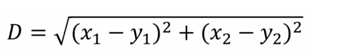
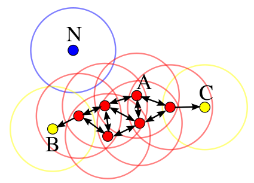

# 聚类算法

本篇结构

 - 简介
 - 聚类算法的分类
 - K-Means聚类算法
 - DBSCAN聚类算法

本篇介绍了聚类算法的种类，重点关注K-Means和DBSCAN两类聚类算法，并给出具体实现。
 
## 一、简介

### 1.1 什么是聚类

聚类是数据挖掘中的概念，就是按照某个特定标准(如距离)把一个数据集分割成不同的类或簇，使得同一个簇内的数据对象的相似性尽可能大，同时不在同一个簇中的数据对象的差异性也尽可能地大。也即聚类后同一类的数据尽可能聚集到一起，不同类数据尽量分离。

### 1.2 什么是分类

分类简单来说，就是根据文本的特征或属性，划分到已有的类别中。也就是说，这些类别是已知的，通过对已知分类的数据进行训练和学习，找到这些不同类的特征，再对未分类的数据进行分类。

### 1.3 聚类与分类的区别

Clustering (聚类)，是把相似的东西分到一组。聚类的时候，并不关心某一类是什么，需要实现的目标只是把相似的东西聚到一起。因此，一个聚类算法通常只需要知道如何计算相似度就可以开始工作了，因此 clustering 通常并不需要使用训练数据进行学习，这在Machine Learning中被称作unsupervised learning (无监督学习)。

Classification (分类)，对于一个classifier，通常需要告诉它“这个东西被分为某某类”这样一些例子，理想情况下，一个 classifier 会从它得到的训练集中进行“学习”，从而具备对未知数据进行分类的能力，这种提供训练数据的过程通常叫做supervised learning (监督学习)。

### 1.4 举例说明两者的区别

> 来自博文：[聚类（clustering）与分类（Classification）的区别](https://blog.csdn.net/gdp12315_gu/article/details/49777797)。

假设有一批人的年龄的数据，大致知道其中有一堆少年儿童，一堆青年人，一堆老年人。

聚类就是自动发现这三堆数据，并把相似的数据聚合到同一堆中。所以对于这个例子，如果要聚成3堆的话，那么输入就是一堆年龄数据，注意，此时的年龄数据并不带有类标号，也就是说我只知道里面大致有三堆人，至于谁是哪一堆，现在是不知道的，而输出就是每个数据所属的类标号，聚类完成之后，就知道谁和谁是一堆了。

而分类就是，事先告诉你，少年儿童、青年人及老年人的年龄是什么样的，现在新来了一个年龄，输出它的类标号，就是它是属于少年儿童、青年人、老年人的哪个类。一般来说，分类器是需要训练的，也就是要告诉你的算法，每个类的特征是什么样子，它才能识别新的数据。

下面再举一个实际的例子。

对于聚类，比如有些搜索引擎有“查看相似网页”的功能，这个就可以用聚类来做，把网页就行聚类，在聚类的结果中，每一个类中的网页看成是相似的。

对于分类，比如手写识别就可以看到是分类问题，比如我写了10个“我”字，然后对这10个“我”字进行特征提取，就可以告诉算法，“我”字具有什么样的特征，于是来了一个新的“我”字，虽然笔画和之前的10个“我”字不完全一样，但是特征高度相似，于是就把这个手写的字分类到“我”这个类，就识别出来了。
       
> 总结一下，数据分类是分析已有的数据，寻找其共同的属性，并根据分类模型将这些数据划分成不同的类别，这些数据赋予类标号。这些类别是事先定义好的，并且类别数是已知的。相反，数据聚类则是将本没有类别参考的数据进行分析并划分为不同的组，即从这些数据导出类标号。聚类分析本身则是根据数据来发掘数据对象及其关系信息，并将这些数据分组。每个组内的对象之间是相似的，而各个组间的对象是不相关的。不难理解，组内相似性越高，组间相异性越高，则聚类越好。

## 二、聚类算法的分类

> 来自博文：[常用聚类算法有哪些？](http://www.elecfans.com/dianzichangshi/20171025570086.html)

主要分为层次化聚类算法，划分式聚类算法，基于密度的聚类算法，基于网格的聚类算法，基于模型的聚类算法等。

### 2.1 基于划分的聚类（partitioning methods）

给定一个有N个元组或者记录的数据集，分裂法将构造K个分组，每一个分组就代表一个聚类，K《N。而且这K个分组满足下列条件：

1. 每一个分组至少包含一个数据纪录；
2. 每一个数据纪录属于且仅属于一个分组（注意：这个要求在某些模糊聚类算法中可以放宽）；

对于给定的K，算法首先给出一个初始的分组方法，以后通过反复迭代的方法改变分组，使得每一次改进之后的分组方案都较前一次好，而所谓好的标准就是：同一分组中的记录越近越好，而不同分组中的纪录越远越好。

大部分划分方法是基于距离的。给定要构建的分区数k，划分方法首先创建一个初始化划分。然后，它采用一种迭代的重定位技术，通过把对象从一个组移动到另一个组来进行划分。一个好的划分的一般准备是：同一个簇中的对象尽可能相互接近或相关，而不同的簇中的对象尽可能远离或不同。

代表算法有：K-means，K-medoids，CLARANS。

### 2.2 基于分层的聚类(hierarchical methods)

这种方法对给定的数据集进行层次似的分解，直到某种条件满足为止。具体又可分为“自底向上”和“自顶向下”两种方案。

例如：在“自底向上”方案中，初始时每个数据点组成一个单独的组，在接下来的迭代中，按一定的距离度量将相互邻近的组合并成一个组，直至所有的记录组成一个分组或者满足某个条件为止。代表算法有：BIRCH，CURE，CHAMELEON等。

### 2.3 基于密度的聚类（density-based methods）

基于密度的方法的特点是不依赖于距离，而是依赖于密度，从而克服基于距离的算法只能发现“球形”聚簇的缺点。其核心思想在于只要一个区域中点的密度大于某个阈值，就把它加到与之相近的聚类中去。代表算法有：DBSCAN，OPTICS，DENCLUE，WaveCluster。

### 2.4 基于网格的聚类（gird-based methods）

这种方法通常将数据空间划分成有限个单元的网格结构，所有的处理都是以单个的单元为对象。这样做起来处理速度很快，因为这与数据点的个数无关，而只与单元个数有关。代表算法有：STING，CLIQUE，WaveCluster。

### 2.5 基于模型的聚类（model-based methods）

基于模型的方法给每一个聚类假定一个模型，然后去寻找能很好的拟合模型的数据集。模型可能是数据点在空间中的密度分布函数或者其它。这样的方法通常包含的潜在假设是：数据集是由一系列的潜在概率分布生成的。通常有两种尝试思路：统计学方法和神经网络方法。其中，统计学方法有COBWEB算法、GMM(Gaussian Mixture Model)，神经网络算法有SOM(Self Organized Maps)算法。

## 三、K-Means聚类算法

### 3.1 定义

k-means算法中的k代表类簇个数，means代表类簇内数据对象的均值（这种均值是一种对类簇中心的描述），因此，k-means算法又称为k-均值算法。k-means算法是一种基于划分的聚类算法，以距离作为数据对象间相似性度量的标准，即数据对象间的距离越小，则它们的相似性越高，则它们越有可能在同一个类簇。

数据对象间距离的计算有很多种，k-means算法通常采用欧氏距离来计算数据对象间的距离，计算公式如下（如果是多维也可以进行扩展）： 



k-means算法聚类过程中，每次迭代，对应的类簇中心需要重新计算（更新）：对应类簇中所有数据对象的均值，即为更新后该类簇的类簇中心。

k-means算法需要不断地迭代来重新划分类簇，并更新类簇中心，那么迭代终止的条件是什么呢？一般情况，有两种方法来终止迭代：一种方法是设定迭代次数T，当到达第T次迭代，则终止迭代，此时所得类簇即为最终聚类结果；另一种方法是采用误差平方和准则函数。

### 3.2 算法思路

k-means算法思想可描述为：

1. 首先初始化K个类簇中心；
2. 然后计算各个数据对象到聚类中心的距离，把数据对象划分至距离其最近的聚类中心所在类簇中；
3. 接着根据所得类簇，更新类簇中心；
4. 继续计算各个数据对象到聚类中心的距离，把数据对象划分至距离其最近的聚类中心所在类簇中；
5. 根据所得类簇，继续更新类簇中心；
6. 一直迭代，直到达到最大迭代次数T，或者两次迭代J的差值小于某一阈值时，迭代终止，得到最终聚类结果。

### 3.3 算法实现

网上有很多实现，可以该仓库下的代码，也可以参考一下下面的博文：

[C#下实现的基础K-MEANS多维聚类](https://www.cnblogs.com/lzxwalex/p/7708266.html)
[k-means聚类算法](http://hardocs.com/d/datamining/chapter-8/chapter-8-3.html)

### 3.4 优缺点

k-means算法优缺点分析 

- 优点
  原理比较简单，实现也是很容易，收敛速度快
  聚类效果较优
  算法的可解释度比较强
- 缺点
  K值的选取不好把握 
  聚类结果对初始类簇中心的选取较为敏感
  对噪音和异常点比较的敏感
  可能收敛到局部最小值，在大规模数据集上收敛较慢
  只能发现球型类簇

## 四、DBSCAN聚类算法

### 4.1 定义

> 来自博文：[从DBSCAN算法谈谈聚类算法](https://blog.csdn.net/u014688145/article/details/53388649?utm_source=itdadao&utm_medium=referral)

DBSCAN（Density-Based Spatial Clustering of Applications with Noise，具有噪声的基于密度的聚类方法）是一种基于密度的空间聚类算法。该算法将具有足够密度的区域划分为簇，并在具有噪声的空间数据库中发现任意形状的簇，它将簇定义为密度相连的点的最大集合。

DBSCAN一些关键概念的定义： 

1. ϵ邻域：给定对象半径ϵ内的区域称为该对象的ϵ邻域。 
2. 核心对象（core points）：如果给定对象ϵ邻域内的样本点数大于等于MinPts，则称该对象为核心对象。 
3. 直接密度可达（directly density-reachable）：给定一个对象集合D，如果p在q的ϵ的邻域内，且q是一个核心对象，则我们说对象p从对象q出发是直接密度可达的。 
4. 密度可达（density-reachable）：对于样本集合D，如果存在一个对象链P1,P2,...,Pn,P1=q,Pn=p，对于Pi∈D,1≤i≤n，Pi+1是从Pi关于ϵ和MinPts直接密度可达，则对象p是从对象q关于ϵ和MinPts密度可达的。 
5. 密度相连（density-connected）：如果存在对象o∈D，使对象p和q都是从o关于ϵ和MinPts密度可达的，那么对象p到q是关于ϵ和MinPts密度相连的。



根据上图，分别解释这五条定义。 

1. 以某个数据样本点作为圆心，以ϵ为半径画圆，每个圆所圈的区域就是ϵ邻域。直观上来说，有多少个数据样本点，就有多少个邻域。 
2. 核心对象数学形式的定义如下：Nϵ(p)={q∈D|dist(p,q)≤ϵ}，且p∈Nϵ(p),|Nϵ(p)|≥MinPts，满足上述两个条件的p为核心对象。从同图中来说，假设MinPts是3，红色的点都属于核心对象。 
3. 如A点所画出的圈圈内的其他任何红色点都属于直接密度可达。 
4. 密度可达的关系相对弱一点，除A点邻域内的其他红色点与A的关系均属于密度可达。 
5. 从A出发，能够密度可达的任意两个点都属于密度相连。

由以上概念，DBSCAN算法中将数据点分为一下三类：

 - 核心点--在半径Eps内含有超过MinPts数目的点
 - 边界点--在半径Eps内点的数量小于MinPts，但是落在核心点的邻域内
 - 噪音点--既不是核心点也不是边界点的点

### 4.2 算法思路

DBSCAN算法描述: 

1. DBSCAN算法从一个未被访问的任意的数据点开始。这个点的邻域是用距离epsilon来定义（即该点ε距离范围内的所有点都是邻域点）。
2. 如果在该邻域内有足够数量的点（根据minPoints的值），则聚类过程开始，并且当前数据点成为新簇中的第一个点。否则，该点将被标记为噪声（稍后，这个噪声点可能成为聚类中的一部分）。在这两种情况下，该点都会被标记为“已访问”。
3. 对于新簇中的第一个点，它的ε距离邻域内的点也会成为同簇的一部分。这个过程使ε邻域内的所有点都属于同一个簇，然后对才添加到簇中的所有新点重复上述过程。
4. 重复步骤2和3两个过程直到确定了聚类中的所有点才停止，即访问和标记了聚类的ε邻域内的所有点。
5. 一旦我们完成了当前的聚类，就检索和处理新的未访问的点，就能进一步发现新的簇或者是噪声。重复上述过程，直到所有点被标记为已访问才停止。由于所有点已经被访问完毕，每个点都被标记为属于一个簇或是噪声。

具体算法描述如下： 

1. 检测数据库中尚未检查过的对象p，如果p未被处理(归为某个簇或者标记为噪声)，则检查其邻域，若包含的对象数不小于MinPts ，建立新簇C，将其中的所有点加入候选集N； 
2. 对候选集N 中所有尚未被处理的对象q，检查其邻域，若至少包含MinPts个对象，则将这些对象加入N；如果q 未归入任何一个簇，则将q 加入C； 
3. 重复步骤2)，继续检查N 中未处理的对象，当前候选集N为空； 
4. 重复步骤1)~3)，直到所有对象都归入了某个簇或标记为噪声。 

其伪代码描述如下： 
输入：数据对象集合D，半径Eps，密度阈值MinPts 
输出：聚类C

```
**DBSCAN（D, Eps, MinPts）
Begin
    init C=0; //初始化簇的个数为0
    for each unvisited point p in D
        mark p as visited; //将p标记为已访问
        N = getNeighbours (p, Eps);
        //如果满足sizeOf(N) < MinPts，则将p标记为噪声
        if sizeOf(N) < MinPts then
            mark p as Noise; 
                    else
            C= next cluster; //建立新簇C
            ExpandCluster (p, N, C, Eps, MinPts);
        end if
    end for
End**

ExpandCluster(p, N, C, Eps, MinPts)
    add p to cluster C; //首先将核心点加入C
    for each point p’ in N
        mark p' as visited;
        N’ = getNeighbours (p’, Eps); //对N邻域内的所有点在进行半径检查
        if sizeOf(N’) >= MinPts then
            N = N+N’; //如果大于MinPts，就扩展N的数目
        end if
        if p’ is not member of any cluster
            add p’ to cluster C; //将p' 加入簇C
        end if
    end for
End ExpandCluster
```

如果没有讲清楚，可以参考下面的博文：

[聚类分析常用算法原理：KMeans,DBSCAN](https://blog.csdn.net/leonliu1995/article/details/78944798)
[DBSCAN 算法介绍以及C++实现](https://blog.csdn.net/u011557212/article/details/53203323)

### 4.3 算法实现

该仓库下有许多 dbscan 实现，有不同的语言实现，有基于 CPU， 也有基于 GPU：

* [c++ 实现](diff_lang_dbscan/c++/README.md)
* [OpenCL实现](diff_lang_dbscan/opencl/README.md)
* [CUDA实现](diff_lang_dbscan/cuda/README.md)

有必要说明：

* process文件夹，保留的是演进中的二维或三维的实现
* result文件夹，是多维的实现

**jcuda DBSCAN运行步骤：**

1. 首先服务器需要有NVIDIA显卡，因为CUDA是NVIDIA专用；
2. 需要安装CUDA驱动程序和工具包，可从 [NVIDIA CUDA下载网站](http://developer.nvidia.com/cuda-toolkit-archive)获取;
3. 安装了CUDA驱动程序和工具包之后，就可以运行示例代码了：
4. 将lib包下的JCuda-All-0.8.0-bin-linux-x86_64.zip包解压，里面包含了jcuda程序依赖的jar包和动态链接库；
5. 将根据需求编写的内核代码getNeighbors.cu，通过"nvcc -ptx getNeighbors.cu -o getNeighbors.ptx"类似的命令将内核代码进行编译；
6. 然后javac -Djava.ext.dirs="JCuda-All-0.8.0-bin-linux-x86_64" CudaGdbscan.java和javac -Djava.ext.dirs="JCuda-All-0.8.0-bin-linux-x86_64" Test.java分别编译；
7. 最后运行java -Djava.ext.dirs="JCuda-All-0.8.0-bin-linux-x86_64" Test

**c++ 版:**

先根据dbscan_c_r.cpp(多维)生成可执行文件，然后运行时动态传入4个参数，分别是：

* 数据源csv文件名字
* csv文件数据个数(int型)
* eps(float型)
* minPts(int型)

其中csv文件内容暂时只有两行(参考resources/data.csv)：

* 128个特征值以“_”连接起来的字符串
* 图片的有效路径

输出内容为一个简单不规格的result.html文件，显示为图片和相应的簇号。

### 4.4 优缺点

DBSCAN算法优缺点：

- 优点
  可以对任意形状的稠密数据集进行聚类，相对的，K-Means之类的聚类算法一般只适用于凸数据集
  可以在聚类的同时发现异常点，对数据集中的异常点不敏感
  聚类结果没有偏倚，相对的，K-Means之类的聚类算法初始值对聚类结果有很大影响
- 缺点
  如果样本集的密度不均匀、聚类间距差相差很大时，聚类质量较差，这时用DBSCAN聚类一般不适合
  调参相对于传统的K-Means之类的聚类算法稍复杂，主要需要对距离阈值ϵ，邻域样本数阈值MinPts联合调参，不同的参数组合对最后的聚类效果有较大影响

