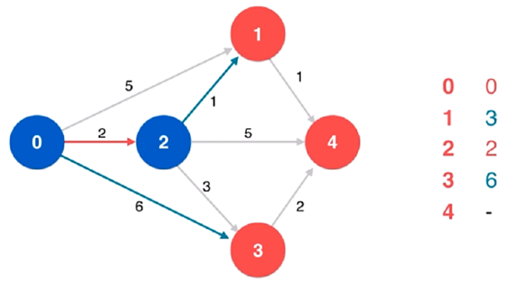
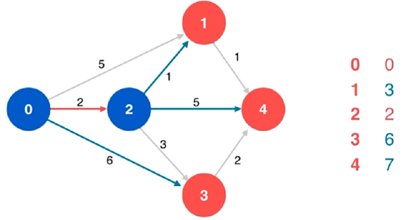

# dijkstra 迪杰斯特拉(单源最短路径算法)

它是一个应用最为广泛的、名气也是最大的单源最短路径算法Dijkstra 算法有一定的局限性：它所处理的图中不能有负权边。

换句话说，如果一张图中，但凡有一条边的权值是负值，那么使用 Dijkstra 算法就可能得到错误的结果不过，在实际生活中所解决的问题，大部分的图是不存在负权边的

如：有一个路线图，那么从一点到另外一点的距离肯定是一个正数,所以，虽然 Dijkstra 算法有局限性，但是并不影响在实际问题的解决中非常普遍的来使用它。

看如下实例：

（1）初始

左边是一张连通带权有向图，右边是起始顶点 0 到各个顶点的当前最短距离的列表，起始顶点 0 到自身的距离是 0

（2）将顶点 0 进行标识，并作为当前顶点

对当前顶点 0 的所有相邻顶点依次进行松弛操作，同时更新列表从列表的未标识顶点中找到当前最短距离最小的顶点，即 顶点 2，就可以说，起始顶点 0 到顶点 2 的最短路径即 0 -> 2

因为：图中没有负权边，即便存在从顶点 1 到顶点 2 的边，也不可能通过松弛操作使得从起始顶点 0 到顶点 2 的距离更小

图中没有负权边保证了：对当前顶点的所有相邻顶点依次进行松弛操作后，只要能从列表的未标识顶点中找到当前最短距离最小的顶点，就能确定起始顶点到该顶点的最短路径

（3）将顶点 2 进行标识，并作为当前顶点

（4）对当前顶点 2 的相邻顶点 1 进行松弛操作，同时更新列表

（5）对当前顶点 2 的相邻顶点 4 进行松弛操作，同时更新列表

（6）对当前顶点 2 的相邻顶点 3 进行松弛操作，同时更新列表

从列表的未标识顶点中找到当前最短距离最小的顶点，即 顶点 1，

就可以说，起始顶点 0 到顶点 1 的最短路径即 0 -> 2 -> 1

（7）将顶点 1 进行标识，并作为当前顶点

（8）对当前顶点 1 的相邻顶点 4 进行松弛操作，同时更新列表

从列表的未标识顶点中找到当前最短距离最小的顶点，即 顶点 4，就可以说，起始顶点 0 到顶点 4 的最短路径即 0 -> 2 -> 1 -> 4

（9）将顶点 4 进行标识，并作为当前顶点

当前顶点 4 没有相邻顶点，不必进行松弛操作

从列表的未标识顶点中找到当前最短距离最小的顶点，即 顶点 3，就可以说，起始顶点 0 到顶点 3 的最短路径即 0 -> 2 -> 3

（10）将顶点 3 进行标识，并作为当前顶点

对当前顶点 3 的相邻顶点 4 进行松弛操作，发现不能通过松弛操作使得从起始顶点 0 到顶点 4 的路径更短，所以保持原有最短路径不变至此，列表中不存在未标识顶点，Dijkstra 算法结束，找到了一棵以顶点 0 为根的最短路径树

Dijkstra 算法的过程总结：

第一步：从起始顶点开始

第二步：对当前顶点进行标识

第三步：对当前顶点的所有相邻顶点依次进行松弛操作

第四步：更新列表

第五步：从列表的未标识顶点中找到当前最短距离最小

       的顶点，作为新的当前顶点

第六步：重复第二步至第五步，直到列表中不存在未标识顶点

Dijkstra 算法主要做两件事情：

（1）从列表中找最值

（2）更新列表

显然，借助最小索引堆作为辅助数据结构，就可以非常容易地实现这两件事情

最后，Dijkstra 算法的时间复杂度：O(E*logV)