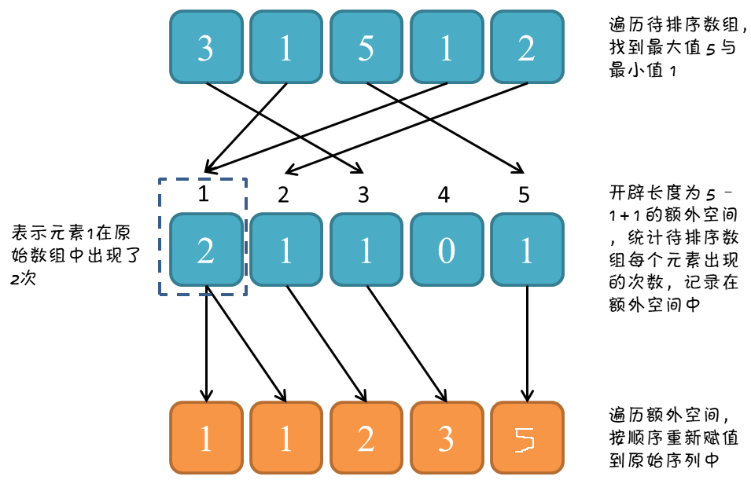

# 【Sort】计数排序

[TOC]

## 一、思想

一句话总结：开辟额外空间，统计每个元素的数量。

计数排序是一种不基于比较的排序算法，主要思想是计算出待排序序列的最大值 maxValue 与 最小值 minValue，开辟一个长度为 maxValue - minValue + 1 的额外空间，统计待排序序列中每个元素的数量，记录在额外空间中，最后遍历一遍额外空间，按照顺序把每个元素赋值到原始序列中。

## 二、图解过程



## 三、核心代码

```java
    /**
     * 找出待排序的数组中最大和最小的元素；
     * 统计数组中每个值为i的元素出现的次数
     * 对所有的计数累加（从C中的第一个元素开始，每一项和前一项相加）；
     * 反向填充目标数组：将每个元素i放在新数组的第C(i)项，每放一个元素就将C(i)减去1。
     *
     * @param array array
     */
    private void countingSort(int[] array) {

        if (array == null || array.length < 2) {
            return;
        }

        // 找出最大值与最小值
        int min = array[0], max = array[0];
        for (int i = 1; i < array.length; i++) {
            if (min > array[i]) {
                min = array[i];
            } else if (max < array[i]) {
                max = array[i];
            }
        }

        // 初始化计数数组
        // 找出每个数字出现的次数
        int[] counter = new int[max - min + 1];
        for (int i = 0; i < array.length; i++) {
            counter[array[i] - min]++;
        }

        // 排序
        int index = 0;
        for (int i = 0; i < counter.length; i++) {
            while (counter[i]-- > 0) {
                array[index++] = i + min;
            }
        }
    }
```

## 四、复杂度分析

### 4.1、时间复杂度：O(n+k)

当待排序元素是 n 个 0 到 k 之间的整数时，时间复杂度是 O(n+k)O(n+k)O(n+k)。

### 4.2、额外空间复杂度：O(n+k)

计数排序需要额外的数组，分别用于记录元素数量与排序结果。

## 五、稳定性分析

生成排序结果的过程，是从后向前遍历的，也就是说原始数组中先出现的元素依旧会在前面。

所以，计数排序是稳定的排序算法。
