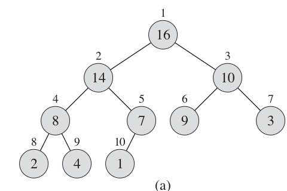
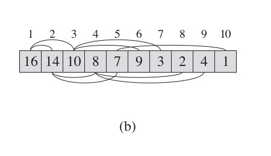
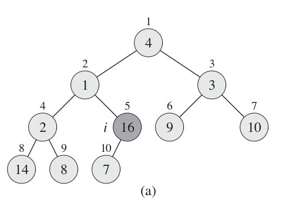

# 堆排序

## 一、堆相关的一些概念

### 1.1、二叉树

二叉树是每个节点最多有两个子树的树结构。也就是**一个节点只能分俩叉。**

### 1.2、完全二叉树

若二叉树的层数为h，除第 h 层外，h层以上的每个节点都挂满两个子节点。

### 1.3、堆

堆，是完全二叉树，分为大根堆和小根堆。

**大根堆的要求是每个节点的值都不大于其父节点的值，在数组的非降序排序中，需要使用的就是大根堆，**因为根据大根堆的要求可知，最大的值一定在堆顶。

## 二、生成最大堆

### 2.1、生成初始堆（数组）

**堆排序是依赖数组来实现的，所以首要的就是把数组和堆结合起来**，比如说我们有一棵如下的二叉树：



上图中，从根结点开始按照**从左到右一层一层的编号的话**，对这些元素的访问就构成了一个序列。比如上图中的序列按照编号顺序如下：`16, 14, 10, 8, 7, 9, 3, 2, 4, 1`，如果将这种**从二叉树的结点关系转换成对应的数组形式的话**，则对应的数组如下图：



从二叉树的每个结点的编码到它的左右字结点的关系，发现一个规律：

> **左子结点的数组索引号= 父结点索引号 i * 2**
> **右子结点的数组索引号=父结点索引号  i * 2 + 1**

这样，**通过一定的运算对应关系将二叉树关系的元素存储到一个数组中。**在实现的时候考虑到我们的数组下标是从0开始的，对应的关系为：

下标为i的左子节点下标为：

```java
public static int left(int i) {  
    return i * 2 + 1;  
}  
```

右子节点下标为：

```java
public static int right(int i) {  
    return i * 2 + 2;  
}  
```

### 2.2、转化为最大堆

最大堆的要求是每个节点的值都**大于它的两个子节点的值**，一个最简单的办法就是从**最低层的结点开始起一个一个的调整大小关系**。

> 如果从a[a.length -1]这样的叶子结点来调整的话，有相当一部分结点是没必要的。**因为这些叶结点根本就没有子结点，连找子结点和去比较的必要都没有了。**
>
> 所以，我们可以从最后面往前到过来去找那些**有子结点的结点**，然后从这些结点开始一个个的进行堆调整。
>
> 那么，**该从哪个结点开始起进行调整呢？**另外，**为什么我们要从后面往前去调整？从前面往后调整不行吗？**

**首先第一个问题，从哪个结点开始进行调整？**

我们来看这棵二叉树：



很显然，**它最后的一个元素也肯定就是最终的一个叶结点**。那么取它的父结点应该就是有子结点的最大号的元素了。**那么从它开始就是最合适的。**取它的父结点可以通过一个简单的i / 2来得到，i为当前结点的下标。

**第二个问题，为什么要从后往前而不是从前往后？**

从下面的层开始调整，保证当上面的父结点来调整的时候，下面的子树已经满足最大堆的条件了。这样出现不符合条件的父结点只需要对下面的子树重新调整就可以。

而从前面往后调整呢？看下面的一个示例：


如果我们从根结点开始，根结点元素4比它的两个子结点都大，不需要调整。而再往后面的时候它的子结点1调整之后被换成16.这样就出现了它的子结点比它还要大的情况，因此从前往后这么调整的过程不行。

**经过前面的讨论，构建最大堆的过程就相当的简单了：**

```java
public static void buildMaxHeap(int[] a) {  
    for(int i = a.length / 2; i >= 0; i--)  
        maxHeapify(a, i);  
}  
```

**其中`maxHeapify(a, i)`方法的含义是调整第i个节点使其满足最大堆的要求。**

## 三、maxHeapify 调整逻辑

maxHeapify方法就是让父结点的值必须比它的子结点要大。笼统的说，就是**将这个不符合条件的结点和子结点进行比较，通过交换将最大的结点作为父结点：**

1. 比较当前结点和它的子结点，**如果当前结点小于它的任何一个子结点，则和最大的那个子结点交换。**否则，当前过程结束。
2. 在交换到新位置的结点重复步骤1，直到叶结点。

```java
public static void maxHeapify(int[] a, int i) {
    int l = left(i);
    int r = right(i);
    int largest = i;

    if(l < a.length && a[l] > a[i])
        largest = l;
    if(r < a.length && a[r] > a[largest])
        largest = r;
    if(i != largest) {
        swap(a, i, largest);
        maxHeapify(a, largest);
    }
}
```

## 四、堆排序

既然建了一个最大堆，能够保证最大的元素就是根结点，那么，**我们如果要从小到大排序的话，最大的元素就只要取根结点就可以了**。如果我们把根结点拿走了，放到结果集的最末一个元素，接着就应该找第二大的元素。

通过前面的maxHeapify过程，如果我们从集合的最低一层叶结点来取，然后放到根结点进行调整的话，肯定也是可以得到剩下元素里面的最大结点的。因此我们可以得到这么一个过程：

1. 取最大堆的根结点元素。
2. 取集合最末尾的元素，放到根结点，调用maxHeapify进行调整。重复步骤1.

```java
public static void heapSort(int[] a)
{  
    if(a == null || a.length <= 1)
        return;
  
    buildMaxHeap(a);
    int length = a.length;
    for(int i = a.length - 1; i > 0; i--) {
        swap(a, i, 0);
        length--;
        maxHeapify(a, 0, length); 
    }
}
```

## 五、完整实例代码

```java
public class HeapSort {
    private static int[] sort = new int[] { 1, 0, 10, 20, 3, 5, 6, 4, 9, 8, 12, 17, 34, 11 };

    public static void main(String[] args) {
        buildMaxHeapify(sort);
        heapSort(sort);
        print(sort);
    }

    private static void buildMaxHeapify(int[] data) {
        // 没有子节点的才需要创建最大堆，从最后一个的父节点开始
        int startIndex = getParentIndex(data.length - 1);
        // 从尾端开始创建最大堆，每次都是正确的堆
        for (int i = startIndex; i >= 0; i--) {
            maxHeapify(data, data.length, i);
        }
    }

    /**
     * 创建最大堆
     *
     * @param data
     * @param heapSize 需要创建最大堆的大小，一般在sort的时候用到，因为最大值放在末尾，末尾就不再归入最大堆了
     * @param index 当前需要创建最大堆的位置
     */
    private static void maxHeapify(int[] data, int heapSize, int index) {
        // 当前点与左右子节点比较
        int left = getChildLeftIndex(index);
        int right = getChildRightIndex(index);

        int largest = index;
        if (left < heapSize && data[index] < data[left]) {
            largest = left;
        }
        if (right < heapSize && data[largest] < data[right]) {
            largest = right;
        }
        // 得到最大值后可能需要交换，如果交换了，其子节点可能就不是最大堆了，需要重新调整
        if (largest != index) {
            int temp = data[index];
            data[index] = data[largest];
            data[largest] = temp;
            maxHeapify(data, heapSize, largest);
        }
    }

    /**
     * 排序，最大值放在末尾，data虽然是最大堆，在排序后就成了递增的
     *
     * @paramdata
     */
    private static void heapSort(int[] data) {
        // 末尾与头交换，交换后调整最大堆
        for (int i = data.length - 1; i > 0; i--) {
            print(data);
            int temp = data[0];
            data[0] = data[i];
            data[i] = temp;
            maxHeapify(data, i, 0);
        }
    }

    /**
     * 父节点位置
     *
     * @paramcurrent
     * @return
     */
    private static int getParentIndex(int current) {
        return (current - 1) >> 1;
    }

    /**
     * 左子节点position注意括号，加法优先级更高
     *
     * @paramcurrent
     * @return
     */
    private static int getChildLeftIndex(int current) {
        return (current << 1) + 1;
    }

    /**
     * 右子节点position
     *
     * @paramcurrent
     * @return
     */
    private static int getChildRightIndex(int current) {
        return (current << 1) + 2;
    }

    private static void print(int[] data) {
        int pre = -2;
        for (int i = 0; i < data.length; i++) {
            if (pre < (int) getLog(i + 1)) {
                pre = (int) getLog(i + 1);
                System.out.println();
            }
            System.out.print(data[i] + "|");
        }
    }

    /**
     * 以2为底的对数
     *
     * @paramparam
     * @return
     */
    private static double getLog(double param) {
        return Math.log(param) / Math.log(2);
    }
}
```

