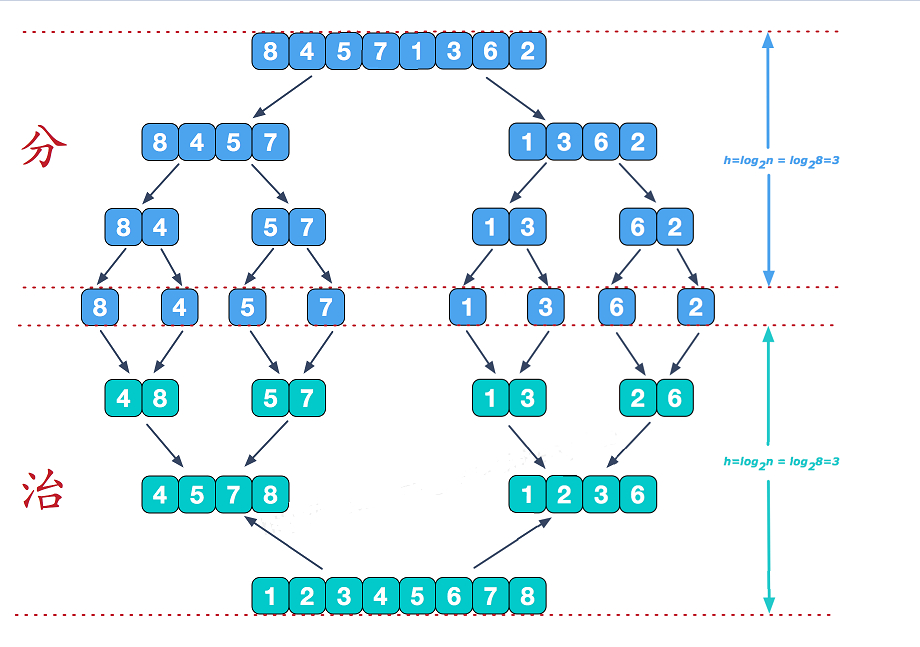
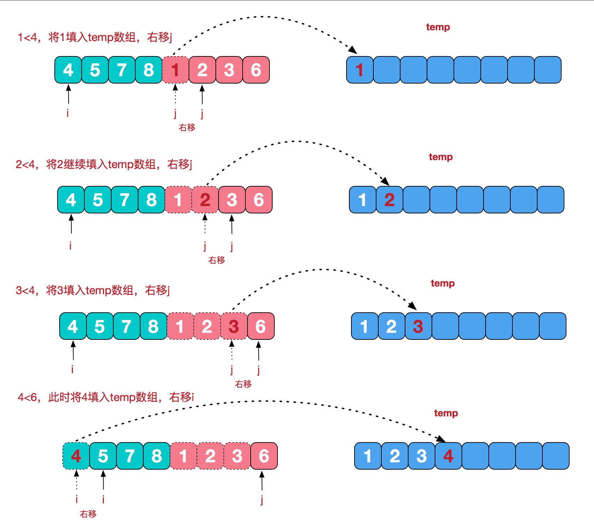

# 【Sort】归并排序算法

[TOC]

## 一、算法介绍

归并排序（MERGE-SORT）是利用**归并**的思想实现的排序方法，该算法采用经典的**分治**（divide-and-conquer）策略（分治法将问题**分**(divide)成一些小的问题然后递归求解，而**治(conquer)**的阶段则将分的阶段得到的各答案"修补"在一起，即分而治之)。



**分**阶段可以理解为就是递归拆分子序列的过程，递归深度为log2n。

## 二、算法解析

分阶段后，再看看**治**阶段，需要将两个已经有序的子序列合并成一个有序序列，比如上图中的最后一次合并，要将[4,5,7,8]和[1,2,3,6]两个已经有序的子序列，合并为最终序列[1,2,3,4,5,6,7,8]，来看下实现步骤：




## 三、算法实现

```java
public class MergeSort {

    public static void main(String[] args) {
        int[] arr = {9, 8, 7, 11, 5, 4, 3, 2, 1};
        sort(arr);
        System.out.println(Arrays.toString(arr));
    }

    public static void sort(int[] arr) {
        //在排序前，先建好一个长度等于原数组长度的临时数组，避免递归中频繁开辟空间
        int[] temp = new int[arr.length];
        sort(arr, 0, arr.length - 1, temp);
    }

    private static void sort(int[] arr, int left, int right, int[] temp) {
        if (left < right) {
            int mid = (left + right) / 2;
            //左边归并排序，使得左子序列有序
            sort(arr, left, mid, temp);
            //右边归并排序，使得右子序列有序
            sort(arr, mid + 1, right, temp);
            //将两个有序子数组合并操作
            merge(arr, left, mid, right, temp);
        }
    }

    private static void merge(int[] arr, int left, int mid, int right, int[] temp) {
        //左序列指针
        int i = left;
        //右序列指针
        int j = mid + 1;
        //临时数组指针
        int t = 0;
        while (i <= mid && j <= right) {
            if (arr[i] <= arr[j]) {
                temp[t++] = arr[i++];
            } else {
                temp[t++] = arr[j++];
            }
        }
        //将左边剩余元素填充进temp中
        while (i <= mid) {
            temp[t++] = arr[i++];
        }
        //将右序列剩余元素填充进temp中
        while (j <= right) {
            temp[t++] = arr[j++];
        }
        t = 0;
        //将temp中的元素全部拷贝到原数组中
        while (left <= right) {
            arr[left++] = temp[t++];
        }
    }

}
```

## 四、总结

归并排序的时间复杂度，在最坏，最好和平均都是O(nlogn)，这是效率，性能非常好的排序算法。

只不过它需要占用 O(n)的内存空间，如果数据量一旦很大，内存可能吃不消，这是它的弱点和致命伤。