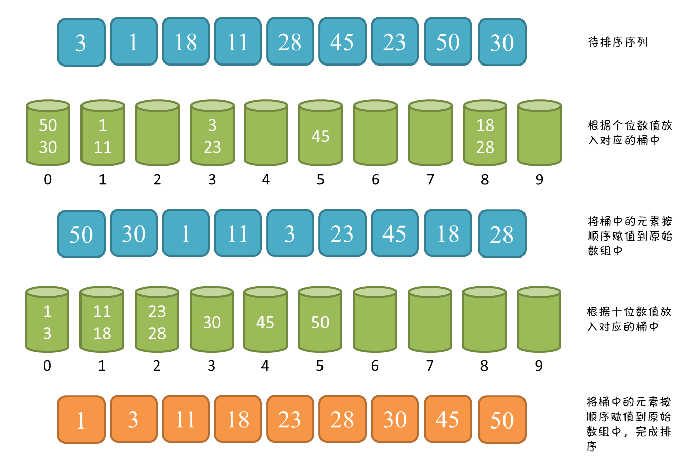

# 【Sort】基数排序

## 一、思想

相比其它排序，主要是利用比较和交换，而基数排序则是利用分配和收集两种基本操作。基数 排序是一种按记录关键字的各位值逐步进行排序的方法。此种排序一般适用于记录的关键字为整数类型的情况。所有对于字符串和文字排序不适合。

实现：将所有待比较数值（自然数）统一为同样的数位长度，数位较短的数前面补零。然后，从最低位开始，依次进行一次排序。这样从最低位排序一直到最高位排序完成以后, 数列就变成一个有序序列。

分为两类：

第一类：最低位优先法，简称 LSD法：先从最低位开始排序，再对次低位排序，直到对最高位排序后得到一个有序序列，*适用于位数较小的数排序*。

第二类：最高位优先法，简称MSD法：先从最高位开始排序，再逐个对各分组按次高位进行子排序，循环直到最低位，*适用于位数较多的情况*。

## 二、图解过程



## 三、LSD 

```java
/**
 * @author w1992wishes 2020/1/15 11:12
 */
public class RadixSort {

    public static void main(String[] args) {
        int[] arr = {6, 9, 1, 4, 5, 8, 7, 0, 2, 3, 1, 4};

        System.out.println("排序前:  ");
        Arrays.stream(arr).forEach(System.out::println);

        new RadixSort().radixLSDSort(arr);

        System.out.println("排序后:  ");
        Arrays.stream(arr).forEach(System.out::println);
    }

    /**
     * 基数排序
     *
     * @param array 数组
     */
    private void radixLSDSort(int[] array) {

        if (array == null || array.length < 2) {
            return;
        }

        // 指数。当对数组按各位进行排序时，exp=1；按十位进行排序时，exp=10；...
        int exp;
        // 数组a中的最大值
        int max = getMax(array);

        // 从个位开始，对数组a按"指数"进行排序
        for (exp = 1; max / exp > 0; exp *= 10) {
            countSort(array, exp);
        }

    }

    /**
     * 对数组按照"某个位数"进行排序(桶排序)
     *
     * @param array -- 数组
     * @param exp   -- 指数。对数组a按照该指数进行排序。
     *
     *              例如，对于数组a={50, 3, 542, 745, 2014, 154, 63, 616}；
     *              (01) 当exp=1表示按照"个位"对数组a进行排序
     *              (02) 当exp=10表示按照"十位"对数组a进行排序
     *              (03) 当exp=100表示按照"百位"对数组a进行排序
     */
    private void countSort(int[] array, int exp) {
        // 存储"被排序数据"的临时数组
        int[] output = new int[array.length];
        int[] buckets = new int[10];

        // 将数据出现的次数存储在buckets[]中, (array[i] / exp) % 10 为 array 中元素在 bucket 数组的下标
        for (int i = 0; i < array.length; i++) {
            buckets[(array[i] / exp) % 10]++;
        }

        // 更改buckets[i]。目的是让更改后的buckets[i]的值，是该数据在output[]中的位置。
        for (int i = 1; i < 10; i++) {
            buckets[i] += buckets[i - 1];
        }

        // 将数据存储到临时数组output[]中
        for (int i = array.length - 1; i >= 0; i--) {
            output[buckets[(array[i] / exp) % 10] - 1] = array[i];
            buckets[(array[i] / exp) % 10]--;
        }

        // 将排序好的数据赋值给 a[]
        for (int i = 0; i < array.length; i++) {
            array[i] = output[i];
        }

        output = null;
        buckets = null;
    }

    /**
     * 位数
     */
    private int getDigit(int max) {

        // String.valueOf(max).length()

        int digit = 0;
        while (max > 0) {
            max /= 10;
            digit++;
        }
        return digit;
    }

    private int getMax(int[] array) {
        int max = array[0];
        for (int i = 0; i < array.length; ++i) {
            max = Math.max(max, array[i]);
        }
        return max;
    }
}
```

## 四、复杂度分析

### 4.1、时间复杂度：O(k*(n+m))

k 为关键字个数，本文的上述距离关键字为 2 个，分别是个位和十位；m 为 关键字的取值范围，本文的举例关键字取值范围 m 为 10（0 - 9）；n 为待排序序列的元素数量。

总共遍历 k 遍，每一遍包含：将每个元素放进桶中（n） 与 将桶中元素收回到原序列中（m），所以时间复杂度为 O(k*(n+m))。

### 4.2、额外空间复杂度：O(n+m)

m 个桶与存放 n 个元素的空间。

## 五、稳定性分析

基数排序不会改变相同元素之间的相对位置，仔细思考一下过程，元素收回的过程中是从后向前进行的。

所以，基数排序是稳定的排序算法。