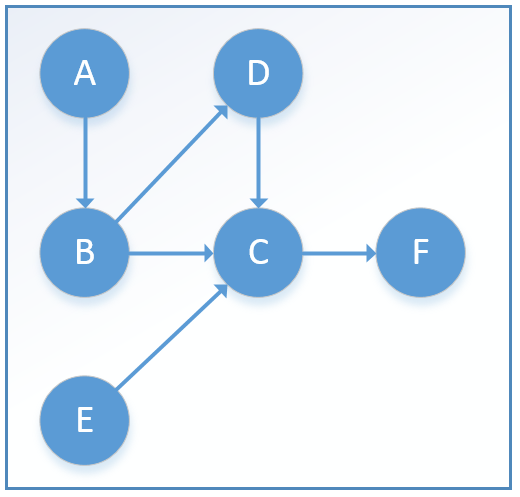

# 【Graph】Topo 排序

[TOC]

## 一、算法介绍

**定义：将有向图中的顶点以线性方式进行排序。即对于任何连接自顶点 u 到顶点 v 的有向边 uv，在最后的排序结果中，顶点u总是在顶点 v 的前面，解决的是一系列相互依赖的事件的排序问题。**

拓扑排序的应用场景很好理解，比如在内存中运行着很多任务，某个任务 A 的执行依赖于另外一个任务 B，那么在 A 执行完之前，B 一定不能被清理。而另外一些任务是没有关联的，如何来安排这些任务被清理的顺序就需要依赖拓扑排序。

一个有向图能被拓扑排序的充要条件就是它是一个有向无环图**(DAG**：**Directed Acyclic Graph)**。

## 二、*Kahn* 算法解析

*Kahn* 算法的实现十分直观，关键在于需要维护一个入度为 **0** 的顶点的集合：

每次从该集合中取出(没有特殊的取出规则，随机取出也行，使用队列/栈也行，下同)一个顶点，将该顶点放入保存结果的 List 中。

紧接着循环遍历由该顶点引出的所有边，从图中移除这条边，同时获取该边的另外一个顶点，如果该顶点的入度在减去本条边之后为0，那么也将这个顶点放到入度为0的集合中。然后继续从集合中取出一个顶点…...

当集合为空之后，检查图中是否还存在任何边，如果存在的话，说明图中至少存在一条环路。不存在的话则返回结果 List，此 List 中的顺序就是对图进行拓扑排序的结果。



## 三、*Kahn* 算法实现

```java
public class KahnTopoSort {
    /**
     * 拓扑排序节点类
     */
    private static class Node {
        public Object val;
        // 入链路数量
        public int pathIn = 0;

        public Node(Object val) {
            this.val = val;
        }
    }

    /**
     * 拓扑图类
     */
    private static class Graph {
        // 图中节点的集合
        public Set<Node> vertexSet = new HashSet<Node>();
        // 相邻的节点，纪录边
        public Map<Node, Set<Node>> adjaNode = new HashMap<Node, Set<Node>>();

        // 将节点加入图中
        public boolean addNode(Node start, Node end) {
            if (!vertexSet.contains(start)) {
                vertexSet.add(start);
            }
            if (!vertexSet.contains(end)) {
                vertexSet.add(end);
            }
            if (adjaNode.containsKey(start)
                    && adjaNode.get(start).contains(end)) {
                return false;
            }
            if (adjaNode.containsKey(start)) {
                adjaNode.get(start).add(end);
            } else {
                Set<Node> temp = new HashSet<Node>();
                temp.add(end);
                adjaNode.put(start, temp);
            }
            end.pathIn++;
            return true;
        }
    }

    //Kahn算法
    private static class KahnTopo {
        private List<Node> result; // 用来存储结果集
        private Queue<Node> setOfZeroIndegree; // 用来存储入度为0的顶点
        private Graph graph;

        //构造函数，初始化
        public KahnTopo(Graph di) {
            this.graph = di;
            this.result = new ArrayList<Node>();
            this.setOfZeroIndegree = new LinkedList<Node>();
            // 对入度为0的集合进行初始化
            for (Node iterator : this.graph.vertexSet) {
                if (iterator.pathIn == 0) {
                    this.setOfZeroIndegree.add(iterator);
                }
            }
        }

        //拓扑排序处理过程
        private void process() {
            while (!setOfZeroIndegree.isEmpty()) {
                Node v = setOfZeroIndegree.poll();

                // 将当前顶点添加到结果集中
                result.add(v);

                if (this.graph.adjaNode.keySet().isEmpty()) {
                    return;
                }

                // 遍历由v引出的所有边
                for (Node w : this.graph.adjaNode.get(v)) {
                    // 将该边从图中移除，通过减少边的数量来表示
                    w.pathIn--;
                    if (0 == w.pathIn) // 如果入度为0，那么加入入度为0的集合
                    {
                        setOfZeroIndegree.add(w);
                    }
                }
                this.graph.vertexSet.remove(v);
                this.graph.adjaNode.remove(v);
            }

            // 如果此时图中还存在边，那么说明图中含有环路
            if (!this.graph.vertexSet.isEmpty()) {
                throw new IllegalArgumentException("Has Cycle !");
            }
        }

        //结果集
        public Iterable<Node> getResult() {
            return result;
        }
    }

    //测试
    public static void main(String[] args) {
        Node A = new Node("A");
        Node B = new Node("B");
        Node C = new Node("C");
        Node D = new Node("D");
        Node E = new Node("E");
        Node F = new Node("F");

        Graph graph = new Graph();
        graph.addNode(A, B);
        graph.addNode(B, C);
        graph.addNode(B, D);
        graph.addNode(D, C);
        graph.addNode(E, C);
        graph.addNode(C, F);

        KahnTopo topo = new KahnTopo(graph);
        topo.process();
        for (Node temp : topo.getResult()) {
            System.out.print(temp.val.toString() + "-->");
        }
    }
}
```