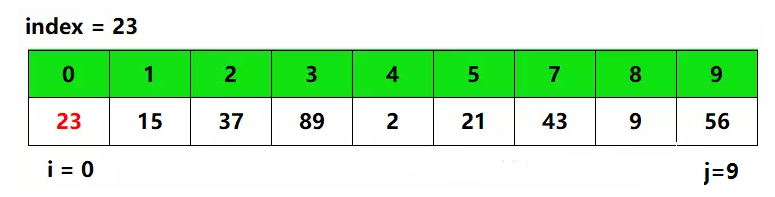
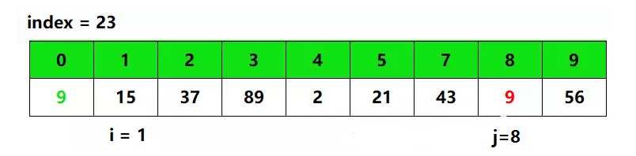
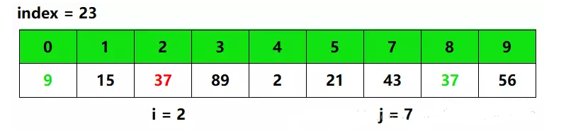
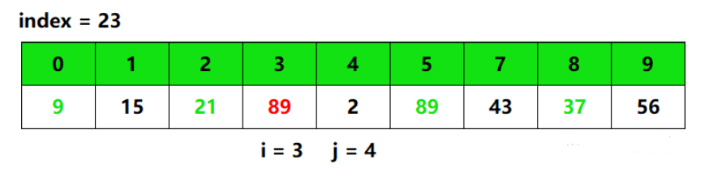
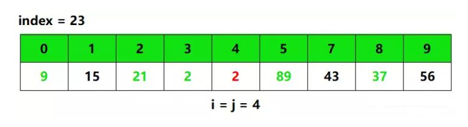
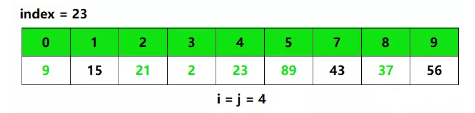
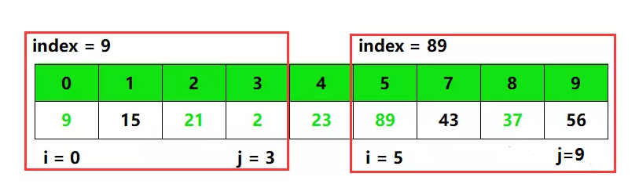

# 【Sort】快速排序算法

[TOC]

## 一、算法介绍

快速排序（QuickSort）是对冒泡排序的一种改进。快速排序由C. A. R. Hoare在1962年提出。它的基本思想是：

1. 从要排序的数据中取一个数为“基准数”。
2. 通过一趟排序将要排序的数据分割成独立的两部分，其中左边的数据都比“基准数”小，右边的数据都比“基准数”大。
3. 然后再按步骤2对这两部分数据分别进行快速排序，整个排序过程可以递归进行，以此达到整个数据变成有序序列。

因为它是跳跃式交换，并非类似与冒泡排序的相邻交换，所以在部分有序的集合中进行快速排序，会大大降低时间跟空间复杂度。

**平均情况下快速排序的时间复杂度是 Θ(nlgn)，最坏情况是 Θ(n^2)，但通过随机算法可以避免最坏情况。由于递归调用，快排的空间复杂度是Θ(lg⁡n)**。

## 二、基准数选取

快速排序是以基准点进行来回交换，所以快速排序的排序趟数和初始的序列有关系。因此选择快速排序的基准点是非常重要的，关系到排序的效率。

**取前或后法**：序列中的第一个或最后一个元素作为基准，如果输入序列（上文中的数组）是随机的，处理时间可以接受的。如果数组已经有序时，此时的分割就是一个非常不好的分割。因为每次划分只能使待排序序列减一，此时为最坏情况，时间复杂度为O(n^2)。而且，输入的数据是有序或部分有序的情况是相当常见的。因此，使用第一个元素作为枢纽元是非常糟糕的。

**随机选取基准**：这是一种相对安全的策略。由于基准点的位置是随机的，那么产生的分割也不会总是会出现劣质的分割。在整个数组数字全相等时，仍然是最坏情况，时间复杂度是O(n^2)。所以随机化快速排序可以对于绝大多数输入数据达到O(nlogn）的期望时间复杂度。

**三数取中法：**在快排的过程中，每一次我们要取一个元素作为基准值，以这个数字来将序列划分为两部分。在此我们采用三数取中法，也就是取左端、中间、右端三个数，然后进行排序，将中间数作为基准值。显然使用三数中值分割法消除了预排序输入的不好情形，并且减少快排大约14%的比较次数。

## 三、算法解析

通过一个例子来看看快速排序是怎么工作的，例子中表格中红色的字体为需要填的坑，绿色的字体为已经移动过的数据。



1）刚开始，i 和 j 分别指向数组头和数组尾，即 i = 0，j = 9，基准数取第一个数，即 index = array[i] = array[0] = 23。

此时，array[0] 的值已经存在了index，因此 array[0] 的位置就好像被挖了个坑，可以填充一个数。

因此，从位置 j 开始向左寻找比 index 小的数，当 j = 8 时，符合条件，于是将 array[8] 的值填到 array[0] ，即将 9 填入 array[0]，并将 i 向右移动一个位置，即 i++。

从位置 j 向左寻找比 index 小的数，并在寻找到后填入坑中，用代码表示如下：

```java
while (i < j && array[j] >= index) { // 向左寻找第一个小于index的数
    j--;
}
if (i < j) {
    array[i++] = array[j]; // 将array[j]填入array[i]，并将i向右移动
}
```

此时，array 数组如下图：



2）因为 array[0] 的坑被 array[8] 填了，于是 array[8] 的位置又成了一个新的坑。此时从位置 i 开始向右寻找比 index 大的数，当 i = 2 时符合条件，于是将 array[2] 的值填到 array[8] ，即将 37 填入 array[8]，并将 j 向左移动一个位置，即 j--。

从位置 i 向右寻找比 index 大的数，并在寻找到后填入坑中，用代码表示如下（跟上面相似）:

```java
while (i < j && array[i] < index) {// 向右寻找第一个大于index的数
    i++;
}
if (i < j) {
    array[j--] = array[i]; // 将array[i]填入array[j]，并将j向左移动
}
```

此时，array 数组如下图：



3）同样，array[8] 的坑被 array[2] 填了，于是 array[2] 的位置又成了一个新的坑。此时从位置 j 开始向左寻找比 index 小的数，当 j = 5 时符合条件，于是将 array[5] 的值填到 array[2] ，即将 21 填入 array[2]，并将 i 向右移动一个位置，即 i++，此时 array 数组如下图：


4）同样，array[2] 的坑被 array[5] 填了，于是 array[5] 的位置又成了一个新的坑。此时从位置 i 开始向右寻找比 index 大的数，当 i = 3 时符合条件，于是将 array[3] 的值填到 array[5] ，即将 89 填入 array[5]，并将 j 向左移动一个位置，即 j--，此时 array 数组如下图：



5）同样，array[5] 的坑被 array[3] 填了，于是 array[3] 的位置又成了一个新的坑。此时从位置 j 开始向左寻找比 index 小的数，当 j = 4 时符合条件，于是将 array[4] 的值填到 array[3] ，即将 2 填入 array[3]，并将 i 向右移动一个位置，即 i++，此时 array 数组如下图：


6）此时，发现 i = j，结束遍历，并将 index 填入 array[4]，即将 23 填入 array[4]，这样，array[4] 左边的数据全比 array[4] 小，而 array[4] 右边的数据全比 array[4] 大，如下图：



7）接下去，只需要对 array[4] 两边的数据分别在进行上面的操作即可（分治法）:

```java
quickSort(array, low, i - 1); // 递归调用，分治
quickSort(array, i + 1, high); // 递归调用，分治
```



## 四、算法实现

将上述整合就得到以下代码：

```java
public class QuickSort {
    
    private static void quickSort(int[] array, int low, int high) {
        if (low >= high) {
            return;
        }
        int i = low, j = high, index = array[i]; // 取最左边的数作为基准数
        while (i < j) {
            while (i < j && array[j] >= index) { // 向左寻找第一个小于index的数
                j--;
            }
            if (i < j) {
                array[i++] = array[j]; // 将array[j]填入array[i]，并将i向右移动
            }
            while (i < j && array[i] < index) {// 向右寻找第一个大于index的数
                i++;
            }
            if (i < j) {
                array[j--] = array[i]; // 将array[i]填入array[j]，并将j向左移动
            }
        }
        array[i] = index; // 将基准数填入最后的坑
        quickSort(array, low, i - 1); // 递归调用，分治
        quickSort(array, i + 1, high); // 递归调用，分治
    }

    public static void quickSort(int[] array) {
        if (array == null || array.length == 0) {
            return;
        }
        quickSort(array, 0, array.length - 1);
    }
}
```