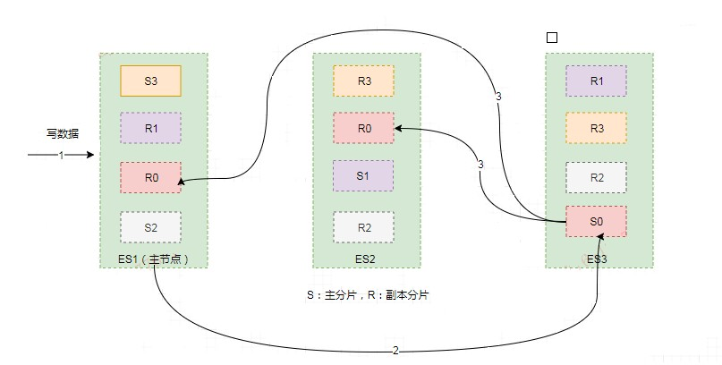
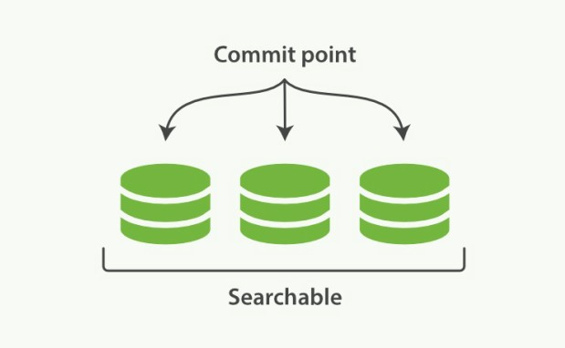
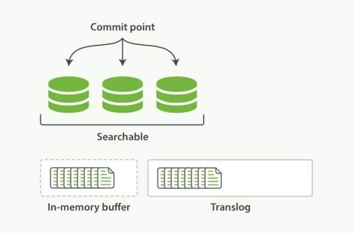
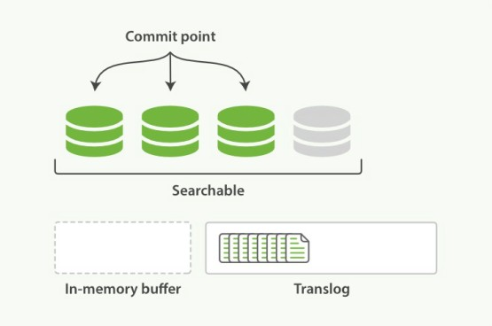
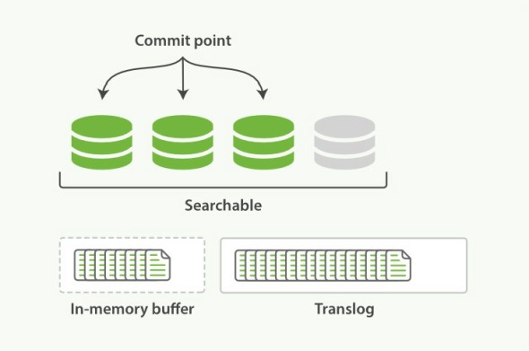
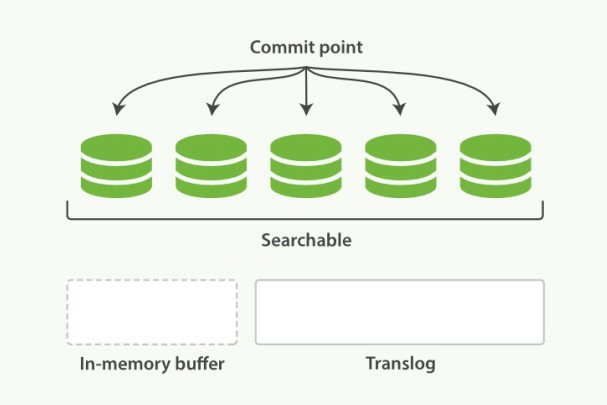
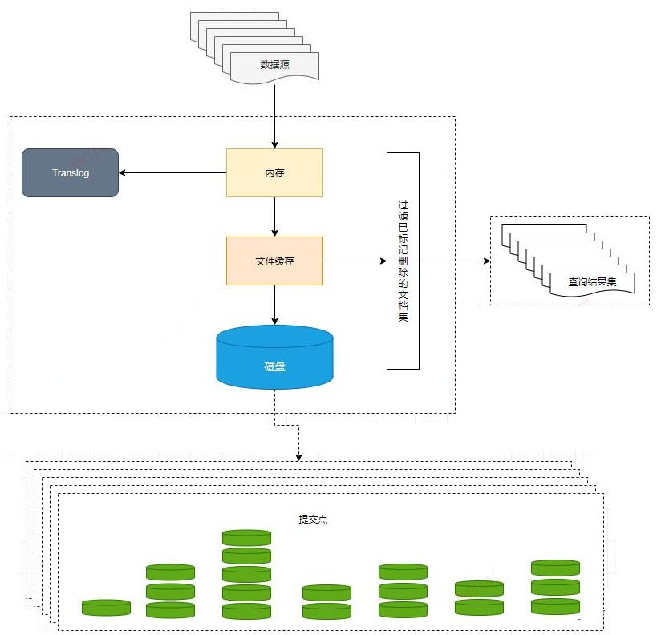
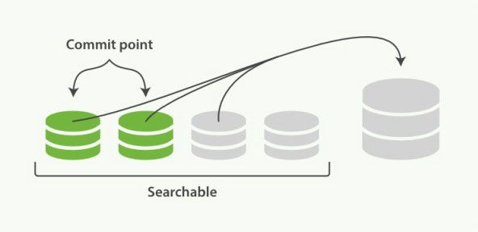
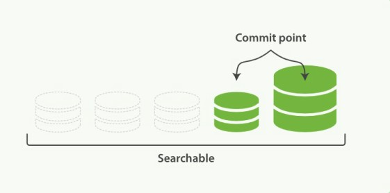

# 【ES】ElasticSearch 深入分片

[TOC]

## 一、分片介绍

分片是 Elasticsearch 在集群中分发数据的关键。

把分片想象成数据的容器。文档存储在分片中，然后分片分配到集群中的节点上。当集群扩容或缩小，Elasticsearch 将会自动在节点间迁移分片，以使集群保持平衡。

一个分片(shard)是一个最小级别“工作单元(worker	unit)”，它只是保存了索引中所有数据的一部分。

 这类似于 MySql 的分库分表，只不过 Mysql 分库分表需要借助第三方组件而 ES 内部自身实现了此功能。 

分片可以是**主分片(primary shard)**或者是**复制分片(replica shard)**。

在集群中唯一一个空节点上创建一个叫做 blogs 的索引。默认情况下，一个索引被分配 5 个主分片，下面只分配 3 个主分片和一个复制分片（每个主分片都有一个复制分片）：

```javascript
curl -H "Content-Type: application/json" -XPUT localhost:9200/blogs -d '
{
    "settings": {
        "number_of_shards": 3,
        "number_of_replicas": 1
    }
}'
```

### 1.1、主分片

在一个多分片的索引中写入数据时，通过路由来确定具体写入哪一个分片中，大致路由过程如下：

```javascript
shard = hash(routing) % number_of_primary_shards
```

routing 是一个可变值，默认是文档的 `_id` ，也可以设置成一个自定义的值。routing 通过 hash 函数生成一个数字，然后这个数字再除以 `number_of_primary_shards` （主分片的数量）后得到余数 。这个在 0 到 `number_of_primary_shards`  之间的余数，就是所寻求的文档所在分片的位置。 

这解释了为什么要在创建索引的时候就确定好主分片的数量并且永远不会改变这个数量：**因为如果数量变化了，那么所有之前路由的值都会无效，文档也再也找不到了**。 

索引中的每个文档属于一个单独的主分片，所以**主分片的数量决定了索引最多能存储多少数据**（实际的数量取决于数据、硬件和应用场景）。

### 1.2、复制分片

复制分片只是主分片的一个副本，它可以**防止硬件故障导致的数据丢失，同时可以提供读请求，比如搜索或者从别的 shard 取回文档**。

每个主分片都有一个或多个副本分片，当主分片异常时，副本可以提供数据的查询等操作。主分片和对应的副本分片是不会在同一个节点上的，所以副本分片数的最大值是 n -1（其中 n 为节点数）。

当索引创建完成的时候，主分片的数量就固定了，但是复制分片的数量可以随时调整，根据需求扩大或者缩小规模。如把复制分片的数量从原来的 1 增加到 2 ：

```shell
curl -H "Content-Type: application/json" -XPUT localhost:9200/blogs/_settings -d '
{
    "number_of_replicas": 2
}'
```

分片本身就是一个完整的搜索引擎，它可以使用单一节点的所有资源。**主分片或者复制分片都可以处理读请求——搜索或文档检索，所以数据的冗余越多，能处理的搜索吞吐量就越大。**

对文档的新建、索引和删除请求都是写操作，必须在主分片上面完成之后才能被复制到相关的副本分片，ES 为了提高写入的能力这个过程是并发写的，同时为了解决并发写的过程中数据冲突的问题，ES 通过乐观锁的方式控制，每个文档都有一个 _version （版本）号，当文档被修改时版本号递增。一旦所有的副本分片都报告写成功才会向协调节点报告成功，协调节点向客户端报告成功。 

## 二、分片的存储

### 2.1、写索引过程

ES 集群中每个节点通过路由都知道集群中的文档的存放位置，所以每个节点都有处理读写请求的能力。

在一个写请求被发送到某个节点后，该节点即为协调节点，协调节点会根据路由公式计算出需要写到哪个分片上，再将请求转发到该分片的主分片节点上。假设  shard = hash(routing) % 4 = 0 ，则过程大致如下：



1. 客户端向 ES1节点（协调节点）发送写请求，通过路由计算公式得到值为0，则当前数据应被写到主分片 S0 上。
2. ES1 节点将请求转发到 S0 主分片所在的节点 ES3，ES3 接受请求并写入到磁盘。
3. 并发将数据复制到两个副本分片 R0 上，其中通过乐观并发控制数据的冲突。一旦所有的副本分片都报告成功，则节点 ES3 将向协调节点报告成功，协调节点向客户端报告成功。

### 2.2、存储原理

#### 2.2.1、索引的不可变性

写入磁盘的倒排索引是不可变的，优势主要表现在： 

* 不需要锁。因为如果从来不需要更新一个索引，就不必担心多个程序同时尝试修改，也就不需要锁。
* 一旦索引被读入内核的文件系统缓存，便会留在哪里，由于其不变性，只要文件系统缓存中还有足够的空间，那么大部分读请求会直接请求内存，而不会命中磁盘。这提供了很大的性能提升。 
* 其它缓存(像filter缓存)，在索引的生命周期内始终有效。它们不需要在每次数据改变时被重建，因为数据不会变化。 
* 写入单个大的倒排索引，可以压缩数据，较少磁盘 IO 和需要缓存索引的内存大小。

当然，不可变的索引有它的缺点：

- 当对旧数据进行删除时，旧数据不会马上被删除，而是在 `.del`文件中被标记为删除。而旧数据只能等到段更新时才能被移除，这样会造成大量的空间浪费。
- 若有一条数据频繁的更新，每次更新都是新增新的标记旧的，则会有大量的空间浪费。
- 每次新增数据时都需要新增一个段来存储数据。当段的数量太多时，对服务器的资源例如文件句柄的消耗会非常大。
- 在查询的结果中包含所有的结果集，需要排除被标记删除的旧数据，这增加了查询的负担。

#### 2.2.2、段的引入

在全文检索的早些时候，会为整个文档集合建立一个大索引，并且写入磁盘。只有新的索引准备好了，它就会替代旧的索引，最近的修改才可以被检索。这无疑是低效的。

因为索引的不可变性带来的好处，那如何在保持不可变同时更新倒排索引？

答案是，使用多个索引。**不是重写整个倒排索引，而是增加额外的索引反映最近的变化。**每个倒排索引都可以按顺序查询，从最老的开始，最后把结果聚合。

这就引入了**段 （segment）**：

* 新的文档首先写入内存区的索引缓存，这时不可检索。
* 时不时（默认 1s 一次），内存区的索引缓存被 refresh 到文件系统缓存（该过程比直接到磁盘代价低很多），成为一个新的段（segment）并被打开，这时可以被检索。
* 新的段提交，写入磁盘，提交后，新的段加入提交点，缓存被清除，等待接收新的文档。

分片下的索引文件被拆分为多个子文件，每个子文件叫作**段**， 每一个段本身都是一个倒排索引，并且段具有不变性，一旦索引的数据被写入硬盘，就不可再修改。

段被**写入到磁盘**后会生成一个**提交点**，提交点是一个用来记录所有提交后段信息的文件。一个段一旦拥有了提交点，就说明这个段只有读的权限，失去了写的权限。相反，当段在内存中时，就只有写的权限，而不具备读数据的权限，意味着不能被检索。 

在 Lucene 中的索引（Lucene 索引是 ES 中的分片，ES 中的索引是分片的集合）指的是段的集合，再加上提交点(commit point)，如下图：



在底层采用了分段的存储模式，使它在读写时几乎完全避免了锁的出现，大大提升了读写性能。 

**索引文件分段存储并且不可修改**，那么新增、更新和删除如何处理呢？ 

- 新增，新增很好处理，由于数据是新的，所以只需要对当前文档新增一个段就可以了。
- 删除，由于不可修改，所以对于删除操作，不会把文档从旧的段中移除，而是通过新增一个 `.del`文件（每一个提交点都有一个 .del 文件），包含了段上已经被删除的文档。当一个文档被删除，它实际上只是在.del文件中被标记为删除，依然可以匹配查询，但是最终返回之前会被从结果中删除。
- 更新，不能修改旧的段来进行反映文档的更新，其实更新相当于是删除和新增这两个动作组成。会将旧的文档在 `.del`文件中标记删除，然后文档的新版本被索引到一个新的段中。可能两个版本的文档都会被一个查询匹配到，但被删除的那个旧版本文档在结果集返回前就会被移除。

#### 2.2.3、延迟写策略--近实时搜索--fresh

ES 是怎么做到**近实时**全文搜索？

磁盘是瓶颈。提交一个新的段到磁盘需要`fsync`操作，确保段被物理地写入磁盘，即时电源失效也不会丢失数据。但是`fsync`是昂贵的，严重影响性能，当写数据量大的时候会造成 ES 停顿卡死，查询也无法做到快速响应。

所以`fsync`不能在每个文档被索引的时就触发，需要一种更轻量级的方式使新的文档可以被搜索，这意味移除`fsync`。

为了提升写的性能，ES 没有每新增一条数据就增加一个段到磁盘上，而是采用**延迟写**的策略。 

**每当有新增的数据时，就将其先写入到内存中，在内存和磁盘之间是文件系统缓存，当达到默认的时间（1秒钟）或者内存的数据达到一定量时，会触发一次刷新（Refresh），将内存中的数据生成到一个新的段上并缓存到文件缓存系统 上，稍后再被刷新到磁盘中并生成提交点**。 

这里的内存使用的是ES的JVM内存，而文件缓存系统使用的是操作系统的内存。新的数据会继续的被写入内存，但内存中的数据并不是以段的形式存储的，因此不能提供检索功能。由内存刷新到文件缓存系统的时候会生成了新的段，并将段打开以供搜索使用，而不需要等到被刷新到磁盘。 

在 Elasticsearch 中，这种写入和打开一个新段的轻量的过程叫做 refresh （即内存刷新到文件缓存系统）。默认情况下每个分片会每秒自动刷新一次。 **这就是为什么说 Elasticsearch 是近实时的搜索了：文档的改动不会立即被搜索，但是会在一秒内可见。**

也可以手动触发 refresh。 `POST /_refresh` 刷新所有索引， `POST /index/_refresh`刷新指定的索引：

```javascript
PUT	/my_logs
{
	"settings":	{
		"refresh_interval":	"30s"
	}
}
```

> **Tips**：尽管刷新是比提交轻量很多的操作，它还是会有性能开销。当写测试的时候，手动刷新很有用，但是不要在生产环境下每次索引一个文档都去手动刷新。而且并不是所有的情况都需要每秒刷新。在使用 Elasticsearch 索引大量的日志文件，可能想优化索引速度而不是近实时搜索，这时可以在创建索引时在 `settings`中通过调大 `refresh_interval="30s"` 的值 ， 降低每个索引的刷新频率，设值时需要注意后面带上时间单位，否则默认是毫秒。当 `refresh_interval=-1`时表示关闭索引的自动刷新。 

#### 2.2.4、持久化--flush

没用`fsync`同步文件系统缓存到磁盘，不能确保电源失效，甚至正常退出应用后，数据的安全。为了 ES 的可靠性，需要确保变更持久化到磁盘。

虽然通过定时 Refresh 获得近实时的搜索，但是 Refresh 只是将数据挪到文件缓存系统，文件缓存系统也是内存空间，属于操作系统的内存，只要是内存都存在断电或异常情况下丢失数据的危险。 

为了避免丢失数据，Elasticsearch添加了**事务日志（Translog）**，事务日志记录了所有还没有持久化到磁盘的数据。 

有了事务日志，过程现在如下：

1. 当一个文档被索引，它被加入到内存缓存，同时加到事务日志。不断有新的文档被写入到内存，同时也都会记录到事务日志中。这时新数据还不能被检索和查询。 
2. 当达到默认的刷新时间或内存中的数据达到一定量后，会触发一次 refresh：
   * 将内存中的数据以一个新段形式刷新到文件缓存系统，但没有fsync；
   * 段被打开，使得新的文档可以搜索；
   * 缓存被清除。 
3. 随着更多的文档加入到缓存区，写入日志，这个过程会继续。
4.  随着新文档索引不断被写入，当日志数据大小超过 512M 或者时间超过 30 分钟时，会进行一次全提交：
   * 内存缓存区的所有文档会写入到新段中，同时清除缓存；
   * 文件系统缓存通过`fsync`操作`flush`到硬盘，生成提交点；
   * 事务日志文件被删除，创建一个空的新日志。 

事务日志记录了没有`flush`到硬盘的所有操作。当故障重启后，ES 会用最近一次提交点从硬盘恢复所有已知的段，并且从日志里恢复所有的操作。

在 ES 中，进行一次提交并删除事务日志的操作叫做`flush`。分片每 30 分钟，或事务日志过大会进行一次`flush`操作。`flush API` 也可用来进行一次手动`flush`，`POST/ _flush`针对所有索引有效，`POST /index/_flush`则指定的索引：

通常很少需要手动`flush`，通常自动的就够了。

总体的流程大致如下：



#### 2.2.5、合并段

由于自动刷新流程每秒会创建一个新的段 ，这样会导致短时间内的段数量暴增。而段数目太多会带来较大的麻烦。每一个段都会消耗文件句柄、内存和 cpu 运行周期。更重要的是，每个搜索请求都必须轮流检查每个段然后合并查询结果，所以段越多，搜索也就越慢。 

ES 通过后台合并段解决这个问题。小段被合并成大段，再合并成更大的段。这时旧的文档从文件系统删除的时候，旧的段不会再复制到更大的新段中。合并的过程中不会中断索引和搜索。 

段合并在进行索引和搜索时会自动进行，合并进程选择一小部分大小相似的段，并且在后台将它们合并到更大的段中，这些段既可以是未提交的也可以是已提交的。



合并结束后老的段会被删除，新的段被 flush 到磁盘，同时写入一个包含新段且排除旧的和较小的段的新提交点，新的段被打开可以用来搜索。



合并大的段会消耗很多 IO 和 CPU，如果不检查会影响到搜素性能。默认情况下，ES 会限制合并过程，这样搜索就可以有足够的资源进行。

## 三、来源资料

1.[全文搜索引擎Elasticsearch，这篇文章给讲透了](https://cloud.tencent.com/developer/article/1488535)
2.ElasticSearch 权威指南》