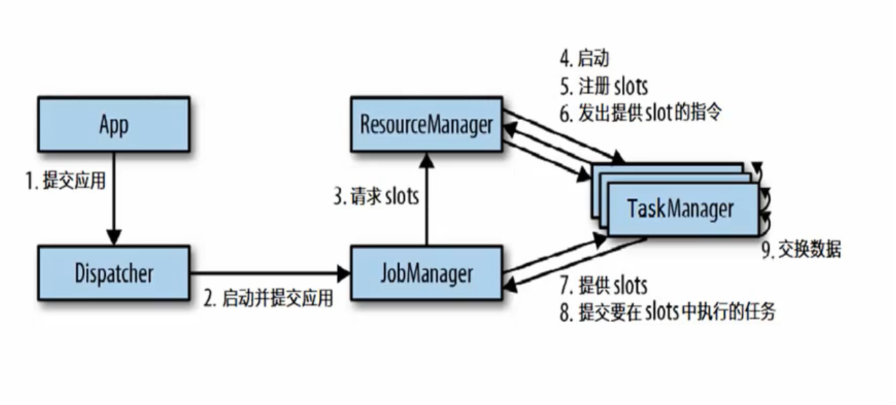
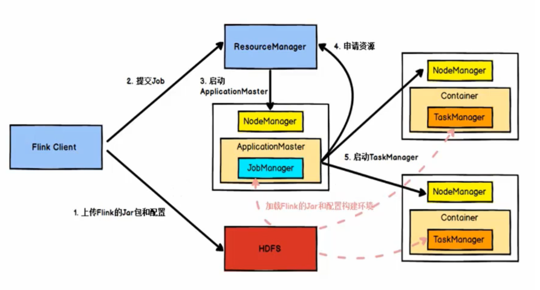

# 【Flink】Flink 运行架构

## 一、运行时组件

### 1.1、JobManager

* 控制一个应用程序执行的主进程，也就是说，每个应用程序都会被一个不同的 JobManager 所控制执行。
* JobManager 会先接收到要执行的应用程序，这个应用程序会包括：作业图（JobGraph）、逻辑数据流图（Logical dataflow graph）和打包了所有的类、库和其他资源的 Jar 包。
* JobManager 会把 JobGraph 转换成一个物理层面的数据流图，这个图被叫做“执行图”（ExecutionGraph），包含了所有可以并发执行的任务。
* JobManager 会向资源管理器（ResourceManger）请求执行任务必要的资源，也就是任务管理器（TaskManager）上的插槽（slot）。一旦它获取到了足够的资源，就会将执行图分发到真正运行它们的 TaskManager上。而在运行过程中，JobManager 会负责所有需要中央协调的操作，比如检查点（checkpoints）的协调。

### 1.2、TaskManager

* Fink 中的工作进程。通常在 Flink 中会有多个 TaskManager 运行，每一个 Task Manager 都包含了一定数量的插槽(slots)。插槽的数量限制了TaskManager 能够执行的任务数量。
* 启动之后，TaskManager 会向资源管理器注册它的插槽；收到资源管理器的指令后，TaskManager 就会将一个或者多个插槽提供给 JobManager 调用。 JobManage 就可以向插槽分配任务( tasks)来执行了。
* 在执行过程中，一个 TaskManager 可以跟其它运行同一应用程序的TaskManager 交换数据。

### 1.3、ResourceManager

* 主要负责管理任务管理器( TaskManager)的插槽(slot)，TaskManger 插槽是 Fink 中定义的处理资源单元。
* Flink 为不同的环境和资源管理工具提供了不同资源管理器，比如YARNMesos、K85,以及 standalone部署
* 当 JobManager 申请插槽資源时，ResourceManager 会将有空闲插槽的TaskManager 分配给 JobManager。如果 ResourceManager 没有足够的插槽来满足 JobManager 的请求，它还可以向資源提供平台发起会话，以提供启动 TaskManager 进程的容器。

### 1.4、Dispatcher

* 可以跨作业运行，它为应用提交提供了 REST 接口。
* 当一个应用被提交执行时，分发器就会启动并将应用移交给一个 JobManager。
* Dispatcher 也会启动一个 WebU，用来方便地展示和监控作业执行的信息。
* Dispatcher 在架构中可能并不是必需的,这取决于应用提交运行的方式。

## 二、运行时基本原理

### 2.1、REST 方式任务提交流程

### 2.2、YARN 方式任务提交流程

Flink 任务提交后，Client 向 HDFS 上传 Flink 的 Jar 包和配置，之后向 Yarn ResourceManager 提交任务，ResourceManager 分配 Container 资源并通知对应的 NodeManager 启动 ApplicationMaster，ApplicationMaster 启动后加载 Flink 的 Jar 包和配置构建环境，然后启动 JobManager，之后 ApplicationMaster 向 ResourceManager 申请资源启动 TaskManager，ResourceManager 分配 Container 资源后，由 ApplicationMaster 通知资源所在节点的 NodeManager 启动TaskManager，NodeManager 加载 Flink 的 Jar 包和配置构建环境并启动TaskManager，TaskManager 启动后向 JobManager 发送心跳包，并等待 JobManager 向其分配任务。

### 2.3、通用任务调度原理

当 Flink 集群启动后，首先会启动一个 JobManger 和一个或多个的 TaskManager。由 Client 提交任务给 JobManager，JobManager 再调度任务到各个 TaskManager 去执行，然后 TaskManager 将心跳和统计信息汇报给 JobManager。TaskManager 之间以流的形式进行数据的传输。上述三者均为独立的 JVM 进程。

- **Client** 为提交 Job 的客户端，可以是运行在任何机器上（与 JobManager 环境连通即可）。客户端不是运行时和程序执行的一部分，它用于准备并发送 dataflow(JobGraph) 给Master(JobManager)，然后，客户端断开连接或者维持连接以等待接收计算结果。
- **JobManager** 主要负责调度 Job 并协调 Task 做 checkpoint，职责上很像 Storm 的 Nimbus。从 Client 处接收到 Job 和 JAR 包等资源后，会生成优化后的执行计划，并以 Task 的单元调度到各个 TaskManager 去执行。
- **TaskManager** 在启动的时候就设置好了槽位数（Slot），每个 slot 能启动一个 Task，Task 为线程。从 JobManager 处接收需要部署的 Task，部署启动后，与自己的上游建立 Netty 连接，接收数据并处理。

可以看到 Flink 的任务调度是多线程模型，并且不同 Job/Task 混合在一个 TaskManager 进程中。虽然这种方式可以有效提高 CPU 利用率，但缺乏资源隔离机制，同时也不方便调试。

## 三、运行时图

Flink 中的执行图可以分成四层：StreamGraph -> JobGraph -> ExecutionGraph -> 物理执行图。

* StreamGraph：是根据用户通过 Stream API 编写的代码生成的最初的图。用来表示程序的拓扑结构。
  * StreamNode：用来代表 operator 的类，并具有所有相关的属性，如并发度、入边和出边等。
  * StreamEdge：表示连接两个StreamNode的边。

* JobGraph：StreamGraph经过优化后生成了 JobGraph，提交给 JobManager 的数据结构。主要的优化为，将多个符合条件的节点 chain 在一起作为一个节点，这样可以减少数据在节点之间流动所需要的序列化/反序列化/传输消耗。
  * JobVertex：经过优化后符合条件的多个StreamNode可能会chain在一起生成一个JobVertex，即一个JobVertex包含一个或多个operator，JobVertex的输入是JobEdge，输出是IntermediateDataSet。
  * IntermediateDataSet：表示JobVertex的输出，即经过operator处理产生的数据集。producer是JobVertex，consumer是JobEdge。
  * JobEdge：代表了job graph中的一条数据传输通道。source 是 IntermediateDataSet，target 是 JobVertex。即数据通过JobEdge由IntermediateDataSet传递给目标JobVertex。

* ExecutionGraph：JobManager 根据 JobGraph 生成 ExecutionGraph。ExecutionGraph 是 JobGraph 的并行化版本，是调度层最核心的数据结构。
  * ExecutionJobVertex：和JobGraph中的JobVertex一一对应。每一个ExecutionJobVertex都有和并发度一样多的 ExecutionVertex。
  * ExecutionVertex：表示ExecutionJobVertex的其中一个并发子任务，输入是ExecutionEdge，输出是IntermediateResultPartition。
  * IntermediateResult：和JobGraph中的IntermediateDataSet一一对应。一个IntermediateResult包含多个IntermediateResultPartition，其个数等于该operator的并发度。
  * IntermediateResultPartition：表示ExecutionVertex的一个输出分区，producer是ExecutionVertex，consumer是若干个ExecutionEdge。
  * ExecutionEdge：表示ExecutionVertex的输入，source是IntermediateResultPartition，target是ExecutionVertex。source和target都只能是一个。
  * Execution：是执行一个 ExecutionVertex 的一次尝试。当发生故障或者数据需要重算的情况下 ExecutionVertex 可能会有多个 ExecutionAttemptID。一个 Execution 通过 ExecutionAttemptID 来唯一标识。JM和TM之间关于 task 的部署和 task status 的更新都是通过 ExecutionAttemptID 来确定消息接受者。

* 物理执行图：JobManager 根据 ExecutionGraph 对 Job 进行调度后，在各个TaskManager 上部署 Task 后形成的“图”，并不是一个具体的数据结构。
  * Task：Execution被调度后在分配的 TaskManager 中启动对应的 Task。Task 包裹了具有用户执行逻辑的 operator。
  * ResultPartition：代表由一个Task的生成的数据，和ExecutionGraph中的IntermediateResultPartition一一对应。
  * ResultSubpartition：是ResultPartition的一个子分区。每个ResultPartition包含多个ResultSubpartition，其数目要由下游消费 Task 数和 DistributionPattern 来决定。
  * InputGate：代表Task的输入封装，和JobGraph中JobEdge一一对应。每个InputGate消费了一个或多个的ResultPartition。
  * InputChannel：每个InputGate会包含一个以上的InputChannel，和ExecutionGraph中的ExecutionEdge一一对应，也和ResultSubpartition一对一地相连，即一个InputChannel接收一个ResultSubpartition的输出。

## 四、Task Slot

每个 Task Slot 表示 TaskManager 拥有资源的一个固定大小的子集。假如一个 TaskManager 有三个 Slot，那么它会将其管理的内存分成三份给各个 Slot。资源 Slot 化意味着一个subtask将不需要跟来自其他job的subtask竞争被管理的内存，取而代之的是它将拥有一定数量的内存储备。需要注意的是，这里不会涉及到CPU的隔离，slot目前仅仅用来隔离task的受管理的内存。

**Task Slot** **是静态的概念， 是指** **TaskManager** **具有的并发执行能力**， 可以通过参数 taskmanager.numberOfTaskSlots 进行配置；而**并行度** **parallelism** **是动态概念， 即** **TaskManager** **运行程序时实际使用的并发能力**，可以通过参数 parallelism.default 进行配置。