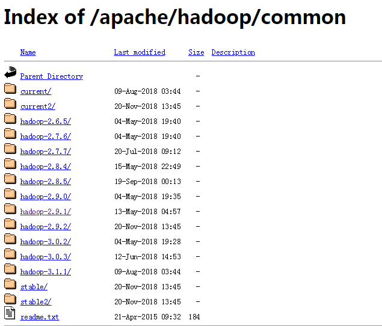
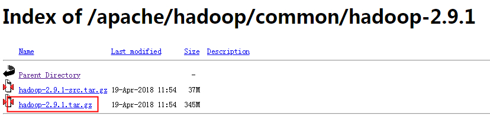

# 【Hadoop】Hadoop 2.9.1 集群安装

本篇结构：

- 前言
- 准备条件
- 安装 Hadoop 集群
- 启动 Hadoop 集群

## 一、前言

开始使用 Hadoop，之前并没有接触，所以先从整个集群搭建开始，也正是因为初识 Hadoop，所以下面的搭建配置不会特别多，先将整个环境搞起来，后续再慢慢了解其他配置，完整整个集群。

## 二、准备条件

环境：Ubuntu 16.04

Hadoop 版本：2.9.1

**2.1、首先所有节点安装两个必要的软件**

```
$ sudo apt-get install ssh 
$ sudo apt-get install rsync
```

**2.2、所有节点修改 /etc/hosts**

```
192.168.11.72 master
192.168.11.73 node1
192.168.11.74 node2
192.168.11.75 node3
192.168.11.76 node4
```

**2.3、所有的节点安装 JDK**

1.下载对应的 jdk 版本

2.解压到 /usr/local/lib 下， tar -zxvf jdk-xxx.tar.gz -C /usr/local/lib

3.配置系统环境变量，编辑/etc/profile文件，在文件的末尾添加如下：

```
export JAVA_HOME=/usr/local/lib/jdk1.8.0_181
export JRE_HOME=$JAVA_HOME/jre
export CLASSPATH=.:$CLASSPATH:$JAVA_HOME/lib:$JRE_HOME/lib
export PATH=$PATH:$JAVA_HOME/bin:$JRE_HOME/bin
```

4.source /etc/profile命令使刚才配置的信息生效

5.验证是否安装成功  java -version
**2.4、创建账户**

```
sudo useradd -m bigdata -s /bin/bash //添加用户
sudo passwd bigdata  //创建密码
sudo  adduser bigdata sudo   //sudo 授权
```

我这边就在原有的账户之上进行，如果想要一个干净的环境，还是建议创建一个新的账户。

**2.5、配置免登陆**

```
# 在master 
sudo apt-get install openssh-server
ssh-keygen -t rsa 回车 回车 回车
cat $HOME/.ssh/id_rsa.pub >> $HOME/.ssh/authorized_keys

scp $HOME/.ssh/id_rsa.pub  bigdata@192.168.11.73:.ssh/
scp $HOME/.ssh/id_rsa.pub  bigdata@192.168.11.74:.ssh/

# 在node1,node2 
cat $HOME/.ssh/id_rsa.pub >> $HOME/.ssh/authorized_keys
```

## 三、安装 Hadoop 集群

**3.1、下载 Hadoop 安装包**

http://www.apache.org/dyn/closer.cgi/hadoop/common/


选一个连接进去：

http://mirror.bit.edu.cn/apache/hadoop/common/



然后选择一个版本下载：



**3.2、解压**

```
sudo tar zxvf hadoop-2.9.1.tar.gz -C /home/bigdata
sudo mv /home/bigdata/hadoop-2.9.1 /home/bigdata/hadoop
sudo chown -R bigdata.bigdata /home/bigdata/hadoop/ 
```

**3.3、hadoop环境变量配置**

```
vi ~/.bashrc
export HADOOP_HOME=/home/bigdata/hadoop
export PATH=$PATH:$HADOOP_HOME/bin

# 立即生效
source ~/.bashrc
```

**3.4、配置hadoop 配置文件**

```
# 修改如下配置
$HADOOP_HOME/etc/hadoop/hadoop-env.sh
$HADOOP_HOME/etc/hadoop/core-site.xml
$HADOOP_HOME/etc/hadoop/hdfs-site.xml
$HADOOP_HOME/etc/hadoop/mapred-site.xml
$HADOOP_HOME/etc/hadoop/yarn-site.xml
$HADOOP_HOME/etc/hadoop/slaves
```

**修改 hadoop-env.sh**

```
vi $HADOOP_HOME/etc/hadoop/hadoop-env.sh

export JAVA_HOME=/usr/local/jdk1.8.0_181
```

将 export JAVA_HOME=${JAVA_HOME} 修改为正确的路径

**配置 core-site.xml**

```
vi $HADOOP_HOME/etc/hadoop/core-site.xml

<configuration>
    <property>
        <name>hadoop.tmp.dir</name>
        <value>file:/home/bigdata/hadoop/tmp</value>
        <description>Abase for other temporary directories.</description>
    </property>
    <property>
        <name>fs.defaultFS</name>
        <value>hdfs://master:9000</value>
    </property>
</configuration>
```

通过 fs.default.name 指定 NameNode 的 IP 地址和端口号，通过 hadoop.tmp.dir 指定 hadoop 数据存储的临时文件夹。

如没有配置 hadoop.tmp.dir 参数，此时系统默认的临时目录为：/tmp/hadoo-hadoop。而这个目录在每次重启后都会被删除，必须重新执行 format 才行，否则会出错。

**配置 hdfs-site.xml**

```
vi $HADOOP_HOME/etc/hadoop/hdfs-site.xml

<configuration>
    <property>
        <name>dfs.replication</name>
        <value>2</value>
    </property>
    <property>
        <name>dfs.name.dir</name>
        <value>/home/bigdata/hadoop/hdfs/name</value>
    </property>
    <property>
        <name>dfs.data.dir</name>
        <value>/home/bigdata/hadoop/hdfs/data</value>
    </property>
</configuration>
```

修改 HDFS 核心配置文件 $HADOOP_HOME/etc/hadoop/hdfs-site.xml，通过dfs.replication 指定 HDFS 的备份因子为 2，通过 dfs.name.dir 指定 namenode 节点的文件存储目录，通过 dfs.data.dir 指定 datanode 节点的文件存储目录。

**配置 mapred-site.xml**

```
cp $HADOOP_HOME/etc/hadoop/mapred-site.xml.template $HADOOP_HOME/etc/hadoop/mapred-site.xml
vi $HADOOP_HOME/etc/hadoop/mapred-site.xml

<configuration>
   <property>
        <name>mapreduce.framework.name</name>
        <value>yarn</value>
    </property>
</configuration>
```

mapred-site.xml 配置 mapreduce 运行的平台，默认为 local 本地平台模拟运行，而不是在集群分布式运行，这里配置为 yarn 平台余下， yarn 负责分配资源。

**配置 yarn-site.xml**

```
$HADOOP_HOME/etc/hadoop/yarn-site.xml

<configuration>
  <!-- Site specific YARN configuration properties -->
      <property>
          <name>yarn.nodemanager.aux-services</name>
          <value>mapreduce_shuffle</value>
      </property>
      <property>
          <name>yarn.resourcemanager.hostname</name>
          <value>master</value>
      </property>
</configuration>
```

yarn.resourcemanager.hostname 指定 yarn  resourcemanager 的 hostname。

**配置 slaves**

```
$HADOOP_HOME/etc/hadoop/slaves

node1
node2
node3
node4
```

**3.5、复制所有的 hadoop 文件夹到其他节点**

```
scp -r hadoop bigdata@node1:/home/bigdata/
scp -r hadoop bigdata@node2:/home/bigdata/
scp -r hadoop bigdata@node3:/home/bigdata/
scp -r hadoop bigdata@node4:/home/bigdata/
```

**3.6、给所有节点 配置 Hadoop 环境变量， master 前面已经配置，这里只配其他的节点就好**

```
vi ~/.bashrc
export HADOOP_HOME=/home/bigdata/hadoop
export PATH=$PATH:$HADOOP_HOME/bin

# 立即生效
source ~/.bashrc
```

## 四、启动 Hadoop 集群

**4.1、格式化 HDFS 文件系统**

进入master的~/hadoop目录，执行以下操作

```
bin/hadoop namenode -format

```

格式化namenode，第一次启动服务前执行的操作，以后不需要执行。

**4.2、然后启动 hadoop**

sbin/start-all.sh

**4.3、使用 jps 命令查看运行情况**

```
# master 上 jps
6307 SecondaryNameNode
6579 ResourceManager
6061 NameNode
7406 Jps

# node 上
124065 NodeManager
124388 Jps
123899 DataNode

```

**4.4、命令查看 Hadoop 集群的状态**

```
DEPRECATED: Use of this script to execute hdfs command is deprecated.
Instead use the hdfs command for it.

Configured Capacity: 2043571961856 (1.86 TB)
Present Capacity: 1360491036672 (1.24 TB)
DFS Remaining: 1360490905600 (1.24 TB)
DFS Used: 131072 (128 KB)
DFS Used%: 0.00%
Under replicated blocks: 0
Blocks with corrupt replicas: 0
Missing blocks: 0
Missing blocks (with replication factor 1): 0
Pending deletion blocks: 0

------

Live datanodes (4):

Name: 192.168.11.73:50010 (gpseg1)
Hostname: gpseg1
Decommission Status : Normal
Configured Capacity: 510892990464 (475.81 GB)
DFS Used: 32768 (32 KB)
Non DFS Used: 167012597760 (155.54 GB)
DFS Remaining: 317904826368 (296.07 GB)
DFS Used%: 0.00%
DFS Remaining%: 62.23%
Configured Cache Capacity: 0 (0 B)
Cache Used: 0 (0 B)
Cache Remaining: 0 (0 B)
Cache Used%: 100.00%
Cache Remaining%: 0.00%

```

**4.5、页面查看 hadoop 状态**

```
http://${master}:50070
http://${master}:8088

```

