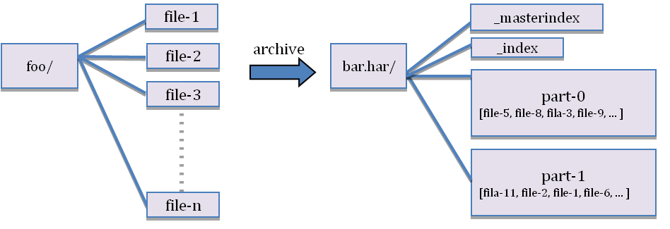

# 【Hadoop】Hadoop 小文件处理

[TOC]

## 一、什么是小文件

小文件是指文件大小明显小于 HDFS 上块（block）大小（默认64MB，在Hadoop2.x中默认为128MB）的文件。

如果一个文件的大小不是块大小的 75%，那么它就是一个小文件。然而，小文件问题并不仅仅影响小文件。如果 Hadoop 集群中的大量文件稍微大于块大小的增量，那么也将遇到与小文件相同的挑战。

例如，如果块大小为128MB，但加载到 Hadoop 的所有文件都是 136MB，那么将拥有大量小的 8MB 块，好消息是解决此处的小块问题可以设置较大的块大小。解决小文件问题要复杂得多。

## 二、小文件是如何产生的

1. 动态分区插入数据，产生大量的小文件，从而导致 map 数量剧增；
2. reduce 数量越多，小文件也越多，reduce 的个数和输出文件个数一致；
3. 数据源本身就是大量的小文件；

## 三、为什么有小文件问题

Hadoop 存在小文件问题有两个主要原因：NameNode 内存管理和 MapReduce 性能。

### 3.1、NameNode 内存管理

Hadoop 中的每个目录，文件和块都表示为 NameNode 内存中的对象。

HDFS 中文件元信息（位置，大小，分块等）保存在 NameNode 的内存中，每个对象大约占用150 字节，如果小文件过多，会占用大量内存，十亿个文件需要 300GB的内存，这严重限制了集群规模的扩展。

1. 当 NameNode 重新启动时，它必须从本地磁盘上的缓存中读取每个文件的元数据，这意味要从磁盘读取大量的数据，会导致启动时间延迟。
2. NameNode 必须不断跟踪并检查群集中每个数据块的存储位置。这是通过监听数据节点来报告其所有数据块来完成的。数据节点必须报告的块越多，它将消耗的网络带宽就越多。即使节点之间存在高速互连，这种规模的简单块报告也可能会造成破坏性。

### 3.2、MapReduce 性能

拥有大量小文件会降低 MapReduce 处理的性能。

**第一个原因是大量的小文件意味着大量的随机磁盘 IO，一次大的顺序读取总是胜过通过几次随机读取相同数量的数据。**

**性能下降的第二个原因，一个文件会启动一个 map，所以小文件越多，map 也越多，一个 map 启动一个 jvm 去执行，这些任务的初始化、启动、执行会浪费大量的资源，严重影响性能。**

当 MapReduce 作业启动时，它会为每个正在处理的数据块计划一个映射任务。存储在 Hadoop 中的每个文件至少有一个块。如果有10000个文件，每个文件包含 10 MB 的数据，则 MapReduce 作业将安 1000 个 map 任务。通常配置 Hadoop，以便每个 map 任务在其自己的 JVM 中运行。

在 MapReduce v1 中，为避免节点过载，会指定节点可以处理的最大并发 map 数。通常，map 的最大数量在 5 到 20 范围内。因此，要同时运行 10 000 个 map，必须拥有500 到 2000 个节点。大多数 Hadoop 集群都小于此，导致JobTracker 在等待打开的插槽时对 map 任务进行排队。如果有一个包含总共 100 个插槽的 20 个节点群集，则队列将变得非常大，并且过程将花费很长时间。

如果拥有 800 个 128 MB 的文件而不是 10000 个 10MB 文件，那么只需要 800 个map 任务。这将减少 JVM 维护时间，并将导致更好的磁盘 IO。即使处理 128 MB 的单个 map 任务将花费比处理 10 MB 的 map 任务处理更长的时间，但是当处理800 个更大的文件时，所有处理时间的总和几乎总是要快几个数量级。

## 四、如何解决小文件问题

指导原则：

1. 输入合并，在 Map 前合并小文件；
2. 输出合并，在输出结果的时候合并小文件；
3. 控制 reduce 个数来实现减少小文件个数。

### 4.1、解决 NameNode 内存问题

Hadoop 中每个块的元数据必须存储在 NameNode 的内存中，这限制 Hadoop 中可以存储的对象数量，并且还会影响启动时间和网络带宽。

有两种解决方案，减少 Hadoop 集群中的对象数量，或以某种方式使 NameNode 更多地使用内存，但不会导致过多的启动时间。解决此内存问题的最常用方法涉及Hadoop 存档（HAR）文件和联合 NameNodes。

#### 4.1.1、Hadoop HAR File

Hadoop Archives （HAR files）是在 0.18.0 版本中引入到 HDFS 中的，它的出现就是为了缓解大量小文件消耗 NameNode 内存的问题。

HAR 文件是通过在 HDFS 上构建一个分层文件系统来工作。HAR 文件通过 `hadoop archive` 命令来创建，而这个命令实际上是运行 MapReduce 作业来将小文件打包成少量的 HDFS 文件（将小文件进行合并成几个大文件）。对于客户端来说，使用 HAR 文件系统没有任何的变化：所有原始文件都可见以及可以访问（只是使用 `har://URL`，而不是 `hdfs://URL`），但是在 HDFS 中文件个数却减少了。

har 文件是通过 MapReduce 生成的，job 结束后源文件不会删除，其结构如下：



Hadoop Archives 唯一的优势可能就是将众多的小文件打包成一个 HAR 文件了，那这个文件就会按照 `dfs.block.size` 的大小进行分块，打成 HAR 文件可以大大降低 NameNode 守护节点的内存压力。但对于MapReduce 来说起不到任何作用，因为 HAR 文件就相当一个目录，仍然不能讲小文件合并到一个 Split 中去，一个小文件一个 Split ，任然是低效的，甚至是更慢的。因为 HAR 文件仍然随机存储在磁盘上，并且每个 HAR 文件访问需要读取两个索引文件以及还要读取数据文件本。


```shell
# Usage: hadoop archive -archiveName name -p <parent> <src>  <dest>

hadoop archive -archiveName zoo.har -p /foo/bar /outputdir

# har命令说明
# 参数 “-p” 为 src path 的前缀，src 可以写多个 path
```

#### 4.1.2、Federated NameNodes

Federated NameNodes 允许在群集中拥有多个 NameNode，每个 NameNode 都存储对象元数据的子集。这消除了将所有对象元数据存储在单个机器上的需要，从而为内存使用提供了更多的扩展。

Federated NameNodes 隔离对象元数据 。只有一个 NameNode 知道任何特定对象。这意味着要获取文件，必须知道要使用哪个 NameNode。如果群集包含多个租户或孤立的应用程序，那么使用 Federated NameNode 很自然 ，可以通过租户或应用程序隔离对象元数据。但是，如果要在群集中的所有应用程序之间共享数据，则此方法并不理想。

由于 Federated 实际上不会更改群集中的对象或块的数量，因此它无法解决MapReduce 性能问题。相反，Federated 为 Hadoop 安装和管理增加了重要且通常不必要的复杂性。当用于解决小文件问题时，通常更多的是隐藏小文件问题的机制。

### 4.2、解决 MapReduce 性能问题

MapReduce 性能问题是由随机磁盘 IO 和启动/管理太多 map 任务的组合引起的。解决方案比较明显 ：拥有更少，更大的文件或启动更少的 map 任务。

一些最常见的解决方案包括：

- 更改摄取过程/间隔
- 批处理文件合并
- 序列文件
- HBase
- S3DistCp（如果使用Amazon EMR）
- 使用 CombineFileInputFormat
- Hive 配置
- 使用 Hadoop 的附加功能

#### 4.2.1、更改摄取过程/间隔

摆脱小文件的最简单方法就是不首先生成它们。如果源系统生成数千个复制到 Hadoop 的小文件，请调查更改源系统以生成一些大文件，或者在摄取到 HDFS 时尽可能连接文件。

如果每小时仅摄取 10 MB 数据，请确定是否每天只能摄取一次，尽量创建 1x240MB 文件而不是 24x10MB 文件。如果小文件确实是不可避免的，那么应该考虑其他解决方案。

#### 4.2.2、批处理文件合并

当小文件不可避免时，文件合并是最常见的解决方案。使用此选项，可以定期运行一个简单的合并 MapReduce 作业来读取文件夹中的所有小文件，并将它们重写为更少的大文件。如果文件夹中有 1000 个文件，并且 MapReduce 作业仅指定 5 个文件，则 1000 个输入文件将合并为 5 个输出文件。

对于小文件合并，一般的做法是编写脚本、程序完成合并。

当然 HDFS 中也提供了一些命令，对于数据量不是很大的情况，十分有用，比如：

1. 将本地的小文件合并，上传到 HDFS：

   ```shell
   hadoop fs -appendToFile 1.txt 2.txt hdfs://cdh5/tmp/12.txt
   ```

2. 下载 HDFS 的小文件到本地，合并成一个大文件**：

   ```shell
   hadoop fs -getmerge hdfs://cdh5/tmp/ *.txt local_largefile.txt
   ```

3. 合并 HDFS 上的小文件：

   ```shell
   hadoop fs -cat hdfs://cdh5/tmp/*.txt | hadoop fs -appendToFile - hdfs://cdh5/tmp/hdfs_largefile.txt
   ```

#### 4.2.3、SequenceFile

当需要维护原始文件名时，一种非常常见的方法是使用 Sequence 文件。方案中，使用文件名作为 key，文件内容作为 value，可以在 map/reduce 过程中的input/output 的 format 时被使用。在 map/reduce 过程中，map 处理文件的临时输出就是使用 SequenceFile 处理过的。


使用 SequenceFile 作为表存储格式：

```sql
create table test2
STORED AS SEQUENCEFILEAS SELECT * FROM test;
```

在实践中这种方式非常有效。回到 10 000 个 100KB 大小的小文件问题上，可以编写一个程序将合并为一个 SequenceFile，然后可以以流式方式处理（直接处理或使用 MapReduce） SequenceFile。这样会带来两个优势：

- SequenceFiles 是可拆分的，因此 MapReduce 可以将它们分成块，分别对每个块进行操作；
- 与 HAR 不同，它们基于记录或块的数据压缩。在大多数情况下，块压缩是最好的选择，因为它直接对几个记录组成的块进行压缩，而不是对每一个记录进行压缩。

```java
public class SmallFilesToSequenceFile extends Configured implements Tool {

    static class SequenceFileMapper extends
            Mapper<NullWritable, BytesWritable, Text, BytesWritable> {
        private Text filename;

        @Override
        protected void setup(Context context) throws IOException,
                InterruptedException {
            InputSplit split = context.getInputSplit();
            Path path = ((FileSplit) split).getPath();
            filename = new Text(path.toString());
        }

        @Override
        protected void map(NullWritable key, BytesWritable value,
                           Context context) throws IOException, InterruptedException {
            context.write(filename, value);
        }
    }

    @Override
    public int run(String[] args) throws Exception {

        Configuration conf = new Configuration();
        Job job = Job.getInstance(conf);
        job.setJarByClass(SmallFilesToSequenceFile.class);
        job.setJobName("smallfilestoseqfile");
        job.setInputFormatClass(FileInputFormat.class);
        job.setOutputFormatClass(SequenceFileOutputFormat.class);

        job.setNumReduceTasks(1);
        FileInputFormat.setInputPaths(job, new Path(args[0]));
        FileOutputFormat.setOutputPath(job, new Path(args[1]));

        job.setOutputKeyClass(Text.class);
        job.setOutputValueClass(BytesWritable.class);
        job.setMapperClass(SequenceFileMapper.class);
        return job.waitForCompletion(true) ? 0 : 1;
    }

    public static void main(String[] args) throws Exception {
        int exitCode = ToolRunner.run(new SmallFilesToSequenceFile(), args);
        System.exit(exitCode);
    }
}
```

#### 4.2.4、CombineFileInputFormat

Hadoop 内置提供了一个 CombineFileInputFormat 类来专门处理小文件，其核心思想是：根据一定的规则，将 HDFS 上多个小文件合并到一个 InputSplit 中，然后会启用一个 Map 来处理这里面的文件，以此减少MR整体作业的运行时间。

CombineFileInputFormat 类继承自 FileInputFormat，主要重写了`List  getSplits(JobContext job) `方法；这个方法会根据数据的分布，`mapreduce.input.fileinputformat.split.minsize.per.node`、`mapreduce.input.fileinputformat.split.minsize.per.rack` 以及`mapreduce.input.fileinputformat.split.maxsize`  参数的设置来合并小文件，并生成List。

其中 `mapreduce.input.fileinputformat.split.maxsize` 参数至关重要，如果用户没有设置这个参数（默认就是没设置），那么同一个机架上的所有小文件将组成一个 InputSplit，最终由一个 Map Task 来处理。

如果用户设置了这个参数，那么同一个节点（node）上的文件将会组成一个InputSplit。同一个 InputSplit 包含了多个 HDFS 块文件，这些信息存储在 CombineFileSplit 类中，它主要包含以下信息:

```java
private Path[] paths;
private long[] startoffset;
private long[] lengths;
private String[] locations;
private long totLength;
```

CombineFileSplit 类包含了每个块文件的路径、起始偏移量、相对于原始偏移量的大小以及这个文件的存储节点。因为一个 CombineFileSplit 包含了多个小文件，所以需要使用数组来存储这些信息。

CombineFileInputFormat 是抽象类，如果要使用它，需要实现 createRecordReader 方法，告诉 MR 程序如何读取组合的 InputSplit。内置实现了两种用于解析组合 InputSplit 的类：org.apache.hadoop.mapreduce.lib.input.CombineTextInputFormat 和 org.apache.hadoop.mapreduce.lib.input.CombineSequenceFileInputFormat，可以把这两个类理解是 TextInputFormat 和 SequenceFileInputFormat。

```java
public class CombineFileTest extends Configured implements Tool {
    private static final Log LOG = LogFactory.getLog(CombineFileTest.class);
    private static final long ONE_MB = 1024 * 1024L;

    static class TextFileMapper extends Mapper<LongWritable, Text, Text, Text> {

        @Override
        protected void map(LongWritable key, Text value, Context context)
                throws IOException, InterruptedException {
            Configuration configuration = context.getConfiguration();
            LOG.warn("MAP_INPUT_FILE    " + configuration.get(MRJobConfig.MAP_INPUT_FILE));
            Text filenameKey = new Text(configuration.get(MRJobConfig.MAP_INPUT_FILE));
            context.write(filenameKey, value);
        }
    }

    public static void main(String[] args) throws Exception {
        int exitCode = ToolRunner.run(new CombineFileTest(), args);
        System.exit(exitCode);
    }

    @Override
    public int run(String[] args) throws Exception {
        Configuration conf = new Configuration(getConf());
        conf.setLong("mapreduce.input.fileinputformat.split.maxsize", ONE_MB * 32);
        Job job = Job.getInstance(conf);
        FileInputFormat.setInputPaths(job, args[0]);
        FileOutputFormat.setOutputPath(job, new Path(args[1]));
        job.setJarByClass(CombineFileTest.class);
        job.setInputFormatClass(CombineTextInputFormat.class);
        job.setOutputFormatClass(TextOutputFormat.class);
        job.setOutputKeyClass(Text.class);
        job.setOutputValueClass(Text.class);
        job.setMapperClass(TextFileMapper.class);
        return job.waitForCompletion(true) ? 0 : 1;
    }
}
```

## 五、参考博文

https://www.jianshu.com/p/e2c8f89dfda6
https://www.jianshu.com/p/9b1042c761d4
https://www.cnblogs.com/ballwql/p/8944025.html