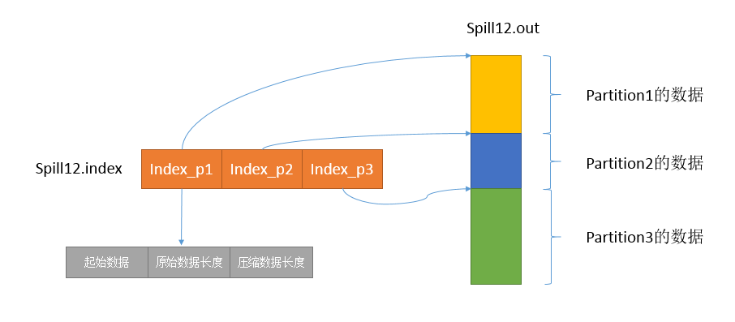
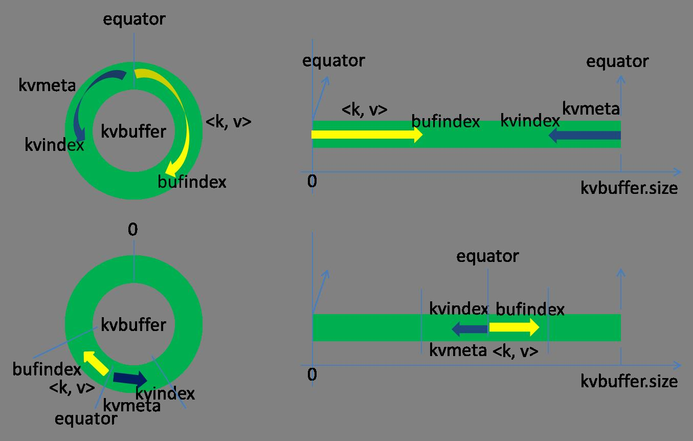
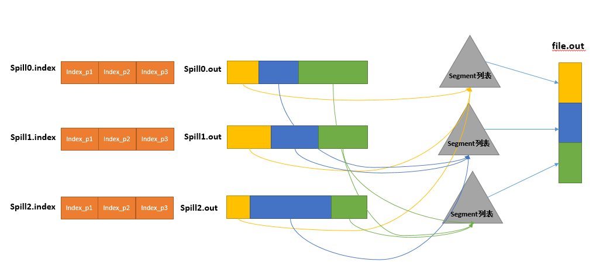

# 【Hadoop】MapReduce shuffle 过程详解

非原创，转载自： https://blog.csdn.net/u014374284/article/details/49205885 

[TOC]

## 一、MapReduce计算模型

MapReduce 计算模型主要由三个阶段构成：Map、shuffle、Reduce。

Map 是映射，负责数据的过滤分法，将原始数据转化为键值对；Reduce 是合并，将具有相同 key 值的 value 进行处理后再输出新的键值对作为最终结果。为了让Reduce 可以并行处理 Map 的结果，必须对 Map 的输出进行一定的排序与分割，然后再交给对应的 Reduce，而这个将 Map 输出进行进一步整理并交给 Reduce 的过程就是 Shuffle。整个 MR 的大致过程如下：

Map 和 Reduce 操作需要自己定义相应 Map 类和 Reduce 类，以完成所需要的化简、合并操作，而 shuffle 则是系统自动实现的，了解 shuffle 的具体流程能帮助编写出更加高效的 Mapreduce 程序。

Shuffle 过程包含在 Map 和 Reduce 两端，即 **Map shuffle** 和 **Reduce shuffle**。

## 二、Map shuffle

在 Map 端的 shuffle 过程是**对 Map 的结果进行分区、排序、分割，然后将属于同一划分（分区）的输出合并在一起并写在磁盘上，最终得到一个分区有序的文件**，分区有序的含义是 map 输出的键值对按分区进行排列，具有相同 partition值的键值对存储在一起，每个分区里面的键值对又按 key 值进行升序排列（默认），其流程大致如下：

### 2.1、Partition

对于 map 输出的每一个键值对，系统都会给定一个 partition，partition 值默认是通过计算 key 的 hash 值后对 Reduce task 的数量取模获得。如果一个键值对的partition 值为1，意味着这个键值对会交给第一个 Reducer 处理。 

我们知道每一个 Reduce 的输出都是有序的，但是将所有 Reduce 的输出合并到一起却并非是全局有序的，如果要做到全局有序，我们该怎么做呢？最简单的方式，只设置一个 Reduce task，但是这样完全发挥不出集群的优势，而且能应对的数据量也很受限。最佳的方式是自己定义一个 Partitioner，用输入数据的最大值除以系统 Reduce task 数量的商作为分割边界，也就是说分割数据的边界为此商的 1 倍、2 倍至 numPartitions-1 倍，这样就能保证执行 partition 后的数据是整体有序的。

另一种需要我们自己定义一个 Partitioner 的情况是各个 Reduce task 处理的键值对数量极不平衡。对于某些数据集，由于很多不同的 key 的 hash 值都一样，导致这些键值对都被分给同一个 Reducer 处理，而其他的 Reducer 处理的键值对很少，从而拖延整个任务的进度。当然，编写自己的 Partitioner 必须要保证具有相同 key 值的键值对分发到同一个 Reducer。

### 2.2、Collector

Map 的输出结果是由 collector 处理的，每个 Map 任务不断地将键值对输出到在内存中构造的一个**环形数据结构中**。使用环形数据结构是为了更有效地使用内存空间，在内存中放置尽可能多的数据。

这个数据结构其实就是个字节数组，叫 Kvbuffer，名如其义，但是这里面不光放置了数据，还放置了一些索引数据，给放置索引数据的区域起了一个 Kvmeta 的别名，在 Kvbuffer 的一块区域上穿了一个 IntBuffer（字节序采用的是平台自身的字节序）的马甲。数据区域和索引数据区域在 Kvbuffer 中是相邻不重叠的两个区域，用一个分界点来划分两者，分界点不是亘古不变的，而是每次 Spill 之后都会更新一次。初始的分界点是0，数据的存储方向是向上增长，索引数据的存储方向是向下增长，如图所示：

Kvbuffer 的存放指针 bufindex 是一直闷着头地向上增长，比如 bufindex 初始值为0，一个 Int 型的 key 写完之后，bufindex 增长为4，一个 Int 型的 value 写完之后，bufindex 增长为8。

索引是对在 kvbuffer 中的键值对的索引，是个四元组，包括：value 的起始位置、key 的起始位置、partition 值、value 的长度，占用四个 Int 长度，Kvmeta 的存放指针 Kvindex 每次都是向下跳四个“格子”，然后再向上一个格子一个格子地填充四元组的数据。比如 Kvindex 初始位置是 -4，当第一个键值对写完之后，(Kvindex+0)的位置存放 value 的起始位置、(Kvindex+1)的位置存放 key 的起始位置、(Kvindex+2)的位置存放 partition 的值、(Kvindex+3)的位置存放 value 的长度，然后 Kvindex 跳到 -8 位置，等第二个键值对和索引写完之后，Kvindex 跳到 -12 位置。

**Kvbuffer 的大小可以通过 io.sort.mb 设置，默认大小为 100M**。但不管怎么设置，Kvbuffer 的容量都是有限的，键值对和索引不断地增加，加着加着，Kvbuffer 总有不够用的那天，那怎么办？把数据从内存刷到磁盘上再接着往内存写数据，把Kvbuffer 中的数据刷到磁盘上的过程就叫 Spill，多么明了的叫法，内存中的数据满了就自动地 spill 到具有更大空间的磁盘。

关于 Spill 触发的条件，也就是 Kvbuffer 用到什么程度开始 Spill，还是要讲究一下的。如果把 Kvbuffer 用得死死得，一点缝都不剩的时候再开始 Spill，那 Map 任务就需要等 Spill 完成腾出空间之后才能继续写数据；如果 Kvbuffer 只是满到一定程度，比如 80% 的时候就开始 Spill，那在 Spill 的同时，Map 任务还能继续写数据，如果 Spill 够快，Map 可能都不需要为空闲空间而发愁。两利相衡取其大，一般选择后者。**Spill 的门限可以通过 io.sort.spill.percent，默认是0.8**。

Spill 这个重要的过程是由 Spill 线程承担，Spill 线程从 Map 任务接到“命令”之后就开始正式干活，干的活叫 SortAndSpill，原来不仅仅是 Spill，在 Spill 之前还有个颇具争议性的 Sort。

### 2.3、Sort

当 Spill 触发后，SortAndSpill 先把 Kvbuffer 中的数据按照 partition 值和 key 两个关键字升序排序，移动的只是索引数据，排序结果是 Kvmeta 中数据按照 partition为单位聚集在一起，同一 partition 内的按照 key 有序。 

### 2.4、Spill

Spill 线程为这次 Spill 过程创建一个磁盘文件：从所有的本地目录中轮训查找能存储这么大空间的目录，找到之后在其中创建一个类似于 “spill12.out” 的文件。Spill 线程根据排过序的 Kvmeta 挨个 partition 的把数据吐到这个文件中，一个 partition 对应的数据吐完之后顺序地吐下个 partition，直到把所有的 partition 遍历完。一个 partition 在文件中对应的数据也叫段(segment)。在这个过程中如果用户配置了 combiner类，那么在写之前会先调用 combineAndSpill()，对结果进行进一步合并后再写出。Combiner 会优化 MapReduce 的中间结果，所以它在整个模型中会多次使用。那哪些场景才能使用 Combiner 呢？Combiner 的输出是 Reducer 的输入，Combiner 绝不能改变最终的计算结果。所以从我的想法来看，Combiner 只应该用于那种 Reduce 的输入 key/value 与输出 key/value 类型完全一致，且不影响最终结果的场景。比如累加，最大值等。Combiner 的使用一定得慎重，如果用好，它对 job 执行效率有帮助，反之会影响 reduce 的最终结果。

所有的 partition 对应的数据都放在这个文件里，虽然是顺序存放的，但是怎么直接知道某个partition 在这个文件中存放的起始位置呢？强大的索引又出场了。有一个三元组记录某个 partition 对应的数据在这个文件中的索引：**起始位置、原始数据长度、压缩之后的数据长度，一个 partition 对应一个三元组**。然后把这些索引信息存放在内存中，如果内存中放不下了，后续的索引信息就需要写到磁盘文件中了：从所有的本地目录中轮训查找能存储这么大空间的目录，找到之后在其中创建一个类似于 “spill12.out.index” 的文件，文件中不光存储了索引数据，还存储了crc32 的校验数据。spill12.out.index 不一定在磁盘上创建，如果内存（默认 1M 空间）中能放得下就放在内存中，即使在磁盘上创建了，和 spill12.out 文件也不一定在同一个目录下。每一次 Spill 过程就会最少生成一个 out 文件，有时还会生成 index 文件，Spill 的次数也烙印在文件名中。索引文件和数据文件的对应关系如下图所示：

在 Spill 线程如火如荼的进行 SortAndSpill 工作的同时，Map 任务不会因此而停歇，而是一无既往地进行着数据输出。Map 还是把数据写到 kvbuffer 中，那问题就来了：只顾着闷头按照 bufindex 指针向上增长，kvmeta 只顾着按照 Kvindex 向下增长，是保持指针起始位置不变继续跑呢，还是另谋它路？如果保持指针起始位置不变，很快 bufindex 和 Kvindex 就碰头了，碰头之后再重新开始或者移动内存都比较麻烦，不可取。Map 取 kvbuffer 中剩余空间的中间位置，用这个位置设置为新的分界点，bufindex 指针移动到这个分界点，Kvindex 移动到这个分界点的 -16 位置，然后两者就可以和谐地按照自己既定的轨迹放置数据了，当 Spill 完成，空间腾出之后，不需要做任何改动继续前进。分界点的转换如下图所示：

**Map 任务总要把输出的数据写到磁盘上，即使输出数据量很小在内存中全部能装得下，在最后也会把数据刷到磁盘上。** 

### 2.5、Merge

Map 任务如果输出数据量很大，可能会进行好几次 Spill，out 文件和 Index 文件会产生很多，分布在不同的磁盘上。最后把这些文件进行合并的 merge 过程闪亮登场。

Merge 过程怎么知道产生的 Spill 文件都在哪了呢？从所有的本地目录上扫描得到产生的 Spill 文件，然后把路径存储在一个数组里。Merge 过程又怎么知道 Spill 的索引信息呢？没错，也是从所有的本地目录上扫描得到 Index 文件，然后把索引信息存储在一个列表里。到这里，又遇到了一个值得纳闷的地方。在之前 Spill 过程中的时候为什么不直接把这些信息存储在内存中呢，何必又多了这步扫描的操作？特别是 Spill 的索引数据，之前当内存超限之后就把数据写到磁盘，现在又要从磁盘把这些数据读出来，还是需要装到更多的内存中。之所以多此一举，是因为这时 kvbuffer 这个内存大户已经不再使用可以回收，有内存空间来装这些数据了。（对于内存空间较大的土豪来说，用内存来省却这两个 io 步骤还是值得考虑的。）

然后为 merge 过程创建一个叫 file.out 的文件和一个叫 file.out.Index 的文件用来存储最终的输出和索引，一个 partition 一个 partition 的进行合并输出。对于某个partition 来说，从索引列表中查询这个 partition 对应的所有索引信息，每个对应一个段插入到段列表中。也就是这个 partition 对应一个段列表，记录所有的 Spill 文件中对应的这个 partition 那段数据的文件名、起始位置、长度等等。

然后对这个 partition 对应的所有的 segment 进行合并，目标是合并成一个segment。当这个 partition 对应很多个 segment 时，会分批地进行合并：先从segment 列表中把第一批取出来，以 key 为关键字放置成最小堆，然后从最小堆中每次取出最小的输出到一个临时文件中，这样就把这一批段合并成一个临时的段，把它加回到 segment 列表中；再从 segment 列表中把第二批取出来合并输出到一个临时 segment，把其加入到列表中；这样往复执行，直到剩下的段是一批，输出到最终的文件中。最终的索引数据仍然输出到 Index 文件中。

## 三、Reduce shuffle

 在 Reduce 端，shuffle 主要分为复制 Map 输出、排序合并两个阶段。 

### 3.1、Copy

Reduce 任务通过 HTTP 向各个 Map 任务拖取它所需要的数据。Map 任务成功完成后，会通知父 TaskTracker 状态已经更新，TaskTracker 进而通知 JobTracker（这些通知在心跳机制中进行）。所以，对于指定作业来说，JobTracker 能记录 Map 输出和 TaskTracker 的映射关系。Reduce 会定期向 JobTracker 获取 Map 的输出位置，一旦拿到输出位置，Reduce 任务就会从此输出对应的 TaskTracker 上复制输出到本地，而不会等到所有的 Map 任务结束。

### 3.2、Merge Sort

Copy 过来的数据会先放入内存缓冲区中，如果内存缓冲区中能放得下这次数据的话就直接把数据写到内存中，即**内存到内存 merge**。

Reduce 要向每个 Map 去拖取数据，在内存中每个 Map 对应一块数据，当内存缓存区中存储的 Map 数据占用空间达到一定程度的时候，开始启动内存中 merge，把内存中的数据 merge 输出到磁盘上一个文件中，即**内存到磁盘 merge**。

在将 buffer 中多个 map 输出合并写入磁盘之前，如果设置了 Combiner，则会化简压缩合并的 map 输出。Reduce 的内存缓冲区可通过`mapred.job.shuffle.input.buffer.percent`配置，默认是 JVM 的 heap size 的70%。内存到磁盘 merge 的启动门限可以通过`mapred.job.shuffle.merge.percent`配置，默认是 66%。

当属于该 reducer 的 map 输出全部拷贝完成，则会在 reducer 上生成多个文件（如果拖取的所有 map 数据总量都没有内存缓冲区，则数据就只存在于内存中），这时开始执行合并操作，即**磁盘到磁盘 merge**，Map 的输出数据已经是有序的，Merge 进行一次合并排序，所谓 Reduce 端的 sort 过程就是这个合并的过程。一般Reduce 是一边 copy 一边 sort，即 copy 和 sort 两个阶段是重叠而不是完全分开的。最终 Reduce shuffle 过程会输出一个整体有序的数据块。

## 四、参考

http://www.csdn.net/article/2014-05-19/2819831-TDW-Shuffle/1
http://blog.csdn.net/xiaolang85/article/details/8528892
http://shiyanjun.cn/archives/588.html