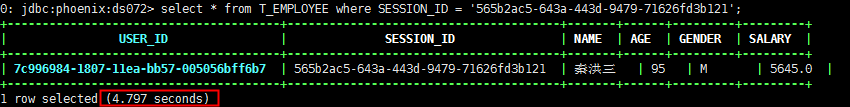
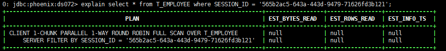
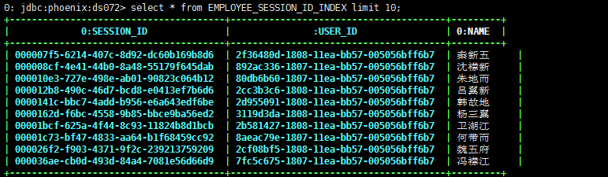
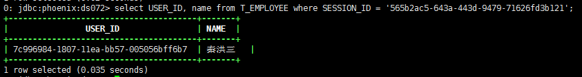
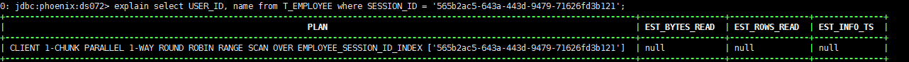
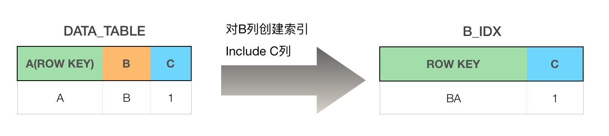
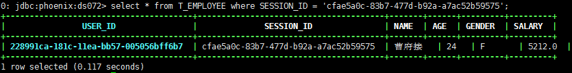

# 【HBase】HBase phoenix 安装使用

## 一、Hbase 集成 Phoneix

### 1.1、下载

 https://mirrors.tuna.tsinghua.edu.cn/apache/phoenix/ 

选择 HBase 对应的版本下载。

### 1.2、解压

```shell
tar -zxv -f apache-phoenix-4.14.3-HBase-1.4-bin.tar.gz
mv apache-phoenix-4.14.3-HBase-1.4-bin/ phoenix
```

### 1.3、拷贝 jar 包至所有节点

将 phoenix-4.14.3-HBase-1.4-server.jar、phoenix-core-4.14.3-HBase-1.4.jar 发送到 hregionserver 所在的 hbase 的 lib 目录下

```shell
cp phoenix-4.14.3-HBase-1.4-server.jar phoenix-core-4.14.3-HBase-1.4.jar $HBASE_HOME/lib

scp phoenix-4.14.3-HBase-1.4-server.jar phoenix-core-4.14.3-HBase-1.4.jar ds074:/xx/xx
```

### 1.4、开启 schema 与 namespace 的对应关系

如果使用了 hbase 中的自定义 namespace，不仅仅使用 default，那么在 phoenix 中与之对应的是 schema 的概念，但是默认并没有开启，需要在 hbase-site.xml ( `hbase/conf/hbase-site.xml`、`phoenix/bin/hbase-site.xml` )中增加以下配置项： 

```xml
<property>
    <name>phoenix.schema.isNamespaceMappingEnabled</name>
    <value>true</value>
</property>
<property>
    <name>phoenix.schema.mapSystemTablesToNamespace</name>
    <value>true</value>
</property>
```

### 1.5、重启 HBase

```shell
$HBASE_HOME/bin/stop-hbase.sh && $HBASE_HOME/bin/start-hbase.sh
```

### 1.6、启动 phoneix

添加 Phoenix 到 PATH 中：

```shell
echo -e  'export PHOENIX_HOME=/home/hadoop/phoenix\nexport PATH=$PHOENIX_HOME/bin:$PATH' >> ~/.bashrc
```

使配置生效：

```shell
source ~/.bashrc
```

启动：

```shell
sqlline.py master #其中的master为Zookeeper所在节点的主机名
```

查看所有表：

```shell
!tables
```

帮助命令：

```shell
help

```

退出：

```shell
！quit

```

## 二、Phoneix 集成 Hbase 创建二级索引

### 2.1、配置

如果使用的 phoneix 版本在 4.8 之后则不需要如下配置。

在每一个 RegionServer 的 hbase-site.xml 中加入如下的属性：

```xml
<property>
    <name>hbase.regionserver.wal.codec</name>
    <value>org.apache.hadoop.hbase.regionserver.wal.IndexedWALEditCodec</value>
</property>

<property>
    <name>hbase.region.server.rpc.scheduler.factory.class</name>
    <value>org.apache.hadoop.hbase.ipc.PhoenixRpcSchedulerFactory</value>
</property>
<property>
    <name>hbase.rpc.controllerfactory.class</name>
    <value>org.apache.hadoop.hbase.ipc.controller.ServerRpcControllerFactory</value>
</property>

```

重启 HBase。

### 2.2、命令行工具 psql 使用

psql.py 主要是用来实现批量加载CSV数据的一个工具，其存放在 bin 目录下。

首先，创建一个建表的 sql 脚本文件 employee.sql：

```sql
CREATE TABLE IF NOT EXISTS t_employee (
 user_id VARCHAR PRIMARY KEY,
 session_id VARCHAR,
 name VARCHAR,
 age UNSIGNED_INT,
 gender CHAR(1),
 salary UNSIGNED_DOUBLE );

```

创建 csv 格式的数据文件 t_employee.csv，可以用以下脚本生成：

```python
import csv
import random
import uuid

fn = 't_employee.csv'

xing='赵钱孙李周吴郑王冯陈褚卫蒋沈韩杨朱秦尤许何吕施张孔曹严华金魏陶姜'
ming='豫章故郡洪都新府星分翼轸地接衡庐襟三江而带五湖'

with open(fn, 'w') as fp:
    # 创建 csv 文件写入对象
    wr = csv.writer(fp)

    for i in range(0, 2000000):
        # user_id, age, sex, salary
        # 从a-zA-Z0-9生成指定数量的随机字符
        user_id = uuid.uuid1()
        name = random.choice(xing) + "".join(random.choice(ming) for j in range(2))
        session_id = uuid.uuid4()
        age = random.randrange(100)
        sex = random.choice(['M', 'F'])
        salary = random.randrange(3000, 10000)
        wr.writerow([user_id, session_id, name, age, sex, salary])

```

创建一个查询 sql 脚本文件 t_employee_queries.sql：

```sql
SELECT name as "员工姓名",gender as "性别",salary as "工资"
FROM t_employee
ORDER BY salary DESC limit 10;

```

执行 psql.py 工具运行 sql 脚本：

```shell
$PHOENIX_HOME/bin/psql.py ds072 employee.sql t_employee.csv t_employee_queries.sql

```

通过 hbase 客户端查询结果：

```shell
scan "T_EMPLOYEE"                         

```

在 PSQL 批量导入数据时，为了满足更多的需求，可以使用如下参数：

| 参数 | 描述                                                         |
| ---- | ------------------------------------------------------------ |
| \-t  | 提供了需要加载数据的表名，默认情况下加载数据的表名由 CSV 文件名来决定。 |
| \-h  | 指定 CSV 数据映射到 HBase 的列名。默认情况下 CSV 数据会按照顺序映射到表的每个字段中。 |
| \-d  | 指定 CSV 数据的列分隔符。                                    |
| \-a  | 指定数据组的分隔符。                                         |

### 2.3、二级索引测试

先来一个全局索引的二级索引测试。

#### 1、正常查询

正常查询一条数据所需的时间：

```sql
select * from T_EMPLOYEE where SESSION_ID = '565b2ac5-643a-443d-9479-71626fd3b121';

```

如下图，200 万数据大约耗费 5 s：



然后执行逻辑以及计划：

```sql
explain select * from T_EMPLOYEE where SESSION_ID = '565b2ac5-643a-443d-9479-71626fd3b121';

```

由图可知先进行了全表扫描再通过过滤器来筛选出目标数据，效率较低：



#### 2、创建全局索引

首先了解下全局索引：

> 全局索引适合那些**读多写少的场景**。如果使用全局索引，读数据基本不损耗性能，所有的性能损耗都来源于写数据。数据表的添加、删除和修改都会更新相关的索引表（数据删除了，索引表中的数据也会删除；数据增加了，索引表的数据也会增加）。而查询数据的时候，Phoenix 会通过索引表来快速低损耗的获取数据。默认情况下，如果**查询语句中没有索引相关的列的时候，Phoenix不会使用索引**。

接着创建 Global Indexing 的二级索引：

```sql
create index EMPLOYEE_SESSION_ID_INDEX on T_EMPLOYEE (SESSION_ID) INCLUDE(NAME);

```

我创建索引时出现了超时，所以调整参数，在 hbase-site.xml 中添加：

```xml
<property>
   <name>hbase.rpc.timeout</name>
  <value>600000</value>   //时间间隔
</property>
<property>
   <name>hbase.client.scanner.timeout.period</name>
  <value>600000</value>   //scan缓存时间
</property>

```

创建成功后，会出现一张基于 SESSION_ID 的索引表，查看一下：

```sql
select * from EMPLOYEE_SESSION_ID_INDEX limit 10;

```



可见创建了一个 SESSION_ID 和 USER_ID 的对应表，这个 USER_ID 就是 hbase 中的 rowkey。根据 SESSION_ID 查询会先找到 USER_ID ，然后 hbase 会利用布隆过滤器来查询。

如果再执行：

```sql 
select * from T_EMPLOYEE where SESSION_ID = '565b2ac5-643a-443d-9479-71626fd3b121';

```

发现并不会提升效率，因为使用全局索引，**默认查询索引相关的列（索引表中不存在的列不行）**时才会使用索引，比如：

```sql
select USER_ID, name from T_EMPLOYEE where SESSION_ID = '565b2ac5-643a-443d-9479-71626fd3b121';

```

如下图，只用了 0.035s：



查看执行计划，可以看到使用了索引：



**创建全局索引，当写入数据到主表时，索引数据也会被同步到索引表中。**索引表中的主键将会是索引列和数据表主键的组合值，include 的列被存储在索引表的普通列中，其目的是让查询更加高效，只需要查询一次索引表就能够拿到数据，而不用去回查主表。其过程入下图：



#### 3、创建本地索引

> **本地索引适合写任务繁重，且空间有限的用例。**就像全局索引一样，Phoenix会在查询时自动选择是否使用本地索引。**使用本地索引，索引数据和表数据共同驻留在同一台服务器上**，防止写入期间的任何网络开销。**与全局索引不同，即使查询没有被完全覆盖，也可以使用本地索引**（即Phoenix自动检索不在索引中的列，通过与数据表相对应的索引）。**4.8.0 版本之前所有的本地索引都存储在一个单独独立的共享表中。从 4.8.0 版本开始，所有的本地索引数据都存储于相同数据表的独立列簇里。**

实现本地索引需要考虑以下 3 个方面的因素：

* 索引数据与原表数据需要位于同一 regionserver（colocation），这是为了性能而考虑，可以避免不必要的网络传输。同时，它也是条件2的前置条件：意味着数据 region 和索引 region 都以原子性的方式被同一个regionserver打开（要么一起提供服务，要么一起offline）。

* 一致性：指的是索引表与原表可以被原子更新数据，有两种方式：

  * 使用事务 ；

  * 索引表与原表共享相同的 wal 同时使用 MVCC 机制。

* 需要考虑客户端如何使用索引数据：如果本地索引是保存在一个单独的表中，那么客端直接进行 scan 等一些操作，但如果索引数据隐藏在原数据 region 当中，那么就需要另外的机制去保障如何从原数据 region 中访问到索引数据。

创建本地索引：

```sql
create local index LOCAL_IDX_SESSION_ID ON T_EMPLOYEE(SESSION_ID);

```

创建时报错：ERROR 102 (08001): Malformed connection url

修改 hbase-site.xml 的这个配置项：hbase.zookeeper.quorum，改为这种格式：hbase1,hbase2,hbase3:2181 得到解决。

使用本地索引查询：

```sql
select * from T_EMPLOYEE where SESSION_ID = 'cfae5a0c-83b7-477d-b92a-a7ac52b59575';

```

可以看到非常快：



可以查看下源表结构，可以发现多出了一个列族 `NAME => 'L#0'`：

```shell
hbase(main):002:0> desc 'T_EMPLOYEE'
Table T_EMPLOYEE is ENABLED                                                                                    
{NAME => '0', BLOOMFILTER => 'NONE', VERSIONS => '1', IN_MEMORY => 'false', KEEP_DELETED_CELLS => 'FALSE', DATA_BLOCK_ENCODING => 'FAST_DIFF', TTL => 'FOREVER', COMPRESSION => 'NONE', MIN_VERSIONS => '0', BLOCKCACHE => 'true', BLOCKSIZE => '65536', REPLICATION_SCOPE => 
'0'}                                                                                 
{NAME => 'L#0', BLOOMFILTER => 'NONE', VERSIONS => '1', IN_MEMORY => 'false', KEEP_DELETED_CELLS => 'FALSE', DATA_BLOCK_ENCODING => 'FAST_DIFF', TTL => 'FOREVER', COMPRESSION => 'NONE', MIN_VERSIONS => '0', BLOCKCACHE => 'true', BLOCKSIZE => '65536', REPLICATION_SCOPE =
> '0'} 

```

说明了索引的数据是与原表数据储存在同一个表的，这种方式的特点有：

1. 使得 colocation 得到强保证，因为原表数据与索引数据的 RowKey 都在同一个范围内，使得它们会位于同一个 region 中。
2. 因为原数据与索引数据保存在同一个 region，所以它们共享同一个 WAL 与 MVCC 标志，使得原子性也得到保证：当插入一行记录时，会同时解析出其中的索引数据并附加到本次的插入，所以，实际插入的行 = 业务数据 + 索引。
3. 这种实现方式不需要对 hbase 作任何改变，最主要的是不用再去维护 region 的 split 以及 merge (以前的实现方式需要 phoenix 自己实现逻辑以保证 split/merge 后索引数据与原数据依然在同一个 region 中)。

### 2.4、二级索引总结

#### 1、索引用法

Phoenix 会在查询的时候自动选择高效的索引。但是，除非查询中引用的所有列都包含在索引中，否则不会使用全局索引。

例如，以下查询不会使用索引，因为在查询中引用了v2，但未包含在索引中：

```sql
SELECT v2 FROM my_table WHERE v1 ='foo'

```

在这种情况下，有三种获取索引的方法：

**通过在索引中包含v2来创建一个覆盖索引：**

```sql
CREATE INDEX my_index ON my_table(v1) INCLUDE(v2)

```

**提示查询强制它使用索引：**

```sql
SELECT / * + INDEX(my_table my_index)* / v2 FROM my_table WHERE v1 ='foo'

```

这将导致在遍历索引时找到每个数据行以找到缺少的 v2 列值。这个提示只有在索引有很好的选择性的时候才可以使用（例如，在这个例子中有少数量行的值是'foo'），否则可以通过默认的行为来获得更好的性能全表扫描。

**创建一个本地索引：**

```sql
CREATE LOCAL INDEX my_index ON my_table(v1)

```

与全局索引不同，即使查询中引用的所有列都不包含在索引中，本地索引也将使用索引。这是默认为本地索引完成的，因为在同一个区域服务器上的表和索引数据 coreside 确保查找是本地的。

#### 2、索引重建

```sql
--Phoenix的索引重建是把索引表清空后重新装配数据。
alter index USER_COOKIE_ID_INDEX on user rebuild;

```

#### 3、删除索引

```sql
--删除某个表的某张索引：
drop index 索引名称 on 表名
drop index USER_COOKIE_ID_INDEX on user;
	
--如果表中的一个索引列被删除，则索引也将被自动删除，如果删除的是覆盖索引上的列，则此列将从覆盖索引中被自动删除。
```

#### 4、索引属性

就像使用 CREATE TABLE 语句一样，CREATE INDEX 语句可以通过属性应用到底层的 HBase 表，包括对其进行限制的能力：

```sql
CREATE INDEX my_index ON my_table(v2 DESC, v1) INCLUDE(v3)
   SALT_BUCKETS = 10, DATA_BLOCK_ENCODING ='NONE'
```

注意，如果主表是 salted，则对于全局索引，索引将以相同的方式自动被 salted。另外，相对于主索引表与索引表的大小，索引的 MAX_FILESIZE 向下调整。另一方面，使用本地索引时，不允许指定 SALT_BUCKETS。

#### 5、索引性能调优

一般来说，索引已经很快了，不需要特别的优化。下面的这些需要在 hbase-site.xml 文件中设置，针对所有的服务器。

```
1. index.builder.threads.max 
创建索引时，使用的最大线程数。 
默认值: 10。

2. index.builder.threads.keepalivetime 
创建索引的创建线程池中线程的存活时间，单位：秒。 
默认值: 60

3. index.writer.threads.max 
写索引表数据的写线程池的最大线程数。 
更新索引表可以用的最大线程数，也就是同时可以更新多少张索引表，数量最好和索引表的数量一致。 
默认值: 10

4. index.writer.threads.keepalivetime 
索引写线程池中，线程的存活时间，单位：秒。
默认值：60

5. hbase.htable.threads.max 
每一张索引表可用于写的线程数。 
默认值: 2,147,483,647

6. hbase.htable.threads.keepalivetime 
索引表线程池中线程的存活时间，单位：秒。 
默认值: 60

7. index.tablefactory.cache.size 
允许缓存的索引表的数量。 
增加此值，可以在写索引表时不用每次都去重复的创建htable，这个值越大，内存消耗越多。 
默认值: 10

8. org.apache.phoenix.regionserver.index.handler.count 
处理全局索引写请求时，可以使用的线程数。 
默认值: 30
```

## 三、参考博文

1.https://zhuanlan.zhihu.com/p/80401886
2.https://javinjunfeng.gitbooks.io/hbase/hbaseyuan-ma-xi-liezhi-yuan-ma-qian-zou-hbase-meta-biao-xiang-guan-xiang-xi-jie-shao/phoenixer-ji-suo-yin.html