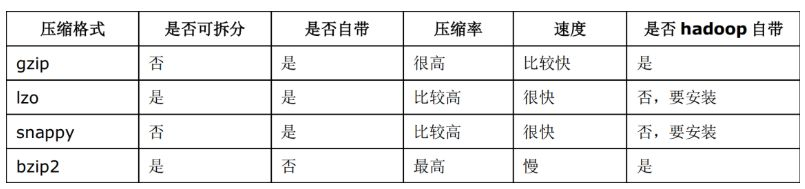
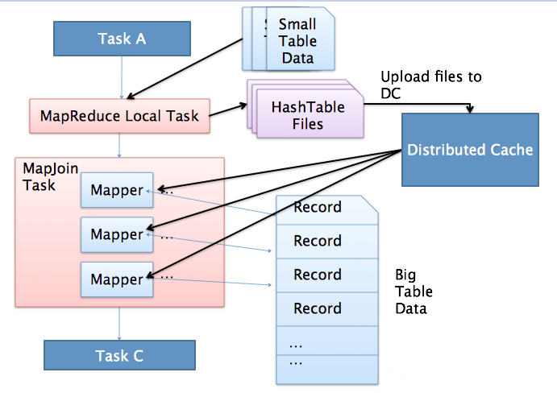

# 【Hive】Hive 优化小结

[TOC]

## 一、简述

**Hadoop的核心能力是parition和sort，因而这也是优化的根本。**

　　*观察Hadoop处理数据的过程，有几个显著的特征*：

* 数据的大规模并不是负载重点，造成运行压力过大是因为运行数据的倾斜。
* jobs 数比较多的作业运行效率相对比较低，比如即使有几百行的表，如果多次关联对此汇总，产生几十个jobs，将会需要30分钟以上的时间且大部分时间被用于作业分配，初始化和数据输出。M/R作业初始化的时间是比较耗时间资源的一个部分。
* 在使用SUM，COUNT，MAX，MIN等UDAF函数时，不怕数据倾斜问题，Hadoop在Map端的汇总合并优化过，使数据倾斜不成问题。
* COUNT(DISTINCT)在数据量大的情况下，效率较低，如果多COUNT(DISTINCT)效率更低，因为COUNT(DISTINCT)是按GROUP BY字段分组，按DISTINCT字段排序，一般这种分布式方式是很倾斜的；比如：男UV，女UV，淘宝一天30亿的PV，如果按性别分组，分配2个reduce，每个reduce处理15亿数据。
* 数据倾斜是导致效率大幅降低的主要原因，可以采用多一次 Map/Reduce 的方法， 避免倾斜。

## 二、表设计层面优化

### 2.1、利用分区表优化

**分区表** 是在某一个或者几个维度上对数据进行分类存储，一个分区对应一个目录。如果筛选条件里有分区字段，那么 Hive 只需要遍历对应分区目录下的文件即可，不需要遍历全局数据，使得处理的数据量大大减少，从而提高查询效率。

> 当一个 Hive 表的查询大多数情况下，会根据某一个字段进行筛选时，那么非常适合创建为分区表。

### 2.2、利用桶表优化

指定桶的个数后，存储数据时，根据某一个字段进行哈希后，确定存储在哪个桶里，这样做的目的和分区表类似，也是使得筛选时不用全局遍历所有的数据，只需要遍历所在桶就可以了。

### 2.3、选择合适的文件存储格式

Apache Hive 支持 Apache Hadoop 中使用的几种熟悉的文件格式。

**TextFile**

默认格式，如果建表时不指定默认为此格式。

存储方式：行存储。

每一行都是一条记录，每行都以换行符`\n`结尾。数据不做压缩时，磁盘会开销比较大，数据解析开销也比较大。

可结合 **Gzip**、**Bzip2** 等压缩方式一起使用（系统会自动检查，查询时会自动解压），但对于某些压缩算法 hive 不会对数据进行切分，从而无法对数据进行并行操作。

**SequenceFile**

一种Hadoop API 提供的二进制文件，使用方便、可分割、可压缩的特点。

支持三种压缩选择：NONE、RECORD、BLOCK。RECORD压缩率低，一般建议使用BLOCK压缩。

**RCFile**

存储方式：数据按行分块，每块按照列存储 。

- 首先，将数据按行分块，保证同一个record在一个块上，避免读一个记录需要读取多个block。
- 其次，块数据列式存储，有利于数据压缩和快速的列存取。

**ORC**

存储方式：数据按行分块，每块按照列存储

Hive 提供的新格式，属于 RCFile 的升级版，性能有大幅度提升，而且数据可以压缩存储，压缩快，快速列存取。

**Parquet**

存储方式：列式存储

Parquet 对于大型查询的类型是高效的。对于扫描特定表格中的特定列查询，Parquet特别有用。Parquet一般使用 Snappy、Gzip 压缩。默认 Snappy。

Parquet 支持 Impala 查询引擎。

> 表的文件存储格式尽量采用 **Parquet** 或 **ORC**，不仅降低存储量，还优化了查询，压缩，表关联等性能；

### 2.4、选择合适的压缩方式

Hive 语句最终是转化为 MapReduce 程序来执行的，而 MapReduce 的性能瓶颈在与 **网络IO** 和 **磁盘IO**，要解决性能瓶颈，最主要的是 **减少数据量**，对数据进行压缩是个好方式。压缩虽然是减少了数据量，但是压缩过程要消耗CPU，好在Hadoop中，往往性能瓶颈不在于CPU，CPU压力并不大，所以压缩充分利用了比较空闲的CPU。

**常用压缩算法对比**



**如何选择压缩方式**

1. 压缩比率
2. 压缩解压速度
3. 是否支持split

> 支持分割的文件可以并行的有多个 mapper 程序处理大数据文件，大多数文件不支持可分割是因为这些文件只能从头开始读。

## 三、分阶段优化

### 3.1、map 阶段优化

**确定合适的 map 数**

Map阶段的优化，主要是确定合适的map数。

默认的 mapper 个数计算方式：

```
# 输入文件总大小：total_size   
# hdfs 设置的数据块大小：dfs_block_size
default_mapper_num = total_size/dfs_block_size
```

MapReduce 中提供了如下参数来控制 map 任务个数：

```shell
set mapred.map.tasks=10;
```

从字面上看，貌似是可以直接设置 mapper 个数的样子，但是很遗憾不行，这个参数设置只有在大于`default_mapper_num`的时候，才会生效。

还有另外的参数：

```
mapred.min.split.size: 指的是数据的最小分割单元大小，min的默认值是1B，这个大小只有在大于 dfs_block_size 的时候才会生效
mapred.max.split.size: 指的是数据的最大分割单元大小，max的默认值是256MB
```

hive.input.format指定为org.apache.hadoop.hive.ql.io.*HiveInputFormat*时，map数与设定的以下三个参数相关：

```
（maxSize与blockSize之间的最小值）与minSize之间的最大值
split_size = max(mapred.min.split.size, min(dfs_block_size, mapred.max.split.size)
split_num = total_size/split_size
default_mapper_num = total_size/dfs_block_size
compute_map_num = min(split_num, max(default_mapper_num, mapred.map.tasks))
```

总结一下控制 mapper 个数的方法：

- 如果想增加 mapper 个数，可以设置`mapred.map.tasks`为一个较大的值
- 如果想减少 mapper 个数，可以设置`maperd.min.split.size`为一个较大的值
- 如果输入是大量小文件，想减少 mapper 个数，可以通过设置`hive.input.format`合并小文件

> 如果想要调整 mapper 个数，在调整之前，需要确定处理的文件大概大小以及文件的存在形式（是大量小文件，还是单个大文件），然后再设置合适的参数。

**减少map数量**

```sql
--假设一个SQL任务：
Select count(1) from popt_tbaccountcopy_meswhere pt = '2012-07-04';
--该任务的inputdir :  /group/p_sdo_data/p_sdo_data_etl/pt/popt_tbaccountcopy_mes/pt=2012-07-04
--共有194个文件，其中很多事远远小于128M的小文件，总大小9G，正常执行会用194个map任务。
--Map总共消耗的计算资源：SLOTS_MILLIS_MAPS= 623,020

--通过以下方法来在map执行前合并小文件，减少map数, 100000000表示100M：
set mapred.max.split.size=100000000;
set mapred.min.split.size.per.node=100000000;
set mapred.min.split.size.per.rack=100000000;
set hive.input.format=org.apache.hadoop.hive.ql.io.CombineHiveInputFormat;

--再执行上面的语句，用了74个map任务，map消耗的计算资源：SLOTS_MILLIS_MAPS= 333,500
--对于这个简单SQL任务，执行时间上可能差不多，但节省了一半的计算资源。

set hive.input.format=org.apache.hadoop.hive.ql.io.CombineHiveInputFormat;
--这个参数表示执行前进行小文件合并，前面三个参数确定合并文件块的大小，文件块大小128m的，按照128m来分隔，小于128m,大于100m的，按照100m来分隔，把那些小于100m的（包括小文件和分隔大文件剩下的），进行合并,最终生成了74个块。
```

**增大map数量**

```sql
--如何适当的增加map数？
--当input的文件都很大，任务逻辑复杂，map执行非常慢的时候，可以考虑增加Map数，来使得每个map处理的数据量减少，从而提高任务的执行效率。

--假设有这样一个任务：
Select data_desc,
        count(1),
        count(distinct id),
        sum(case when ...),
        sum(case when ...),
        sum(...)
from a group by data_desc

--如果表a只有一个文件，大小为120M，但包含几千万的记录，如果用1个map去完成这个任务，肯定是比较耗时的，
--这种情况下，考虑将这一个文件合理的拆分成多个，这样就可以用多个map任务去完成。

set mapred.reduce.tasks=10;
create table a_1 as select * from a distribute by rand(123);

--这样会将a表的记录，随机的分散到包含10个文件的a_1表中，再用a_1代替上面sql中的a表，则会用10个map任务去完成。
--每个map任务处理大于12M（几百万记录）的数据，效率肯定会好很多。
```

### 3.2、reduce 阶段优化

如果 reducer 数量过多，一个 reducer 会产生一个结数量果文件，这样就会生成很多小文件，那么如果这些结果文件会作为下一个 job 的输入，则会出现小文件需要进行合并的问题，而且启动和初始化 reducer 需要耗费和资源。

如果 reducer 数量过少，这样一个 reducer 就需要处理大量的数据，并且还有可能会出现数据倾斜的问题，使得整个查询耗时长。

默认情况下，hive 分配的 reducer 个数由下列参数决定:

- 参数1：`hive.exec.reducers.bytes.per.reducer`(默认1G)
- 参数2：`hive.exec.reducers.max`(默认为999)

reducer的计算公式为:

```
N = min(参数2， 总输入数据量/参数1)
```

可以通过改变上述两个参数的值来控制reducer的数量，也可以通过：

```
set mapred.reduce.tasks=10;
```

直接控制reducer个数，如果设置了该参数，上面两个参数就会忽略。

## 四、	SQL 语法优化

### 4.1、列裁剪

Hive 在读数据的时候，可以只读取查询中所需要用到的列，而忽略其他的列。这样做可以节省读取开销，中间表存储开销和数据整合开销。

```sql
set hive.optimize.cp = true; -- 列裁剪，取数只取查询中需要用到的列，默认为真
```

### 4.2、分区裁剪

在查询的过程中只选择需要的分区，可以减少读入的分区数目，减少读入的数据量。

```sql
set hive.optimize.pruner=true; -- 默认为true
```

### 4.3、Join优化

#### 4.3.1、使用相同的连接键

在 hive 中，当对 3 个或更多张表进行 join 时，如果 on 条件使用相同字段，那么它们会合并为一个 MapReduce  Job，利用这种特性，可以将相同的 join on 的放入一个 job 来节省执行时间。

#### 4.3.2、小表 join 大表原则

在使用写有 Join 操作的查询语句时有一条原则：应该将条目少的表/子查询放在Join操作符的左边。原因是在Join操作的Reduce阶段，位于Join操作符左边的表的内容会被加载进内存，将条目少的表放在左边，可以有效减少发生OOM错误的几率；再进一步，可以使用Group让小的维度表（1000条以下的记录条数）先进内存。在map端完成reduce。

实际测试发现：新版的 hive 已经对小表 JOIN 大表和大表 JOIN 小表进行了优化。小表放在左边和右边已经没有明显区别。

#### 4.3.3、启用 mapjoin

mapjoin 是将 join 双方比较小的表直接分发到各个 map 进程的内存中，在 map 进程中进行 join 操作，这样就不用进行 reduce 步骤，从而提高了速度。只有 join 操作才能启用 mapjoin。

- 开启MapJoin参数设置：

　　　　1) 设置自动选择MapJoin

　　　　　　set hive.auto.convert.join = true（默认为true）

　　　　2) 大表小表的阀值设置（默认25M以下认为是小表）：

　　　　　　set hive.mapjoin.smalltable.filesize=25000000;

- MapJoin 工作机制

  

上图是 Hive MapJoin 的原理图，从图中可以看出 MapJoin 分为两个阶段：

1. 通过 MapReduce Local Task，将小表读入内存，生成内存HashTableFiles上传至Distributed Cache中，这里会对HashTableFiles进行压缩。
2. MapReduce Job在Map阶段，每个Mapper从Distributed Cache读取HashTableFiles到内存中，顺序扫描大表，在Map阶段直接进行Join，将数据传递给下一个MapReduce任务。也就是在map端进行join避免了shuffle。

Join操作在Map阶段完成，不再需要Reduce，有多少个Map Task，就有多少个结果文件。

#### 4.3.4、桶表 mapjoin

当两个分桶表 join 时，如果 join on的是分桶字段，小表的分桶数是大表的倍数时，可以启用 mapjoin 来提高效率。

```sql
set hive.optimize.bucketmapjoin = true; -- 启用桶表 map join
```

#### 4.3.5、大表 JOIN 大表

把空值的 key 变成一个字符串加上随机数，就能把倾斜的数据分到不同的Reduce上，从而解决数据倾斜问题。

### 4.4、Group By 优化

默认情况下，Map阶段同一个Key的数据会分发到一个Reduce上，当一个Key的数据过大时会产生 **数据倾斜**。进行`group by`操作时可以从以下两个方面进行优化：

**Map端部分聚合**

事实上并不是所有的聚合操作都需要在reduce部分进行，很多聚合操作都可以先在Map端进行部分聚合，然后reduce端得出最终结果。

```sql
--开启Map端聚合参数设置
set hive.map.aggr=true

--用于设定 map 端进行聚合操作的条目数
set hive.grouby.mapaggr.checkinterval=100000
```

**有数据倾斜时进行负载均衡**

```sql
set hive.groupby.skewindata = true; -- 有数据倾斜的时候进行负载均衡（默认是false）
```

当选项设定为 true 时，生成的查询计划有两个 MapReduce 任务。

在第一个 MapReduce 任务中，map 的输出结果会随机分布到 reduce 中，每个 reduce 做部分聚合操作，并输出结果，这样处理的结果是相同的`group by key`有可能分发到不同的 reduce 中，从而达到负载均衡的目的；

第二个 MapReduce 任务再根据预处理的数据结果按照`group by key`分布到各个 reduce 中，最后完成最终的聚合操作。

### 4.5、Order By 优化

`order by`只能是在一个reduce进程中进行，所以如果对一个大数据集进行 `order by`，会导致一个reduce进程中处理的数据相当大，造成查询执行缓慢。

- 在最终结果上进行`order by`，不要在中间的大数据集上进行排序。如果最终结果较少，可以在一个reduce上进行排序时，那么就在最后的结果集上进行 `order by`。
- 如果是取排序后的前N条数据，可以使用`distribute by`和 `sort by`在各个reduce上进行排序后前N条，然后再对各个reduce的结果集合合并后在一个reduce中全局排序，再取前N条，因为参与全局排序的`order by`的数据量最多是 `reduce个数 * N`，所以执行效率很高。

### 4.6、in/exists 优化

虽然经过测验，hive1.2.1 也支持in/exists操作，但还是推荐使用hive的一个高效替代方案：left semi join

比如说：　　　　

```sql
select a.id, a.name from a where a.id in (select b.id from b);
select a.id, a.name from a where exists (select id from b where a.id = b.id);
```

应该转换成：

```sql
select a.id, a.name from a left semi join b on a.id = b.id;
```

### 4.7、count(distinct) 优化

```sql
-- 优化前（只有一个reduce，先去重再count负担比较大）：
select count(distinct id) from tablename;
-- 优化后（启动两个job，一个job负责子查询(可以有多个reduce)，另一个job负责count(1))：
select count(1) from (select distinct id from tablename) tmp
```

### 4.8、一次读取多次插入

有些场景是从一张表读取数据后，要多次利用，这时可以使用`multi insert`语法：

```sql
from sale_detail  
insert overwrite table sale_detail_multi 
partition (sale_date='2010', region='china' )  
select shop_name, customer_id, total_price where .....  
insert overwrite table sale_detail_multi partition (sale_date='2011', region='china' )  
select shop_name, customer_id, total_price where .....;
```

## 五、小文件优化

**小文件是如何产生的：**

- 动态分区插入数据，产生大量的小文件，从而导致map数量剧增；
- reduce数量越多，小文件也越多（reduce的个数和输出文件是对应的）
- 数据源本身就包含大量的小文件。

**小文件问题的影响：**

- 从Hive的角度看，小文件会开很多map，一个map开一个JVM去执行，所以这些任务的初始化，启动，执行会浪费大量的资源，严重影响性能。
- 在HDFS中，每个小文件对象约占150byte，如果小文件过多会占用大量内存。这样NameNode内存容量严重制约了集群的扩展。

**小文件问题的解决方案：**

* 从小文件产生的途径就可以从源头上控制小文件数量，方法如下：
  * 使用Sequencefile作为表存储格式，不要用textfile，在一定程度上可以减少小文件
  * 减少reduce的数量（可以使用参数进行控制）
  * 少用动态分区，用时记得按 distribute by 分区

* 对于已有的小文件，我们可以通过以下几种方案解决：
  * 使用hadoop archive命令把小文件进行归档；
  * 重建表，建表时减少 reduce 数量；
  * 通过参数进行调节，设置map/reduce端的相关参数

### 5.1、Map 输入合并

可以通过在输入 mapper 的之前将是输入合并，以减少 map 的个数：

```sql
-- 每个Map最大输入大小，决定合并后的文件数
set mapred.max.split.size=256000000;
-- 一个节点上split的至少的大小 ，决定了多个data node上的文件是否需要合并
set mapred.min.split.size.per.node=100000000;
-- 一个交换机下split的至少的大小，决定了多个交换机上的文件是否需要合并
set mapred.min.split.size.per.rack=100000000;
-- 执行Map前进行小文件合并
set hive.input.format=org.apache.hadoop.hive.ql.io.CombineHiveInputFormat;
```

### 5.2、Map/Reduce 输出合并

```sql
-- 在map-only job后合并文件，默认true
set hive.merge.mapfiles=true;
-- 在map-reduce job后合并文件，默认false
set hive.merge.mapredfiles=true;
-- 设置合并后文件大大小，默认256000000
set hive.merge.size.per.task=256000000;
-- 当输出文件的平均值大小小于该值时，启动一个独立的MR任务进行文件merge，是决定是否执行合并操作的阈值，默认16000000
set hive.merge.smallfiles.avgsize=16000000;
```

## 六、其他参数层面优化

### 6.1、启用压缩

#### 6.1.1、map 输出压缩

```sql
set mapreduce.map.output.compress=true;
set mapreduce.map.output.compress.codec=org.apache.hadoop.io.compress.SnappyCodec;
```

#### 6.1.2、中间数据压缩

中间数据压缩就是对 hive 查询的多个 job 之间的数据进行压缩。最好是选择一个节省CPU耗时的压缩方式。可以采用`snappy`压缩算法，该算法的压缩和解压效率都非常高。

```sql
set hive.exec.compress.intermediate=true;
set hive.intermediate.compression.codec=org.apache.hadoop.io.compress.SnappyCodec;
set hive.intermediate.compression.type=BLOCK;
```

#### 6.1.3、结果数据压缩

最终的结果数据（Reducer输出数据）也是可以进行压缩的，可以选择一个压缩效果比较好的，可以减少数据的大小和数据的磁盘读写时间。

常用的gzip，snappy压缩算法是不支持并行处理的，如果数据源是gzip/snappy压缩文件大文件，这样只会有有个mapper来处理这个文件，会严重影响查询效率。

所以如果结果数据需要作为其他查询任务的数据源，可以选择支持splitable的 `LZO`算法，这样既能对结果文件进行压缩，还可以并行的处理，这样就可以大大的提高job执行的速度了。

关于如何给Hadoop集群安装LZO压缩库可以查看 [这篇文章](https://mp.weixin.qq.com/s?__biz=MzU5OTM5NjQ2NA==&mid=2247483676&idx=1&sn=2a14972e97bc6c25647e962c12ce3e77&chksm=feb4d803c9c35115c66017e077fdc4b613515d3b93206d62400213bd5ab79ae46f125333db15&scene=21#wechat_redirect)。

```sql
set hive.exec.compress.output=true;
set mapreduce.output.fileoutputformat.compress=true;
set mapreduce.output.fileoutputformat.compress.codec=org.apache.hadoop.io.compress.GzipCodec;
set mapreduce.output.fileoutputformat.compress.type=BLOCK;
```

## 七、Hive架构层面优化

### 7.1、模式选择

#### 7.1.1、本地模式

对于大多数情况，Hive可以通过本地模式在单台机器上处理所有任务。对于小数据，执行时间可以明显被缩短。通过set hive.exec.mode.local.auto = true（默认为false）设置为本地模式，本地模式涉及到三个参数：

set hive.exec.mode.local.auto=true；是打开hive自动判断是否启动本地模式的开关，但是只是打开这个参数不能保证启动本地模式，要当map任务数不超过hive.exec.mode.local.auto.input.files.max 的个数并且 map 输入文件大小不超过hive.exec.mode.local.auto.inputbytes.max 所指定的大小时，才能启动本地模式。

如下：用户可以通过设置hive.exec.mode.local.auto的值为true，来让Hive在适当的时候自动启动这个优化。

```sql
--开启本地mr，默认 false
set hive.exec.mode.local.auto=true;  
--设置local mr的最大输入数据量，当输入数据量小于这个值时采用local mr的方式，默认为134217728，即128M
set hive.exec.mode.local.auto.inputbytes.max=50000000;
--设置local mr的最大输入文件个数，当输入文件个数小于这个值时采用local mr的方式，默认为4
set hive.exec.mode.local.auto.input.files.max=10;
```

#### 7.1.2、并行模式

Hive会将一个查询转化成一个或多个阶段。这样的阶段可以是MapReduce阶段、抽样阶段、合并阶段、limit阶段。默认情况下，Hive一次只会执行一个阶段，由于job包含多个阶段，而这些阶段并非完全相互依赖，即：这些阶段可以并行执行，可以缩短整个job的执行时间。设置参数，set hive.exec.parallel=true，或者通过配置文件来完成：

```sql
 set hive.exec.parallel;
```

#### 7.1.3、严格模式

Hive提供一个严格模式，可以防止用户执行那些可能产生意想不到的影响查询，通过设置Hive.mapred.modestrict来完成。

```sql
set Hive.mapred.modestrict;
```

### 7.2 JVM重用

Hadoop通常是使用派生JVM来执行map和reduce任务的。这时JVM的启动过程可能会造成相当大的开销，尤其是执行的job包含成百上千的task任务的情况。JVM重用可以使得JVM示例在同一个job中时候，通过参数mapred.job.reuse.jvm.num.tasks来设置。

```sql
set mapred.job.reuse.jvm.num.tasks=5;
```

JVM 重用也是有缺点的，开启JVM重用会一直占用使用到的 task 的插槽，以便进行重用，直到任务完成后才会释放。如果某个`不平衡的job`中有几个 reduce task 执行的时间要比其他的 reduce task 消耗的时间要多得多的话，那么保留的插槽就会一直空闲却无法被其他的 job 使用，直到所有的 task 都结束了才会释放。

### 7.3、推测执行

Hadoop推测执行可以触发执行一些重复的任务，尽管因对重复的数据进行计算而导致消耗更多的计算资源，不过这个功能的目标是通过加快获取单个task的结果以侦测执行慢的TaskTracker加入到没名单的方式来提高整体的任务执行效率。Hadoop的推测执行功能由2个配置控制着：

```sql
set mapreduce.map.speculative=true;
set mapreduce.reduce.speculative=true;
```

## 八、来源

1.https://www.cnblogs.com/swordfall/p/11037539.html#auto_id_27
2.https://juejin.im/entry/5afb63e051882542af040dd2


