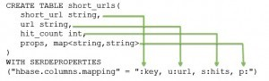
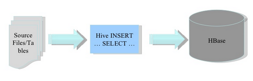
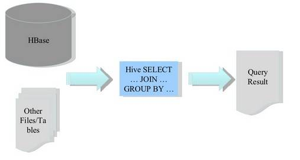
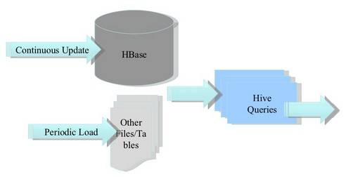

# 【Hive】Hive 整合映射 HBase

[TOC]

## 一、前言

HBase 只提供了简单的基于 Key 值的快速查询能力，没法进行大量的条件查询，对于数据分析来说，不太友好。

hive 整合 hbase 为用户提供一种 sqlOnHbase 的方法。Hive 与 HBase 整合的实现是利用两者本身对外的 API 接口互相通信来完成的，其具体工作交由 Hive 的 lib 目录中的 hive-hbase-handler-xxx.jar 工具类来实现对 HBase 数据的读取。

* Hive 和 HBase 通过接口互通，用户可以方便地通过 SQL 接口进行建表、映射表、查询、删除等操作。 **使用 Hive 操作 HBase 中的表，只是提供了便捷性，由于对于 hiveOnHbase 表的查询走 MR 框架，因此查询效率较为缓慢**需酌情使用。 

* Hive 集成 HBase 可以有效利用 HBase 数据库的存储特性，如行更新和列索引等。在集成的过程中注意维持 HBase jar 包的一致性。Hive 集成 HBase  需要在 Hive 表和 HBase 表之间建立映射关系，也就是 Hive 表的列 (columns) 和列类型(column types)与 HBase 表的列族(column families)及列限定词(column qualifiers)建立关联。

每一个在 Hive 表中的域都存在于 HBase 中，而在 Hive 表中不需要包含所有HBase 中的列。HBase 中的 RowKey 对应到 Hive 中为选择一个域使用 :key 来对应，列族(cf:)映射到 Hive 中的其它所有域，列为(cf:cq)。 



## 二、适用场景

* 实现将批量数据导入到 HBase 表中。

   

* 通过 Hive 与 HBase 整合，可以将 HBase 的数据通过 Hive 来分析，让 HBase 支持 JOIN、GROUP 等 SQL 查询语法。 

   

* 构建低延时的数据仓库 

   

## 三、依赖条件

*  已有 HDFS、MapReduce、Hive、Zookeeper、HBase 环境。 
*  确保 Hive 的 lib 目录下有 hive-hbase-handler-xxx.jar、Zookeeper jar、HBase Server jar、HBase Client jar 包。 

## 四、具体使用

### 4.1、Hive 表映射到 Hbase 中

```sql
create table hive_people
(
id int,
name string,
age string,
sex string, 
edu string, 
country string, 
telPhone string,  
email string
)
stored by 'org.apache.hadoop.hive.hbase.HBaseStorageHandler'
with serdeproperties ("hbase.columns.mapping" = "
:key,
basic_info:name,
basic_info:age,
basic_info:sex,
basic_info:edu,
other_info:country,
other_info:telPhone,
other_info:email
")
tblproperties("hbase.table.name" = "default:hbase_people","hbase.mapred.output.outputtable" = "default:hbase_people");
```

参数解释：

* ***hbase.columns.mapping：***
  定义 hive 表中的字段与 hbase 的列族映射

* ***hbase.table.name：***
  可选参数，仅当用户想在 Hive 和 HBase 中使用不同表名时才需要填写。

* ***hbase.mapred.output.outputtable：***
  可选参数，仅当想往这个表中插入数据时使用（在hbase.mapreduce.TableOutputFormat 中使用到） 

* ***stored by 'org.apache.hadoop.hive.hbase.HBaseStorageHandler'：*** 

  指定处理的存储器，就是 hive-hbase-handler-\*.jar 包，要做 hive 和 hbase 的集成必须要加上这一句

在 hive 中执行该语句后，hbase 会相应创建表，可以用 `list` 命令查看下。

往 hive 中插入数据：

```sql
insert overwrite table hive_people  select * from people where age = 17;
```

hive 会触发 map 任务，运行结束后在 hive 和 hbase 中都可以查询到数据。就不具体展示了。

### 4.2、HBase 表映射到 Hive 表中

在 hive 中建立 HBase 的外部映射表，只在 hive 端执行建表操作，要求 HBase 端的表事先存在。hive 端执行表删除操作时，只会删除 hive 端的外部映射表，对 HBase 中被映射的表无影响。

所以先在 HBase 中建一张 t_employee_info 表，添加两个列族 st1,st2 ：

```sql
create 't_employee_info','st1','st2' 
```

对于在 HBase 已经存在的表，在 hive 中使用 CREATE **EXTERNAL** TABLE 来建立联系。 

```sql
create external table t_employee_info(id int,age int,sex string)
stored by 'org.apache.hadoop.hive.hbase.HBaseStorageHandler'
with serdeproperties("hbase.columns.mapping"=":key,st1:age,st2:sex")
tblproperties("hbase.table.name"="t_employee_info");
```

然后往 HBase 的 t_employee_info 中添加数据：

```shell
put 't_employee_info','1001','st2:sex','man'
put 't_employee_info','1001','st1:age','32'
put 't_employee_info','1002','st1:age','25'
put 't_employee_info','1002','st2:sex','woman'
```

在 hive 中查询该表：

```sql
hive> select * from t_employee_info;
OK
1001	32	man
1002	25	woman
```

**注意！注意！注意：** 在上述示例中，使用的 insert 命令向 Hive 表中插入数据。对于批量数据的插入，还是建议使用 load 命令，但对于 Hive 外部表来说，不支持 load 命令。可以先创建一个 Hive 内部表，将数据 load 到该表中，最后将查询内部表的所有数据都插入到与 Hbase 关联的 Hive 外部表中，就可以了，相当于中转一下。

### 4.3、Hive Map 类型在 HBase 中的映射

通过 Hive 的 Map 数据类型映射 HBase 表，这样每行都可以有不同的列组合，列名与 map中的 key 对应，列值与 map 中的 value 对应 ：

```sql
CREATE TABLE hbase_table_1(value map, row_key int) 
STORED BY 'org.apache.hadoop.hive.hbase.HBaseStorageHandler'
WITH SERDEPROPERTIES (
"hbase.columns.mapping" = "cf:,:key"
);

INSERT OVERWRITE TABLE hbase_table_1 SELECT map(bar, foo), foo FROM pokes 
WHERE foo=98 OR foo=100;
```

当 hbase.columns.mapping 中的列族后面为空时(形如cf:)，说明在 Hive 中其对应的数据类型为 map。 

### 4.4、 使用 Hive 集成 HBase 表的需注意 

1. 对 HBase 表进行预分区，增大其 MapReduce 作业的并行度
2. 合理的设计 rowkey 使其尽可能的分布在预先分区好的 Region 上
3. 通过 set hbase.client.scanner.caching 设置合理的扫描缓存（内存未提供数据的情况下扫描仪下次调用时所提取的行数。较高缓存值需启用较快速度的扫描仪，但这需要更多的内存且当缓存为空时某些下一次调用会运行较长时间 ）

## 五、参考

[如何整合hive和hbase]( https://zhuanlan.zhihu.com/p/74041611)
[Hive 集成 HBase 详解]( https://juejin.im/entry/57a975f85bbb5000643fb9c0 )

