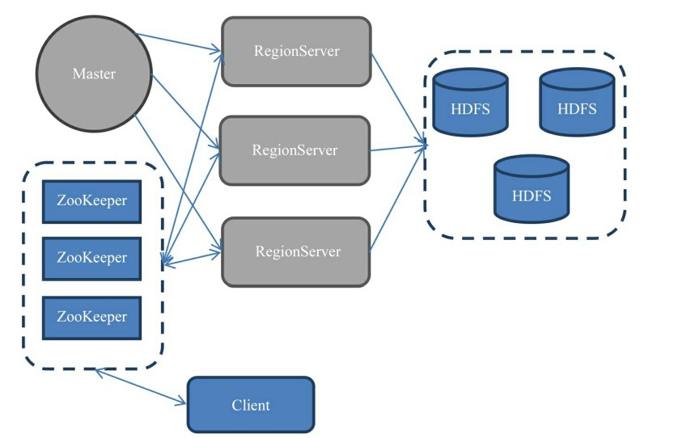
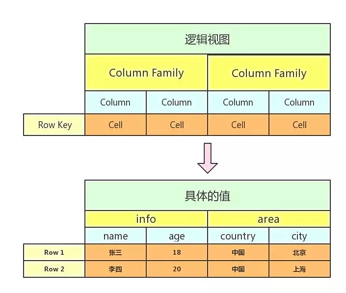
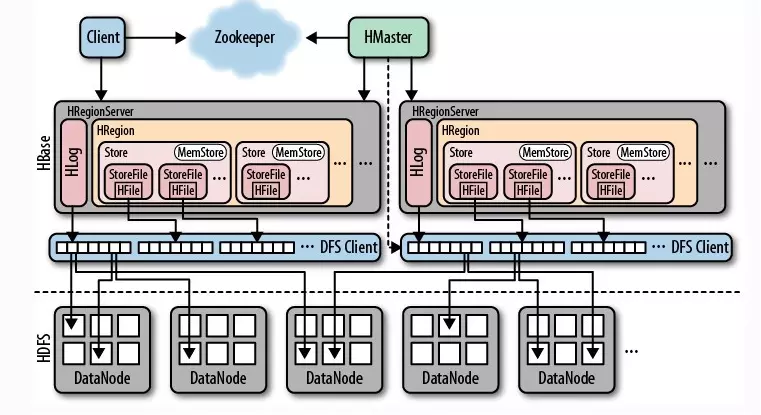

# 【HBase】HBase 架构

## 一、简单介绍

HBase 存储是基于 Hadoop 的，采用的是 Key/Value 的存储方式，这意味着，随着数据量增大，也几乎不会导致查询的性能下降。HBase 又是一个列式数据库（对比于传统的行式数据库而言），当表字段很多的时候，甚至可以把其中几个字段放在集群的一部分机器上，而另外几个字段放到另外一部分机器上，充分分散了负载压力。

数据分析是 HBase 的弱项，因为对于 HBase 乃至整个 NoSQL 生态圈来说，基本上都是不支持表关联的。当想实现 group by 或者 order by 的时候，需要写很多的代码来实现 MapReduce。

HBase 适用于：

* 单表数据量超千万，而且并发还挺高。
* 数据分析需求较弱，或者不需要那么灵活或者实时。

不适用于：

* 单表数据量不超过千万。
* 主要需求是数据分析，比如做报表。

## 二、部署架构

HBase 有两种服务器：Master 服务器和 RegionServer 服务器。

### 2.1、HMaster

HMaster 没有单点问题，HBase 中可以启动多个 HMaster，通过 Zookeeper 的Master Election 机制保证总有一个 Master 运行，**HMaster 在功能上主要负责 Table 和 Region 的管理工作**： 

- 协调 Region Servers
  - 在集群启动时分配 Region，在集群失败恢复时或者需要负载均衡时重新分配 Region；
  - 在 Region 合并分裂后，负责新的 Region 重新分配 ；
  - 监测集群中所有的 RegionServer，同时监听来自 zookeeper 的通知。
- 管理 Table 
  - 负责对表的 DDL 操作。

HMaster 是保证 HBase 高可靠的因素之一，线上环境 ，HMaster 一般由两到三台组成。

1. 线上环境 ，HMaster是般由两到三台组成，普通(24G)的虚拟机；

### 2.2、HRegionServer

RegionServer 是直接负责存储数据的服务器。RegionServer 保存的表数据直接存储在 Hadoop 的 HDFS 上。

* HRegionServer 存储实际 Region，响应客户端写入的 IO，并负责存储数据到 HDFS 中，是 HBase 最核心的部分； 
* 一台 HRegionServer 上有多个 HRegion， 一个 HRegion 上有多个Hstore ，一个 family 对应一个 HStore ，一个 Hstore 上有多个 StoreFile 和一个 MemStore ，HBase 用 LSM 树来组织这些 StoreFile 和 MemStore；
* RegionServer 机器的配置要求： CPU 内核数越多、内存越大、硬盘越大越好，当然 regionServer 的 JVM 堆内存不是越大越好，通常建议不要超过 32G，过大，会有严重的 Full GC 问题，而且在 64 位的 JVM 中，堆大小超过 32G，指针不能做压缩。

客户端获取数据由客户端直连 RegionServer ，所以 Master 挂掉之后依然可以查询数据，但就是不能新建表了。

每个运行在 DataNode 上的 RegionServer 都有这些组件:

- WAL: `Write-Ahead-Log` 是一份用于存储还未被持久化的数据的文件，它主要用于失败恢复；
- BlockCache: 是一种**读缓存**。用于在内存中缓存经常被读的数据。Least Recently Used (LRU) 数据在存满时会被失效；
- MemStore: 是一种写缓存：
  - 用于缓存还未被持久化到硬盘的数据；
  - 在持久化之前会先将数据排序；
  - 每个 region 的每个 CF 都有一个 MemStore。
- Hfile: 真正存在硬盘上的，对行数据排好序的 **键值对** 文件。

### 2.3、ZooKeeper

RegionServer 非常依赖 ZooKeeper 服务，可以说没有 ZooKeeper 就没有 HBase。ZooKeeper 在 HBase 中扮演的角色类似一个管家。ZooKeeper 管理了 HBase 所有RegionServer 的信息，包括具体的数据段存放在哪个 RegionServer 上。

客户端从  ZooKeeper 获取了 RegionServer 的地址后，会直接从 RegionServer 获取数据。其实不光是获取数据，包括插入、删除等所有的数据操作都是直接操作RegionServer，而不需要经过 Master。Master 只负责各种协调工作（其实就是打杂），比如建表、删表、移动 Region、合并等操作。

同时 HBase 使用 ZooKeeper 作为分布式协调服务，用于维护集群中服务器状态。 

每个 Region Server 都会创建一个 **暂时节点**，HMaster 会监测这些节点来发现可用的 RegionServer，同时也监测失败的节点。

多个 **HMaster** 争相创建自己的暂时节点，ZK 决定第一个创建成功的机器为真正的 HMaster，HMaster 也像 ZK 发送心跳包，而那些未激活的 HMaster 则监听真正 HMaster 的失败消息。

如果一个 RegionServer  或者 HMaster 发送心跳包失败了，那么会话就过期了，相应的暂时节点也被删除，监听消息者会收到这个删除的消息：

- HMaster 会监听 Region Server 的失败消息，一旦收到消息，就开始启动 恢复程序；
- 备用 HMaster 监听真正 HMaster 的失败消息，一旦收到，就启动新的选举算法。

### 2.4、HBase 第一次读写

当有客户端第一次向 HBase 读或写时：

1. 客户端从 ZK 得到保存 META 表的 RS 的地址；
2. 客户端访问这个 RS 上的 META 表，得到想要查询的 RowKey 所在的 RS 地址；随后，客户端将 META 表地址缓存起来；
3. 从对应的 RS 拿到数据；
4. 这以后的读操作都从缓存中获取 META Server 地址。

META 表保存着系统中所有 regions 信息，META 表类似 B 树，META 表的结构如下：

- Key: region start key, region id
- Values: RegionServer

### 2.5、HBase 写操作步骤

当 HBase 收到一个 `Put` 请求时： 

1.  首先写数据到 `WAL` 中：数据修改会被**追加**到 WAL 文件的末尾； 
2.  数据被放在 `MemStore` 中，然后给客户端返回一个 `PUT ack` ；
3.  数据在 `MemStore` 中以有序的 **键值对** 的形式存储；每个 `CF` 都有一个 `MemStore` ；
4.  当 `MemStore` 中的数据量达到配置的容量时，整个数据集都被写入到 HDFS 中的 `HFile`；一个 `CF` 有多个 `HFile`，每个 `HFile` 存储的是有序键值对；同时，每个 `HFile` 中还存储了`最后被写入的序列数`作为一个元信息，这个信息反映了 CF 中持久化到哪里了。

## 三、存储结构

可以把 `HBase`的存储结构分为**逻辑结构**和**物理结构**两个部分。

### 3.1、逻辑存储结构

列簇（`Column Family`）对应的值就是  `info`  和 `area` ，列（ `Column` 或者称为 `Qualifier` ）对应的就是 `name`  、 `age` 、 `country` 和 `city` ，`Row key` 对应的就是 `Row 1` 和 `Row 2`，`Cell` 对应的就是具体的值。

* `Row key` ：表的主键，按照字典序排序。
* 列簇：在 `HBase` 中，列簇将表进行横向切割。
* 列：属于某一个列簇，在 `HBase` 中可以进行动态的添加。
* `Cell` : 是指具体的 `Value` 。
* `Version` ：在这张图里面没有显示出来，这个是指版本号，用时间戳（`TimeStamp` ）来表示。

 `HBase` 是 `KV` 的数据库，以获取 `KEY` 的形式来获取到 `Value` 。在 `HBase` 中的 `KEY` 组成是以 `Row key` 、`CF(Column Family)` 、`Column` 和 `TimeStamp` 组成的。 

### 3.2、物理存储结构

在具体的物理结构中

- `HRegion Server` 就是一个机器节点，包含多个 `HRegion` ，但是这些 `HRegion` 不一定是来自于同一个 `Table` ，负责响应的是用户的 `IO` 请求，和 `HDFS` 进行交互，是服务器中的一个进程。
- `HRegion` 包含多个 `HStore` 。
- 一个 `CF` 组成一个 `HStore` ，默认是 `10 G`，如果大于 `10G` 会进行分裂。`HStore` 是 `HBase` 的核心存储单元，一个 `HStore` 由 `MemStore` 和 `StoreFile` 组成。
- `MemStore` 是一块内存，默认大小是 `128M`，如果超过了这个大小，那么就会进行刷盘，把内存里的数据刷进到 `StoreFile` 中。
- 在 `HStore` 对应着的是 `Table` 里面的 `Column Family`，不管有 `CF` 中有多少的数据，都会存储在 `HStore` 中，为了避免访问不同的 `HStore` 而导致的效率低下。
- `HRegion` 是 `Hbase` 中分布式存储和负载均衡的最小单元，但不是存储的最小单元。
- 一个 `Hstore` 可以有多个 `StoreFile`。

## 四、参考资料

1.[HBase 架构详述]( https://xieyuanpeng.com/2018/12/27/hbase-architecture/)
2.[一文讲清HBase存储结构]( https://juejin.im/post/5c31cf486fb9a04a102f6f89 )

