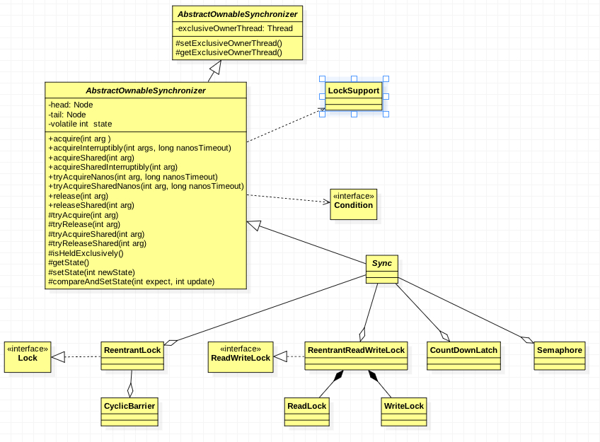
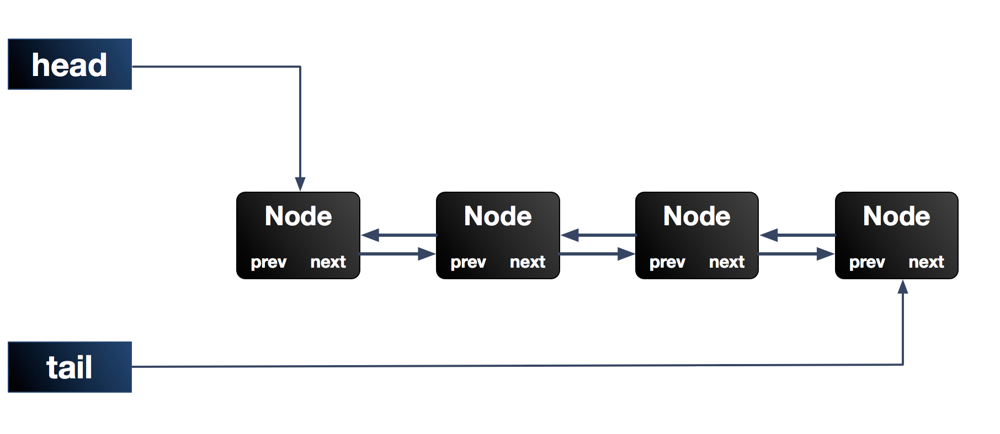
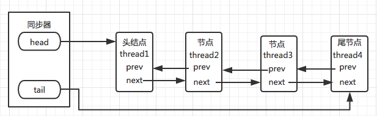
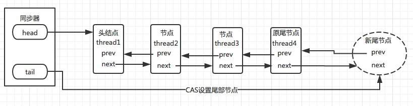
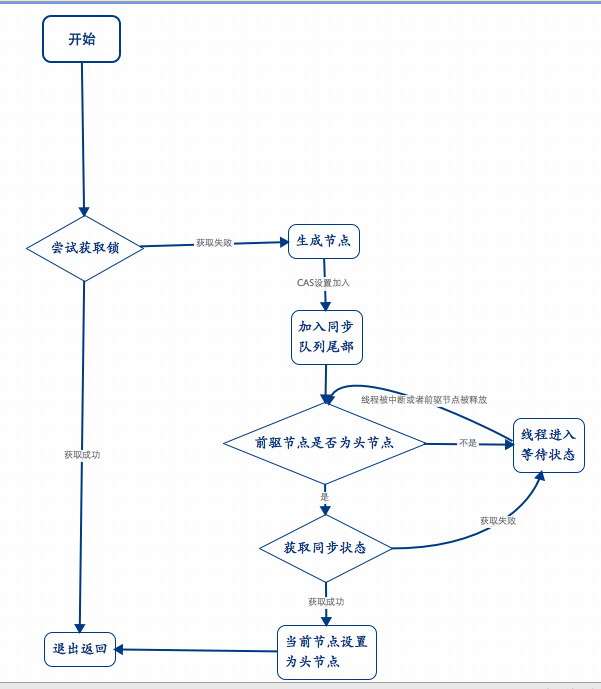

# 【Java 并发】Java 并发包基石-AQS详解

[TOC]

## 一、AQS 介绍

队列同步器 AbstractQueuedSynchronizer，是用来构建锁或者其他同步组件的基础框架，核心思想是基于 `volatile int state` 这样的 volatile 变量，使用volatile 修饰保证线程可见性，配合 Unsafe 工具对其原子性的操作来实现对当前锁状态进行修改。状态信息通过 procted 类型的 **getState**，**setState**，**compareAndSetState** 进行操作。

同步器 AQS 内部的实现是依赖同步队列（一个 FIFO 的双向队列，其实就是数据结构双向链表）来完成同步状态的管理。当前线程获取同步状态失败时，同步器 AQS 会将当前线程和等待状态等信息构造成为一个节点（node）加入到同步队列，同时会阻塞当前线程；当同步状态释放的时候，会把首节点中的线程唤醒，使首节点的线程再次尝试获取同步状态。AQS 是独占锁和共享锁的实现的父类。 

## 二、AQS 使用

### 2.1、使用方式

同步器的设计是基于**模板方法模式**的，一般的使用方式是这样：

　　**1.使用者继承 AbstractQueuedSynchronizer 并重写指定的方法（这些重写方法是对于共享资源 state 的获取和释放）**。

　　**2.将 AQS 组合在自定义同步组件的实现中，并调用其模板方法，而这些模板方法会调用使用者重写的方法。**

继承同步器的子类推荐被定义为自定义同步组件的静态内部类，同步器自身没有实现任何同步接口，它仅仅是定义了若干同步状态获取和释放的方法来供自定义同步组件使用，同步器既可以支持独占式地获取同步状态，也可以支持共享式地获取同步状态，这样就可以方便实现不同类型的同步组件，独占式如 ReentrantLock，共享式如 Semaphore，CountDownLatch，组合式的如 ReentrantReadWriteLock。



AQ S定义的可重写的方法：

```java
// 独占式获取同步状态，试着获取，成功返回true，反之为false
protected boolean tryAcquire(int arg)
// 独占式释放同步状态，等待中的其他线程此时将有机会获取到同步状态
protected boolean tryRelease(int arg) 
// 共享式获取同步状态，返回值大于等于0，代表获取成功；反之获取失败
protected int tryAcquireShared(int arg) 
// 共享式释放同步状态，成功为true，失败为false
protected boolean tryReleaseShared(int arg) 
// 是否在独占模式下被线程占用
protected boolean isHeldExclusively() 
```

### 2.2、使用实例

对于使用者，无需关心获取资源失败、线程排队、线程阻塞/唤醒等一系列复杂的实现，这些都在 AQS 中处理好了，使用者只需要负责好获取/释放共享资源 state 的姿势。

同步器是实现锁（也可以是任意同步组件）的关键，在锁的实现中，没有直接继承AQS，而是定义了一个静态内部类去继承 AQS，锁的实现聚合同步器，利用同步器实现锁的语义。

可以这样理解二者之间的关系：锁是面向使用者的，它定义了使用者与锁交互的接口（比如可以允许两个线程并行访问），隐藏了实现细节；同步器面向的是锁的实现者，它简化了锁的实现方式，屏蔽了同步状态管理、线程的排队、等待与唤醒等底层操作。锁和同步器很好地隔离了使用者和实现者所需关注的领域。

```java
/**
 *
 * @author w1992wishes
 * @date 2017/6/1
 */
public class Mutex implements Lock {

    /**
     * 静态内部类，自定义同步器
     */
    private static class Sync extends AbstractQueuedSynchronizer {

        /**
         * 是否处于占用状态
         */
        @Override
        protected boolean isHeldExclusively() {
            return getState() == 1;
        }

        /**
         * 当状态为0的时候获取锁
         */
        @Override
        public boolean tryAcquire(int acquires) {
            if (compareAndSetState(0, 1)) {
                setExclusiveOwnerThread(Thread.currentThread());
                return true;
            }
            return false;
        }

        /**
         * 释放锁，将当前状态设置为0
         */
        @Override
        protected boolean tryRelease(int releases) {
            if (getState() == 0) {
                throw new IllegalMonitorStateException();
            }
            setExclusiveOwnerThread(null);
            setState(0);
            return true;
        }

        /**
         * 返回一个Condition，每个condition都包含了一个condition队列
         */
        Condition newCondition() {
            return new ConditionObject();
        }
    }

    /**
     * 仅需要将操作代理到Sync上即可
     */
    private final Sync sync = new Sync();

    @Override
    public void lock() {
        // 加锁操作，代理到acquire（模板方法）上就行，acquire 会调用我们重写的 tryAcquire 方法
        sync.acquire(1);
    }

    @Override
    public boolean tryLock() {
        // 释放锁，代理到 release（模板方法）上就行，release 会调用我们重写的 tryRelease 方法。
        return sync.tryAcquire(1);
    }

    @Override
    public void unlock() {
        sync.release(1);
    }

    @Override
    public void lockInterruptibly() throws InterruptedException {
        sync.acquireInterruptibly(1);
    }

    @Override
    public boolean tryLock(long timeout, TimeUnit unit) throws InterruptedException {
        return sync.tryAcquireNanos(1, unit.toNanos(timeout));
    }

    @Override
    public Condition newCondition() {
        return sync.newCondition();
    }

    public boolean isLocked(){
        return sync.isHeldExclusively();
    }

}
```

独占锁 Mutex 是一个自定义同步组件，它在同一时刻只允许一个线程占有锁。Mutex 中定义了一个静态内部类，该内部类继承了同步器并实现了独占式获取和释放同步状态。在 tryAcquire(int acquires) 方法中，如果经过 CAS 设置成功（同步状态设置为1），则代表获取了同步状态，而在 tryRelease(int releases) 方法中只是将同步状态重置为0。用户使用 Mutex 时并不会直接和内部同步器的实现打交道，而是调用 Mutex 提供的方法，在 Mutex 的实现中，以获取锁的 lock() 方法为例，只需要在方法实现中调用同步器的模板方法 acquire(int args) 即可，当前线程调用该方法获取同步状态失败后会被加入到同步队列中等待，这样就大大降低了实现一个可靠自定义同步组件的门槛。

### 2.3、使用测试

测试下这个自定义的同步器，这里使用并发环境下 a++ 的例子来说明问题（a++的原子性其实最好使用原子类 AtomicInteger 来解决，此处用 Mutex 只是单纯为了使用该类）。

```java
/**
 * 说明:启用 30 个线程，每个线程对i自加 10000 次，同步正常的话，最终结果应为 300000；
 */
public class TestMutex {

    private static CyclicBarrier barrier = new CyclicBarrier(31);
    private static int a = 0;
    private static Mutex mutex = new Mutex();

    public static void main(String[] args) throws Exception {

        //未加锁前
        for (int i = 0; i < 30; i++) {
            Thread t = new Thread(() -> {
                for (int i1 = 0; i1 < 10000; i1++) {
                    increment1();//没有同步措施的a++；
                }
                try {
                    barrier.await();//等30个线程累加完毕
                } catch (Exception e) {
                    e.printStackTrace();
                }
            });
            t.start();
        }
        barrier.await();

        System.out.println("加锁前，a=" + a);

        //加锁后
        barrier.reset();//重置CyclicBarrier
        a = 0;
        for (int i = 0; i < 30; i++) {
            new Thread(() -> {
                for (int i12 = 0; i12 < 10000; i12++) {
                    increment2();//a++采用Mutex进行同步处理
                }
                try {
                    barrier.await();//等30个线程累加完毕
                } catch (Exception e) {
                    e.printStackTrace();
                }
            }).start();
        }
        barrier.await();
        System.out.println("加锁后，a=" + a);
    }

    /**
     * 没有同步措施的a++
     */
    private static void increment1() {
        a++;
    }

    /**
     * 使用自定义的 Mutex 进行同步处理的 a++
     */
    private static void increment2() {
        mutex.lock();
        a++;
        mutex.unlock();
    }
}
```

## 三、AQS 实现

同步器依赖内部的同步队列（一个 FIFO 双向队列）来完成同步状态的管理，该队列由一个一个的 Node 结点组成，每个 Node 结点维护一个 prev 引用和 next 引用，分别指向自己的前驱和后继结点。AQS 维护两个指针，分别指向队列头部 head 和尾部 tail。

当前线程获取同步状态失败时，同步器会将当前线程以及等待状态等信息构造成为一个节点（Node）并将其加入同步队列，同时会阻塞当前线程，当持有同步状态的线程释放同步状态时，会唤醒后继结点，然后此结点线程继续加入到对同步状态的争夺中。



### 3.1、Node 结点

同步队列中的节点（Node）是队列同步器的一个内部类，用来保存获取同步状态失败的线程引用、等待状态以及前驱和后继节点。

```java
static final class Node {
    //该等待同步的节点处于共享模式
    static final Node SHARED = new Node();
    //该等待同步的节点处于独占模式
    static final Node EXCLUSIVE = null;
    //等待状态，这个和state是不一样的:有1，0，-1，-2，-3五个值
    volatile int waitStatus;
    static final int CANCELLED = 1;
    static final int SIGNAL = -1;
    static final int CONDITION = -2;
    static final int PROPAGATE = -3;

    volatile Node prev;//前驱节点
    volatile Node next;//后继节点
    volatile Thread thread;//等待锁的线程
    //和节点是否共享有关
    Node nextWaiter;

    //Returns true if node is waiting in shared mode
    final boolean isShared() {
        return nextWaiter == SHARED;
    }
}
```

waitStatus 五个值的含义:

- CANCELLED(1)：该节点的线程可能由于超时或被中断而处于被取消(作废)状态，一旦处于这个状态，节点状态将一直处于 CANCELLED (作废)，不再变化，因此应该从队列中移除；
- SIGNAL(-1)：当前节点为 SIGNAL 时，后继节点会被挂起，因此在当前节点释放锁或被取消之后必须唤醒 (unparking) 其后继结点；
- CONDITION(-2)：该节点的线程处于等待条件状态，在等待队列中，不会被当作是同步队列上的节点，直到被唤醒 (signal)，设置其值为 0，从等待队列转移到同步队列中，加入到对同步状态的获取中；
- PROPAGATE(-3)：表示下一次共享式同步状态获取将会无条件传播下去；
- 0：新加入的节点，初始为0。

节点是构成同步队列的基础，同步器拥有首节点（head）和尾节点（tail）。同步队列的基本结构如下：



同步队列设置尾节点（未获取到锁的线程加入同步队列）: 同步器 AQS 中包含两个节点类型的引用：一个指向头结点的引用（head)，一个指向尾节点的引用（tail），当一个线程成功的获取到锁（同步状态），其他线程无法获取到锁，而是被构造成节点（包含当前线程，等待状态）加入到同步队列中等待获取到锁的线程释放锁。这个加入队列的过程，必须要保证线程安全。否则如果多个线程的环境下，可能造成添加到队列等待的节点顺序错误，或者数量不对。因此同步器提供了 CAS 原子的设置尾节点的方法（保证一个未获取到同步状态的线程加入到同步队列后，下一个未获取的线程才能够加入）。 



同步队列设置首节点（原头节点释放锁，唤醒后继节点）：同步队列遵循 FIFO，头节点是获取锁（同步状态）成功的节点，头节点在释放同步状态的时候，会唤醒后继节点，而后继节点将会在获取锁（同步状态）成功时候将自己设置为头节点。设置头节点是由获取锁（同步状态）成功的线程来完成的，由于只有一个线程能够获取同步状态，则设置头节点的方法不需要 CAS 保证，只需要将头节点设置成为原首节点的后继节点，并断开原头结点的 next 引用。如下图，设置首节点：



### 3.2、独占式获取同步状态--acquire()

lock 方法一般会直接代理到 **acquire** 上：

```java
public void lock() {
    // 加锁操作，代理到acquire（模板方法）上就行，acquire 会调用我们重写的 tryAcquire 方法
    sync.acquire(1);
}

public final void acquire(int arg) {
    if (!tryAcquire(arg) &&
        acquireQueued(addWaiter(Node.EXCLUSIVE), arg))
        selfInterrupt();
}
```

简单理一下代码逻辑：

1. 首先，调用使用者重写的 tryAcquire方法，若返回true，意味着获取同步状态成功，后面的逻辑不再执行；若返回 false，也就是获取同步状态失败，进入 2 步骤；
2. 此时，获取同步状态失败，构造独占式同步结点，通过 addWatiter 将此结点添加到同步队列的尾部（此时可能会有多个线程结点试图加入同步队列尾部，需要以线程安全的方  式添加）；
3. 该结点以在队列中尝试获取同步状态，若获取不到，则阻塞结点线程，直到被前驱结点唤醒或者被中断。

**addWaiter 为获取同步状态失败的线程，构造成一个 Node 结点，添加到同步队列尾部：**

```java
private Node addWaiter(Node mode) {
    Node node = new Node(Thread.currentThread(), mode);//构造结点
    //指向尾结点tail
    Node pred = tail;
    //如果尾结点不为空，CAS快速尝试在尾部添加，若CAS设置成功，返回；否则，eng。
    if (pred != null) {
        node.prev = pred;
        if (compareAndSetTail(pred, node)) {
            pred.next = node;
            return node;
        }
    }
    enq(node);
    return node;
}
```

**将结点添加到同步队列尾部这个操作，同时可能会有多个线程尝试添加到尾部，是非线程安全的操作，所以先用 compareAndSetTail 方法 cas 快速设置，若失败，进入 enq 方法：**

```java
private Node enq(final Node node) {
    for (;;) {
        Node t = tail;
        if (t == null) { //如果队列为空，创建结点，同时被head和tail引用
            if (compareAndSetHead(new Node()))
                tail = head;
        } else {
            node.prev = t;
            if (compareAndSetTail(t, node)) {//cas设置尾结点，不成功就一直重试
                t.next = node;
                return t;
            }
        }
    }
}
```

enq 内部是个死循环，通过 CAS 设置尾结点，不成功就一直重试。这是一种**乐观的并发策略**。

**进入同步队列后，就尝试获取同步状态，看下 acquireQueued 方法：**

```java
final boolean acquireQueued(final Node node, int arg) {
    boolean failed = true;
    try {
        boolean interrupted = false;
        for (;;) {//死循环
            final Node p = node.predecessor();//找到当前结点的前驱结点
            if (p == head && tryAcquire(arg)) {//如果前驱结点是头结点，才tryAcquire，其他结点是没有机会tryAcquire的。
                setHead(node);//获取同步状态成功，将当前结点设置为头结点。
                p.next = null; // 方便GC
                failed = false;
                return interrupted;
            }
            // 如果没有获取到同步状态，通过shouldParkAfterFailedAcquire判断是否应该阻塞，parkAndCheckInterrupt用来阻塞线程
            if (shouldParkAfterFailedAcquire(p, node) &&
                parkAndCheckInterrupt())
                interrupted = true;
        }
    } finally {
        if (failed)
            cancelAcquire(node);
    }
}
```

**acquireQueued 内部也是一个死循环，只有前驱结点是头结点的结点，也就是老二结点，才有机会去 tryAcquire；若 tryAcquire 成功，表示获取同步状态成功，将此结点设置为头结点；若是非老二结点，或者 tryAcquire 失败，则进入 shouldParkAfterFailedAcquire 去判断判断当前线程是否应该阻塞，若可以，调用parkAndCheckInterrupt 阻塞当前线程，直到被中断或者被前驱结点唤醒。若还不能休息，继续循环。**

**shouldParkAfterFailedAcquire**

shouldParkAfterFailedAcquire 用来判断当前结点线程是否能休息：

```java
private static boolean shouldParkAfterFailedAcquire(Node pred, Node node) {
    //获取前驱结点的wait值 
    int ws = pred.waitStatus;
    if (ws == Node.SIGNAL)//若前驱结点的状态是SIGNAL，意味着当前结点可以被安全地park
        return true;
    if (ws > 0) {
    // ws>0，只有CANCEL状态ws才大于0。若前驱结点处于CANCEL状态，也就是此结点线程已经无效，从后往前遍历，找到一个非CANCEL状态的结点，将自己设置为它的后继结点
        do {
            node.prev = pred = pred.prev;
        } while (pred.waitStatus > 0);
        pred.next = node;
    } else {  
        // 若前驱结点为其他状态，将其设置为SIGNAL状态
        compareAndSetWaitStatus(pred, ws, Node.SIGNAL);
    }
    return false;
}
```

**若 shouldParkAfterFailedAcquire 返回 true，也就是当前结点的前驱结点为 SIGNAL 状态，则意味着当前结点可以放心休息，进入 parking 状态了。parkAncCheckInterrupt 阻塞线程并处理中断：**

```java
private final boolean parkAndCheckInterrupt() {
    LockSupport.park(this);//使用LockSupport使线程进入阻塞状态
    return Thread.interrupted();// 线程是否被中断过
}
```

关于 acquire 的方法源码已经分析完毕，简单总结下：

1. **首先 tryAcquire 获取同步状态，成功则直接返回；否则，进入下一环节；** 
2. **线程获取同步状态失败，就构造一个结点，加入同步队列中，这个过程要保证线程安全；** 
3. **加入队列中的结点线程进入自旋状态，若是老二结点（即前驱结点为头结点），才有机会尝试去获取同步状态；否则，当其前驱结点的状态为 SIGNAL，线程便可安心休息，进入阻塞状态，直到被中断或者被前驱结点唤醒。**


### 3.3、独占式释放同步状态--release()

当前线程执行完自己的逻辑之后，需要释放同步状态，来看看 release 方法的逻辑：

```java
public final boolean release(int arg) {
    if (tryRelease(arg)) {//调用使用者重写的tryRelease方法，若成功，唤醒其后继结点，失败则返回false
        Node h = head;
        if (h != null && h.waitStatus != 0)
            unparkSuccessor(h);//唤醒后继结点
        return true;
    }
    return false;
}
```

**unparkSuccessor：唤醒后继结点**　

```java
private void unparkSuccessor(Node node) {
    //获取wait状态
    int ws = node.waitStatus;
    if (ws < 0)
        compareAndSetWaitStatus(node, ws, 0);// 将等待状态waitStatus设置为初始值0
    Node s = node.next;//后继结点
    if (s == null || s.waitStatus > 0) {//若后继结点为空，或状态为CANCEL（已失效），则从后尾部往前遍历找到一个处于正常阻塞状态的结点　　　　　进行唤醒
        s = null;
        for (Node t = tail; t != null && t != node; t = t.prev)
            if (t.waitStatus <= 0)
                s = t;
    }
    if (s != null)
        LockSupport.unpark(s.thread);//使用LockSupprot唤醒结点对应的线程
}
```

release 同步状态相对简单，需要找到头结点的后继结点进行唤醒，若后继结点为空或处于 CANCEL 状态，从后向前遍历找寻一个正常的结点，唤醒其对应线程。

### 3.4、共享式获取同步状态--acquireShared　

对于独占式同步组件来讲，同一时刻只有一个线程能获取到同步状态，其他线程都得去排队等待，其待重写的尝试获取同步状态的方法 tryAcquire 返回值为boolean，这很容易理解；对于共享式同步组件来讲，同一时刻可以有多个线程同时获取到同步状态，这也是“共享”的意义所在。其待重写的尝试获取同步状态的方法 tryAcquireShared 返回值为 int。

```java
protected int tryAcquireShared(int arg) {
    throw new UnsupportedOperationException();
}
```

1. **当返回值大于 0 时，表示获取同步状态成功，同时还有剩余同步状态可供其他线程获取；**
2. **当返回值等于 0 时，表示获取同步状态成功，但没有可用同步状态了；**
3. **当返回值小于 0 时，表示获取同步状态失败。**

**获取同步状态--acquireShared**

```java
public final void acquireShared(int arg) {
    if (tryAcquireShared(arg) < 0)//返回值小于0，获取同步状态失败，排队去；获取同步状态成功，直接返回去干自己的事儿。
    doAcquireShared(arg);
}
```

大体逻辑与独占式的 acquireQueued 差距不大，只不过由于是共享式，会有多个线程同时获取到线程，也可能同时释放线程，空出很多同步状态，所以当排队中的老二获取到同步状态，如果还有可用资源，会继续传播下去。

**setHeadAndPropagate**

```java
private void setHeadAndPropagate(Node node, int propagate) {
    Node h = head; // Record old head for check below
    setHead(node);
    if (propagate > 0 || h == null || h.waitStatus < 0) {
        Node s = node.next;
        if (s == null || s.isShared())
            doReleaseShared();
    }
}
```

### 3.5、共享式释放同步状态--releaseShared

```java
public final boolean releaseShared(int arg) {
    if (tryReleaseShared(arg)) {
        doReleaseShared();//释放同步状态
        return true;
    }
    return false;
}
```

**doReleaseShared**

```java
private void doReleaseShared() {
    for (;;) {//死循环，共享模式，持有同步状态的线程可能有多个，采用循环CAS保证线程安全
        Node h = head;
        if (h != null && h != tail) {
            int ws = h.waitStatus;
            if (ws == Node.SIGNAL) {
                if (!compareAndSetWaitStatus(h, Node.SIGNAL, 0))
                    continue;          
                unparkSuccessor(h);//唤醒后继结点
            }
            else if (ws == 0 &&
                     !compareAndSetWaitStatus(h, 0, Node.PROPAGATE))
                continue;                
        }
        if (h == head)              
            break;
    }
}
```

## 四、总结

AQS 是 JUC 中很多同步组件的构建基础，简单来讲，它内部实现主要是状态变量 state 和一个 FIFO 队列来完成，同步队列的头结点是当前获取到同步状态的结点，获取同步状态 state 失败的线程，会被构造成一个结点（或共享式或独占式）加入到同步队列尾部（采用自旋 CAS 来保证此操作的线程安全），随后线程会阻塞；释放时唤醒头结点的后继结点，使其加入对同步状态的争夺中。