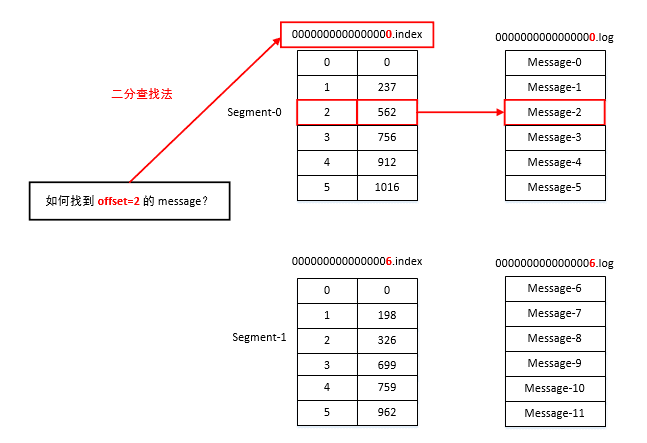
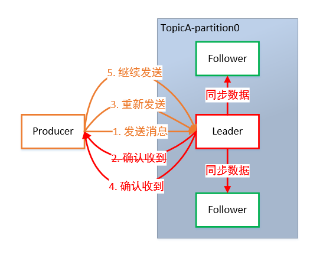
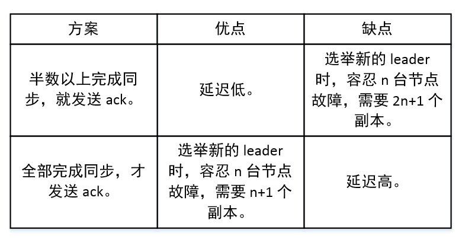
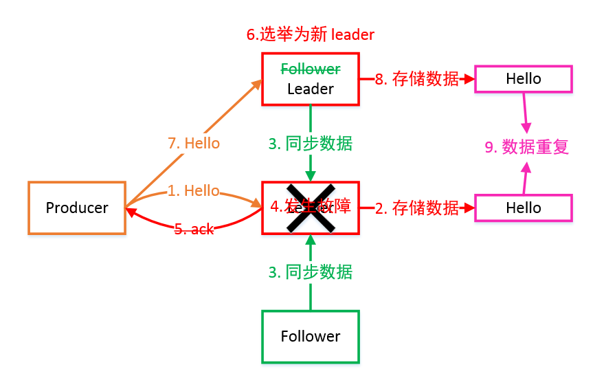
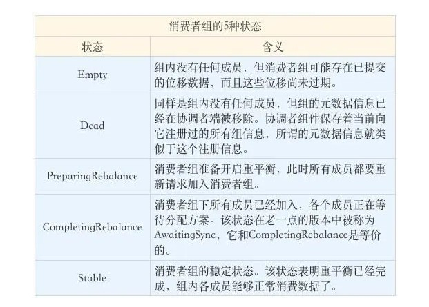
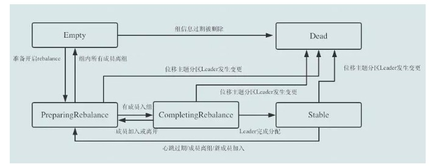
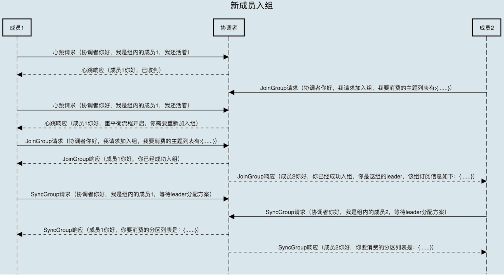
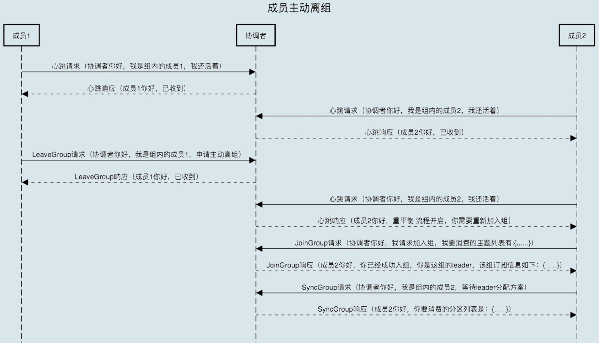
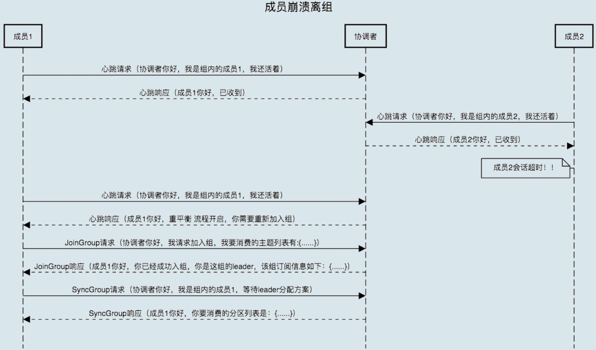
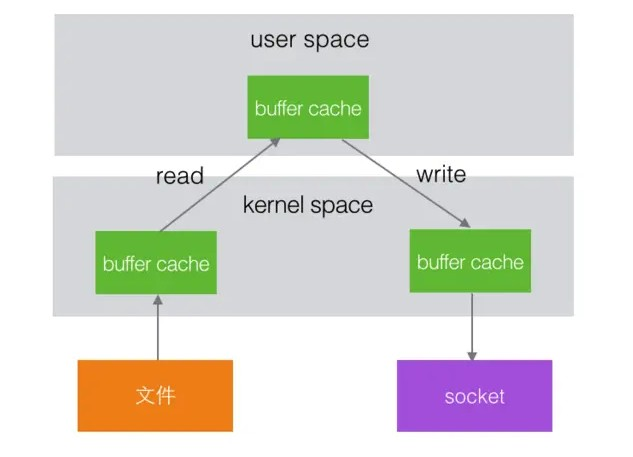

# Kafka 总结

[TOC]

## 一、kafka 核心原理

### 1.1、Kafka 架构


- **Producer**： 消息生产者，向 Kafka Broker 发消息的客户端。
- **Consumer**：消息消费者，从 Kafka Broker 取消息的客户端。
- **Consumer Group**：消费者组(CG)，消费者组内每个消费者负责消费不同分区的数据，提高消费能力。一个分区只能由组内一个消费者消费，消费者组之间互不影响。所有的消费者都属于某个消费者组，即消费者组是逻辑上的一个订阅者。
- **Broker**：一台 Kafka 机器就是一个 Broker。一个集群由多个 Broker 组成。一个 Broker 可以容纳多个 Topic。
- **Topic**：可以理解为一个队列，Topic 将消息分类，生产者和消费者面向的是同一个 Topic。
- **Partition**：为了实现扩展性，提高并发能力，一个非常大的 Topic 可以分布到多个 Broker (即服务器)上，一个 Topic 可以分为多个 Partition，每个 Partition 是一个 有序的队列。
- **Replica**：副本，为实现备份的功能，保证集群中的某个节点发生故障时，该节点上的 Partition 数据不丢失，且 Kafka 仍然能够继续工作，Kafka 提供了副本机制，一个 Topic 的每个分区都有若干个副本，一个 Leader 和若干个 Follower。
- **Leader**：每个分区多个副本的“主”副本，生产者发送数据的对象，以及消费者消费数据的对象，都是 Leader。
- **Follower**：每个分区多个副本的“从”副本，实时从 Leader 中同步数据，保持和 Leader 数据的同步。Leader 发生故障时，某个 Follower 还会成为新的 Leader。
- **Offset**：消费者消费的位置信息，监控数据消费到什么位置，当消费者挂掉再重新恢复的时候，可以从消费位置继续消费。
- **Zookeeper**：Kafka 集群能够正常工作，需要依赖于 Zookeeper，Zookeeper 帮助 Kafka 存储和管理集群信息。

### 1.2、工作流程

Kafka 集群将 Record 流存储在称为 Topic 的类别中，每个记录由一个键、一个值和一个时间戳组成。


Kafka 中消息是以 Topic 进行分类的，生产者生产消息，消费者消费消息，面向的都是同一个 Topic。

Topic 是逻辑上的概念，而 Partition 是物理上的概念，每个 Partition 对应于一个 log 文件，该 log 文件中存储的就是 Producer 生产的数据。

Producer 生产的数据会不断追加到该 log 文件末端，且每条数据都有自己的 Offset。

消费者组中的每个消费者，都会实时记录自己消费到了哪个 Offset，以便出错恢复时，从上次的位置继续消费。

### 1.3、存储机制


由于生产者生产的消息会不断追加到 log 文件末尾，为防止 log 文件过大导致数据定位效率低下，Kafka 采取了分片和索引机制。

它将每个 Partition 分为多个 Segment，每个 Segment 对应两个文件：“.index” 索引文件和 “.log” 数据文件。

这些文件位于同一文件下，该文件夹的命名规则为：topic 名-分区号。例如，first 这个 topic 有三分分区，则其对应的文件夹为 first-0，first-1，first-2。

```sh
# ls /root/data/kafka/first-0        
00000000000000009014.index    
00000000000000009014.log
00000000000000009014.timeindex
00000000000000009014.snapshot   
leader-epoch-checkpoint
```

index 和 log 文件以当前 Segment 的第一条消息的 Offset 命名。下图为 index 文件和 log 文件的结构示意：



“.index” 文件存储大量的索引信息，“.log” 文件存储大量的数据，索引文件中的元数据指向对应数据文件中 Message 的物理偏移量。

### 1.4、数据可靠性保证

为保证 Producer 发送的数据，能可靠地发送到指定的 Topic，Topic 的每个 Partition 收到 Producer 发送的数据后，都需要向 Producer 发送 ACK（ACKnowledge 确认收到）。

如果 Producer 收到 ACK，就会进行下一轮的发送，否则重新发送数据。



### 1.5、副本数据同步策略

何时发送 ACK？确保有 Follower 与 Leader 同步完成，Leader 再发送 ACK，这样才能保证 Leader 挂掉之后，能在 Follower 中选举出新的 Leader 而不丢数据。

多少个 Follower 同步完成后发送 ACK？全部 Follower 同步完成，再发送 ACK。



采用第二种方案，所有 Follower 完成同步，Producer 才能继续发送数据，设想有一个 Follower 因为某种原因出现故障，那 Leader 就要一直等到它完成同步。

这个问题怎么解决？Leader 维护了一个动态的 in-sync replica set（ISR）：和 Leader 保持同步的 Follower 集合。

当 ISR 集合中的 Follower 完成数据的同步之后，Leader 就会给 Follower 发送 ACK。

如果 Follower 长时间未向 Leader 同步数据，则该 Follower 将被踢出 ISR 集合，该时间阈值由 replica.lag.time.max.ms 参数设定。Leader 发生故障后，就会从 ISR 中选举出新的 Leader。

### 1.6、ACK 应答机制

对于某些不太重要的数据，对数据的可靠性要求不是很高，能够容忍数据的少量丢失，所以没必要等 ISR 中的 Follower 全部接受成功。

所以 Kafka 为用户提供了三种可靠性级别，用户根据可靠性和延迟的要求进行权衡，选择以下的配置。



ACK 参数配置：

- 0：Producer 不等待 Broker 的 ACK，这提供了最低延迟，Broker 一收到数据还没有写入磁盘就已经返回，当 Broker 故障时有可能丢失数据。
- 1：Producer 等待 Broker 的 ACK，Partition 的 Leader 落盘成功后返回 ACK，如果在 Follower 同步成功之前 Leader 故障，那么将会丢失数据。
- -1（all）：Producer 等待 Broker 的 ACK，Partition 的 Leader 和 Follower 全部落盘成功后才返回 ACK。但是在 Broker 发送 ACK 时，Leader 发生故障，则会造成数据重复。

### 1.7、故障处理细节


LEO：每个副本最大的 Offset。HW：消费者能见到的最大的 Offset，ISR 队列中最小的 LEO。

#### 1.7.1、Follower 故障：

Follower 发生故障后会被临时踢出 ISR 集合，待该 Follower 恢复后，Follower 会 读取本地磁盘记录的上次的 HW，并将 log 文件高于 HW 的部分截取掉，从 HW 开始向 Leader 进行同步数据操作。

等该 Follower 的 LEO 大于等于该 Partition 的 HW，即 Follower 追上 Leader 后，就可以重新加入 ISR 了。

#### 1.7.2、Leader 故障：

Leader 发生故障后，会从 ISR 中选出一个新的 Leader，之后，为保证多个副本之间的数据一致性，其余的 Follower 会先将各自的 log 文件高于 HW 的部分截掉，然后从新的 Leader 同步数据。

注意：这只能保证副本之间的数据一致性，并不能保证数据不丢失或者不重复。

### 1.8、Exactly Once 语义

将服务器的 ACK 级别设置为 -1，可以保证 Producer 到 Server 之间不会丢失数据，即 At Least Once 语义。

相对的，将服务器 ACK 级别设置为 0，可以保证生产者每条消息只会被发送一次，即 At Most Once 语义。

At Least Once 可以保证数据不丢失，但是不能保证数据不重复；相对的，At Most Once 可以保证数据不重复，但是不能保证数据不丢失。

但是，对于一些非常重要的信息，比如交易数据，下游数据消费者要求数据既不重复也不丢失，即 Exactly Once 语义。

0.11 版本的 Kafka，引入了幂等性：Producer 不论向 Server 发送多少重复数据，Server 端都只会持久化一条。

即：

```
At Least Once + 幂等性 = Exactly Once   
```


要启用幂等性，只需要将 Producer 的参数中 enable.idompotence 设置为 true 即可。

开启幂等性的 Producer 在初始化时会被分配一个 PID，发往同一 Partition 的消息会附带 Sequence Number。

而 Borker 端会对 <PID,Partition,SeqNumber> 做缓存，当具有相同主键的消息提交时，Broker 只会持久化一条。

但是 PID 重启后就会变化，同时不同的 Partition 也具有不同主键，所以幂等性无法保证跨分区会话的 Exactly Once。

## 二、kafka 消费者

### 3.1、消费方式

Consumer 采用 Pull（拉取）模式从 Broker 中读取数据。

Consumer 采用 Push（推送）模式，Broker 给 Consumer 推送消息的速率是由 Broker 决定的，很难适应消费速率不同的消费者。

它的目标是尽可能以最快速度传递消息，但是这样很容易造成 Consumer 来不及处理消息，典型的表现就是拒绝服务以及网络拥塞。

而 Pull 模式则可以根据 Consumer 的消费能力以适当的速率消费消息。Pull 模式不足之处是，如果 Kafka 没有数据，消费者可能会陷入循环中，一直返回空数据。

因为消费者从 Broker 主动拉取数据，需要维护一个长轮询，针对这一点， Kafka 的消费者在消费数据时会传入一个时长参数 timeout。

如果当前没有数据可供消费，Consumer 会等待一段时间之后再返回，这段时长即为 timeout。

### 3.2、Offset 的维护

由于 Consumer 在消费过程中可能会出现断电宕机等故障，Consumer 恢复后，需要从故障前的位置继续消费。

所以 Consumer 需要实时记录自己消费到了哪个 Offset，以便故障恢复后继续消费。

Kafka 0.9 版本之前，Consumer 默认将 Offset 保存在 Zookeeper 中，从 0.9 版本开始，Consumer 默认将 Offset 保存在 Kafka 一个内置的 Topic 中，该 Topic 为 __consumer_offsets。

### 3.3、消费者分区分配策略

org.apache.kafka.clients.consumer.internals.AbstractPartitionAssignor

如果是自定义分配策略的话可以继承AbstractPartitionAssignor这个类，它默认有3个实现。

#### 3.3.1、Range

range 策略对应的实现类是 org.apache.kafka.clients.consumer.RangeAssignor。这是默认的分配策略。

1. RangeAssignor 是按照 Topic 的维度进行分配的，也就是说按照 Topic 对应的每个分区平均的按照范围区段分配给 Consumer 实例。
2. 首先，将分区按数字顺序排行序，消费者按消费者名称的字典序排好序。
3. 然后，用分区总数除以消费者总数。如果能够除尽，则皆大欢喜，平均分配；若除不尽，则位于排序前面的消费者将多负责一个分区


从上图的最终分配结果看来，因为是按照 Topic A 和 Topic B 的维度进行分配的。对于Topic A 而言，有 2 个消费者，此时算出来C0 得到 2 个分区，C1 得到 1 个分区；对于Topic B的维度也是一样，也就是先分配的Consumer 会得到的更多，从而造成倾斜。需要注意一点的是，RangeAssignor **是按照范围截断分配的，不是按顺序分发的。**

这种分配方案是按照 Topic 的维度去分发分区的，此时可能会造成先分配分区的Consumer 实例的任务过重。

#### 3.3.2、RoundRobin

具体实现是 org.apache.kafka.clients.consumer.RoundRobinAssignor。

RoundRobinAssignor 中文可以翻译为轮询，也就是顺序一个一个的分发。

轮询分配策略是基于所有可用的消费者和所有可用的分区的，与前面的 range 策略最大的不同就是它不再局限于某个主题。

大概逻辑如下：

1. 拿到组内所有 Consumer 订阅的 TopicPartition，将所有的 partition 和 consumer 按照字典序进行排序
2. 按照顺序将 TopicPartition 挨个分发给 Consumer，如果和当前Consumer 没有订阅关系，则寻找下一个Consumer。

如果组内每个消费者的订阅关系是同样的，这样TopicPartition 的分配是均匀的。


当组内每个消费者订阅的 Topic  关系是不同的，这样就可能会造成分区订阅的倾斜。


#### 3.3.3、Sticky

具体实现是 org.apache.kafka.clients.consumer.StickyAssignor。

StickyAssignor 是 Kafka Java 客户端提供的 3 中分配策略中最复杂的一种，从字面上可以看出是具有“粘性”的分区策略。Kafka从0.11 版本开始引入，其主要实现了两个功能：

* 主题分区的分配要尽可能的均匀；
* 当 Rebalance 发生时，尽可能保持上一次的分配方案（因为分区从一个消费者转移到另一个消费者是需要一些开销的，尽可能保证现有分配有助于减少这种开销）

当然，当上面两个条件发生冲突是，第一个提交件要优先于第二个提交，这样可以使分配更加均匀。

具体实现：

1. 首先将所有的分区进行排序，排序方式为：首先按照当前分区所分配的consumer 数量从低到高进行排序，如果 consumer 数量相同，则按照分区的字典序进行排序。
2. 然后将所有的 consumer 进行排序，其排序方式为：首先按照当前consumer 已经分配的分区数量有小到大排序，如果两个 consumer 分配的分区数量相同，则会按照其名称的字典序进行排序。
3. 然后将各个分区依次遍历分配给各个 consumer，首先需要注意的是，这里的遍历并不是 C0 分配完了再分配给 C1，而是每次分配分区的时候都整个的对所有的 consumer 从头开始遍历分配，如果当前 consumer 没有订阅当前分区，则会遍历下一个 consumer。然后需要注意的是，在整个分配的过程中，各个 consumer 所分配的分区数是动态变化的，而这种变化是会体现在各个 consumer 的排序上的，比如初始时 C0 是排在第一个的，此时如果分配了一个分区给C0，那么C0就会排到最后，因为其拥有的分区数是最多的。


### 3.4、Kafka 消息数据积压，Kafka 消费能力不足处理

1）如果是 Kafka 消费能力不足，则可以考虑增加 Topic 的分区数，并且同时提升消费组的消费者数量，消费者数=分区数。（两者缺一不可）

2）如果是下游的数据处理不及时：提高每批次拉取的数量。批次拉取数据过少（拉取数据/处理时间<生产速度），使处理的数据小于生产的数据，也会造成数据积压。

## 三、kafka 再均衡

### 3.1、发生 rebalance 的时机

**订阅主题数发生变化：**

这种情况一般不会发生，如果发生，那也是因为我们的业务调整才会，所以这种基本要么不发生要么就是不可避免。

**主题分区发生变化：**

这种情况发生会相对多一点，但是也有限，在部署 Kafka 集群前，我们就需要考虑到该集群的容量，以便来确定好分区数。虽然不一定一步到位，但是调整的次数应该是极其有限的，一般也可以选择在半夜低峰的时候进行调整，影响不大。

**消费端的消费者组成员变化：**

基本上影响最大的就是这个原因了，主要有：

1. 消费者处理消息超时，即如果消费者处理消费的消息的时间超过了 Kafka 集群配置的`max.poll.interval.ms` 的值，那么该消费者将会自动离组
2. 心跳超时，如果消费者在指定的`session.timeout.ms`时间内没有汇报心跳，那么 Kafka 就会认为该消费已经 dead 了

### 3.2、消费者组状态切换

消费组的协调管理已经依赖于 Broker 端某个节点，该节点即是该消费组的 Coordinator， 并且**每个消费组有且只有一个 Coordinator**，它负责消费组内所有的事务协调，其中包括**分区分配，重平衡触发，消费者离开与剔除**等等，整个消费组都会被 Coordinator 管控着，在每个过程中，消费组都有一个状态，Kafka 为消费组定义了 5 个状态，如下：

1. Empty：消费组没有一个活跃的消费者；
2. PreparingRebalance：消费组准备进行重平衡，此时的消费组可能已经接受了部分消费者加入组请求；
3. AwaitingSync：全部消费者都已经加入组并且正在进行重平衡，各个消费者等待 Broker 分配分区方案；
4. Stable：分区方案已经全部发送给消费者，消费者已经在正常消费；
5. Dead：该消费组被 Coordinator 彻底废弃。



其流转过程大概如下：



一个消费者组最开始是 Empty 状态，当重平衡过程开启后，它会被置于PreparingRebalance 状态等待成员加入，成员都加入之后变更到CompletingRebalance 状态等待分配方案，当 coordinator 分配完个消费者消费的分区后，最后就流转到 Stable 状态完成重平衡。

当有新成员加入或已有成员退出时，消费者组的状态 从 Stable 直接跳到PreparingRebalance 状态，此时，所有现存成员就必须重新申请加入组。当所有成员都退出组后，消费者组状态变更为 Empty。

Kafka 定期自动删除过期位移的条件就是，组要处于 Empty 状态。因此，如果你的消费者组停掉了很长时间（超过7天），那么 Kafka 很可能就把该组的位移数据删除了。

### 3.3、消费者端重平衡流程

在消费者端，重平衡分为两个步骤：

**加入组**

当组内成员加入组时，它会向 coordinator 发送 JoinGroup 请求。在该请求中，每个成员都要将自己订阅的主题上报，这样协调者就能收集到所有成员的订阅信息。

一旦收集了全部成员的 JoinGroup 请求后，Coordinator 会从这些成员中选择一个担任这个消费者组的领导者。

通常情况下，第一个发送 JoinGroup 请求的成员自动成为领导者。

领导者消费者的任务是收集所有成员的订阅信息，然后根据这些信息，制定具体的分区消费分配方案。**特别注意的是：这里说的是消费者领导者。**

选出领导者之后，Coordinator 会把消费者组订阅信息封装进 JoinGroup 请求的响应体中，然后发给领导者，由领导者统一做出分配方案后，进入到下一步：发送SyncGroup 请求。


**领导者消费者（Leader Consumer）分配方案**

领导者向 Coordinator 发送SyncGroup请求，将刚刚做出的分配方案发给协调者。

值得注意的是，其他成员也会向 Coordinator 发送 SyncGroup 请求，只不过请求体中并没有实际的内容。这一步的主要目的是让 Coordinator 接收分配方案，然后统一以 SyncGroup 响应的方式分发给所有成员，

**这样组内所有成员就都知道自己该消费哪些分区了。**


### 3.4、Broker 端重平衡

分几个场景来讨论：

- 新成员加入组
- 组成员主动离组
- 组成员崩溃离组

**新成员入组**

新成员入组是指组处于 Stable 状态后，有新成员加入。

如果是全新启动一个消费者组，Kafka 是有一些自己的小优化的，流程上会有些许的不同。

这里讨论的是，组稳定了之后有新成员加入的情形。当协调者收到新的 JoinGroup请求后，它会通过心跳请求响应的方式通知组内现有的所有成员，强制它们开启新一轮的重平衡。

具体的过程和之前的客户端重平衡流程是一样的。现在，用一张时序图来说明协调者一端是如何处理新成员入组的。



**组成员主动离组**

何谓主动离组？就是指消费者实例所在线程或进程调用 close() 方法主动通知协调者它要退出。 

这个场景就涉及到了第三类请求：LeaveGroup 请求。 协调者收到 LeaveGroup 请求后，依然会以心跳响应的方式通知其他成员， 因此就不再赘述了，还是直接用一张图来说明。



**组成员崩溃离组**

崩溃离组是指消费者实例出现严重故障，突然宕机导致的离组。 

它和主动离组是有区别的， 因为后者是主动发起的离组，协调者能马上感知并处理。 但崩溃离组是被动的，协调者通常需要等待一段时间才能感知到， 这段时间一般是由消费者端参数 session.timeout.ms 控制的。 也就是说，Kafka一般不会超过 session.timeout.ms 就能感知到这个崩溃。



### 3.5、重平衡所涉及的参数

在消费者启动时，某些参数会影响重平衡机制的发生，所以需要根据业务的属性，对这些参数进行调优，否则可能会因为设置不当导致频繁重平衡，严重影响消费速度。

**•session.timeout.ms**

该参数是 Coordinator 检测消费者失败的时间，即在这段时间内客户端是否跟 Coordinator 保持心跳，如果该参数设置数值小，可以更早发现消费者崩溃的信息，从而更快地开启重平衡，避免消费滞后，但是这也会导致频繁重平衡，这要根据实际业务来衡量。

**•max.poll.interval.ms**

消费者处理消息逻辑的最大时间，对于某些业务来说，处理消息可能需要很长时间，比如需要 1分钟，那么该参数就需要设置成大于 1分钟的值，否则就会被 Coordinator 剔除消息组然后重平衡。

**•heartbeat.interval.ms**

该参数跟 session.timeout.ms 紧密关联，前面也说过，只要在 session.timeout.ms 时间内与 Coordinator 保持心跳，就不会被 Coordinator 剔除，那么心跳间隔的时间就是 session.timeout.ms，因此，该参数值必须小于 session.timeout.ms，以保持 session.timeout.ms 时间内有心跳。

下面用图来形象表达这三个参数的含义： 


## 四、kafka 常见问题

### 4.1、Kafka 中 Zookpeer 的作用

Controller 选举:

- Controller 是一个特殊的 Broker，其负责所有 Partition 的 leader/follower 关系；
- Zookeeper 负责从 Broker 中选举出一个作为 Controller， 并确保其唯一性。同时， 当Controller 宕机时，选举一个新的。

集群 membership:

- 记录集群中都有哪些活跃着的Broker

Topic 配置:

- 有哪些 Topic，Topic 都有哪些 Partition，Replica 存放在哪里， Leader 是谁

配额(0.9.0+):

- 记录每个客户能够读写的数据量.

ACLs(0.9.0+):

- 记录对Topic 的读写控制.

high-level consumer(已废弃):

- 记录 consumer group 及其成员和 offset 信息

### 4.2、Kafka 是如何实现高吞吐率的

顺序读写：

kafka 的消息是不断追加到文件中的，这个特性使 kafka 可以充分利用磁盘的顺序读写性能，顺序读写不需要硬盘磁头的寻道时间，只需很少的扇区旋转时间，所以速度远快于随机读写

零拷贝：



在 Linux kernel2.2 之后出现了一种叫做"零拷贝(zero-copy)"系统调用机制，就是跳过“用户缓冲区”的拷贝，建立一个磁盘空间和内存的直接映射，数据不再复制到“用户态缓冲区”， 系统上下文切换减少为2次，可以提升一倍的性能。

批量发送：

Kafka 允许进行批量发送消息，先将消息缓存在内存中，然后一次请求批量发送出去，比如可以指定缓存的消息达到某个量的时候就发出去，或者缓存了固定的时间后就发送出去，如 100 条消息就发送，或者每 5 秒发送一次，这种策略将大大减少服务端的 I/O 次数

数据压缩：

Kafka 还支持对消息集合进行压缩，Producer 可以通过 GZIP 或 Snappy 格式对消息集合进行压缩压缩的好处就是减少传输的数据量，减轻对网络传输的压力 Producer 压缩之后，在 Consumer 需进行解压，虽然增加了CPU 的工作，但在对大数据处理上，瓶颈在网络上而不是 CPU，所以这个成本很值得。

### 4.3、如何提高 kafka 吞吐量

生产端调整 batch.size、linger.ms 参数，以及主题分区数合理分配等。

### 4.4、判断一个节点是否还活着的个条件

* 节点必须可以维护和 ZooKeeper 的连接，Zookeeper 通过心跳机制检查每个节点的连接
* 如果节点是个 follower，他必须能及时的同步 leader 的写操作，延时不能太久

### 4.5、ISR、AR 代表什么？ISR的伸缩指什么？

分区中的所有副本统称为AR(Assigned Replicas)。

所有与 leader 副本保持一定程度同步的副本(包括 leader副本在内)组成 ISR(In-Sync Replicas)，ISR 集合是 AR 集合中的一个子集。

消息会先发送到 leader 副本，然后 follower 副本才能从 leader 副本中拉取消息进行同步，同步期间内 follower 副本相对于 leader 副本而言会有一定程度的滞后。前面所说的“一定程度的同步”是指可忍受的滞后范围，这个范围可以通过参数进行配置。与 leader副本同步滞后过多的副本(不包括 leader副本)组成OSR(Out-of-Sync Replicas)，由此可见，**AR=ISR+OSR**。

在正常情况下，所有的 follower 副本都应该与 leader 副本保持一定程度的同步，即 AR=ISR，OSR 集合为空。

ISR 的伸缩是指 leader 副本负责跟踪 ISR 集合中所有 follower 副本的滞后状态，有follower 副本滞后太多的时候将他从ISR中剔除，OSR 集合中有 follower副本”追上“了 leader 副本将其加入 ISR 集合中

### 4.6、HW、LEO、LSO、LW 等分别代表什么？

HW 是 High Watermark的缩写，俗称高水位，它标识了一个特定的消息偏移量(offset)，消费者只能拉取到这个 offset 之前的消息。

LEO 是 Log End Offset的缩写，它标识当前日志文件中下一条待写入消息的 offset。

LEO 的大小相当于当前日志分区中最后一条消息的 offset值加1。分区ISR集合中的每个副本都会维护自身的LEO，而ISR集合中最小的LEO即为分区的HW，对消费者而言只能消费HW之前的消息。

LSO(Last Stable Offset) 对未完成的事务而言，LSO 的值等于事务中第一条消息的位置(firstUnstableOffset)，对已完成的事务而言，它的值同 HW 相同

LW:Low Watermark 低水位, 代表 AR 集合中最小的 logStartOffset 值

### 4.7、Kafka中是怎么体现消息顺序性的？

通过 Topic 和 Partition 来提现，Topic 是消息归类的主题是逻辑概念，Topic 下有多个 Partition，其在存储层面可以看成是一个可追加的日志文件，消息在被追加到 Partition 日志文件中的时候会分配一个特定的偏移量（offset）。offset 是消息在分区中的唯一标识，Kafka 通过 offset 来保证消息在分区内的顺序性。

### 4.8、分区器、序列化器、拦截器的处理顺序？

分区器、序列化器、拦截器都是生产者客户端中的东西。

分区器是将消息发送给指定的分区的，如果在发送的消息中指定了 Partition，就不需要分区器了，默认的分区器中对 key 进行哈希（采用MurmurHash2算法，具备高运算性能及低碰撞率），同时也可以自定义分区器。

序列化器把消息对象转换成字节数组，这样才能够通过网络发送给 Kafka。

生产者拦截器既可以用来在消息发送前做一些准备工作，比如按照某个规则过滤不符合要求的消息、修改消息的内容等，也可以用来在发送回调逻辑前做一些定制化的需求，比如统计类工作。

他们之间工作的顺序是拦截器 -> 序列化器 -> 分区器

### 4.9、生产者使用了几个线程来处理？

使用了两个线程来进行处理：主线程和 Sender 线程。

主线程负责由 KafkaProducer 创建消息，通过拦截器、序列化器和分区器作用以后缓存到消息累加器；

Sender 线程负责从消息累加器中获取消息并将其发送到 Kafka 中。

### 3.10、消费者提交的是 offset 还是 offset+1?

提交的是offset + 1，表示下一条需要拉取的消息的位置

### 3.11、KafkaConsumer 是非线程安全的，怎样实现多线程消费？

第一种方式：线程封闭，每个线程实例化一个 KafkaConsumer 对象，一个消费线程可以消费一个或者多个分区中的消息，所有的消费线程都隶属于同一个消费者组。

第二种方式：多个消费线程同时消费同一个分区，通过 assign()、seek() 等方法实现，这样可以打破原有的消费线程的个数不能超过分区的限制，进一步提高消费能力。但是这种方式会导致位移提交和顺序控制的处理变得更加复杂。
