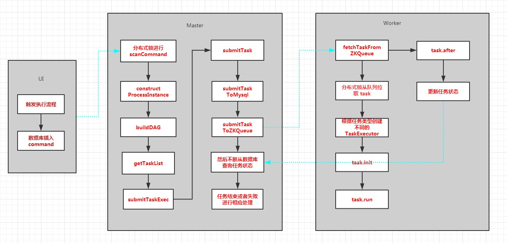
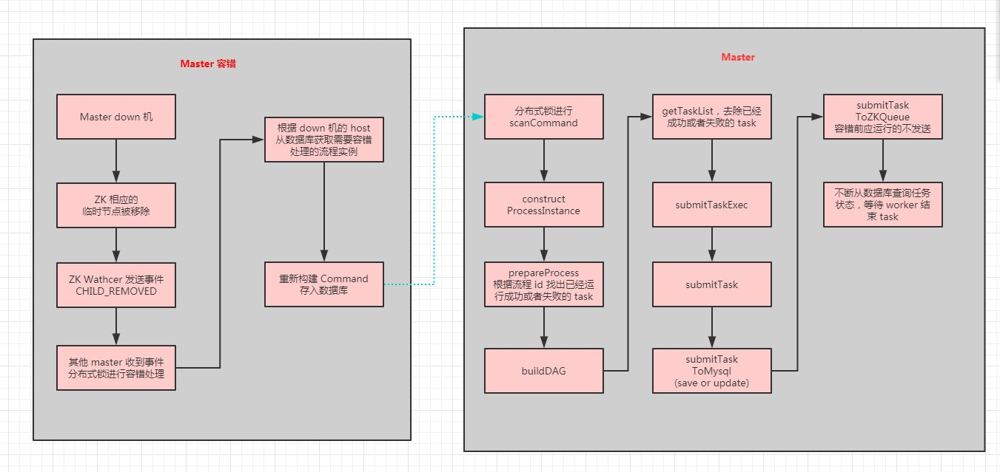
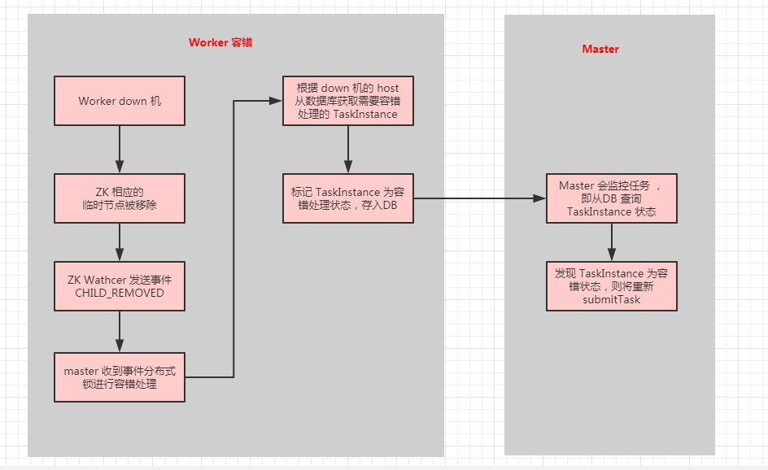

# 【Scheduler】大数据调度系统设计

## 一、调度执行逻辑

Master 不断从 DB 扫描命令，一旦发现，就从命令中解析出流程实例（如果多个 Master，可设置分布式锁，每台 Master 扫描命令时都加锁处理）；然后通过给流程构建 DAG，然后构建任务实例，持久化到数据库，同时通过 ZK 发送给 Worker；然后不断扫描数据库，监控任务的状态，直到任务结束。

Worker 集群通过分布式锁，加锁，然后从队列中取出设定数量的任务，将其提交到任务执行线程执行后，然后从队列移除这些任务，并释放锁。

这样 Worker 执行任务，并不断更新任务状态，Master 则监控流程状态和流程状态。

## 二、调度容错逻辑

### 2.1、Master 容错处理

Master 监听 ZK 的事件，一旦发现有 Master down 机，多台 Master 同时收到这个事件，通过分布式锁，只有一台 Master 会真正执行容错恢复。

该 Master 从 DB 根据 Host 找出需要容错的流程实例，然后构建一个新的 Command 插入 DB。

该条新增的 Command 又被其中一个 Master 扫描，重构 ProcessInstance ，构建 DAG，然后构建任务实例列表 tasks.

不同的是，对于进行容错恢复的 ProcessInstance，需要从 tasks 中去除已经成功或者失败的 task，然后将其余的 task 提交，一是持久化到数据库，二是发送到 ZK 队列。

当然对于正在运行的 task 不会重复运行，在提交到队列时会先判断是否正在运行，正在运行的不会丢到队列中。

Worker 从队列获取 task 进行处理。Master 则监控状态。

### 2.2、Worker 容错

Master 监听 ZK 的事件，一旦发现有 Worker down 机，多台 Master 同时收到这个事件，通过分布式锁，只有一台 Master 会真正执行容错恢复。

该 Master 从 DB 获取已 down Worker 运行的需要容错的 task 实例，标记为需要容错状态，存入 DB，监控该 task 实例的 Master 扫描 DB，发现需要容错处理，则重新提交该 task 实例。

## 三、构建 DAG

参考拓扑排序实现。

