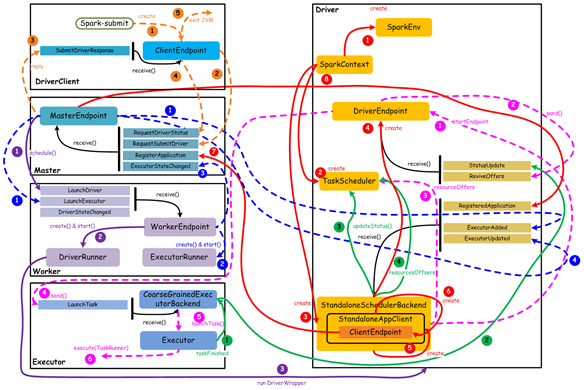

#  Spark 提交任务-核心组件交互原理

[TOC]

## 一、总述

在 Standalone 模式下，Spark 中各个组件之间交互还是比较复杂的，但是对于一个通用的分布式计算系统来说，这些都是非常重要而且比较基础的交互。首先，为了理解组件之间的主要交互流程，我们给出一些基本要点：

* 一个Application会启动一个Driver
* 一个Driver负责跟踪管理该Application运行过程中所有的资源状态和任务状态
* 一个Driver会管理一组Executor
* 一个Executor只执行属于一个Driver的Task

核心组件之间的主要交互流程，如下图所示：



## 二、橙色：提交用户 Spark 程序

用户提交一个Spark程序，主要的流程如下所示：

1. 用户 spark-submit 脚本提交一个 Spark 程序，会创建一个 ClientEndpoint 对象，该对象负责与 Master 通信交互
2. ClientEndpoint 向 Master 发送一个 RequestSubmitDriver 消息，表示提交用户程序
3. Master 收到 RequestSubmitDriver 消息，向 ClientEndpoint 回复 SubmitDriverResponse，表示用户程序已经完成注册，同时会调用 scheduler 方法调度 worker 运行 driver
4. ClientEndpoint 向 Master 发送 RequestDriverStatus 消息，请求 Driver 状态
5. 如果当前用户程序对应的 Driver 已经启动，则 ClientEndpoint 直接退出，完成提交用户程序

```scala
case RequestSubmitDriver(description) =>
      if (state != RecoveryState.ALIVE) {
        val msg = s"${Utils.BACKUP_STANDALONE_MASTER_PREFIX}: $state. " +
          "Can only accept driver submissions in ALIVE state."
        context.reply(SubmitDriverResponse(self, false, None, msg))
      } else {
        logInfo("Driver submitted " + description.command.mainClass)
        val driver = createDriver(description)
        persistenceEngine.addDriver(driver)
        waitingDrivers += driver
        drivers.add(driver)
        schedule()

        // TODO: It might be good to instead have the submission client poll the master to determine
        //       the current status of the driver. For now it's simply "fire and forget".

        context.reply(SubmitDriverResponse(self, true, Some(driver.id),
          s"Driver successfully submitted as ${driver.id}"))
      }
```

## 三、紫色：启动 Driver 进程

当用户提交用户 Spark 程序后，需要启动 Driver 来处理用户程序的计算逻辑，完成计算任务，这时 Master 协调需要启动一个 Driver，具体流程如下所示：

1. Maser 内存中维护着用户提交计算的任务 Application，每次内存结构变更都会触发调度，向 Worker 发送 LaunchDriver 请求
2. Worker 收到 LaunchDriver 消息，会启动一个 DriverRunner 线程去执行 LaunchDriver 的任务
3. DriverRunner 线程在 Worker 上启动一个新的 JVM 实例，该 JVM 实例内运行一个 Driver 进程，该 Driver 会创建 SparkContext 对象

```scala
case LaunchDriver(driverId, driverDesc) =>
logInfo(s"Asked to launch driver $driverId")
val driver = new DriverRunner(
    conf,
    driverId,
    workDir,
    sparkHome,
    driverDesc.copy(command = Worker.maybeUpdateSSLSettings(driverDesc.command, conf)),
    self,
    workerUri,
    securityMgr)
drivers(driverId) = driver
driver.start()

coresUsed += driverDesc.cores
memoryUsed += driverDesc.mem
```

## 四、 红色：注册 Application

Dirver 启动以后，它会创建 SparkContext 对象，初始化计算过程中必需的基本组件，并向 Master 注册 Application，流程描述如下：

1. 创建 SparkEnv 对象，创建并管理一些数基本组件
2. 创建 TaskScheduler，负责 Task 调度
3. 创建 StandaloneSchedulerBackend，负责与 ClusterManager 进行资源协商
4. 创建 DriverEndpoint，其它组件可以与 Driver 进行通信
5. 在 StandaloneSchedulerBackend 内部创建一个 StandaloneAppClient，负责处理与 Master 的通信交互
6. StandaloneAppClient 创建一个 ClientEndpoint，实际负责与 Master 通信
7. ClientEndpoint 向 Master 发送 RegisterApplication 消息，注册Application
8. Master 收到 RegisterApplication 请求后，回复 ClientEndpoint 一个RegisteredApplication 消息，表示已经注册成功

```scala
private def registerWithMaster(nthRetry: Int) {
    registerMasterFutures.set(tryRegisterAllMasters())
    registrationRetryTimer.set(registrationRetryThread.schedule(new Runnable {
        override def run(): Unit = {
            if (registered.get) {
                registerMasterFutures.get.foreach(_.cancel(true))
                registerMasterThreadPool.shutdownNow()
            } else if (nthRetry >= REGISTRATION_RETRIES) {
                markDead("All masters are unresponsive! Giving up.")
            } else {
                registerMasterFutures.get.foreach(_.cancel(true))
                registerWithMaster(nthRetry + 1)
            }
        }
    }, REGISTRATION_TIMEOUT_SECONDS, TimeUnit.SECONDS))
}
```

## 五、蓝色：启动 Executor 进程

1. Master 向 Worker 发送 LaunchExecutor 消息，请求启动 Executor；同时Master 会向 Driver 发送 ExecutorAdded 消息，表示 Master 已经新增了一个 Executor（此时还未启动）
2. Worker 收到 LaunchExecutor 消息，会启动一个 ExecutorRunner 线程去执行 LaunchExecutor 的任务
3. Worker 向 Master 发送 ExecutorStageChanged 消息，通知 Executor 状态已发生变化
4.  Master 向 Driver 发送 ExecutorUpdated 消息，此时 Executor 已经启动

```scala
  private def allocateWorkerResourceToExecutors(
      app: ApplicationInfo,
      assignedCores: Int,
      coresPerExecutor: Option[Int],
      worker: WorkerInfo): Unit = {
    // If the number of cores per executor is specified, we divide the cores assigned
    // to this worker evenly among the executors with no remainder.
    // Otherwise, we launch a single executor that grabs all the assignedCores on this worker.
    val numExecutors = coresPerExecutor.map { assignedCores / _ }.getOrElse(1)
    val coresToAssign = coresPerExecutor.getOrElse(assignedCores)
    for (i <- 1 to numExecutors) {
      val exec = app.addExecutor(worker, coresToAssign)
      launchExecutor(worker, exec)
      app.state = ApplicationState.RUNNING
    }
  }
```

## 六、粉色：启动 Task 执行

1. StandaloneSchedulerBackend 启动一个 DriverEndpoint
2. DriverEndpoint 启动后，会周期性地检查 Driver 维护的 Executor 的状态，如果有空闲的 Executor 便会调度任务执行
3. DriverEndpoint 向 TaskScheduler 发送 Resource Offer 请求
4. 如果有可用资源启动 Task，则 DriverEndpoint 向 Executor 发送 LaunchTask 请求
5. Executor 进程内部的 CoarseGrainedExecutorBackend 调用内部的Executor 线程的 launchTask 方法启动 Task
6. Executor 线程内部维护一个线程池，创建一个 TaskRunner 线程并提交到线程池执行

```scala
private def makeOffers() {
    // Make sure no executor is killed while some task is launching on it
    val taskDescs = CoarseGrainedSchedulerBackend.this.synchronized {
        // Filter out executors under killing
        val activeExecutors = executorDataMap.filterKeys(executorIsAlive)
        val workOffers = activeExecutors.map {
            case (id, executorData) =>
            new WorkerOffer(id, executorData.executorHost, executorData.freeCores)
        }.toIndexedSeq
        scheduler.resourceOffers(workOffers)
    }
    if (!taskDescs.isEmpty) {
        launchTasks(taskDescs)
    }
}
```

## 七、绿色：Task 运行完成

1. Executor 进程内部的 Executor 线程通知CoarseGrainedExecutorBackend，Task 运行完成
2. CoarseGrainedExecutorBackend 向 DriverEndpoint 发送 StatusUpdated 消息，通知 Driver 运行的 Task 状态发生变更
3. StandaloneSchedulerBackend 调用 TaskScheduler 的 updateStatus 方法更新 Task 状态 
4. StandaloneSchedulerBackend 继续调用 TaskScheduler 的 resourceOffers 方法，调度其他任务运行

```scala
case LaunchTask(data) =>
if (executor == null) {
    exitExecutor(1, "Received LaunchTask command but executor was null")
} else {
    val taskDesc = TaskDescription.decode(data.value)
    logInfo("Got assigned task " + taskDesc.taskId)
    executor.launchTask(this, taskDesc)
}
```

