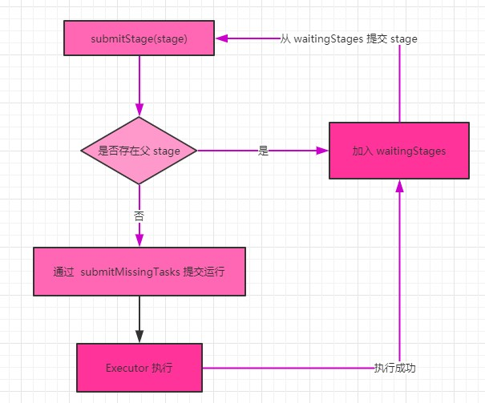
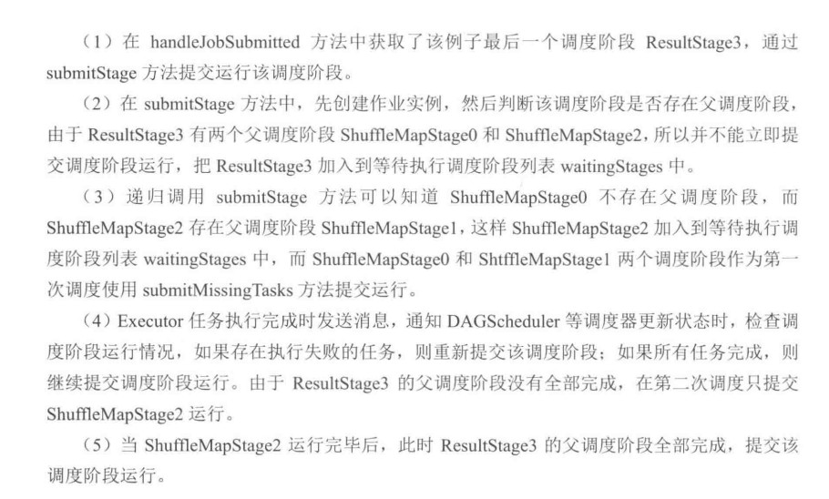

# 【Spark】Spark作业执行原理--提交调度阶段

参考：图解 Spark：核心技术与案例实战

在 DAGScheduler 的 handleMapStageSubmitted 方法中，划分完调度阶段后，进行调度阶段的提交。

调度阶段的提交是在 submitStage 方法中进行的：

```scala
/** Submits stage, but first recursively submits any missing parents. */
private def submitStage(stage: Stage) {
  val jobId = activeJobForStage(stage)
  if (jobId.isDefined) {
    logDebug("submitStage(" + stage + ")")
    if (!waitingStages(stage) && !runningStages(stage) && !failedStages(stage)) {
      val missing = getMissingParentStages(stage).sortBy(_.id)
      logDebug("missing: " + missing)
      if (missing.isEmpty) {
        logInfo("Submitting " + stage + " (" + stage.rdd + "), which has no missing parents")
        submitMissingTasks(stage, jobId.get)
      } else {
        for (parent <- missing) {
          submitStage(parent)
        }
        waitingStages += stage
      }
    }
  } else {
    abortStage(stage, "No active job for stage " + stage.id, None)
  }
}
```

该方法中，先通过 getMissingParentStages 获取 finalStage 的父调度阶段：

```scala
private def getMissingParentStages(stage: Stage): List[Stage] = {
  val missing = new HashSet[Stage]
  val visited = new HashSet[RDD[_]]
  // We are manually maintaining a stack here to prevent StackOverflowError
  // caused by recursively visiting
  val waitingForVisit = new Stack[RDD[_]]
  def visit(rdd: RDD[_]) {
    if (!visited(rdd)) {
      visited += rdd
      val rddHasUncachedPartitions = getCacheLocs(rdd).contains(Nil)
      if (rddHasUncachedPartitions) {
        for (dep <- rdd.dependencies) {
          dep match {
            case shufDep: ShuffleDependency[_, _, _] =>
              val mapStage = getOrCreateShuffleMapStage(shufDep, stage.firstJobId)
              if (!mapStage.isAvailable) {
                missing += mapStage
              }
            case narrowDep: NarrowDependency[_] =>
              waitingForVisit.push(narrowDep.rdd)
          }
        }
      }
    }
  }
  waitingForVisit.push(stage.rdd)
  while (waitingForVisit.nonEmpty) {
    visit(waitingForVisit.pop())
  }
  missing.toList
}
```

在获取父调度阶段时，是通过该 rdd 的依赖关系向前遍历，判断是否存在 Shuffle 操作，如果存在 shuffle 操作，则会创建 ShuffleMapStage，但因为划分调度阶段的时候 ShuffleMapStage 已经创建并缓存了，所以这里会直接获取。

如果存在父调度阶段，将其加入 waitingStages 等待集合，并对递归调用 submitStage 操作，直到找到开始的调度阶段。

如果不存在父调度阶段，则作为作业运行的入口，进入 submitMissingTasks 操作，当入口调度阶段完成后，相继提交后续调度阶段，在提交前先判断依赖的父调度阶段结果是否可用，如果可用，则提交调度阶段，如果不可应，则提交结果不可用的父调度阶段。

这期间会经过很多消息传递，在 Executor.run 任务执行完成后会发送消息：

```scala
override def statusUpdate(taskId: Long, state: TaskState, data: ByteBuffer) {
  val msg = StatusUpdate(executorId, taskId, state, data)
  driver match {
    case Some(driverRef) => driverRef.send(msg)
    case None => logWarning(s"Drop $msg because has not yet connected to driver")
  }
}
```

DriverEndpoint 收到消息后，调用  TaskSchedulerImpl 的 statusUpdate 方法：

```scala
def statusUpdate(tid: Long, state: TaskState, serializedData: ByteBuffer) {
  var failedExecutor: Option[String] = None
  var reason: Option[ExecutorLossReason] = None
  synchronized {
    try {
      taskIdToTaskSetManager.get(tid) match {
        case Some(taskSet) =>
          if (state == TaskState.LOST) {
            // TaskState.LOST is only used by the deprecated Mesos fine-grained scheduling mode,
            // where each executor corresponds to a single task, so mark the executor as failed.
            val execId = taskIdToExecutorId.getOrElse(tid, throw new IllegalStateException(
              "taskIdToTaskSetManager.contains(tid) <=> taskIdToExecutorId.contains(tid)"))
            if (executorIdToRunningTaskIds.contains(execId)) {
              reason = Some(
                SlaveLost(s"Task $tid was lost, so marking the executor as lost as well."))
              removeExecutor(execId, reason.get)
              failedExecutor = Some(execId)
            }
          }
          if (TaskState.isFinished(state)) {
            cleanupTaskState(tid)
            taskSet.removeRunningTask(tid)
            if (state == TaskState.FINISHED) {
              taskResultGetter.enqueueSuccessfulTask(taskSet, tid, serializedData)
            } else if (Set(TaskState.FAILED, TaskState.KILLED, TaskState.LOST).contains(state)) {
              taskResultGetter.enqueueFailedTask(taskSet, tid, state, serializedData)
            }
          }
        case None =>
          logError(
            ("Ignoring update with state %s for TID %s because its task set is gone (this is " +
              "likely the result of receiving duplicate task finished status updates) or its " +
              "executor has been marked as failed.")
              .format(state, tid))
      }
    } catch {
      case e: Exception => logError("Exception in statusUpdate", e)
    }
  }
  // Update the DAGScheduler without holding a lock on this, since that can deadlock
  if (failedExecutor.isDefined) {
    assert(reason.isDefined)
    dagScheduler.executorLost(failedExecutor.get, reason.get)
    backend.reviveOffers()
  }
}
```

在这里会根据不同状态进入的代码分支，任务丢失，任务完成。任务完成又有任务失败和任务成功。

任务完成后经过消息传递会来到 DAGScheduler 的 handleTaskCompletion 中：

```scala
/**
 * Responds to a task finishing. This is called inside the event loop so it assumes that it can
 * modify the scheduler's internal state. Use taskEnded() to post a task end event from outside.
 */
private[scheduler] def handleTaskCompletion(event: CompletionEvent) {
  val task = event.task
  val taskId = event.taskInfo.id
  val stageId = task.stageId
  val taskType = Utils.getFormattedClassName(task)

  outputCommitCoordinator.taskCompleted(
    stageId,
    task.partitionId,
    event.taskInfo.attemptNumber, // this is a task attempt number
    event.reason)

  // Reconstruct task metrics. Note: this may be null if the task has failed.
  val taskMetrics: TaskMetrics =
    if (event.accumUpdates.nonEmpty) {
      try {
        TaskMetrics.fromAccumulators(event.accumUpdates)
      } catch {
        case NonFatal(e) =>
          logError(s"Error when attempting to reconstruct metrics for task $taskId", e)
          null
      }
    } else {
      null
    }

  // The stage may have already finished when we get this event -- eg. maybe it was a
  // speculative task. It is important that we send the TaskEnd event in any case, so listeners
  // are properly notified and can chose to handle it. For instance, some listeners are
  // doing their own accounting and if they don't get the task end event they think
  // tasks are still running when they really aren't.
  listenerBus.post(SparkListenerTaskEnd(
     stageId, task.stageAttemptId, taskType, event.reason, event.taskInfo, taskMetrics))

  if (!stageIdToStage.contains(task.stageId)) {
    // Skip all the actions if the stage has been cancelled.
    return
  }

  val stage = stageIdToStage(task.stageId)
  event.reason match {
    case Success =>
      stage.pendingPartitions -= task.partitionId
      task match {
        case rt: ResultTask[_, _] =>
          // Cast to ResultStage here because it's part of the ResultTask
          // TODO Refactor this out to a function that accepts a ResultStage
          val resultStage = stage.asInstanceOf[ResultStage]
          resultStage.activeJob match {
            case Some(job) =>
              if (!job.finished(rt.outputId)) {
                updateAccumulators(event)
                job.finished(rt.outputId) = true
                job.numFinished += 1
                // If the whole job has finished, remove it
                if (job.numFinished == job.numPartitions) {
                  markStageAsFinished(resultStage)
                  cleanupStateForJobAndIndependentStages(job)
                  listenerBus.post(
                    SparkListenerJobEnd(job.jobId, clock.getTimeMillis(), JobSucceeded))
                }

                // taskSucceeded runs some user code that might throw an exception. Make sure
                // we are resilient against that.
                try {
                  job.listener.taskSucceeded(rt.outputId, event.result)
                } catch {
                  case e: Exception =>
                    // TODO: Perhaps we want to mark the resultStage as failed?
                    job.listener.jobFailed(new SparkDriverExecutionException(e))
                }
              }
            case None =>
              logInfo("Ignoring result from " + rt + " because its job has finished")
          }

        case smt: ShuffleMapTask =>
          val shuffleStage = stage.asInstanceOf[ShuffleMapStage]
          updateAccumulators(event)
          val status = event.result.asInstanceOf[MapStatus]
          val execId = status.location.executorId
          logDebug("ShuffleMapTask finished on " + execId)
          if (failedEpoch.contains(execId) && smt.epoch <= failedEpoch(execId)) {
            logInfo(s"Ignoring possibly bogus $smt completion from executor $execId")
          } else {
            shuffleStage.addOutputLoc(smt.partitionId, status)
          }

          if (runningStages.contains(shuffleStage) && shuffleStage.pendingPartitions.isEmpty) {
            markStageAsFinished(shuffleStage)
            logInfo("looking for newly runnable stages")
            logInfo("running: " + runningStages)
            logInfo("waiting: " + waitingStages)
            logInfo("failed: " + failedStages)

            // We supply true to increment the epoch number here in case this is a
            // recomputation of the map outputs. In that case, some nodes may have cached
            // locations with holes (from when we detected the error) and will need the
            // epoch incremented to refetch them.
            // TODO: Only increment the epoch number if this is not the first time
            //       we registered these map outputs.
            mapOutputTracker.registerMapOutputs(
              shuffleStage.shuffleDep.shuffleId,
              shuffleStage.outputLocInMapOutputTrackerFormat(),
              changeEpoch = true)

            clearCacheLocs()

            if (!shuffleStage.isAvailable) {
              // Some tasks had failed; let's resubmit this shuffleStage
              // TODO: Lower-level scheduler should also deal with this
              logInfo("Resubmitting " + shuffleStage + " (" + shuffleStage.name +
                ") because some of its tasks had failed: " +
                shuffleStage.findMissingPartitions().mkString(", "))
              submitStage(shuffleStage)
            } else {
              // Mark any map-stage jobs waiting on this stage as finished
              if (shuffleStage.mapStageJobs.nonEmpty) {
                val stats = mapOutputTracker.getStatistics(shuffleStage.shuffleDep)
                for (job <- shuffleStage.mapStageJobs) {
                  markMapStageJobAsFinished(job, stats)
                }
              }
              submitWaitingChildStages(shuffleStage)
            }
          }
      }

    case Resubmitted =>
      logInfo("Resubmitted " + task + ", so marking it as still running")
      stage.pendingPartitions += task.partitionId

    case FetchFailed(bmAddress, shuffleId, mapId, reduceId, failureMessage) =>
      val failedStage = stageIdToStage(task.stageId)
      val mapStage = shuffleIdToMapStage(shuffleId)

      if (failedStage.latestInfo.attemptId != task.stageAttemptId) {
        logInfo(s"Ignoring fetch failure from $task as it's from $failedStage attempt" +
          s" ${task.stageAttemptId} and there is a more recent attempt for that stage " +
          s"(attempt ID ${failedStage.latestInfo.attemptId}) running")
      } else {
        // It is likely that we receive multiple FetchFailed for a single stage (because we have
        // multiple tasks running concurrently on different executors). In that case, it is
        // possible the fetch failure has already been handled by the scheduler.
        if (runningStages.contains(failedStage)) {
          logInfo(s"Marking $failedStage (${failedStage.name}) as failed " +
            s"due to a fetch failure from $mapStage (${mapStage.name})")
          markStageAsFinished(failedStage, Some(failureMessage))
        } else {
          logDebug(s"Received fetch failure from $task, but its from $failedStage which is no " +
            s"longer running")
        }

        if (disallowStageRetryForTest) {
          abortStage(failedStage, "Fetch failure will not retry stage due to testing config",
            None)
        } else if (failedStage.failedOnFetchAndShouldAbort(task.stageAttemptId)) {
          abortStage(failedStage, s"$failedStage (${failedStage.name}) " +
            s"has failed the maximum allowable number of " +
            s"times: ${Stage.MAX_CONSECUTIVE_FETCH_FAILURES}. " +
            s"Most recent failure reason: ${failureMessage}", None)
        } else {
          if (failedStages.isEmpty) {
            // Don't schedule an event to resubmit failed stages if failed isn't empty, because
            // in that case the event will already have been scheduled.
            // TODO: Cancel running tasks in the stage
            logInfo(s"Resubmitting $mapStage (${mapStage.name}) and " +
              s"$failedStage (${failedStage.name}) due to fetch failure")
            messageScheduler.schedule(new Runnable {
              override def run(): Unit = eventProcessLoop.post(ResubmitFailedStages)
            }, DAGScheduler.RESUBMIT_TIMEOUT, TimeUnit.MILLISECONDS)
          }
          failedStages += failedStage
          failedStages += mapStage
        }
        // Mark the map whose fetch failed as broken in the map stage
        if (mapId != -1) {
          mapStage.removeOutputLoc(mapId, bmAddress)
          mapOutputTracker.unregisterMapOutput(shuffleId, mapId, bmAddress)
        }

        // TODO: mark the executor as failed only if there were lots of fetch failures on it
        if (bmAddress != null) {
          handleExecutorLost(bmAddress.executorId, filesLost = true, Some(task.epoch))
        }
      }

    case commitDenied: TaskCommitDenied =>
      // Do nothing here, left up to the TaskScheduler to decide how to handle denied commits

    case exceptionFailure: ExceptionFailure =>
      // Tasks failed with exceptions might still have accumulator updates.
      updateAccumulators(event)

    case TaskResultLost =>
      // Do nothing here; the TaskScheduler handles these failures and resubmits the task.

    case _: ExecutorLostFailure | TaskKilled | UnknownReason =>
      // Unrecognized failure - also do nothing. If the task fails repeatedly, the TaskScheduler
      // will abort the job.
  }
}
```



