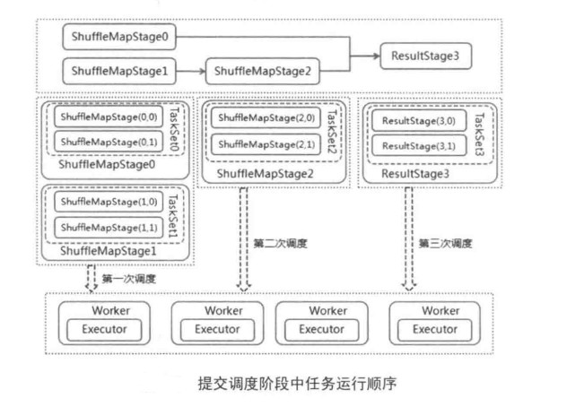
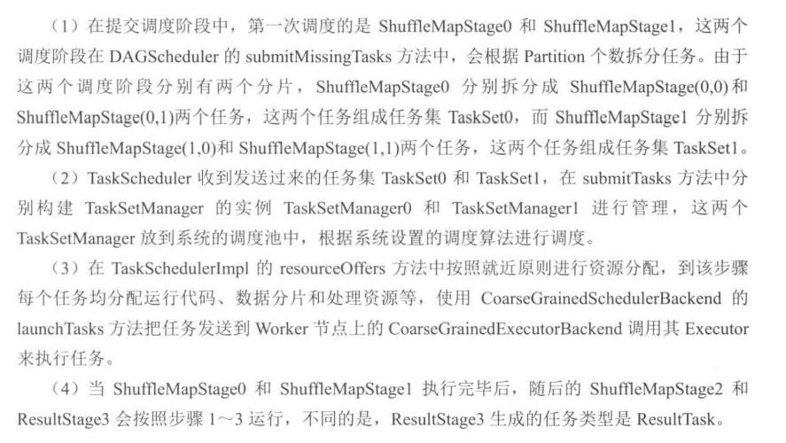

# 【Spark】Spark作业执行原理--提交任务

本篇结构：

- 创建 Task
- 创建 TaskSetManager 并 向 DriverEndpoint 发送消息
- 分配资源
- 发送消息告诉 Executor 去执行 Task

## 一、创建 Task

当调度阶段运行后，在 DAGScheduler 的 submitMissingTasks 方法中会根据调度阶段 Partition 数量拆分对应个数任务。

对于 ResultStage，生成 ResultTask，对于 ShuffleMapStage 生成 ShuffleMapTask。

这些和分区个数一样多的任务组成一个 TaskSet 提交给 TaskScheduler 进行处理。每一个 TaskSet 都包含了对应调度阶段的所有任务，这些任务处理逻辑完全一样，只是处理的数据不同，这些数据是对应的数据分片。

submitMissingTasks ：

```scala
  /** Called when stage's parents are available and we can now do its task. */
  private def submitMissingTasks(stage: Stage, jobId: Int) {
    ...
    val tasks: Seq[Task[_]] = try {
      stage match {
        // 对于 ShuffleMapStage 生成 ShuffleMapTask
        case stage: ShuffleMapStage =>
          partitionsToCompute.map { id =>
            val locs = taskIdToLocations(id)
            val part = stage.rdd.partitions(id)
            new ShuffleMapTask(stage.id, stage.latestInfo.attemptId,
              taskBinary, part, locs, stage.latestInfo.taskMetrics, properties, Option(jobId),
              Option(sc.applicationId), sc.applicationAttemptId)
          }
		// 对于 ResultStage 生成 ResultTask
        case stage: ResultStage =>
          partitionsToCompute.map { id =>
            val p: Int = stage.partitions(id)
            val part = stage.rdd.partitions(p)
            val locs = taskIdToLocations(id)
            new ResultTask(stage.id, stage.latestInfo.attemptId,
              taskBinary, part, locs, id, properties, stage.latestInfo.taskMetrics,
              Option(jobId), Option(sc.applicationId), sc.applicationAttemptId)
          }
      }
    } catch {
      case NonFatal(e) =>
        abortStage(stage, s"Task creation failed: $e\n${Utils.exceptionString(e)}", Some(e))
        runningStages -= stage
        return
    }
     
    if (tasks.size > 0) {
      logInfo("Submitting " + tasks.size + " missing tasks from " + stage + " (" + stage.rdd + ")")
      stage.pendingPartitions ++= tasks.map(_.partitionId)
      logDebug("New pending partitions: " + stage.pendingPartitions)
      // 将这些任务以 TaskSet 方式提交
      taskScheduler.submitTasks(new TaskSet(
        tasks.toArray, stage.id, stage.latestInfo.attemptId, jobId, properties))
      stage.latestInfo.submissionTime = Some(clock.getTimeMillis())
    } else {
      // 没有任务就标记该 stage 运行完成
      // Because we posted SparkListenerStageSubmitted earlier, we should mark
      // the stage as completed here in case there are no tasks to run
      markStageAsFinished(stage, None)

      val debugString = stage match {
        case stage: ShuffleMapStage =>
          s"Stage ${stage} is actually done; " +
            s"(available: ${stage.isAvailable}," +
            s"available outputs: ${stage.numAvailableOutputs}," +
            s"partitions: ${stage.numPartitions})"
        case stage : ResultStage =>
          s"Stage ${stage} is actually done; (partitions: ${stage.numPartitions})"
      }
      logDebug(debugString)

      submitWaitingChildStages(stage)
    }
  }

```

## 二、创建 TaskSetManager 并 向 DriverEndpoint 发送消息

将 TaskSet 提交到 TaskSchedulerImpl 的 submitTasks 时，会创建 TaskSetManager，用于管理这个 TaskSet 的生命周期，并且该 TaskSetManager 会放入系统的调度池中，根据系统设置的调度算法进行调度，支持 FIFO 和 FAIR(公平调度)两种。

```scala
override def submitTasks(taskSet: TaskSet) {
  val tasks = taskSet.tasks
  logInfo("Adding task set " + taskSet.id + " with " + tasks.length + " tasks")
  this.synchronized {
    // 创建 TaskSetManager
    val manager = createTaskSetManager(taskSet, maxTaskFailures)
    val stage = taskSet.stageId
    val stageTaskSets =
      taskSetsByStageIdAndAttempt.getOrElseUpdate(stage, new HashMap[Int, TaskSetManager])
    stageTaskSets(taskSet.stageAttemptId) = manager
    val conflictingTaskSet = stageTaskSets.exists { case (_, ts) =>
      ts.taskSet != taskSet && !ts.isZombie
    }
    if (conflictingTaskSet) {
      throw new IllegalStateException(s"more than one active taskSet for stage $stage:" +
        s" ${stageTaskSets.toSeq.map{_._2.taskSet.id}.mkString(",")}")
    }
    // 将 TaskSetManager放入调度池中，由系统统一调度，支持 FIFO 和 FAIR 两种调度算法
    schedulableBuilder.addTaskSetManager(manager, manager.taskSet.properties)

    if (!isLocal && !hasReceivedTask) {
      starvationTimer.scheduleAtFixedRate(new TimerTask() {
        override def run() {
          if (!hasLaunchedTask) {
            logWarning("Initial job has not accepted any resources; " +
              "check your cluster UI to ensure that workers are registered " +
              "and have sufficient resources")
          } else {
            this.cancel()
          }
        }
      }, STARVATION_TIMEOUT_MS, STARVATION_TIMEOUT_MS)
    }
    hasReceivedTask = true
  }
  // 调用调度器后台 SchedulerBackend 的 reviveOffers 方法
  backend.reviveOffers()
}
```

在 backend.reviveOffers() 方法，CoarseGrainedSchedulerBackend 实现如下：

```scala
override def reviveOffers() {
  driverEndpoint.send(ReviveOffers)
}
```

该方法向 DriverEndpoint 终端发送 ReviveOffers 消息。

## 三、分配资源

DriverEndpoint 接收消息后调用 makeOffers 方法：

```scala
// Make fake resource offers on all executors
private def makeOffers() {
  // Filter out executors under killing
  // 获取集群可用的 Executor 列表
  val activeExecutors = executorDataMap.filterKeys(executorIsAlive)
  val workOffers = activeExecutors.map { case (id, executorData) =>
    new WorkerOffer(id, executorData.executorHost, executorData.freeCores)
  }.toIndexedSeq
  // 对任务集的任务分配运行资源，并把这些任务提交运行
  launchTasks(scheduler.resourceOffers(workOffers))
}
```

在 TaskSchedulerImpl 的 resourceOffers 方法中要进行重要的步骤--资源分配，在分配的过程中会根据调度策略对 TaskSetManager 排序，然后依次对这些 TaskSetManager 按照就近原则分配资源，具体顺序为 PROCESS_LOCAL、NODE_LOCAL、NO_PREF、PACK_LOCAL、ANY。

```scala
/**
 * Called by cluster manager to offer resources on slaves. We respond by asking our active task
 * sets for tasks in order of priority. We fill each node with tasks in a round-robin manner so
 * that tasks are balanced across the cluster.
 */
def resourceOffers(offers: IndexedSeq[WorkerOffer]): Seq[Seq[TaskDescription]] = synchronized {
  // Mark each slave as alive and remember its hostname
  // Also track if new executor is added
  var newExecAvail = false
  for (o <- offers) {
    if (!hostToExecutors.contains(o.host)) {
      hostToExecutors(o.host) = new HashSet[String]()
    }
    if (!executorIdToRunningTaskIds.contains(o.executorId)) {
      hostToExecutors(o.host) += o.executorId
      executorAdded(o.executorId, o.host)
      executorIdToHost(o.executorId) = o.host
      executorIdToRunningTaskIds(o.executorId) = HashSet[Long]()
      newExecAvail = true
    }
    for (rack <- getRackForHost(o.host)) {
      hostsByRack.getOrElseUpdate(rack, new HashSet[String]()) += o.host
    }
  }

  // Randomly shuffle offers to avoid always placing tasks on the same set of workers.
  // 为任务随机分配 Executor，避免任务集中分配到一个 Worker 上
  val shuffledOffers = Random.shuffle(offers)
  // 根据 Executor 的核数为每个 Executor 分配运行的 task 个数 
  // Build a list of tasks to assign to each worker.
  val tasks = shuffledOffers.map(o => new ArrayBuffer[TaskDescription](o.cores))
  val availableCpus = shuffledOffers.map(o => o.cores).toArray
  
  // 获取按调度策略排序好的 TaskSetManager
  val sortedTaskSets = rootPool.getSortedTaskSetQueue
  for (taskSet <- sortedTaskSets) {
    logDebug("parentName: %s, name: %s, runningTasks: %s".format(
      taskSet.parent.name, taskSet.name, taskSet.runningTasks))
    if (newExecAvail) {
      taskSet.executorAdded()
    }
  }

  // Take each TaskSet in our scheduling order, and then offer it each node in increasing order
  // of locality levels so that it gets a chance to launch local tasks on all of them.
  // NOTE: the preferredLocality order: PROCESS_LOCAL, NODE_LOCAL, NO_PREF, RACK_LOCAL, ANY
  // 为排序好的 TaskSetManager 按照就近原则分配资源，具体顺序为 PROCESS_LOCAL、NODE_LOCAL、NO_PREF、PACK_LOCAL、ANY
  for (taskSet <- sortedTaskSets) {
    var launchedAnyTask = false
    var launchedTaskAtCurrentMaxLocality = false
    for (currentMaxLocality <- taskSet.myLocalityLevels) {
      do {
        // 为每个 TaskSet 分配资源
        launchedTaskAtCurrentMaxLocality = resourceOfferSingleTaskSet(
          taskSet, currentMaxLocality, shuffledOffers, availableCpus, tasks)
        launchedAnyTask |= launchedTaskAtCurrentMaxLocality
      } while (launchedTaskAtCurrentMaxLocality)
    }
    if (!launchedAnyTask) {
      taskSet.abortIfCompletelyBlacklisted(hostToExecutors)
    }
  }

  if (tasks.size > 0) {
    hasLaunchedTask = true
  }
  return tasks
}
```

这里我们重点关注 resourceOfferSingleTaskSet 方法，该方法为 TaskSet 分配资源：

```scala
private def resourceOfferSingleTaskSet(
    taskSet: TaskSetManager,
    maxLocality: TaskLocality,
    shuffledOffers: Seq[WorkerOffer],
    availableCpus: Array[Int],
    tasks: IndexedSeq[ArrayBuffer[TaskDescription]]) : Boolean = {
  var launchedTask = false
  for (i <- 0 until shuffledOffers.size) {
    val execId = shuffledOffers(i).executorId
    val host = shuffledOffers(i).host
    if (availableCpus(i) >= CPUS_PER_TASK) {
      try {
        for (task <- taskSet.resourceOffer(execId, host, maxLocality)) {
          tasks(i) += task
          val tid = task.taskId
          taskIdToTaskSetManager(tid) = taskSet
          taskIdToExecutorId(tid) = execId
          executorIdToRunningTaskIds(execId).add(tid)
          availableCpus(i) -= CPUS_PER_TASK
          assert(availableCpus(i) >= 0)
          launchedTask = true
        }
      } catch {
        case e: TaskNotSerializableException =>
          logError(s"Resource offer failed, task set ${taskSet.name} was not serializable")
          // Do not offer resources for this task, but don't throw an error to allow other
          // task sets to be submitted.
          return launchedTask
      }
    }
  }
  return launchedTask
}
```

## 四、发送消息告诉 Executor 去执行 Task

分配好资源的任务提交到 CoarseGrainedSchedulerBackend 的 launchTasks 方法中：

```scala
// Launch tasks returned by a set of resource offers
private def launchTasks(tasks: Seq[Seq[TaskDescription]]) {
  for (task <- tasks.flatten) {
    // 序列化每一个 task
    val serializedTask = ser.serialize(task)
    if (serializedTask.limit >= maxRpcMessageSize) {
      scheduler.taskIdToTaskSetManager.get(task.taskId).foreach { taskSetMgr =>
        try {
          var msg = "Serialized task %s:%d was %d bytes, which exceeds max allowed: " +
            "spark.rpc.message.maxSize (%d bytes). Consider increasing " +
            "spark.rpc.message.maxSize or using broadcast variables for large values."
          msg = msg.format(task.taskId, task.index, serializedTask.limit, maxRpcMessageSize)
          taskSetMgr.abort(msg)
        } catch {
          case e: Exception => logError("Exception in error callback", e)
        }
      }
    }
    else {
      val executorData = executorDataMap(task.executorId)
      executorData.freeCores -= scheduler.CPUS_PER_TASK

      logDebug(s"Launching task ${task.taskId} on executor id: ${task.executorId} hostname: " +
        s"${executorData.executorHost}.")

      executorData.executorEndpoint.send(LaunchTask(new SerializableBuffer(serializedTask)))
    }
  }
}
```

在该方法中，把任务一个个发送到 Worker 节点上的 CoarseGrainedExecutorBackend，然后通过其内部的 Executor 执行任务。



