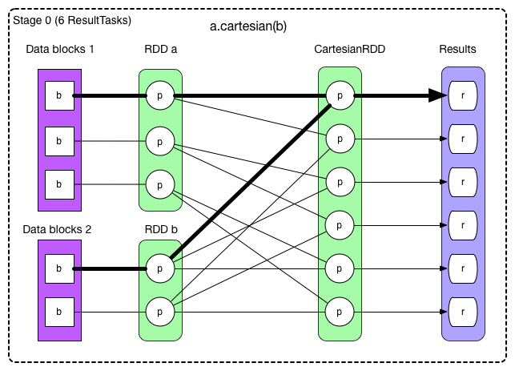
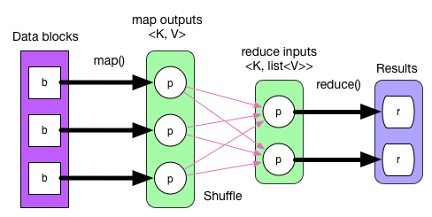

# Job 物理执行图

```scala
import org.apache.spark.SparkContext
import org.apache.spark.SparkContext._
import org.apache.spark.HashPartitioner

object complexJob {
  def main(args: Array[String]) {

    val sc = new SparkContext("local", "ComplexJob test")

    val data1 = Array[(Int, Char)](
      (1, 'a'), (2, 'b'),
      (3, 'c'), (4, 'd'),
      (5, 'e'), (3, 'f'),
      (2, 'g'), (1, 'h'))
    val rangePairs1 = sc.parallelize(data1, 3)

    val hashPairs1 = rangePairs1.partitionBy(new HashPartitioner(3))

    val data2 = Array[(Int, String)]((1, "A"), (2, "B"),
      (3, "C"), (4, "D"))

    val pairs2 = sc.parallelize(data2, 2)
    val rangePairs2 = pairs2.map(x => (x._1, x._2.charAt(0)))

    val data3 = Array[(Int, Char)]((1, 'X'), (2, 'Y'))
    val rangePairs3 = sc.parallelize(data3, 2)

    val rangePairs = rangePairs2.union(rangePairs3)

    val result = hashPairs1.join(rangePairs)

    result.foreachWith(i => i)((x, i) => println("[result " + i + "] " + x))

    println(result.toDebugString)
  }
}
```

给定 job 的逻辑执行图，如何生成物理执行图（也就是 stages 和 tasks）？

## 一个复杂 job 的逻辑执行图


给定这样一个复杂数据依赖图，如何合理划分 stage，并确定 task 的类型和个数？

一个直观想法是将前后关联的 RDDs 组成一个 stage，每个箭头生成一个 task。

对于两个 RDD 聚合成一个 RDD 的情况，这三个 RDD 组成一个 stage。这样虽然可以解决问题，但显然效率不高。除了效率问题，这个想法还有一个更严重的问题：大量中间数据需要存储。对于 task 来说，其执行结果要么要存到磁盘，要么存到内存，或者两者皆有。如果每个箭头都是 task 的话，每个 RDD 里面的数据都需要存起来，占用空间可想而知。

spark 是利用 pipeline 思想：数据用的时候再算，而且数据是流到要计算的位置的。

在 ShuffleDependency 处断开，就只剩 NarrowDependency，而 NarrowDependency chain 是可以进行 pipeline 的。按照此思想，上面 ComplexJob 的划分图如下：


所以划分算法就是：从后往前推算，遇到 ShuffleDependency 就断开，遇到 NarrowDependency 就将其加入该 stage。每个 stage 里面 task 的数目由该 stage 最后一个 RDD 中的 partition 个数决定。

粗箭头表示 task。因为是从后往前推算，因此最后一个 stage 的 id 是 0，stage 1 和 stage 2 都是 stage 0 的 parents。

如果 stage 最后要产生 result，那么该 stage 里面的 task 都是 ResultTask，否则都是 ShuffleMapTask。

之所以称为 ShuffleMapTask 是因为其计算结果需要 shuffle 到下一个 stage，本质上相当于 MapReduce 中的 mapper。ResultTask 相当于 MapReduce 中的 reducer（如果需要从 parent stage 那里 shuffle 数据），也相当于普通 mapper（如果该 stage 没有 parent stage）。

还有一个问题：**算法中提到 NarrowDependency chain 可以 pipeline，可是这里的 ComplexJob 只展示了 OneToOneDependency 和 RangeDependency 的 pipeline，普通 NarrowDependency 如何 pipeline？**


经过算法划分后结果如下：



图中粗箭头展示了第一个 ResultTask，其他的 task 依此类推。由于该 stage 的 task 直接输出 result，所以这个图包含 6 个 ResultTasks。

与 OneToOneDependency 不同的是这里每个 ResultTask 需要计算 3 个 RDD，读取两个 data block，而整个读取和计算这三个 RDD 的过程在一个 task 里面完成。

当计算 CartesianRDD 中的 partition 时，需要从两个 RDD 获取 records，由于都在一个 task 里面，不需要 shuffle。这个图说明：不管是 1:1 还是 N:1 的 NarrowDependency，只要是 NarrowDependency chain，就可以进行 pipeline，生成的 task 个数与该 stage 最后一个 RDD 的 partition 个数相同。

## 物理图的执行

生成了 stage 和 task 以后，下一个问题就是 task 如何执行来生成最后的 result？

回到 ComplexJob 的物理执行图，如果按照 MapReduce 的逻辑，从前到后执行，map() 产生中间数据 map outpus，经过 partition 后放到本地磁盘。再经过 shuffle-sort-aggregate 后生成 reduce inputs，最后 reduce() 执行得到 result。执行流程如下：



整个执行流程没有问题，但不能直接套用在 Spark 的物理执行图上，因为 MapReduce 的流程图简单、固定，而且没有 pipeline。

**回想 pipeline 的思想是 数据用的时候再算，而且数据是流到要计算的位置的。**

Result 产生的地方的就是要计算的位置，要确定 “需要计算的数据”，我们可以从后往前推，需要哪个 partition 就计算哪个 partition，如果 partition 里面没有数据，就继续向前推，形成 computing chain。这样推下去，结果就是：需要首先计算出每个 stage 最左边的 RDD 中的某些 partition。

对于没有 parent stage 的 stage，该 stage 最左边的 RDD 是可以立即计算的，而且每计算出一个 record 后便可以流入 f 或 g（见前面图中的 patterns）。

如果 f 中的 record 关系是 1:1 的，那么 f(record1) 计算结果可以立即顺着 computing chain 流入 g 中。如果 f 的 record 关系是 N:1，record1 进入 f() 后也可以被回收。

总结一下，computing chain 从后到前建立，而实际计算出的数据从前到后流动，而且计算出的第一个 record 流动到不能再流动后，再计算下一个 record。这样，虽然是要计算后续 RDD 的 partition 中的 records，但并不是要求当前 RDD 的 partition 中所有 records 计算得到后再整体向后流动。

对于有 parent stage 的 stage，先等着所有 parent stages 中 final RDD 中数据计算好，然后经过 shuffle 后，问题就又回到了计算 “没有 parent stage 的 stage”。

**总结一下：整个 computing chain 根据数据依赖关系自后向前建立，遇到 ShuffleDependency 后形成 stage。在每个 stage 中，每个 RDD 中的 compute() 调用 parentRDD.iter() 来将 parent RDDs 中的 records 一个个 fetch 过来。**

如果要自己设计一个 RDD，那么需要注意的是 compute() 只负责定义 parent RDDs => output records 的计算逻辑，具体依赖哪些 parent RDDs 由 getDependency() 定义，具体依赖 parent RDD 中的哪些 partitions 由 dependency.getParents() 定义。

例如，在 CartesianRDD 中:

```scala
 // RDD x = (RDD a).cartesian(RDD b)
 // 定义 RDD x 应该包含多少个 partition，每个 partition 是什么类型
 override def getPartitions: Array[Partition] = {
    // create the cross product split
    val array = new Array[Partition](rdd1.partitions.size * rdd2.partitions.size)
    for (s1 <- rdd1.partitions; s2 <- rdd2.partitions) {
      val idx = s1.index * numPartitionsInRdd2 + s2.index
      array(idx) = new CartesianPartition(idx, rdd1, rdd2, s1.index, s2.index)
    }
    array
  }

  // 定义 RDD x 中的每个 partition 怎么计算得到
  override def compute(split: Partition, context: TaskContext) = {
    val currSplit = split.asInstanceOf[CartesianPartition]
    // s1 表示 RDD x 中的 partition 依赖 RDD a 中的 partitions（这里只依赖一个）
    // s2 表示 RDD x 中的 partition 依赖 RDD b 中的 partitions（这里只依赖一个）
    for (x <- rdd1.iterator(currSplit.s1, context);
         y <- rdd2.iterator(currSplit.s2, context)) yield (x, y)
  }

  // 定义 RDD x 中的 partition i 依赖于哪些 RDD 中的哪些 partitions
  //
  // 这里 RDD x 依赖于 RDD a，同时依赖于 RDD b，都是 NarrowDependency
  // 对于第一个依赖，RDD x 中的 partition i 依赖于 RDD a 中的
  //    第 List(i / numPartitionsInRdd2) 个 partition
  // 对于第二个依赖，RDD x 中的 partition i 依赖于 RDD b 中的
  //    第 List(id % numPartitionsInRdd2) 个 partition
  override def getDependencies: Seq[Dependency[_]] = List(
    new NarrowDependency(rdd1) {
      def getParents(id: Int): Seq[Int] = List(id / numPartitionsInRdd2)
    },
    new NarrowDependency(rdd2) {
      def getParents(id: Int): Seq[Int] = List(id % numPartitionsInRdd2)
    }
  )
```


