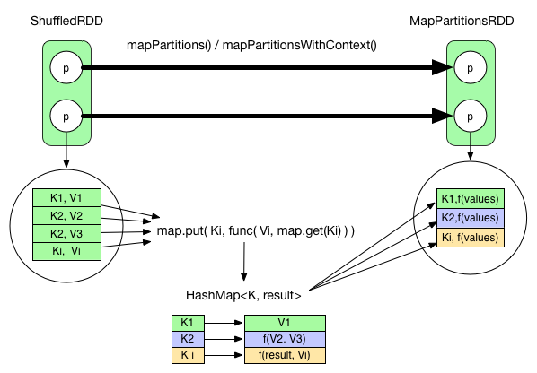
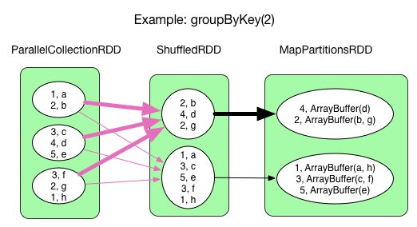
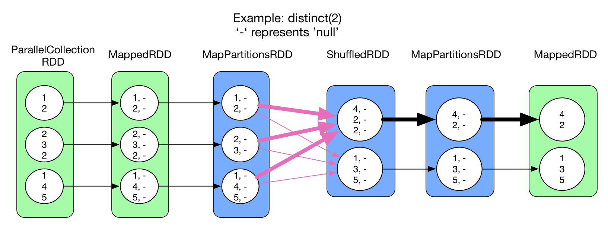
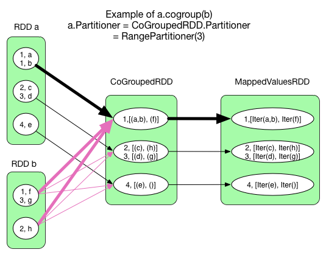
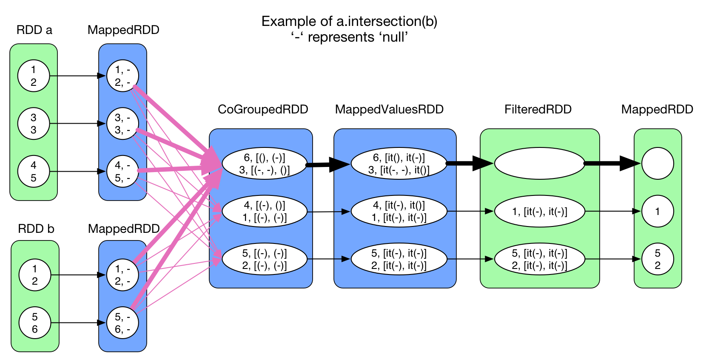
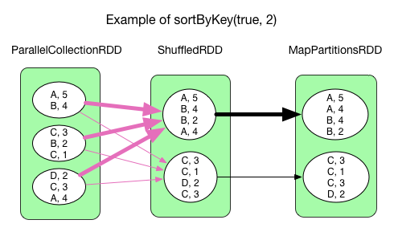
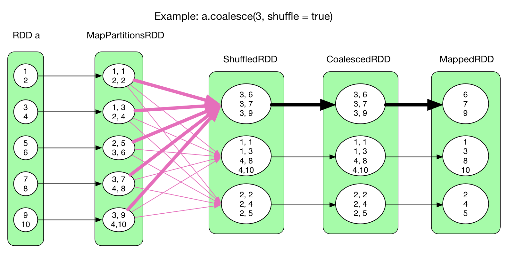

## shuffle

### 在什么时候 fetch？

**当 parent stage 的所有 ShuffleMapTasks 结束后再 fetch。**

理论上讲，一个 ShuffleMapTask 结束后就可以 fetch，但是为了迎合 stage 的概念（即一个 stage 如果其 parent stages 没有执行完，自己是不能被提交执行的），还是选择全部 ShuffleMapTasks 执行完再去 fetch。因为 fetch 来的 FileSegments 要先在内存做缓冲，所以一次 fetch 的 FileSegments 总大小不能太大。Spark 规定这个缓冲界限不能超过 spark.reducer.maxMbInFlight，这里用 softBuffer 表示，默认大小为 48MB。一个 softBuffer 里面一般包含多个 FileSegment，但如果某个 FileSegment 特别大的话，这一个就可以填满甚至超过 softBuffer 的界限。

### 边 fetch 边处理还是一次性 fetch 完再处理？

**边 fetch 边处理。**

本质上，MapReduce shuffle 阶段就是边 fetch 边使用 combine() 进行处理，只是 combine() 处理的是部分数据。MapReduce 为了让进入 reduce() 的 records 有序，必须等到全部数据都 shuffle-sort 后再开始 reduce()。

因为 Spark 不要求 shuffle 后的数据全局有序，因此没必要等到全部数据 shuffle 完成后再处理。

### 那么如何实现边 shuffle 边处理，而且流入的 records 是无序的？

答案是使用可以 aggregate 的数据结构，比如 HashMap。

每 shuffle 得到（从缓冲的 FileSegment 中 deserialize 出来）一个 record，直接将其放进 HashMap 里面。如果该 HashMap 已经存在相应的 Key，那么直接进行 aggregate 也就是 func(hashMap.get(Key), Value)，比如上面 WordCount 例子中的 func 就是 hashMap.get(Key) ＋ Value，并将 func 的结果重新 put(key) 到 HashMap 中去。

这个 func 功能上相当于 reduce()，但实际处理数据的方式与 MapReduce reduce() 有差别，差别相当于下面两段程序的差别。

```
  // MapReduce
  reduce(K key, Iterable<V> values) { 
      result = process(key, values)
      return result    
  }

  // Spark
  reduce(K key, Iterable<V> values) {
      result = null 
      for (V value : values) 
          result  = func(result, value)
      return result
  }
```

MapReduce 可以在 process 函数里面可以定义任何数据结构，也可以将部分或全部的 values 都 cache 后再进行处理，非常灵活。而 Spark 中的 func 的输入参数是固定的，一个是上一个 record 的处理结果，另一个是当前读入的 record，它们经过 func 处理后的结果被下一个 record 处理时使用。因此一些算法比如求平均数，在 process 里面很好实现，直接sum(values)/values.length，而在 Spark 中 func 可以实现sum(values)，但不好实现/values.length。更多的 func 将会在下面的章节细致分析。

### fetch 来的数据存放到哪里？

**刚 fetch 来的 FileSegment 存放在 softBuffer 缓冲区，经过处理后的数据放在内存 + 磁盘上。**

这里我们主要讨论处理后的数据，可以灵活设置这些数据是“只用内存”还是“内存＋磁盘”。

如果spark.shuffle.spill = false就只用内存。内存使用的是AppendOnlyMap ，类似 Java 的HashMap，内存＋磁盘使用的是ExternalAppendOnlyMap，如果内存空间不足时，ExternalAppendOnlyMap可以将 \ records 进行 sort 后 spill 到磁盘上，等到需要它们的时候再进行归并，后面会详解。

### 使用“内存＋磁盘”的一个主要问题就是如何在两者之间取得平衡？

在 Hadoop MapReduce 中，默认将 reducer 的 70% 的内存空间用于存放 shuffle 来的数据，等到这个空间利用率达到 66% 的时候就开始 merge-combine()-spill。

在 Spark 中，也适用同样的策略，一旦 ExternalAppendOnlyMap 达到一个阈值就开始 spill，具体细节下面会讨论。

### 怎么获得要 fetch 的数据的存放位置？

在上一章讨论物理执行图中的 stage 划分的时候，我们强调 “一个 ShuffleMapStage 形成后，会将该 stage 最后一个 final RDD 注册到MapOutputTrackerMaster.registerShuffle(shuffleId, rdd.partitions.size)，这一步很重要，因为 shuffle 过程需要 MapOutputTrackerMaster 来指示 ShuffleMapTask 输出数据的位置”。

因此，reducer 在 shuffle 的时候是要去 driver 里面的 MapOutputTrackerMaster 询问 ShuffleMapTask 输出的数据位置的。每个 ShuffleMapTask 完成时会将 FileSegment 的存储位置信息汇报给 MapOutputTrackerMaster。

## 典型 transformation() 的 shuffle read

### 1.reduceByKey(func)

上面初步介绍了 reduceByKey() 是如何实现边 fetch 边 reduce() 的。需要注意的是虽然 Example(WordCount) 中给出了各个 RDD 的内容，但一个 partition 里面的 records 并不是同时存在的。

比如在 ShuffledRDD 中，每 fetch 来一个 record 就立即进入了 func 进行处理。MapPartitionsRDD 中的数据是 func 在全部 records 上的处理结果。从 record 粒度上来看，reduce() 可以表示如下：

MapPartitionsRDD 中的数据是 func 在全部 records 上的处理结果。从 record 粒度上来看，reduce() 可以表示如下：



可以看到，fetch 来的 records 被逐个 aggreagte 到 HashMap 中，等到所有 records 都进入 HashMap，就得到最后的处理结果。唯一要求是 func 必须是 commulative 的（参见上面的 Spark 的 reduce() 的代码）。

ShuffledRDD 到 MapPartitionsRDD 使用的是 mapPartitionsWithContext 操作。

为了减少数据传输量，MapReduce 可以在 map 端先进行 combine()，其实在 Spark 也可以实现，只需要将上图 ShuffledRDD => MapPartitionsRDD 的 mapPartitionsWithContext 在 ShuffleMapStage 中也进行一次即可，比如 reduceByKey 例子中 ParallelCollectionRDD => MapPartitionsRDD 完成的就是 map 端的 combine()。

#### 对比 MapReduce 的 map()-reduce() 和 Spark 中的 reduceByKey()：

* map 端的区别：map() 没有区别。对于 combine()，MapReduce 先 sort 再 combine()，Spark 直接在 HashMap 上进行 combine()。
* reduce 端区别：MapReduce 的 shuffle 阶段先 fetch 数据，数据量到达一定规模后 combine()，再将剩余数据 merge-sort 后 reduce()，reduce() 非常灵活。Spark 边 fetch 边 reduce()（在 HashMap 上执行 func），因此要求 func 符合 commulative 的特性。

### 2.groupByKey(numPartitions)



与 reduceByKey() 流程一样，只是 func 变成 result = result ++ record.value，功能是将每个 key 对应的所有 values 链接在一起。

result 来自 hashMap.get(record.key)，计算后的 result 会再次被 put 到 hashMap 中。与 reduceByKey() 的区别就是 groupByKey() 没有 map 端的 combine()。对于 groupByKey() 来说 map 端的 combine() 只是减少了重复 Key 占用的空间，如果 key 重复率不高，没必要 combine()，否则，最好能够 combine()。

### 3.distinct(numPartitions)



与 reduceByKey() 流程一样，只是 func 变成 = result == null? record.value :，如果 HashMap 中没有该 record 就将其放入，否则舍弃。

与 reduceByKey() 相同，在map 端存在 combine()。

### 4. cogroup(otherRDD, numPartitions)



CoGroupedRDD 可能有 0 个、1 个或者多个 ShuffleDependency。但并不是要为每一个 ShuffleDependency 建立一个 HashMap，而是所有的 Dependency 共用一个 HashMap。与 reduceByKey() 不同的是，HashMap 在 CoGroupedRDD 的 compute() 中建立，而不是在 mapPartitionsWithContext() 中建立。

粗线表示的 task 首先 new 出一个 Array[ArrayBuffer(), ArrayBuffer()]，ArrayBuffer() 的个数与参与 cogroup 的 RDD 个数相同。

func 的逻辑是这样的：每当从 RDD a 中 shuffle 过来一个 \ record 就将其添加到 hashmap.get(Key) 对应的 Array 中的第一个 ArrayBuffer() 中，每当从 RDD b 中 shuffle 过来一个 record，就将其添加到对应的 Array 中的第二个 ArrayBuffer()。

CoGroupedRDD => MappedValuesRDD 对应 mapValues() 操作，就是将 [ArrayBuffer(), ArrayBuffer()] 变成 [Iterable[V], Iterable[W]]。

### 5. intersection(otherRDD) 和 join(otherRDD, numPartitions)



这两个操作中均使用了 cogroup，所以 shuffle 的处理方式与 cogroup 一样。

### 6. sortByKey(ascending, numPartitions)



sortByKey() 中 ShuffledRDD => MapPartitionsRDD 的处理逻辑与 reduceByKey() 不太一样，没有使用 HashMap 和 func 来处理 fetch 过来的 records。

sortByKey() 中 ShuffledRDD => MapPartitionsRDD 的处理逻辑是：将 shuffle 过来的一个个 record 存放到一个 Array 里，然后按照 Key 来对 Array 中的 records 进行 sort。

### 7. coalesce(numPartitions, shuffle = true)



coalesce() 虽然有 ShuffleDependency，但不需要对 shuffle 过来的 records 进行 aggregate，所以没有建立 HashMap。每 shuffle 一个 record，就直接流向 CoalescedRDD，进而流向 MappedRDD 中。

## 来源

[](https://www.kancloud.cn/kancloud/spark-internals/45244)