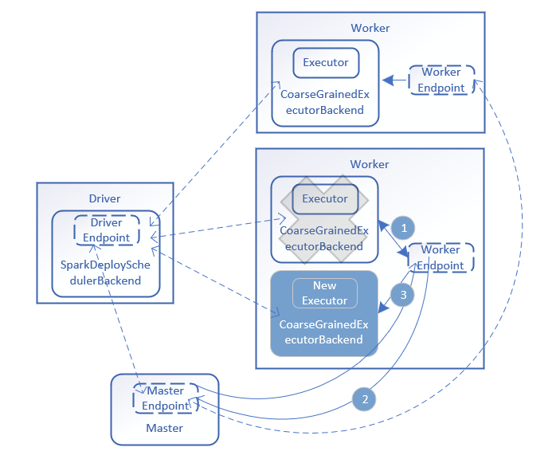

# 【Spark】Spark 容错及 HA--Executor 异常

Spark 支持多种运行模式，这些运行模式中的集群管理器会为任务分配运行资源，在运行资源中启动 Executor，由 Executor 负责执行任务的运行，最终把任务运行状态发送给 Driver。

以独立运行（standalone ）模式为例分析 Executor 出现异常的情况，其运行结构如下图所示，其中虚线为正常运行中进行消息通信线路，实现为异常处理步骤。



（1） 在 standalone 模式中，提交一个程序后，集群中的 Master 给应用程序分配运行资源，然后在Worker 中启动 ExecutorRunner，而 ExecutorRunner 根据当前的运行模式启动 CoarseGrainedExecutorBackend  进程，该进程启动后会向 Driver 发送  RegisterExecutor 注册信息，如果注册成功，则 CoarseGrainedExecutorBackend 在其内部启动 Executor。Executor 由 ExecutorRunner 进行管理，当 Executor 出现异常（如所运行容器 CoarseGrainedExecutorBackend 进程异常退出等）时，由ExecutorRunner 捕获该异常并发送 ExecutorStateChanged 消息给 Worker。

Worker # launchExecutor：

```scala
case LaunchExecutor(masterUrl, appId, execId, appDesc, cores_, memory_) =>
  	  ...
      val manager = new ExecutorRunner(
        appId,
        execId,
        appDesc.copy(command = Worker.maybeUpdateSSLSettings(appDesc.command, conf)),
        cores_,
        memory_,
        self,
        workerId,
        host,
        webUi.boundPort,
        publicAddress,
        sparkHome,
        executorDir,
        workerUri,
        conf,
        appLocalDirs, ExecutorState.RUNNING)
      executors(appId + "/" + execId) = manager
      manager.start()
      ...
```

ExecutorRunner # start：

```scala
private[worker] def start() {
  workerThread = new Thread("ExecutorRunner for " + fullId) {
    override def run() { fetchAndRunExecutor() }
  }
  workerThread.start()
  // Shutdown hook that kills actors on shutdown.
  shutdownHook = ShutdownHookManager.addShutdownHook { () =>
    // It's possible that we arrive here before calling `fetchAndRunExecutor`, then `state` will
    // be `ExecutorState.RUNNING`. In this case, we should set `state` to `FAILED`.
    if (state == ExecutorState.RUNNING) {
      state = ExecutorState.FAILED
    }
    killProcess(Some("Worker shutting down")) }
}
```

ExecutorRunner # fetchAndRunExecutor：

```scala
/**
 * Download and run the executor described in our ApplicationDescription
 */
private def fetchAndRunExecutor() {
  try {
    // Launch the process
    val builder = CommandUtils.buildProcessBuilder(appDesc.command, new SecurityManager(conf),
      memory, sparkHome.getAbsolutePath, substituteVariables)
    val command = builder.command()
    val formattedCommand = command.asScala.mkString("\"", "\" \"", "\"")
    logInfo(s"Launch command: $formattedCommand")

    builder.directory(executorDir)
    builder.environment.put("SPARK_EXECUTOR_DIRS", appLocalDirs.mkString(File.pathSeparator))
    // In case we are running this from within the Spark Shell, avoid creating a "scala"
    // parent process for the executor command
    builder.environment.put("SPARK_LAUNCH_WITH_SCALA", "0")

    // Add webUI log urls
    val baseUrl =
      if (conf.getBoolean("spark.ui.reverseProxy", false)) {
        s"/proxy/$workerId/logPage/?appId=$appId&executorId=$execId&logType="
      } else {
        s"http://$publicAddress:$webUiPort/logPage/?appId=$appId&executorId=$execId&logType="
      }
    builder.environment.put("SPARK_LOG_URL_STDERR", s"${baseUrl}stderr")
    builder.environment.put("SPARK_LOG_URL_STDOUT", s"${baseUrl}stdout")

    process = builder.start()
    val header = "Spark Executor Command: %s\n%s\n\n".format(
      formattedCommand, "=" * 40)

    // Redirect its stdout and stderr to files
    val stdout = new File(executorDir, "stdout")
    stdoutAppender = FileAppender(process.getInputStream, stdout, conf)

    val stderr = new File(executorDir, "stderr")
    Files.write(header, stderr, StandardCharsets.UTF_8)
    stderrAppender = FileAppender(process.getErrorStream, stderr, conf)

    // Wait for it to exit; executor may exit with code 0 (when driver instructs it to shutdown)
    // or with nonzero exit code
    val exitCode = process.waitFor()
    state = ExecutorState.EXITED
    val message = "Command exited with code " + exitCode
    worker.send(ExecutorStateChanged(appId, execId, state, Some(message), Some(exitCode)))
  } catch {
    case interrupted: InterruptedException =>
      logInfo("Runner thread for executor " + fullId + " interrupted")
      state = ExecutorState.KILLED
      killProcess(None)
    case e: Exception =>
      logError("Error running executor", e)
      state = ExecutorState.FAILED
      killProcess(Some(e.toString))
  }
}
```

出现异常，即来到 ExecutorRunner # killProcess：

```scala
/**
 * Kill executor process, wait for exit and notify worker to update resource status.
 *
 * @param message the exception message which caused the executor's death
 */
private def killProcess(message: Option[String]) {
  var exitCode: Option[Int] = None
  if (process != null) {
    logInfo("Killing process!")
    if (stdoutAppender != null) {
      stdoutAppender.stop()
    }
    if (stderrAppender != null) {
      stderrAppender.stop()
    }
    exitCode = Utils.terminateProcess(process, EXECUTOR_TERMINATE_TIMEOUT_MS)
    if (exitCode.isEmpty) {
      logWarning("Failed to terminate process: " + process +
        ". This process will likely be orphaned.")
    }
  }
  try {
    worker.send(ExecutorStateChanged(appId, execId, state, message, exitCode))
  } catch {
    case e: IllegalStateException => logWarning(e.getMessage(), e)
  }
}
```

（2）Worker 接收到 ExecutorStateChanged 消息时，在 Worker 的handleExecutorStateChanged 方法中，根据 Executor 状态进行信息更新，同时把Executor 状态信息转发给 Master。

Worker # receive：

```scala
case executorStateChanged @ ExecutorStateChanged(appId, execId, state, message, exitStatus) =>
  handleExecutorStateChanged(executorStateChanged)
```

Worker # handleExecutorStateChanged：

```scala
private[worker] def handleExecutorStateChanged(executorStateChanged: ExecutorStateChanged):
  Unit = {
  sendToMaster(executorStateChanged)
  val state = executorStateChanged.state
  if (ExecutorState.isFinished(state)) {
    val appId = executorStateChanged.appId
    val fullId = appId + "/" + executorStateChanged.execId
    val message = executorStateChanged.message
    val exitStatus = executorStateChanged.exitStatus
    executors.get(fullId) match {
      case Some(executor) =>
        logInfo("Executor " + fullId + " finished with state " + state +
          message.map(" message " + _).getOrElse("") +
          exitStatus.map(" exitStatus " + _).getOrElse(""))
        executors -= fullId
        finishedExecutors(fullId) = executor
        trimFinishedExecutorsIfNecessary()
        coresUsed -= executor.cores
        memoryUsed -= executor.memory
      case None =>
        logInfo("Unknown Executor " + fullId + " finished with state " + state +
          message.map(" message " + _).getOrElse("") +
          exitStatus.map(" exitStatus " + _).getOrElse(""))
    }
    maybeCleanupApplication(appId)
  }
}
```

Worker # sendToMaster：

```scala
/**
 * Send a message to the current master. If we have not yet registered successfully with any
 * master, the message will be dropped.
 */
private def sendToMaster(message: Any): Unit = {
  master match {
    case Some(masterRef) => masterRef.send(message)
    case None =>
      logWarning(
        s"Dropping $message because the connection to master has not yet been established")
  }
}
```

（3）Master 接收到 Executor 状态变化消息后，如果发现 Executor 出现异常退出，则调用 Master.schedule 方法，尝试获取可用的 Worker 节点并启动 Executor，而这个 Worker 很可能不是失败之前运行 Executor 的 Worker 节点。该尝试系统会进行 10 次，如果超过 10 次，则标记该应用运行失败并在集群中移除该应用。这种限定失败次数是为了避免提交的应用程序存在Bug而反复提交，进而一直挤占集群的资源。

Master # receive：

```scala
case ExecutorStateChanged(appId, execId, state, message, exitStatus) =>
  val execOption = idToApp.get(appId).flatMap(app => app.executors.get(execId))
  execOption match {
    case Some(exec) =>
      val appInfo = idToApp(appId)
      val oldState = exec.state
      exec.state = state

      if (state == ExecutorState.RUNNING) {
        assert(oldState == ExecutorState.LAUNCHING,
          s"executor $execId state transfer from $oldState to RUNNING is illegal")
        appInfo.resetRetryCount()
      }

      exec.application.driver.send(ExecutorUpdated(execId, state, message, exitStatus, false))

      if (ExecutorState.isFinished(state)) {
        // Remove this executor from the worker and app
        logInfo(s"Removing executor ${exec.fullId} because it is $state")
        // If an application has already finished, preserve its
        // state to display its information properly on the UI
        if (!appInfo.isFinished) {
          appInfo.removeExecutor(exec)
        }
        exec.worker.removeExecutor(exec)

        val normalExit = exitStatus == Some(0)
        // Only retry certain number of times so we don't go into an infinite loop.
        // Important note: this code path is not exercised by tests, so be very careful when
        // changing this `if` condition.
        if (!normalExit
            && appInfo.incrementRetryCount() >= MAX_EXECUTOR_RETRIES
            && MAX_EXECUTOR_RETRIES >= 0) { // < 0 disables this application-killing path
          val execs = appInfo.executors.values
          if (!execs.exists(_.state == ExecutorState.RUNNING)) {
            logError(s"Application ${appInfo.desc.name} with ID ${appInfo.id} failed " +
              s"${appInfo.retryCount} times; removing it")
            removeApplication(appInfo, ApplicationState.FAILED)
          }
        }
      }
      schedule()
    case None =>
      logWarning(s"Got status update for unknown executor $appId/$execId")
  }
```