# 【Spark】Spark 调优-数据倾斜

[TOC]

## 一、数据准备

通过 shell 脚本生成大量数据：

```shell
rm -rf ./data.txt
touch data.txt

for((i=0;i<1050000000;i++))
  do
    str=',name';
    name=${i}${str}${i}
    #echo $name  
    echo  $name>> data.txt
  done

echo 'end'
```

导入 hive 中：

```sql
create table student_external(id int,name string) row format delimited fields terminated by ',';  

LOAD DATA LOCAL INPATH '/home/hadoop/data.txt' OVERWRITE INTO TABLE student_external;
```

## 二、调整并行度分散同一个 Task 的不同 Key

### 2.1、原理

Spark在做 Shuffle 时，默认使用 HashPartitioner（非 Hash Shuffle）对数据进行分区。如果并行度设置的不合适，可能造成大量不相同的 Key 对应的数据被分配到了同一个 Task 上，造成该 Task 所处理的数据远大于其它 Task，从而造成数据倾斜。 

如果调整 Shuffle 时的并行度，使得原本被分配到同一 Task 的不同 Key 发配到不同 Task 上处理，则可降低原 Task 所需处理的数据量，从而缓解数据倾斜问题造成的短板效应。 


### 2.2、case

现有一张测试表，名为 test，内有10.5 亿条数据，每条数据有一个唯一的 id 值。现从中取出 id 取值为 9 亿到 10.5 亿的共 1.5 亿条数据，并通过一些处理，使得 id 为 9 亿到 9.4 亿间的所有数据对 12 取模后余数为 8（即在 Shuffle 并行度为 12 时该数据集全部被 HashPartition 分配到第 8 个 Task），其它数据集对其 id 除以 100取整，从而使得 id 大于 9.4 亿的数据在 Shuffle 时可被均匀分配到所有 Task 中，而 id 小于 9.4 亿的数据全部分配到同一个 Task 中。处理过程如下 :

```sql
INSERT OVERWRITE TABLE test
SELECT CASE WHEN id < 940000000 THEN (9500000  + (CAST (RAND() * 8 AS INTEGER)) * 12 )
       ELSE CAST(id/100 AS INTEGER)
       END,
       name
FROM student_external
WHERE id BETWEEN 900000000 AND 1050000000;
```

通过上述处理，一份可能造成后续数据倾斜的测试数据即以准备好。接下来，使用Spark 读取该测试数据，并通过`groupByKey(12)`对 id 分组处理，且 Shuffle 并行度为 12。代码如下：

```scala
object SparkDataSkew {

  def main(args: Array[String]): Unit = {
    val spark = SparkSession.builder()
      //.master("local[20]")
      .appName("SparkDataSkewTunning")
      .config("hive.metastore.uris", "thrift://ds072:9083")
      //.config("spark.sql.shuffle.partitions", 12)
      .enableHiveSupport()
      .getOrCreate()

    spark.sql("use wqf")

    //import spark.implicits._
    val df = spark.sql("select * from test")
   df.rdd
      .map(row => (row.getInt(0), row.getString(1)))
      .groupByKey(12)
      .map(tuple => {
        val id = tuple._1
        val counter = new AtomicInteger(0)
        tuple._2.foreach(name => counter.incrementAndGet())
        (id, counter.get())
      })
      .count()

    spark.stop()
    spark.close()
  }

}
```

提交到 spark 集群运行：

```shell
spark-submit --master yarn \
--deploy-mode client \
--class me.w1992wishes.spark.tunning.SparkDataSkew \
--num-executors 12 \
--executor-cores 4 \
--executor-memory 8g \
spark-tuning.jar
```

如图可以看出明显的数据倾斜：

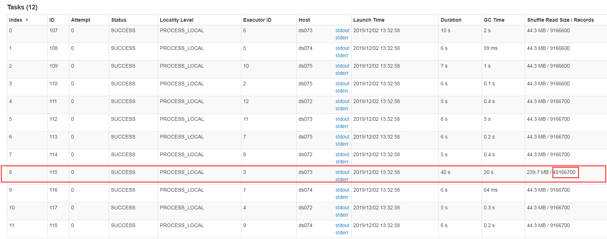

在这种情况下，可以通过调整 Shuffle 并行度，使得原来被分配到同一个 Task（即该例中的 Task 8）的不同 Key 分配到不同 Task，从而降低 Task 8 所需处理的数据量，缓解数据倾斜。

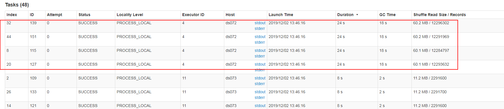

### 2.3、总结

**适用场景**
大量不同的 Key 被分配到了相同的 Task 造成该 Task 数据量过大。

**解决方案**
调整并行度。一般是增大并行度，但有时如本例减小并行度也可达到效果。

**优势**
实现简单，可在需要 Shuffle 的操作算子上直接设置并行度或者使用`spark.default.parallelism`设置。如果是Spark SQL，还可通过`SET spark.sql.shuffle.partitions=[num_tasks]`设置并行度。可用最小的代价解决问题。一般如果出现数据倾斜，都可以通过这种方法先试验几次，如果问题未解决，再尝试其它方法。

**劣势**
适用场景少，只能将分配到同一 Task 的不同 Key 分散开，但对于同一 Key 倾斜严重的情况该方法并不适用。并且该方法一般只能缓解数据倾斜，没有彻底消除问题。从实践经验来看，其效果一般。

## 三、自定义 Partitioner

### 3.1、原理

使用自定义的 Partitioner（默认为HashPartitioner），将原本被分配到同一个 Task 的不同 Key 分配到不同 Task。

### 3.2、case

以上述数据集为例，继续将并发度设置为12，但是在`groupByKey`算子上，使用自定义的`Partitioner`:

```scala
  class CustomPartitioner extends Partitioner {
    override def numPartitions: Int = 12

    override def getPartition(key: Any): Int = {
      val id = Integer.parseInt(key.toString)
      if (id >= 9500000 && id <= 9500084 && ((id - 9500000) % 12) == 0) {
        (id - 9500000) / 12
      } else {
        id % 12
      }
    }
  }
```

运行结果如下：

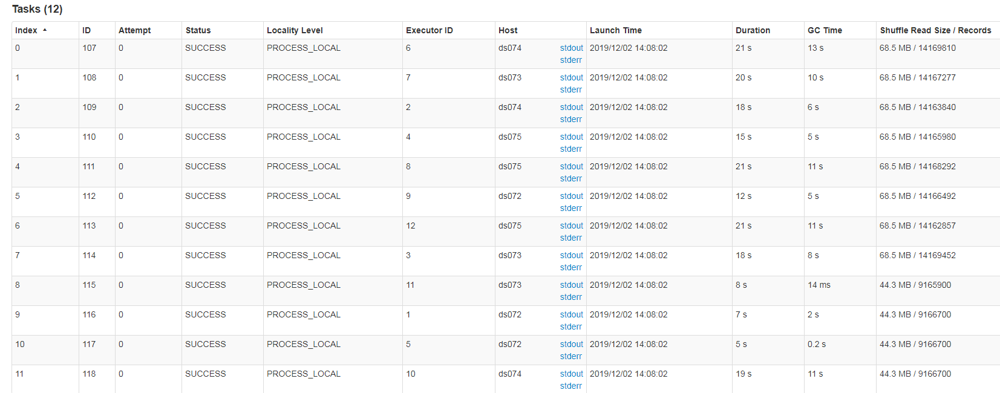

### 3.3、总结

**适用场景**
大量不同的 Key 被分配到了相同的 Task 造成该 Task 数据量过大。

**解决方案**
使用自定义的 Partitioner 实现类代替默认的 HashPartitioner，尽量将所有不同的 Key 均匀分配到不同的 Task 中。

**优势**
不影响原有的并行度设计。如果改变并行度，后续 Stage 的并行度也会默认改变，可能会影响后续 Stage。

**劣势**
适用场景有限，只能将不同 Key 分散开，对于同一 Key 对应数据集非常大的场景不适用。效果与调整并行度类似，只能缓解数据倾斜而不能完全消除数据倾斜。而且需要根据数据特点自定义专用的 Partitioner，不够灵活。

## 四、将 Reduce side Join 转变为 Map side Join

### 4.1、原理

通过 Spark 的 Broadcast 机制，将 Reduce 侧 Join 转化为 Map 侧 Join，避免 Shuffle 从而完全消除 Shuffle 带来的数据倾斜。

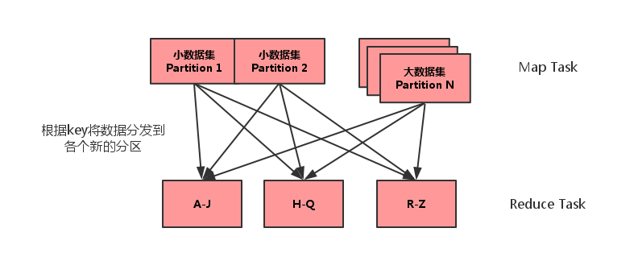

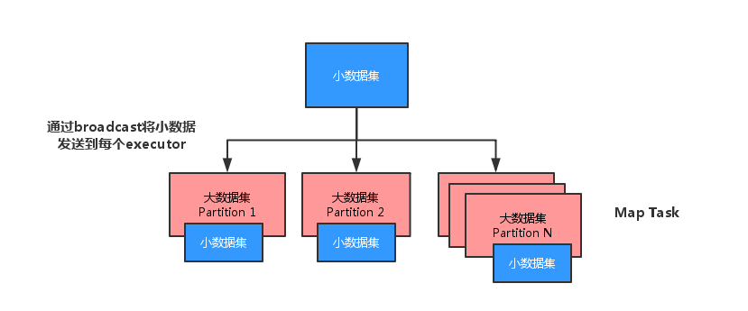

### 4.2、case

通过如下 SQL 创建一张具有倾斜 Key 且总记录数为 1.5 亿的大表 test。

```sql
INSERT OVERWRITE TABLE test
SELECT CAST(CASE WHEN id < 980000000 THEN (95000000  + (CAST (RAND() * 4 AS INT) + 1) * 48 )
       ELSE CAST(id/10 AS INT) END AS STRING),
       name
FROM student_external
WHERE id BETWEEN 900000000 AND 1050000000;
```

使用如下 SQ L创建一张数据分布均匀且总记录数为 50 万的小表 test_new。

```sql
INSERT OVERWRITE TABLE test_new
SELECT CAST(CAST(id/10 AS INT) AS STRING),
       name
FROM student_external
WHERE id BETWEEN 950000000 AND 950500000;
```

启动 SparkSQL ThriftServer，提供 JDBC/ODBC 连接（服务运行方式是一个 Spark的应用程序，只是这个应用程序支持 JDBC/ODBC 的连接）：

```shell
start-thriftserver.sh \
--hiveconf hive.exec.mode.local.auto=true \
--hiveconf hive.auto.convert.join=true \
--hiveconf hive.mapjoin.smalltable.filesize=50000000 \
--name thriftserver \
--master yarn-client \
--driver-cores 5   \
--driver-memory 5G  \
--conf spark.serializer=org.apache.spark.serializer.KryoSerializer \
--conf spark.scheduler.mode=FAIR \
--conf spark.kryoserializer.buffer.max.mb=1024 \
--conf spark.storage.memoryFraction=0.2
```

然后启动 $SPARK_HOME/bin/beeline：

```shell
$SPARK_HOME/bin/beeline -u jdbc:hive2://ds072:10000 -n hadoop
```

接着直接通过 Spark Thrift Server 提交如下 SQL 将表 test 与表 test_new 进行 Join，并将 Join 结果存于表 test_join 中。

```sql
INSERT OVERWRITE TABLE test_join
SELECT test_new.id, test_new.name
FROM test
JOIN test_new
ON test.id = test_new.id;
```

该 SQL 对应的 DAG 如下图所示。从该图可见，该执行过程总共分为三个 Stage，前两个用于从 Hive 中读取数据，同时二者进行 Shuffle，通过最后一个 Stage 进行 Join 并将结果写入表 test_join 中。

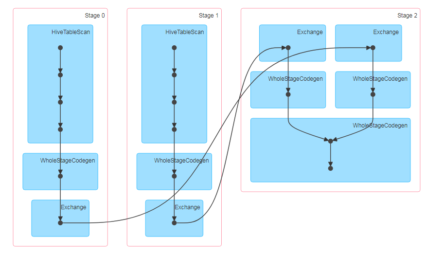

从下图可见，Join Stage 各 Task 处理的数据倾斜严重：

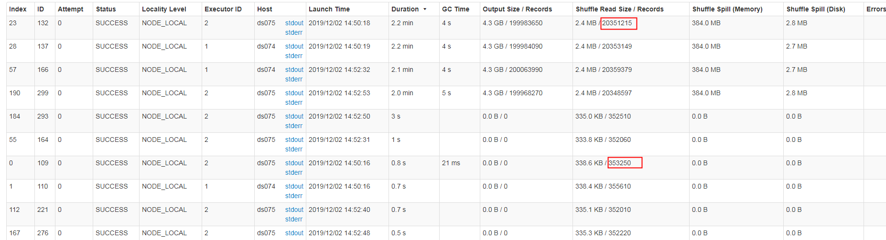

接下来，尝试通过 Broadcast 实现 Map 侧 Join。实现 Map 侧 Join 的方法，并非直接通过`CACHE TABLE test_new`将小表 test_new进 行 cache。现通过如下 SQL 进行 Join。

```sql
CACHE TABLE test_new;
INSERT OVERWRITE TABLE test_join
SELECT test_new.id, test_new.name
FROM test
JOIN test_new
ON test.id = test_new.id;
```

通过如下 DAG 图可见，该操作仍分为三个 Stage，且仍然有 Shuffle 存在，唯一不同的是，小表的读取不再直接扫描 Hive 表，而是扫描内存中缓存的表。

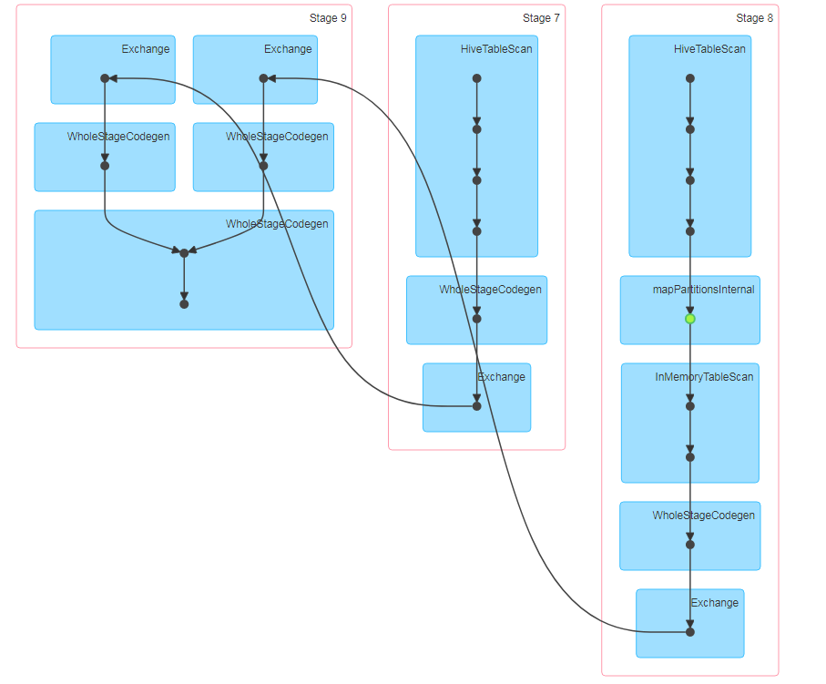

并且数据倾斜仍然存在。

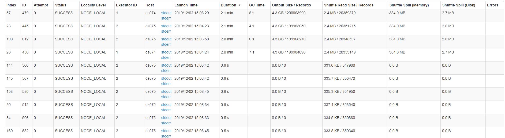

正确的使用 Broadcast 实现 Map 侧 Join 的方式是，通过 `SET spark.sql.autoBroadcastJoinThreshold=104857600` 将 Broadcast 的阈值设置得足够大。

再次通过如下 SQL 进行 Join。

```sql
SET spark.sql.autoBroadcastJoinThreshold=104857600;
INSERT OVERWRITE TABLE test_join
SELECT test_new.id, test_new.name
FROM test
JOIN test_new
ON test.id = test_new.id;
```

通过如下 DAG 图可见，该方案消除了 shuffle。

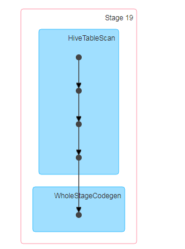

各 task 数据量由读取时界定，不会存在因 shuffle 引起数据倾斜问题。

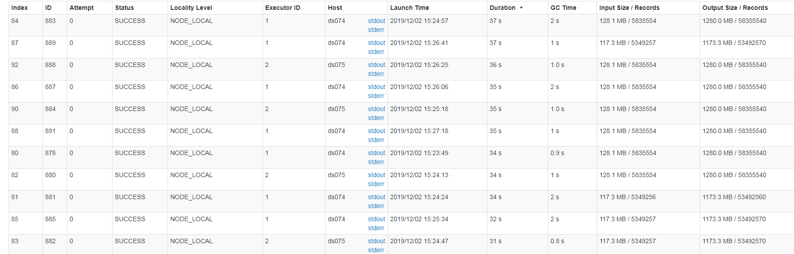

在代码中可通过如下方式进行广播：

```scala
import org.apache.spark.sql.functions.broadcast
broadcast(spark.table("src")).join(spark.table("records"), "key").show()
```

或者：

```scala
bigTable.join(org.apache.spark.sql.functions.broadcast(smallTable), Seq("key"), "left")
```

### 4.3、总结

**适用场景**
参与 Join 的一边数据集足够小，可被加载进 Driver 并通过 Broadcast 方法广播到各个 Executor 中。

**解决方案**
在 Java/Scala 代码中将小数据集数据拉取到 Driver，然后通过 Broadcast 方案将小数据集的数据广播到各 Executor。或者在使用 SQL 前，将 Broadcast 的阈值调整得足够大，从而使用 Broadcast 生效。进而将 Reduce 侧 Join 替换为 Map 侧 Join。

**优势**
避免了 Shuffle，彻底消除了数据倾斜产生的条件，可极大提升性能。

**劣势**
要求参与 Join 的一侧数据集足够小，并且主要适用于 Join 的场景，不适合聚合的场景，适用条件有限。

## 五、为 skew 的 key 增加随机前/后缀

### 5.1、原理

为数据量特别大的 Key 增加随机前/后缀，使得原来 Key 相同的数据变为 Key 不相同的数据，从而使倾斜的数据集分散到不同的 Task 中，彻底解决数据倾斜问题。 Join 另一则的数据中，与倾斜 Key 对应的部分数据，与随机前缀集作笛卡尔乘积，从而保证无论数据倾斜侧倾斜 Key 如何加前缀，都能与之正常 Join。

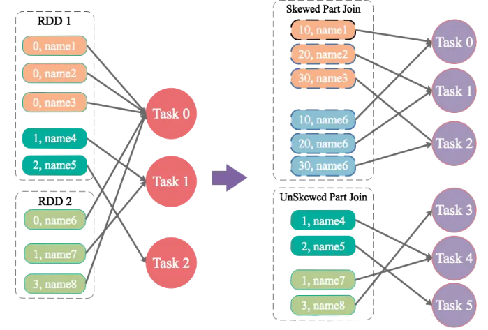

### 5.2、case

通过如下 SQL，将 id 为 9 亿到 9.08 亿共 800 万条数据的 id 转为 9500048 或者 9500096，其它数据的 id 除以 100 取整。从而该数据集中，id 为 9500048 和 9500096 的数据各 400 万，其它 id 对应的数据记录数均为 100 条。这些数据存于名为 test 的表中。

```sql
INSERT OVERWRITE TABLE test
SELECT CAST(CASE WHEN id < 908000000 THEN (9500000  + (CAST (RAND() * 2 AS INT) + 1) * 48 )
  ELSE CAST(id/100 AS INT) END AS STRING),
  name
FROM student_external
WHERE id BETWEEN 900000000 AND 1050000000;
```

对于另外一张小表 test_new，取出 50 万条数据，并将 id（递增且唯一）除以 100取整，使得所有 id 都对应 100 条数据。

```sql
INSERT OVERWRITE TABLE test_new
SELECT CAST(CAST(id/100 AS INT) AS STRING),
  name
FROM student_external
WHERE id BETWEEN 950000000 AND 950500000;
```

通过如下代码，读取 test 表对应的文件夹内的数据并转换为 RDD 存于leftRDD 中，同样读取 test 表对应的数据存于 rightRDD 中。通过 RDD 的 join 算子对 leftRDD 与 rightRDD 进行 Join，并指定并行度为 48。

```scala
object SparkDataSkewNoRandomPrefix {

  def main(args: Array[String]): Unit = {

    var parallelism = 48

    if (args.length > 0) {
      parallelism = args(0).toInt
    }

    val spark = SparkSession.builder()
      //.master("local[20]")
      .appName("SparkDataSkewNoRandomPrefix")
      .config("spark.sql.shuffle.partitions", parallelism)
      .config("spark.sql.crossJoin.enabled", value = true)
      .config("spark.default.parallelism", parallelism)
      //.enableHiveSupport()
      .getOrCreate()

    import spark.implicits._

    val leftRDD = spark.read.text("hdfs://myha01/user/hive/warehouse/wqf.db/test/")
      .map(row => {
        def foo(row: String): (String, String) = {
          val str = row.split(",")
          (str(0), str(1))
        }

        foo(row.getString(0))
      })
      .toDF("id", "name")

    val rightRDD = spark.read.text("hdfs://myha01/user/hive/warehouse/wqf.db/test_new/")
      .map(row => {
        def foo(row: String) = {
          val str = row.split(",")
          (str(0), str(1))
        }

        foo(row.getString(0))
      })
      .toDF("id", "name1")

    leftRDD
      .join(rightRDD, "id")
      .foreachPartition((iterator: Iterator[Row]) => {
        val atomicInteger = new AtomicInteger()
        iterator.foreach(_ => atomicInteger.incrementAndGet())
        println(atomicInteger.get())
      })

    spark.stop()
    spark.close()
  }
}
```

整个过程耗费 3.4min，其中 join stage 耗费 3.1 min。

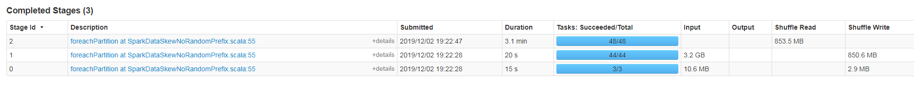

查看 task 可知，有两个 task 明显出现数据倾斜：

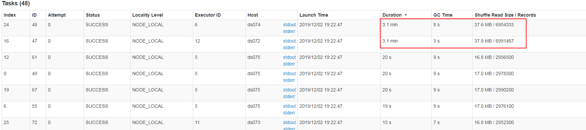

现通过如下操作，实现倾斜 Key 的分散处理：

- 将 leftRDD 中倾斜的 key（即 9500048 与 9500096）对应的数据单独过滤出来，且加上 1 到 24 的随机前缀，并将前缀与原数据用逗号分隔（以方便之后去掉前缀）形成单独的 leftSkewRDD
- 将 rightRDD 中倾斜 key 对应的数据抽取出来，并通过 flatMap 操作将该数据集中每条数据均转换为 24 条数据（每条分别加上 1 到 24 的随机前缀），形成单独的 rightSkewRDD
- 将 leftSkewRDD 与 rightSkewRDD 进行 Join，并将并行度设置为 48，且在 Join 过程中将随机前缀去掉，得到倾斜数据集的 Join 结果 skewedJoinRDD
- 将 leftRDD 中不包含倾斜 Key 的数据抽取出来作为单独的 leftUnSkewRDD
- 对 leftUnSkewRDD 与原始的 rightRDD 进行 Join，并行度也设置为 48，得到 Join 结果 unskewedJoinRDD
- 通过 union 算子将 skewedJoinRDD 与 unskewedJoinRDD 进行合并，从而得到完整的 Join 结果集

代码如下：

```scala
object SparkDataSkewWithRandomPrefix {

  def main(args: Array[String]): Unit = {

    var parallelism = 48

    if (args.length > 0) {
      parallelism = args(0).toInt
    }

    val spark = SparkSession.builder()
      //.master("local[20]")
      .appName("SparkDataSkewNoRandomPrefix")
      .config("spark.sql.shuffle.partitions", parallelism)
      .config("spark.sql.crossJoin.enabled", value = true)
      //.enableHiveSupport()
      .getOrCreate()

    import spark.implicits._

    val leftRDD = spark.read.text("hdfs://myha01/user/hive/warehouse/wqf.db/test/")
      .map(row => {
        def foo(row: String): (String, String) = {
          val str = row.split(",")
          (str(0), str(1))
        }

        foo(row.getString(0))
      })
      .toDF("id", "name1")

    val rightRDD = spark.read.text("hdfs://myha01/user/hive/warehouse/wqf.db/test_new/")
      .map(row => {
        def foo(row: String) = {
          val str = row.split(",")
          (str(0), str(1))
        }

        foo(row.getString(0))
      })
      .toDF("id", "name2")

    val skewedKeyArray = Array[String]("9500048", "9500096")
    val skewedKeySet = mutable.Set[String]()
    val addList = new ArrayBuffer[String]

    Range(0, 24).map(
      i => addList += i.toString
    )

    for (key <- skewedKeyArray) {
      skewedKeySet.add(key)
    }

    val skewedKeys = spark.sparkContext.broadcast(skewedKeySet)
    val addListKeys = spark.sparkContext.broadcast(addList)

    import spark.implicits._
    // 倾斜的 key 单独找出
    val leftSkewRDD = leftRDD
      .filter(row => skewedKeys.value.contains(row.getString(0)))
      .map(row => (s"${(new Random().nextInt(24) + 1).toString},${row.getString(0)}", row.getString(1))) // 映射为随机 24 个前缀
      .toDF("id", "name3")

    // 连接的 key 加上相同的前缀，相当于扩大 N 倍
    val rightSkewRDD = rightRDD
      .filter(row => skewedKeys.value.contains(row.getString(0)))
      .map(row => addListKeys.value.map(i => (s"$i,${row.getString(0)}", row.getString(1))).toArray)
      .flatMap(records => {
        for (record <- records) yield record
      })
      .toDF("id", "name4")

    // 倾斜的 key 做连接
    val skewedJoinRDD = leftSkewRDD.join(rightSkewRDD, "id")
      .map(row => (row.getString(0).split(",")(1), row.getString(2))) // 还原 key

    val leftUnSkewRDD = leftRDD
      .filter(row => !skewedKeys.value.contains(row.getString(0)))
      .toDF("id", "mame5")

    val unskewedJoinRDD = leftUnSkewRDD.join(rightRDD, "id")
      .map(row => (row.getString(0), row.getString(1)))

    skewedJoinRDD.union(unskewedJoinRDD)
      .toDF()
      .foreachPartition((iterator: Iterator[Row]) => {
        val atomicInteger = new AtomicInteger()
        iterator.foreach(_ => atomicInteger.incrementAndGet())
        println(atomicInteger.get())
      })

    spark.stop()
    spark.close()
  }


}
```

从下图可看出，整个 Join 耗时 1.3 m，其中 Join Stage 耗时 57 s：


通过分析 Join Stage 的所有 Task 可知：

- 由于 Join 分倾斜数据集 Join 和非倾斜数据集 Join，而各 Join 的并行度均为 48，故总的并行度为 96
- 可用 Core 数为48，所以前 48 个 Task 同时启动（其 Launch 时间相同），后 48 个 Task 的启动时间各不相同（等待前面的 Task 结束才开始）
- 由于倾斜 Key 被加上随机前缀，原本相同的 Key 变为不同的 Key，被分散到不同的 Task 处理，故在所有 Task 中，未发现所处理数据集明显高于其它 Task 的情况

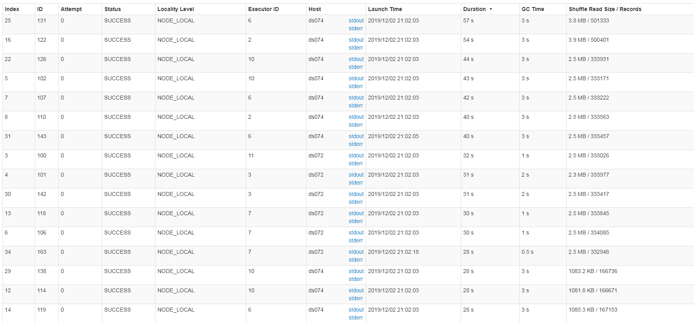

实际上，由于倾斜 Key 与非倾斜 Key 的操作完全独立，可并行进行。而本实验可用总核数为 48，可同时运行的总 Task 数为48，故而该方案只是将总耗时减少一半（效率提升一倍）。如果资源充足，可并发执行 Task 数增多，该方案的优势将更为明显。在实际项目中，该方案往往可提升数倍至 10 倍的效率。

### 5.3、总结

**适用场景**
两张表都比较大，无法使用 Map 侧 Join。其中一个 RDD 有少数几个 Key 的数据量过大，另外一个 RDD 的 Key 分布较为均匀。

**解决方案**
将有数据倾斜的 RDD 中倾斜 Key 对应的数据集单独抽取出来加上随机前缀，另外一个 RDD 每条数据分别与随机前缀结合形成新的 RDD（相当于将其数据增到到原来的 N 倍，N 即为随机前缀的总个数），然后将二者 Join 并去掉前缀。然后将不包含倾斜 Key 的剩余数据进行 Join。最后将两次 Join 的结果集通过 union 合并，即可得到全部 Join 结果。

**优势**
相对于 Map 侧 Join，更能适应大数据集的 Join。如果资源充足，倾斜部分数据集与非倾斜部分数据集可并行进行，效率提升明显。且只针对倾斜部分的数据做数据扩展，增加的资源消耗有限。

**劣势**
如果倾斜 Key 非常多，则另一侧数据膨胀非常大，此方案不适用。而且此时对倾斜Key 与非倾斜 Key 分开处理，需要扫描数据集两遍，增加了开销。

## 六、大表随机添加 N 种随机前缀，小表扩大 N 倍

### 6.1、原理

如果出现数据倾斜的 Key 比较多，上一种方法将这些大量的倾斜 Key 分拆出来，意义不大。此时更适合直接对存在数据倾斜的数据集全部加上随机前缀，然后对另外一个不存在严重数据倾斜的数据集整体与随机前缀集作笛卡尔乘积（即将数据量扩大N倍）。

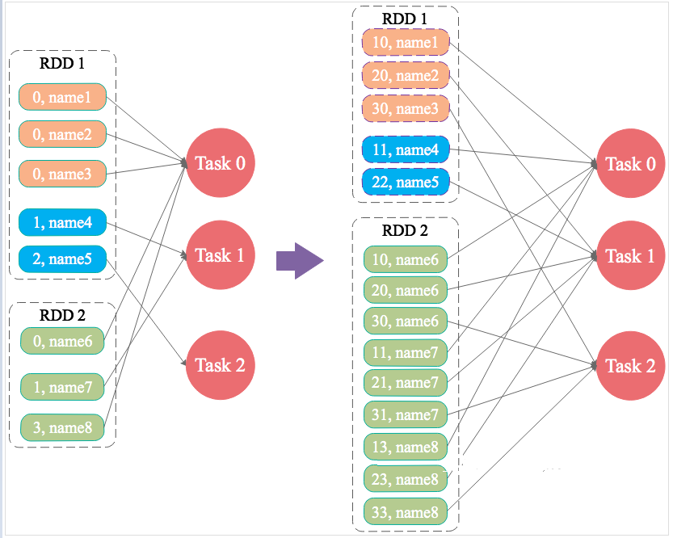

### 6.2、case

```scala
object SparkDataSkewWithRandomPrefix1 {

  def main(args: Array[String]): Unit = {

    var parallelism = 48

    if (args.length > 0) {
      parallelism = args(0).toInt
    }

    val spark = SparkSession.builder()
      //.master("local[20]")
      .appName("SparkDataSkewWithRandomPrefix1")
      .config("spark.sql.shuffle.partitions", parallelism)
      .config("spark.sql.crossJoin.enabled", value = true)
      //.enableHiveSupport()
      .getOrCreate()

    import spark.implicits._

    val leftRDD = spark.read.text("hdfs://myha01/user/hive/warehouse/wqf.db/test/")
      .map(row => {
        def foo(row: String): (String, String) = {
          val str = row.split(",")
          (str(0), str(1))
        }

        foo(row.getString(0))
      })
      .toDF("id", "name1")

    val rightRDD = spark.read.text("hdfs://myha01/user/hive/warehouse/wqf.db/test_new/")
      .map(row => {
        def foo(row: String) = {
          val str = row.split(",")
          (str(0), str(1))
        }

        foo(row.getString(0))
      })
      .toDF("id", "name2")

    val addList = new ArrayBuffer[String]

    // 1 - 48 的随机数
    Range(1, 49).map(
      i => addList += i.toString
    )

    // 广播随机前缀
    val addListKeys = spark.sparkContext.broadcast(addList)

    // 大表增加随机前缀
    val leftRandomRDD = leftRDD
      .map(row => (s"${(new Random().nextInt(48) + 1).toString},${row.getString(0)}", row.getString(1)))

    // 小表扩大 N 倍， 每个增加1 to 48 的前缀
    val rightNewRDD = rightRDD
      .map(row => addListKeys.value.map(i => (s"$i,${row.getString(0)}", row.getString(1))).toArray)
      .flatMap(records => {
        for (record <- records) yield record
      })
      .toDF("id", "name4")

    val joinRDD = leftRandomRDD.join(rightNewRDD, "id")
      .map(row => (row.getString(0).split(",")(1), row.getString(2))) // 还原 key

    joinRDD.toDF()
      .foreachPartition((iterator: Iterator[Row]) => {
        val atomicInteger = new AtomicInteger()
        iterator.foreach(_ => atomicInteger.incrementAndGet())
        println(atomicInteger.get())
      })

    spark.stop()
    spark.close()
  }

}
```

### 6.3、总结

**适用场景**
一个数据集存在的倾斜 Key 比较多，另外一个数据集数据分布比较均匀。

**优势**
对大部分场景都适用，效果不错。

**劣势**
需要将一个数据集整体扩大 N 倍，会增加资源消耗。

## 七、局部聚合+全局聚合

### 7.1、原理

将原本相同的 key 通过附加随机前缀的方式，变成多个不同的 key，就可以让原本被一个 task 处理的数据分散到多个 task 上去做局部聚合，进而解决单个 task 处理数据量过多的问题。接着去除掉随机前缀，再次进行全局聚合，就可以得到最终的结果。

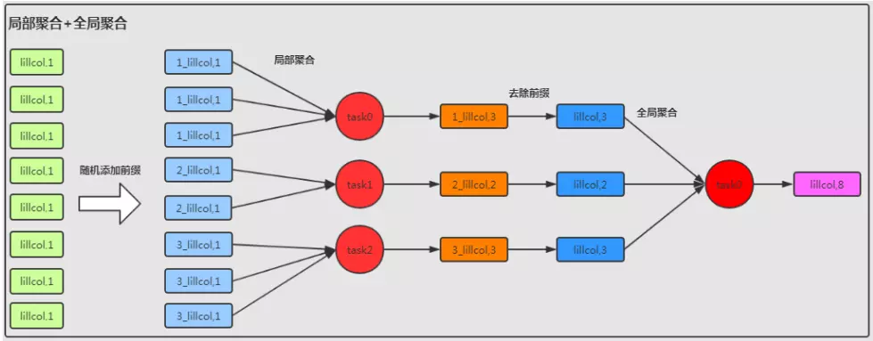

### 7.2、case

```scala
rdd1
    .map(s=>(new Random().nextInt(100)+"_"+s._1,s._2))//添加前缀
    .reduceByKey(_+_)//局部聚合
    .map(s=>(s._1.split("_")(1),s._2))//去除前缀
    .reduceByKey(_+_)//全局聚合
```

### 7.3、总结

**适用场景**
对 RDD 执行 reduceByKey 等聚合类 shuffle 算子或者在 Spark SQL 中使用 group by 语句进行分组聚合时，比较适用这种方案。

**优点**
对于聚合类的 shuffle 操作导致的数据倾斜，效果是非常不错的。通常都可以解决掉数据倾斜，或者至少是大幅度缓解数据倾斜，将 Spark 作业的性能提升数倍以上。

**缺点**
仅仅适用于聚合类的 shuffle 操作，适用范围相对较窄。如果是 join 类的 shuffle 操作，还得用其他的解决方案。

## 八、总结

对于数据倾斜，并无一个统一的一劳永逸的方法。更多的时候，是结合数据特点（数据集大小，倾斜 Key 的多少等）综合使用上文所述的多种方法。

## 九、参考文章

http://www.jasongj.com/spark/skew/