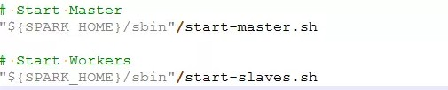

# 【Spark】Spark 启动消息通信

本篇结构：

- 前言
- 详细过程

## 一、前言

在介绍了 Spark RPC 框架的大致内容后，下面以 Standalone 运行模式分析下 Spark 启动过程中的通信。


启动过程中主要是 Master 和 Worker 之间的通信。首先 Worker 向 Master 发送注册消息，然后 Master 回复注册成功或者注册失败的消息，如果 Worker 收到注册成功的消息，就定时向 Master 发送心跳信息。

## 二、详细过程

一般启动 spark 集群是运行 start-all.sh 脚本，该脚本先启动 Master，后启动 Worker。



start-master.sh 最后会在 Master 节点运行 org.apache.spark.deploy.master.Master 类，start-slaves.sh 中最后会在各 slave 节点运行 org.apache.spark.deploy.worker.Worker。

下面分步骤分析启动过程中的通信。

### 2.1、Worker 向 Master 发送注册信息

```
  def main(argStrings: Array[String]) {
    Utils.initDaemon(log)
    val conf = new SparkConf
    val args = new WorkerArguments(argStrings, conf)
    val rpcEnv = startRpcEnvAndEndpoint(args.host, args.port, args.webUiPort, args.cores,
      args.memory, args.masters, args.workDir, conf = conf)
    rpcEnv.awaitTermination()
  }
```

从 Worker 的 main 方法看起，先 startRpcEnvAndEndpoint 启动 RpcEnv 和 Endpoint。

在 startRpcEnvAndEndpoint 中调用 RpcEnv.create(systemName, host, port, conf, securityMgr) 方法，前面有介绍 RpcEnv.create() 方法创建的是  NettyRpcEnv，在 NettyRpcEnv 创建时会初始化 Dispathcer，进而创建 Inbox，在 Inbox 初始化时会将 Onstart 消息放入 messages 中，然后 MessageLoop 会调用 inbox.process() 方法消费该消息，经过 match case 匹配，调用到 endpoint.onStart()：

NettyRpcEnv -> Dispathcer -> EndpointData -> Inbox -> messages.add(OnStart) -> MessageLoop -> data.inbox.process(Dispatcher.this) -> Worker.onStart() 

所以重点关注 onStart() 方法：

```
 override def onStart() {
    assert(!registered)
    logInfo("Starting Spark worker %s:%d with %d cores, %s RAM".format(
      host, port, cores, Utils.megabytesToString(memory)))
    logInfo(s"Running Spark version ${org.apache.spark.SPARK_VERSION}")
    logInfo("Spark home: " + sparkHome)
    createWorkDir()
    shuffleService.startIfEnabled()
    webUi = new WorkerWebUI(this, workDir, webUiPort)
    webUi.bind()

    workerWebUiUrl = s"http://$publicAddress:${webUi.boundPort}"
    registerWithMaster()

    metricsSystem.registerSource(workerSource)
    metricsSystem.start()
    // Attach the worker metrics servlet handler to the web ui after the metrics system is started.
    metricsSystem.getServletHandlers.foreach(webUi.attachHandler)
  }
```

和注册相关的在 registerWithMaster() 方法：

```
  private def registerWithMaster() {
    // onDisconnected may be triggered multiple times, so don't attempt registration
    // if there are outstanding registration attempts scheduled.
    registrationRetryTimer match {
      case None =>
        registered = false
        registerMasterFutures = tryRegisterAllMasters()
        connectionAttemptCount = 0
        registrationRetryTimer = Some(forwordMessageScheduler.scheduleAtFixedRate(
          new Runnable {
            override def run(): Unit = Utils.tryLogNonFatalError {
              Option(self).foreach(_.send(ReregisterWithMaster))
            }
          },
          INITIAL_REGISTRATION_RETRY_INTERVAL_SECONDS,
          INITIAL_REGISTRATION_RETRY_INTERVAL_SECONDS,
          TimeUnit.SECONDS))
      case Some(_) =>
        logInfo("Not spawning another attempt to register with the master, since there is an" +
          " attempt scheduled already.")
    }
  }
```

来重点关注 tryRegisterAllMasters() 方法：

```
  private def tryRegisterAllMasters(): Array[JFuture[_]] = {
    masterRpcAddresses.map { masterAddress =>
      registerMasterThreadPool.submit(new Runnable {
        override def run(): Unit = {
          try {
            logInfo("Connecting to master " + masterAddress + "...")
            val masterEndpoint = rpcEnv.setupEndpointRef(masterAddress, Master.ENDPOINT_NAME)
            registerWithMaster(masterEndpoint)
          } catch {
            case ie: InterruptedException => // Cancelled
            case NonFatal(e) => logWarning(s"Failed to connect to master $masterAddress", e)
          }
        }
      })
    }
  }
```

因为可能存在多个 Master（高HA），所以 Worker 需要向多个 Master 发送注册消息，Worker 在向多个 Master 发送注册消息时，采用了 registerMasterThreadPool 线程池的方式，线程池线程的数量等于 Master 的数量。

根据代码可知，在注册过程中，先获取 Master 的引用 val masterEndpoint = rpcEnv.setupEndpointRef(masterAddress, Master.ENDPOINT_NAME)，接着调用 registerWithMaster(masterEndpoint) 方法：

```
  private def registerWithMaster(masterEndpoint: RpcEndpointRef): Unit = {
    masterEndpoint.ask[RegisterWorkerResponse](RegisterWorker(
      workerId, host, port, self, cores, memory, workerWebUiUrl))
      .onComplete {
        // This is a very fast action so we can use "ThreadUtils.sameThread"
        case Success(msg) =>
          Utils.tryLogNonFatalError {
            handleRegisterResponse(msg)
          }
        case Failure(e) =>
          logError(s"Cannot register with master: ${masterEndpoint.address}", e)
          System.exit(1)
      }(ThreadUtils.sameThread)
  }
```

registerWithMaster 方法中，通过 master 节点引用，调用其 ask 方法，该方法的流程在前面的文章有分析，ask 注册信息，等待回复，如果成功进入 handleRegisterResponse 方法，如果失败，记录日志并退出。

### 2.2、Master 接收 Worker 的注册消息

上篇关于 Spark Rpc 框架一文分析了 ask 的时序图，Worker 的注册消息会通过 TransportClient 发送出去，Master 接收到消息后最后会来到 Dispatcher 的 postMessage，将消息丢到 Inbox 中，由 Inbox.process() 方法进行处理，该方法中经过 match case 匹配会调用到 Master 的 receiveAndReply() 方法中：

```
  override def receiveAndReply(context: RpcCallContext): PartialFunction[Any, Unit] = {
    case RegisterWorker(
        id, workerHost, workerPort, workerRef, cores, memory, workerWebUiUrl) =>
      logInfo("Registering worker %s:%d with %d cores, %s RAM".format(
        workerHost, workerPort, cores, Utils.megabytesToString(memory)))
      if (state == RecoveryState.STANDBY) {
        context.reply(MasterInStandby)
      } else if (idToWorker.contains(id)) {
        context.reply(RegisterWorkerFailed("Duplicate worker ID"))
      } else {
        val worker = new WorkerInfo(id, workerHost, workerPort, cores, memory,
          workerRef, workerWebUiUrl)
        if (registerWorker(worker)) {
          persistenceEngine.addWorker(worker)
          context.reply(RegisteredWorker(self, masterWebUiUrl))
          schedule()
        } else {
          val workerAddress = worker.endpoint.address
          logWarning("Worker registration failed. Attempted to re-register worker at same " +
            "address: " + workerAddress)
          context.reply(RegisterWorkerFailed("Attempted to re-register worker at same address: "
            + workerAddress))
        }
      }
      
      ...
    }
```

分析上面的代码，先判断 Master 是否是 STANDBY 状态，reply MasterInStandby 消息，如果注册列表发现已经有该 Worker，则回复 RegisterWorkerFailed 注册失败的消息。

正常情况下则通过 registerWorker 方法将 worker 加入到 workers 中，然后 Master 向 Worker 回复 RegisteredWorker 注册成功的消息。

下面是 registerWorker() 方法代码：

```
  private def registerWorker(worker: WorkerInfo): Boolean = {
    // There may be one or more refs to dead workers on this same node (w/ different ID's),
    // remove them.
    workers.filter { w =>
      (w.host == worker.host && w.port == worker.port) && (w.state == WorkerState.DEAD)
    }.foreach { w =>
      workers -= w
    }

    val workerAddress = worker.endpoint.address
    if (addressToWorker.contains(workerAddress)) {
      val oldWorker = addressToWorker(workerAddress)
      if (oldWorker.state == WorkerState.UNKNOWN) {
        // A worker registering from UNKNOWN implies that the worker was restarted during recovery.
        // The old worker must thus be dead, so we will remove it and accept the new worker.
        removeWorker(oldWorker)
      } else {
        logInfo("Attempted to re-register worker at same address: " + workerAddress)
        return false
      }
    }

    workers += worker
    idToWorker(worker.id) = worker
    addressToWorker(workerAddress) = worker
    if (reverseProxy) {
       webUi.addProxyTargets(worker.id, worker.webUiAddress)
    }
    true
  }
```

### 2.3、Worker 接收到 Master 注册成功的消息后，定时发送心跳

```
  private def registerWithMaster(masterEndpoint: RpcEndpointRef): Unit = {
    masterEndpoint.ask[RegisterWorkerResponse](RegisterWorker(
      workerId, host, port, self, cores, memory, workerWebUiUrl))
      .onComplete {
        // This is a very fast action so we can use "ThreadUtils.sameThread"
        case Success(msg) =>
          Utils.tryLogNonFatalError {
            handleRegisterResponse(msg)
          }
        case Failure(e) =>
          logError(s"Cannot register with master: ${masterEndpoint.address}", e)
          System.exit(1)
      }(ThreadUtils.sameThread)
  }
  
  private def handleRegisterResponse(msg: RegisterWorkerResponse): Unit = synchronized {
    msg match {
      case RegisteredWorker(masterRef, masterWebUiUrl) =>
        logInfo("Successfully registered with master " + masterRef.address.toSparkURL)
        registered = true
        changeMaster(masterRef, masterWebUiUrl)
        forwordMessageScheduler.scheduleAtFixedRate(new Runnable {
          override def run(): Unit = Utils.tryLogNonFatalError {
            self.send(SendHeartbeat)
          }
        }, 0, HEARTBEAT_MILLIS, TimeUnit.MILLISECONDS)
        if (CLEANUP_ENABLED) {
          logInfo(
            s"Worker cleanup enabled; old application directories will be deleted in: $workDir")
          forwordMessageScheduler.scheduleAtFixedRate(new Runnable {
            override def run(): Unit = Utils.tryLogNonFatalError {
              self.send(WorkDirCleanup)
            }
          }, CLEANUP_INTERVAL_MILLIS, CLEANUP_INTERVAL_MILLIS, TimeUnit.MILLISECONDS)
        }

        val execs = executors.values.map { e =>
          new ExecutorDescription(e.appId, e.execId, e.cores, e.state)
        }
        masterRef.send(WorkerLatestState(workerId, execs.toList, drivers.keys.toSeq))

      case RegisterWorkerFailed(message) =>
        if (!registered) {
          logError("Worker registration failed: " + message)
          System.exit(1)
        }

      case MasterInStandby =>
        // Ignore. Master not yet ready.
    }
  }
  
  // Send a heartbeat every (heartbeat timeout) / 4 milliseconds
  private val HEARTBEAT_MILLIS = conf.getLong("spark.worker.timeout", 60) * 1000 / 4
```

由上代码可知，定时发送心跳的代码是由 HEARTBEAT_MILLIS 决定，可由 spark.worker.timeout 参数控制，默认是其值的 1/4。


