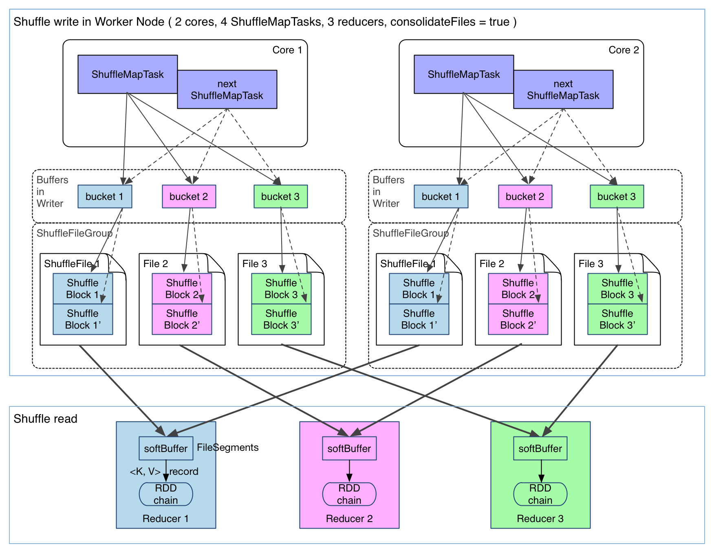
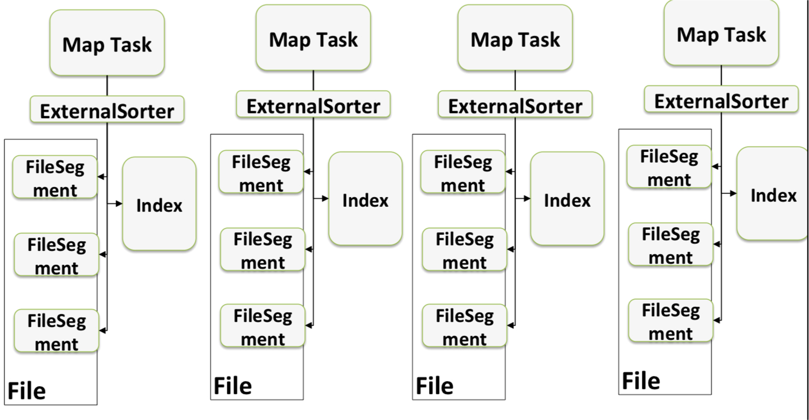
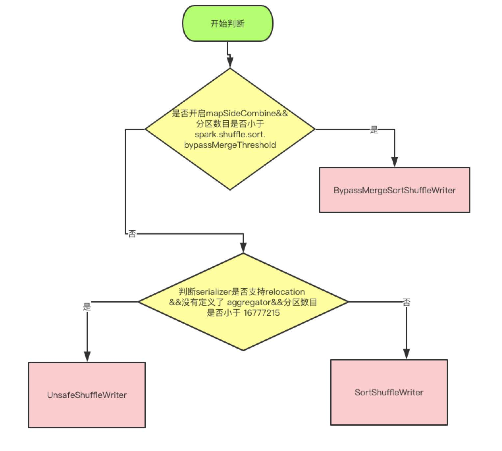
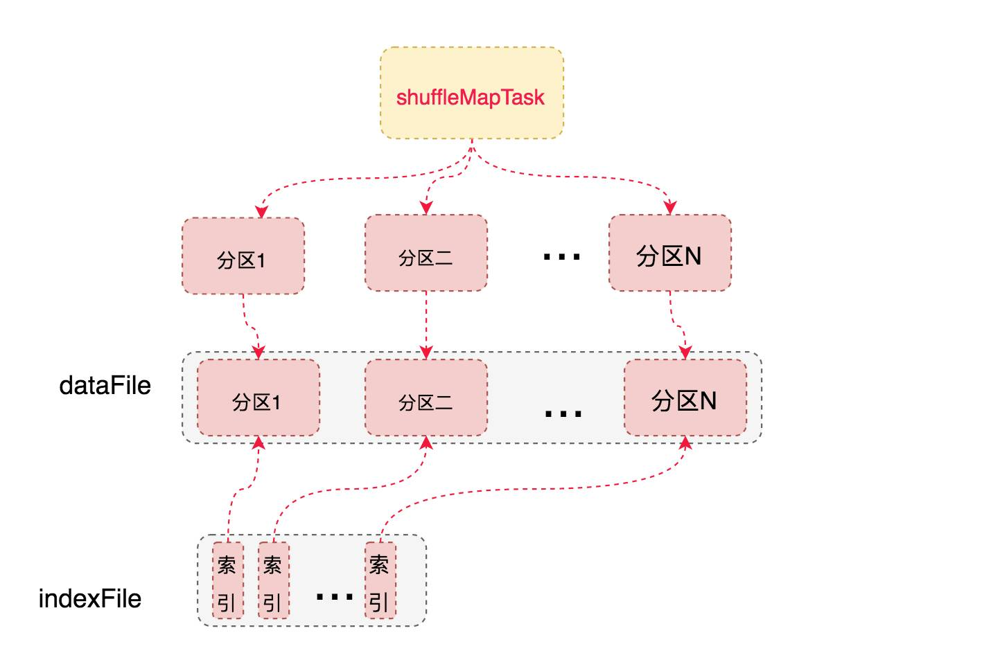
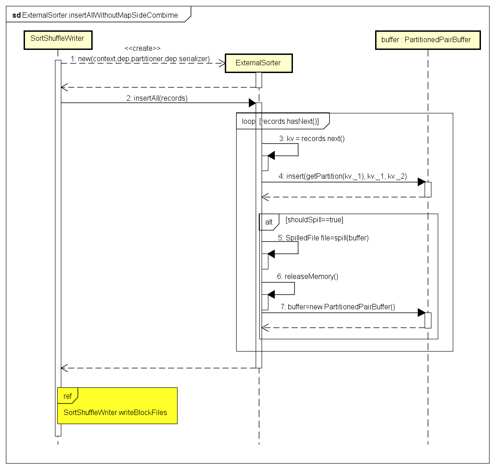
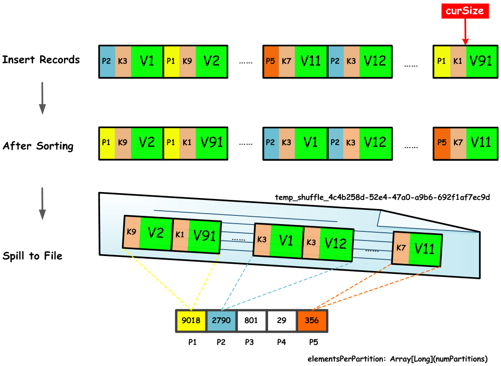
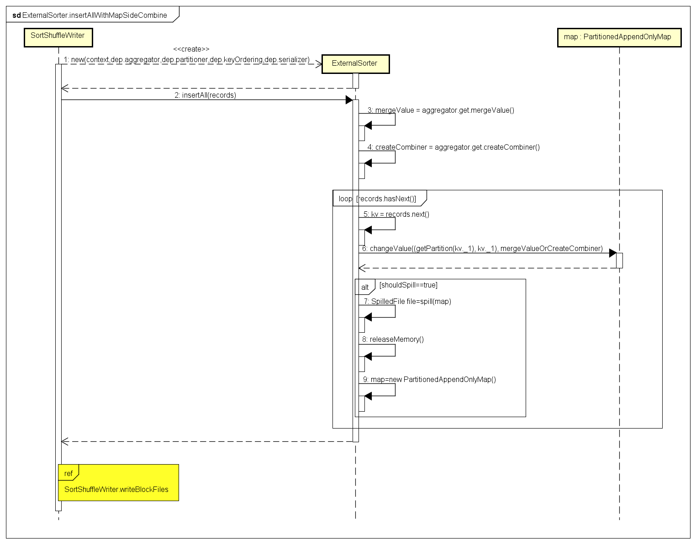
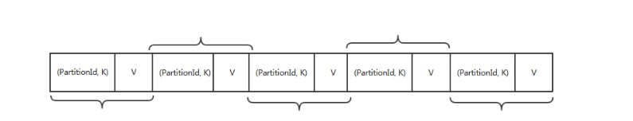

# 【Spark】Spark 存储原理--shuffle 过程

本篇结构：

* Spark Shuffle 的发展
* Spark Shuffle 中数据结构
* Spark Shuffle 原理
* 来源文章

Spark Shuffle 是 spark job 中某些算子触发的操作。当 rdd 依赖中出现宽依赖的时候，就会触发 Shuffle  操作，Shuffle 操作通常会伴随着不同 executor/host 之间数据的传输。

Shuffle 操作可能涉及的过程包括数据的排序，聚合，溢写，合并，传输，磁盘IO，网络的 IO 等等。Shuffle 是连接 MapTask 和 ReduceTask 之间的桥梁，Map 的输出到 Reduce 中须经过 Shuffle 环节，Shuffle 的性能高低直接影响了整个程序的性能和吞吐量。

通常 Shuffle 分为两部分：Map 阶段的数据准备( ShuffleMapTask )和Reduce(ShuffleReduceTask) 阶段的数据拷贝处理。一般将在 Map 端的 Shuffle 称之为 Shuffle Write，在 Reduce 端的 Shuffle 称之为 Shuffle Read。

## 一、Spark Shuffle 的发展

- Spark 0.8及以前 Hash Based Shuffle
- Spark 0.8.1 为Hash Based Shuffle引入File Consolidation机制
- Spark 0.9 引入ExternalAppendOnlyMap
- Spark 1.1 引入Sort Based Shuffle，但默认仍为Hash Based Shuffle
- Spark 1.2 默认的Shuffle方式改为Sort Based Shuffle
- Spark 1.4 引入Tungsten-Sort Based Shuffle
- Spark 1.6 Tungsten-sort并入Sort Based Shuffle
- Spark 2.0 Hash Based Shuffle退出历史舞台

### 1.1、未优化的 HashShuffle

每一个 ShuffleMapTask 都会为每一个 ReducerTask 创建一个单独的文件，总的文件数是 M * R，其中 M 是 ShuffleMapTask 的数量，R 是 ShuffleReduceTask 的数量。

见下图（来源网络）：


在处理大数据时，ShuffleMapTask 和 ShuffleReduceTask 的数量很多，创建的磁盘文件数量 M*R 也越多，大量的文件要写磁盘，再从磁盘读出来，不仅会占用大量的时间，而且每个磁盘文件记录的句柄都会保存在内存中（每个人大约 100k），因此也会占用很大的内存空间，频繁的打开和关闭文件，会导致频繁的GC操作，很容易出现 OOM 的情况。

也正是上述原因，该 HashShuffle 如今已退出历史舞台。

### 1.2、优化后 HashShuffle

在 Spark 0.8.1 版本中，引入了 Consolidation 机制，该机制是对 HashShuffle 的一种优化。

如下图（来源网络）：



可以明显看出，在一个 core 上连续执行的 ShuffleMapTasks 可以共用一个输出文件 ShuffleFile。

先执行完的 ShuffleMapTask 形成 ShuffleBlock i，后执行的 ShuffleMapTask 可以将输出数据直接追加到 ShuffleBlock i 后面，形成 ShuffleBlock i'，每个 ShuffleBlock 被称为 FileSegment。下一个 stage 的 reducer 只需要 fetch 整个 ShuffleFile 就行了。

这样，每个 worker 持有的文件数降为 cores * R。cores 代表核数，R 是 ShuffleReduceTask 数。

### 1.3、Sort-Based Shuffle

由于 HashShuffle 会产生很多的磁盘文件，引入 Consolidation 机制虽然在一定程度上减少了磁盘文件数量，但是不足以有效提高 Shuffle 的性能，适合中小型数据规模的大数据处理。

为了让 Spark 在更大规模的集群上更高性能处理更大规模的数据，因此在 Spark 1.1 版本中，引入了 SortShuffle。

如下图（来源网络）：



该机制每一个 ShuffleMapTask 都只创建一个文件，将所有的 ShuffleReduceTask  的输入都写入同一个文件，并且对应生成一个索引文件。

**以前的数据是放在内存缓存中，等到数据完了再刷到磁盘，现在为了减少内存的使用，在内存不够用的时候，可以将输出溢写到磁盘，结束的时候，再将这些不同的文件联合内存的数据一起进行归并，从而减少内存的使用量。一方面文件数量显著减少，另一方面减少Writer 缓存所占用的内存大小，而且同时避免 GC 的风险和频率。**

但对于 Rueducer 数比较少的情况，Hash Shuffle 要比 Sort Shuffle 快，因此 Sort Shuffle 有个 “fallback” 计划，对于 Reducers 数少于 “spark.shuffle.sort.bypassMergeThreshold” (200 by default)，将使用 fallback 计划，hashing 相关数据到分开的文件，然后合并这些文件为一个。

## 二、Sort Based Shuffle

因为 hash based shuffle 已经退出历史舞台，所以以 spark 2.3 的 sort based shuffle 为例，看 Spark Shuffle 的原理。

Shuffle 的整个生命周期由 ShuffleManager 来管理，Spark 2.3中，唯一的支持方式为 SortShuffleManager，SortShuffleManager 中定义了 writer 和 reader 对应shuffle 的 map 和 reduce 阶段。reader 只有一种实现 `BlockStoreShuffleReader`，writer 有三种运行实现：

- BypassMergeSortShuffleWriter：当前 shuffle 没有聚合， 并且分区数小于 `spark.shuffle.sort.bypassMergeThreshold`（默认200）
- UnsafeShuffleWriter：当条件不满足 BypassMergeSortShuffleWriter 时， 并且当前 rdd 的数据支持序列化（即 UnsafeRowSerializer），也不需要聚合， 分区数小于 2^24
- SortShuffleWriter：其余



### 3.1、BypassMergeSortShuffleWriter

首先，BypassMergeSortShuffleWriter 的运行机制的触发条件如下：

- shuffle reduce task(即partition)数量小于`spark.shuffle.sort.bypassMergeThreshold` 参数的值。
- 没有map side aggregations。
  note: map side aggregations是指在 map 端的聚合操作，通常来说一些聚合类的算子都会都 map 端的 aggregation。不过对于 groupByKey 和combineByKey， 如果设定 mapSideCombine 为false，就不会有 map side aggregations。

BypassMergeSortShuffleHandle 算法适用于没有聚合，数据量不大的场景。 给每个分区分配一个临时文件，对每个 record 的 key 使用分区器（模式是hash，如果用户自定义就使用自定义的分区器）找到对应分区的输出文件句柄，写入文件对应的文件。

因为写入磁盘文件是通过 Java的 BufferedOutputStream 实现的，BufferedOutputStream 是 Java 的缓冲输出流，**首先会将数据缓冲在内存中，当内存缓冲满溢之后再一次写入磁盘文件中**，这样可以减少磁盘 IO 次数，提升性能。所以图中会有内存缓冲的概念。

图片来源网络（正常应该有 3 个 reduce task）：


最后，会将所有临时文件合并成一个磁盘文件，并创建一个索引文件标识下游各个 reduce task 的数据在文件中的 start offset与 end offset。



该过程的磁盘写机制其实跟未经优化的 HashShuffleManager 是一样的，也会创建很多的临时文件（所以触发条件中会有 reduce task 数量限制），只是在最后会做一个磁盘文件的合并，对于 shuffle reader 会更友好一些。

**BypassMergeSortShuffleWriter 所有的中间数据都是在磁盘里，并没有利用内存。而且它只保证分区索引的排序，而并不保证数据的排序。**

```scala
public void write(Iterator<Product2<K, V>> records) throws IOException {
  assert (partitionWriters == null);
  if (!records.hasNext()) {
    partitionLengths = new long[numPartitions];
    shuffleBlockResolver.writeIndexFileAndCommit(shuffleId, mapId, partitionLengths, null);
    mapStatus = MapStatus$.MODULE$.apply(blockManager.shuffleServerId(), partitionLengths);
    return;
  }
  final SerializerInstance serInstance = serializer.newInstance();
  final long openStartTime = System.nanoTime();
  // DiskBlockObjectWriter 数组，索引是 reduce 端的分区索引
  partitionWriters = new DiskBlockObjectWriter[numPartitions];
  // FileSegment数组，索引是 reduce 端的分区索引
  partitionWriterSegments = new FileSegment[numPartitions];
  // 为每个 reduce 端的分区，创建临时 Block 和文件
  for (int i = 0; i < numPartitions; i++) {
    final Tuple2<TempShuffleBlockId, File> tempShuffleBlockIdPlusFile =
      blockManager.diskBlockManager().createTempShuffleBlock();
    final File file = tempShuffleBlockIdPlusFile._2();
    final BlockId blockId = tempShuffleBlockIdPlusFile._1();
    partitionWriters[i] =
      blockManager.getDiskWriter(blockId, file, serInstance, fileBufferSize, writeMetrics);
  }
  // Creating the file to write to and creating a disk writer both involve interacting with
  // the disk, and can take a long time in aggregate when we open many files, so should be
  // included in the shuffle write time.
  writeMetrics.incWriteTime(System.nanoTime() - openStartTime);

  // 遍历数据，根据key找到分区索引，存到对应的文件中
  while (records.hasNext()) {
    final Product2<K, V> record = records.next();
    // 获取数据的key
    final K key = record._1();
 // 根据reduce端的分区器，判断该条数据应该存在reduce端的哪个分区
 // 并且通过DiskBlockObjectWriter，存到对应的文件中
  partitionWriters[partitioner.getPartition(key)].write(key, record._2());
  }

  for (int i = 0; i < numPartitions; i++) {
    final DiskBlockObjectWriter writer = partitionWriters[i];
    // 调用DiskBlockObjectWriter的commitAndGet方法，获取FileSegment，包含写入的数据信息
    partitionWriterSegments[i] = writer.commitAndGet();
    writer.close();
  }

  // 获取最终结果的文件名
  File output = shuffleBlockResolver.getDataFile(shuffleId, mapId);
  // 根据output文件名，生成临时文件。临时文件的名称只是在output文件名后面添加了一个uuid
  File tmp = Utils.tempFileWith(output);
  try {
    // 将所有的文件都合并到tmp文件中，返回每个数据段的长度
    partitionLengths = writePartitionedFile(tmp);
    // 这里writeIndexFileAndCommit会将tmp文件重命名，并且会创建索引文件。
    shuffleBlockResolver.writeIndexFileAndCommit(shuffleId, mapId, partitionLengths, tmp);
  } finally {
    if (tmp.exists() && !tmp.delete()) {
      logger.error("Error while deleting temp file {}", tmp.getAbsolutePath());
    }
  }
  mapStatus = MapStatus$.MODULE$.apply(blockManager.shuffleServerId(), partitionLengths);
}
```

### 3.2、SortShuffleWriter

可以先考虑一个问题，假如有 100 亿条数据，内存只有 1M，但是磁盘很大，现在要对这 100 亿条数据进行排序，是没法把所有的数据一次性的 load 进行内存进行排序的，这就涉及到一个**外部排序**的问题。

假设 1M 内存能装进 1 亿条数据，每次能对这 1 亿条数据进行排序，排好序后输出到磁盘，总共输出 100 个文件，最后把这 100 个文件进行 merge 成一个全局有序的大文件，这是归并的思路：

可以每个文件（有序的）都取一部分头部数据最为一个 buffer， 并且把这 100个 buffer 放在一个堆里面，进行堆排序，比较方式就是对所有堆元素（buffer）的head 元素进行比较大小， 然后不断的把每个堆顶的 buffer 的head 元素 pop 出来输出到最终文件中， 然后继续堆排序，继续输出。如果哪个 buffer 空了，就去对应的文件中继续补充一部分数据。最终就得到一个全局有序的大文件。

SortShuffleWirter  的实现大概就是这样，和 Hadoop MR 的实现相似。

图片来源网络：


该模式下，数据首先写入一个内存数据结构中，此时根据不同的 shuffle 算子，可能选用不同的数据结构。有些 shuffle 操作涉及到聚合，对于这种需要聚合的操作，使用 PartitionedAppendOnlyMap 来排序。对于不需要聚合的，则使用 PartitionedPairBuffer 排序。

**在进行 shuffle 之前，map 端会先将数据进行排序。**排序的规则，根据不同的场景，会分为两种。首先会根据 Key 将元素分成不同的 partition。**第一种只需要保证元素的 partitionId 排序，但不会保证同一个 partitionId 的内部排序。第二种是既保证元素的 partitionId 排序，也会保证同一个 partitionId 的内部排序**。

接着，往内存写入数据，每隔一段时间，当向 MemoryManager 申请不到足够的内存时，或者数据量超过 `spark.shuffle.spill.numElementsForceSpillThreshold` 这个阈值时 （默认是 Long 的最大值，不起作用），就会进行 Spill 内存数据到文件，然后清空内存数据结构。假设可以源源不断的申请到内存，那么 Write 阶段的所有数据将一直保存在内存中，由此可见，PartitionedAppendOnlyMap 或者 PartitionedPairBuffer 是比较吃内存的。

在溢写到磁盘文件之前，会先根据 key 对内存数据结构中已有的数据进行排序。排序过后，会分批将数据写入磁盘文件。默认的 batch 数量是 10000 条，也就是说，排序好的数据，会以每批 1 万条数据的形式分批写入磁盘文件。写入磁盘文件也是通过 Java 的 BufferedOutputStream 实现的。

一个 task 将所有数据写入内存数据结构的过程中，会发生多次磁盘溢写操作，也就会产生多个临时文件。在将最终排序结果写入到数据文件之前，需要将内存中的 PartitionedAppendOnlyMap 或者 PartitionedPairBuffer 和已经 spill 到磁盘的 SpillFiles 进行合并。

此外，由于一个 task 就只对应一个磁盘文件，也就意味着该 task 为下游 stage 的 task 准备的数据都在这一个文件中，因此还会单独写一份索引文件，其中标识了下游各个 task 的数据在文件中的 start offset 与 end offset。

**BypassMergeSortShuffleWriter 与该机制相比：**

第一，磁盘写机制不同；第二，不会进行排序。也就是说，启用 BypassMerge 机制的最大好处在于，shuffle write 过程中，不需要进行数据的排序操作，也就节省掉了这部分的性能开销，当然需要满足那两个触发条件。

```scala
override def write(records: Iterator[Product2[K, V]]): Unit = {
  // 根据是否在map端进行数据合并初始化 ExternalSorter
  sorter = if (dep.mapSideCombine) {
    require(dep.aggregator.isDefined, "Map-side combine without Aggregator specified!")
    new ExternalSorter[K, V, C](
      context, dep.aggregator, Some(dep.partitioner), dep.keyOrdering, dep.serializer)
  } else {
    // In this case we pass neither an aggregator nor an ordering to the sorter, because we don't
    // care whether the keys get sorted in each partition; that will be done on the reduce side
    // if the operation being run is sortByKey.
    // 不进行聚合，也不进行排序，reduce端再进行排序，只会根据 key 值获取对应的分区 id，来划分数据，不会在分区内排序，如果结果需要排序，例如sortByKey，会在 reduce 端获取 shuffle 数据后进行
    new ExternalSorter[K, V, V](
      context, aggregator = None, Some(dep.partitioner), ordering = None, dep.serializer)
  }
  sorter.insertAll(records)

  // Don't bother including the time to open the merged output file in the shuffle write time,
  // because it just opens a single file, so is typically too fast to measure accurately
  // (see SPARK-3570).
  // shuffle输出文件
  val output = shuffleBlockResolver.getDataFile(dep.shuffleId, mapId)
  val tmp = Utils.tempFileWith(output)
  try {
    val blockId = ShuffleBlockId(dep.shuffleId, mapId, IndexShuffleBlockResolver.NOOP_REDUCE_ID)
    // sorter 中的数据写出到该文件中   
    val partitionLengths = sorter.writePartitionedFile(blockId, tmp)
  // 写出对应的index文件，纪录每个Partition对应的偏移量 
  shuffleBlockResolver.writeIndexFileAndCommit(dep.shuffleId, mapId, partitionLengths, tmp)
    // shuffleWriter的返回结果  
    mapStatus = MapStatus(blockManager.shuffleServerId, partitionLengths)
  } finally {
    if (tmp.exists() && !tmp.delete()) {
      logError(s"Error while deleting temp file ${tmp.getAbsolutePath}")
    }
  }
}
```

### 3.3、UnsafeShuffleWriter

触发条件有三个：

- Serializer 支持 relocation。Serializer 支持 relocation 是指，Serializer 可以对已经序列化的对象进行排序，这种排序起到的效果和先对数据排序再序列化一致。支持 relocation 的 Serializer 是 KryoSerializer，Spark 默认使用 JavaSerializer，通过参数 spark.serializer 设置；
- 没有指定 aggregation 或者 key 排序， 因为 key 没有编码到排序指针中，所以只有 partition 级别的排序。
- partition 数量不能大于指定的阈值(2^24)，因为 partition number 使用24bit 表示的。

**UnsafeShuffleWriter 将 record 序列化后插入sorter，然后对已经序列化的 record 进行排序，并在排序完成后写入磁盘文件作为 spill file，再将多个 spill file 合并成一个输出文件。**在合并时会基于 spill file 的数量和 IO compression codec 选择最合适的合并策略。

*下面内容来自 [Spark ShuffleWriter 原理](https://zhmin.github.io/2019/01/26/spark-shuffle-writer/)。*

UnsafeShuffleWriter 首先将数据序列化，保存在 MemoryBlock 中。然后将该数据的地址和对应的分区索引，保存在 ShuffleInMemorySorter 内存中，利用ShuffleInMemorySorter 根据分区排序。当内存不足时，会触发 spill 操作，生成spill 文件。最后会将所有的 spill文 件合并在同一个文件里。

整个过程可以想象成归并排序。ShuffleExternalSorter 负责分片的读取数据到内存，然后利用 ShuffleInMemorySorter 进行排序。排序之后会将结果存储到磁盘文件中。这样就会有很多个已排序的文件， UnsafeShuffleWriter 会将所有的文件合并。

下图来自 [Spark ShuffleWriter 原理](https://zhmin.github.io/2019/01/26/spark-shuffle-writer/)，表示了map端一个分区的shuffle过程：


UnsafeShuffleWriter 是对 SortShuffleWriter 的优化，大体上也和 SortShuffleWriter 差不多。从内存使用角度看，主要差异在以下两点：

* 一方面，在 SortShuffleWriter 的 PartitionedAppendOnlyMap 或者 PartitionedPairBuffer 中，存储的是键值或者值的具体类型，也就是 Java 对象，是反序列化过后的数据。而在 UnsafeShuffleWriter 的 ShuffleExternalSorter 中数据是序列化以后存储到实际的 Page 中，而且在写入数据过程中会额外写入长度信息。总体而言，序列化以后数据大小是远远小于序列化之前的数据。 

* 另一方面，UnsafeShuffleWriter 中需要额外的存储记录（LongArray），它保存着分区信息和实际指向序列化后数据的指针（经过编码的Page num 以及 Offset）。相对于 SortShuffleWriter， UnsafeShuffleWriter 中这部分存储的开销是额外的。

## 三、Spark Shuffle 中数据结构

SortShuffleWriter 中使用 ExternalSorter 来对内存中的数据进行排序，ExternalSorter 中缓存记录数据的数据结构有两种：**一种是Buffer，对应的实现类PartitionedPairBuffer，设置mapSideCombine=false 时会使用该结构；另一种是Map，对应的实现类是PartitionedAppendOnlyMap，设置mapSideCombine=true时会使用该结构。**  

两者都是使用了 hash table 数据结构， 如果需要进行 aggregation， 就使用 PartitionedAppendOnlyMap（支持 lookup 某个Key，如果之前存储过相同 key 的 K-V 元素，就需要进行 aggregation，然后再存入aggregation 后的 K-V）， 否则使用 PartitionedPairBuffer（只进行添K-V 元素） 。 

### 3.1、PartitionedPairBuffer

**设置 mapSideCombine=false 时** ，这种情况在 Map 阶段不进行 Combine 操作，在内存中缓存记录数据会使用 PartitionedPairBuffer 这种数据结构来缓存、排序记录数据，它是一个 Append-only Buffer，仅支持向 Buffer 中追加数据键值对记录，PartitionedPairBuffer 的结构如下图所示： 


默认情况下，PartitionedPairBuffer 初始分配的存储容量为 capacity = initialCapacity = 64，实际上这个容量是针对key的容量，因为要存储的是键值对记录数据，所以实际存储键值对的容量为 2 * initialCapacity = 128。PartitionedPairBuffer 是一个能够动态扩充容量的 Buffer，内部使用一个一维数组来存储键值对，每次扩容结果为当前Buffer容量的 2 倍，即 2*capacity，最大支持存储 2^31-1个键值对记录（1073741823个） 。

PartitionedPairBuffer 存储的键值对记录数据，键是(partition, key)这样一个Tuple，值是对应的数据 value，而且 curSize 是用来跟踪写入 Buffer 中的记录的，key 在 Buffer 中的索引位置为 2 * curSize，value 的索引位置为 2 * curSize+1，可见一个键值对的 key 和 value 的存储在 PartitionedPairBuffer 内部的数组中是相邻的。 

使用PartitionedPairBuffer缓存键值对记录数据，通过跟踪实际写入到Buffer内的记录数据的字节数来判断，是否需要将Buffer中的数据Spill到磁盘文件，如下代码所示： 

```scala
  protected def maybeSpill(collection: C, currentMemory: Long): Boolean = {
    var shouldSpill = false
    if (elementsRead % 32 == 0 && currentMemory >= myMemoryThreshold) {
      // Claim up to double our current memory from the shuffle memory pool
      val amountToRequest = 2 * currentMemory - myMemoryThreshold
      val granted = acquireMemory(amountToRequest)
      myMemoryThreshold += granted
      // If we were granted too little memory to grow further (either tryToAcquire returned 0,
      // or we already had more memory than myMemoryThreshold), spill the current collection
      shouldSpill = currentMemory >= myMemoryThreshold
    }
    shouldSpill = shouldSpill || _elementsRead > numElementsForceSpillThreshold
    // Actually spill
    if (shouldSpill) {
      _spillCount += 1
      logSpillage(currentMemory)
      spill(collection)
      _elementsRead = 0
      _memoryBytesSpilled += currentMemory
      releaseMemory()
    }
    shouldSpill
  }
```

elementsRead 表示存储到 PartitionedPairBuffer 中的记录数，currentMemory 是对 Buffer 中的总记录数据大小（字节数）的估算，myMemoryThreshold 通过配置项`spark.shuffle.spill.initialMemoryThreshold`来进行设置，默认值为5 * 1024 * 1024 = 5M。

当满足条件` elementsRead % 32 == 0 && currentMemory >= myMemoryThreshold` 时，会先尝试向 MemoryManager 申请 2 * currentMemory – myMemoryThreshold 大小的内存，如果能够申请到，则不进行 Spill 操作，而是继续向 Buffer 中存储数据，否则就会调用 spill() 方法将 Buffer 中数据输出到磁盘文件。 

 向 PartitionedPairBuffer 中写入记录数据，以及满足条件 Spill 记录数据到磁盘文件，具体处理流程，如下图所示： 



**在对 PartitionedPairBuffer 中的记录数据 Spill 到磁盘之前，要使用默认的排序规则进行排序，排序的规则是只对 PartitionedPairBuffer 中的记录按 Partition ID 进行升序排序 。**

当满足 Spill 条件时，先对 PartitionedPairBuffer 中记录进行排序，最后 Spill 到磁盘文件，这个过程中 PartitionedPairBuffer 中的记录数据的变化情况，如下图所示： 



对内存中 PartitionedPairBuffer 中的记录按照 Partition ID 进行排序，并且属于同一个 Partition 的数据记录在 PartitionedPairBuffer 内部的 data 数组中是连续的。排序结束后，在 Spill 到磁盘文件时，将对应的 Partition ID 去掉了，只在文件 temp_shuffle_4c4b258d-52e4-47a0-a9b6-692f1af7ec9d 中连续存储键值对数据，但同时在另一个内存数组结构中会保存文件中每个 Partition 拥有的记录数，这样就能根据 Partition 的记录数来顺序读取文件 temp_shuffle_4c4b258d-52e4-47a0-a9b6-692f1af7ec9d 中属于同一个 Partition 的全部记录数据。 

ExternalSorter 类内部维护了一个 SpillFile 的 ArrayBuffer 数组，最终可能会生成多个 SpillFile，SpillFile 的定义如下所示： 

```scala
  private[this] case class SpilledFile(
    file: File,
    blockId: BlockId,
    serializerBatchSizes: Array[Long],
    elementsPerPartition: Array[Long])
```

每个 SpillFile 包含一个 blockId，标识 Map 输出的该临时文件；serializerBatchSizes 表示每次批量写入到文件的 Object 的数量，默认为 10000，由配置项`spark.shuffle.spill.batchSize`来控制；elementsPerPartition 表示每个 Partition 中的 Object 的数量。调用 ExternalSorter的insertAll() 方法，最终可能有如下3种情况：

- Map 阶段输出记录数较少，没有生成 SpillFile，那么所有数据都在 Buffer 中，直接对 Buffer 中记录排序并输出到文件；
- Map 阶段输出记录数较多，生成多个 SpillFile，同时 Buffer 中也有部分记录数据；
- Map 阶段输出记录数较多，只生成多个 SpillFile；

### 3.2、PartitionedAppendOnlyMap

**设置 mapSideCombine=true 时** ， 这种情况在Map阶段会执行 Combine 操作，在 Map 阶段进行 Combine 操作能够降低 Map 阶段数据记录的总数，从而降低 Shuffle 过程中数据的跨网络拷贝传输。这时，RDD 对应的 ShuffleDependency 需要设置一个 Aggregator 用来执行 Combine 操作。

Aggregator类声明如下：

```scala
case class Aggregator[K, V, C] (
    createCombiner: V => C,
    mergeValue: (C, V) => C,
    mergeCombiners: (C, C) => C) {
    ...
}
```

由于在 Map 阶段用到了构造 Aggregator 的几个函数参数 createCombiner、mergeValue、mergeCombiners，对这几个函数详细说明如下：

- createCombiner：进行 Aggregation 开始时，需要设置初始值。因为在Aggregation 过程中使用了类似 Map 的内存数据结构来管理键值对，每次加入前会先查看 Map 内存结构中是否存在 Key 对应的 Value，第一次肯定不存在，所以首次将某个 Key 的 Value 加入到 Map 内存结构中时，Key 在 Map 内存结构中第一次有了 Value。
- mergeValue：某个 Key 已经在 Map 结构中存在 Value，后续某次又遇到相同的 Key 和一个新的 Value，这时需要通过该函数，将旧 Value 和新Value 进行合并，根据 Key 检索能够得到合并后的新 Value。
- mergeCombiners：一个 Map 内存结构中 Key 和 Value 是由mergeValue生成的，那么在向 Map 中插入数据，肯定会遇到 Map 使用容量达到上限，这时需要将记录数据 Spill 到磁盘文件，那么多个 Spill 输出的磁盘文件中可能存在同一个 Key，这时需要对多个 Spill 输出的磁盘文件中的 Key 的多个 Value 进行合并，这时需要使用 mergeCombiners 函数进行处理。

Map Side Combine 时的处理流程，如下所示： 



当需要进行Map Side Combine时，对应的ExternalSorter类insertAll()方法中的处理逻辑，代码如下所示： 

```scala
  def insertAll(records: Iterator[Product2[K, V]]): Unit = {
    // TODO: stop combining if we find that the reduction factor isn't high
    val shouldCombine = aggregator.isDefined

    if (shouldCombine) {
      // Combine values in-memory first using our AppendOnlyMap
      val mergeValue = aggregator.get.mergeValue
      val createCombiner = aggregator.get.createCombiner
      var kv: Product2[K, V] = null
      val update = (hadValue: Boolean, oldValue: C) => {
        if (hadValue) mergeValue(oldValue, kv._2) else createCombiner(kv._2)
      }
      while (records.hasNext) {
        addElementsRead()
        kv = records.next()
        map.changeValue((getPartition(kv._1), kv._1), update)
        maybeSpillCollection(usingMap = true)
      }
    } 
  }
```

map 是内存数据结构，最重要的是 update 函数和 map 的 changeValue方法（这里的 map 对应的实现类是 PartitionedAppendOnlyMap）。

* update 函数所做的工作，其实就是对 createCombiner 和 mergeValue 这两个函数的使用，第一次遇到一个Key调用createCombiner函数处理，非首次遇到同一个Key 对应新的 Value 调用 mergeValue 函数进行合并处理。
* map 的 changeValue 方法主要是将 Key 和 Value 在 map 中存储或者进行修改（对出现的同一个 Key 的多个 Value 进行合并，并将合并后的新 Value 替换旧 Value）。

PartitionedAppendOnlyMap 是一个经过优化的哈希表，它支持向 map 中追加数据，以及修改 Key 对应的 Value，但是不支持删除某个 Key 及其对应的 Value。它能够支持的存储容量是 0.7 * 2 ^ 29 = 375809638。当达到指定存储容量或者指定限制，就会将 map 中记录数据 Spill 到磁盘文件，这个过程和前面的类似，不再累述。 

PartitionedAppendOnlyMap 中的 K 是（PatitionId, K）的元组， 这样就是先按照partitionId 进行排序，如果 partitionId 相同，再按照  hash（key）再进行排序。 



### 3.3、AppendOnlyMap

AppendOnlyMap 单从命名上来看,是一个只能追加元素的 Map 结构。的确，它是只支持追加的 map，可以修改某个 key 对应的 value，但是不能删除已经存在的 key。

底层是由数组结构实现的，当需要对 Key-Value 进行聚合时，会使用AppendOnlyMap 作为 buffer。在插入或者修改元素的时候，会判断是否扩容，如果达到扩容标准，将会对数组 2 倍容量进行扩容，扩容过程中原有元素并不是直接拷贝，而是进行原有元素的重新定位存储，如果集合中存在的数据量大，那么这里的操作将会耗时又耗资源。

存储级别是 Memory-Only ，在 shuffle reduce 数据不会溢写，在数据量不大的情况下可以，但是数据量大时，会极易出现OOM。

### 3.3、ExternalAppendOnlyMap

继承于AppendOnlyMap ，但是存储级别是 Memory and Disk，即在数据量达到一个阈值的时候，会把数据溢写到磁盘，达到释放内存空间，降低 OOM 的风险的作用。

## 四、来源文章

详见：

1.https://zhangchenchen.github.io/2018/09/26/deep-in-spark-shuffle/
2.https://zhmin.github.io/2019/01/26/spark-shuffle-writer/
3.https://toutiao.io/posts/eicdjo/preview 
4.http://shiyanjun.cn/archives/1655.html 