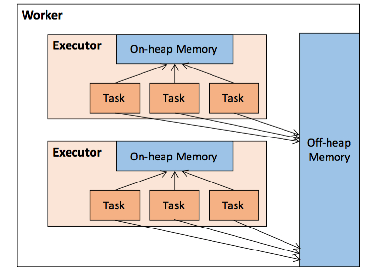
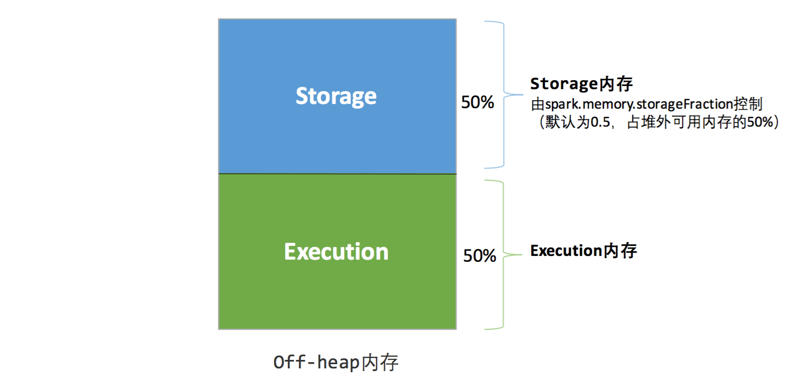
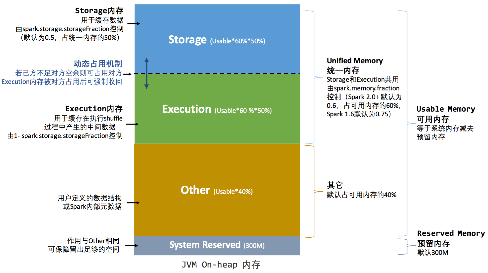

# 【Spark】Spark 存储原理--存储层分析

本篇结构：

* 缓存分析
* 存储级别
* 如何选择存储级别
* 堆内和堆外内存规划
* 内存空间分配
* 参考博文

## 一、缓存分析

RDD 有 persist 和 cache 方法，其中 cache 是 StorageLevel.MEMORY_ONLY 级别的 persist 特例。

追踪下源码，先从 RDD # cache 开始：

```scala
/**
 * Persist this RDD with the default storage level (`MEMORY_ONLY`).
 */
def cache(): this.type = persist()

```

RDD # persist：

```scala
/**
 * Persist this RDD with the default storage level (`MEMORY_ONLY`).
 */
def persist(): this.type = persist(StorageLevel.MEMORY_ONLY)
```

RDD # persist(newLevel: StorageLevel)

```scala
/**
 * Set this RDD's storage level to persist its values across operations after the first time
 * it is computed. This can only be used to assign a new storage level if the RDD does not
 * have a storage level set yet. Local checkpointing is an exception.
 */
def persist(newLevel: StorageLevel): this.type = {
  if (isLocallyCheckpointed) {
    // This means the user previously called localCheckpoint(), which should have already
    // marked this RDD for persisting. Here we should override the old storage level with
    // one that is explicitly requested by the user (after adapting it to use disk).
    persist(LocalRDDCheckpointData.transformStorageLevel(newLevel), allowOverride = true)
  } else {
    persist(newLevel, allowOverride = false)
  }
}
```

RDD # persist(newLevel: StorageLevel, allowOverride: Boolean)：

```scala
/**
 * Mark this RDD for persisting using the specified level.
 *
 * @param newLevel the target storage level
 * @param allowOverride whether to override any existing level with the new one
 */
private def persist(newLevel: StorageLevel, allowOverride: Boolean): this.type = {
  // TODO: Handle changes of StorageLevel
  if (storageLevel != StorageLevel.NONE && newLevel != storageLevel && !allowOverride) {
    throw new UnsupportedOperationException(
      "Cannot change storage level of an RDD after it was already assigned a level")
  }
  // If this is the first time this RDD is marked for persisting, register it
  // with the SparkContext for cleanups and accounting. Do this only once.
  if (storageLevel == StorageLevel.NONE) {
    sc.cleaner.foreach(_.registerRDDForCleanup(this))
    sc.persistRDD(this)
  }
  storageLevel = newLevel
  this
}
```

这段代码的最主要作用是将 storageLevel 设置为 persist() 函数传进来的 newLevel 存储级别，而且一旦设置好 RDD 的存储级别之后就不能再对相同 RDD 设置别的存储级别，否则将会出现异常。

**设置好存储级别之后除非触发了 action 操作，否则不会真正地执行缓存操作，它只是改变了 RDD 的元数据信息。**

SparkContext # persistRDD：

```scala
/**
 * Register an RDD to be persisted in memory and/or disk storage
 */
private[spark] def persistRDD(rdd: RDD[_]) {
  persistentRdds(rdd.id) = rdd
}
```

当触发了 action，它会调用 sc.runJob 方法来真正的计算，而这个方法最终会调用`org.apache.spark.scheduler.Task # run`，而这个方法最后会调用 ResultTask 或者 ShuffleMapTask 的 runTask 方法，runTask 方法最后会调用`org.apache.spark.rdd.RDD # iterator` 方法。

RDD # iterator：

```scala
/**
 * Internal method to this RDD; will read from cache if applicable, or otherwise compute it.
 * This should ''not'' be called by users directly, but is available for implementors of custom
 * subclasses of RDD.
 */
final def iterator(split: Partition, context: TaskContext): Iterator[T] = {
  if (storageLevel != StorageLevel.NONE) {
    getOrCompute(split, context)
  } else {
    computeOrReadCheckpoint(split, context)
  }
}
```

**如果当前 RDD 设置了存储级别（也就是通过上面的 rdd.persist() 设置的），那么会从 getOrCompute 方法中判断是否有缓存数据。如果有，则直接获取，如果没有则计算。**

getOrCompute 中先获取 blockId，查看 BlcokId 源码可知，RDD 包含多个 Partition，每个 Partition 都对应一个 Block，那么每个 RDD 包含一个或多个 Block，每个 Block 都有一个 BlockId，编号规则为 "rdd_" + rddId + "_" + splitIndex。

RDD # getOrCompute：

```scala
/**
 * Gets or computes an RDD partition. Used by RDD.iterator() when an RDD is cached.
 */
private[spark] def getOrCompute(partition: Partition, context: TaskContext): Iterator[T] = {
  // 通过 RDD 编号和 Partition 序号获取 BlockId
  val blockId = RDDBlockId(id, partition.index)
  var readCachedBlock = true
  // This method is called on executors, so we need call SparkEnv.get instead of sc.env.
  // 根据数据库 BlockId 先读取数据，然后再更新数据，这里是读写数据的入口点
  SparkEnv.get.blockManager.getOrElseUpdate(blockId, storageLevel, elementClassTag, () => {
    // 如果数据不存在内存，则尝试读取检查点结果进行迭代计算
    readCachedBlock = false
    computeOrReadCheckpoint(partition, context)
  }) match {
    // 对 getOrElseUpdate 返回结果进行处理，该结果标识成功，记录结果度量信息
    case Left(blockResult) =>
      if (readCachedBlock) {
        val existingMetrics = context.taskMetrics().inputMetrics
        existingMetrics.incBytesRead(blockResult.bytes)
        new InterruptibleIterator[T](context, blockResult.data.asInstanceOf[Iterator[T]]) {
          override def next(): T = {
            existingMetrics.incRecordsRead(1)
            delegate.next()
          }
        }
      } else {
        new InterruptibleIterator(context, blockResult.data.asInstanceOf[Iterator[T]])
      }
    // 对 getOrElseUpdate 返回结果进行处理，该结果标识失败，如数据太大无法放到内存，返回结果给调用者
    case Right(iter) =>
      new InterruptibleIterator(context, iter.asInstanceOf[Iterator[T]])
  }
}
```

getOrCompute 中调用 BlockManager 的 getOrElseUpdate， 该方法是读写数据的入口点。

BlockManager # getOrElseUpdate：

```scala
/**
 * Retrieve the given block if it exists, otherwise call the provided `makeIterator` method
 * to compute the block, persist it, and return its values.
 *
 * @return either a BlockResult if the block was successfully cached, or an iterator if the block
 *         could not be cached.
 */
def getOrElseUpdate[T](
    blockId: BlockId,
    level: StorageLevel,
    classTag: ClassTag[T],
    makeIterator: () => Iterator[T]): Either[BlockResult, Iterator[T]] = {
  // Attempt to read the block from local or remote storage. If it's present, then we don't need
  // to go through the local-get-or-put path.
  // 读取数据块，尝试从本地或者远程读取数据
  get[T](blockId)(classTag) match {
    case Some(block) =>
      return Left(block)
    case _ =>
      // Need to compute the block.
  }
  // Initially we hold no locks on this block.
  // 本地和远程不能读取数据，则需计算并缓存数据
  doPutIterator(blockId, makeIterator, level, classTag, keepReadLock = true) match {
    case None =>
      // doPut() didn't hand work back to us, so the block already existed or was successfully
      // stored. Therefore, we now hold a read lock on the block.
      val blockResult = getLocalValues(blockId).getOrElse {
        // Since we held a read lock between the doPut() and get() calls, the block should not
        // have been evicted, so get() not returning the block indicates some internal error.
        releaseLock(blockId)
        throw new SparkException(s"get() failed for block $blockId even though we held a lock")
      }
      // We already hold a read lock on the block from the doPut() call and getLocalValues()
      // acquires the lock again, so we need to call releaseLock() here so that the net number
      // of lock acquisitions is 1 (since the caller will only call release() once).
      releaseLock(blockId)
      Left(blockResult)
    case Some(iter) =>
      // The put failed, likely because the data was too large to fit in memory and could not be
      // dropped to disk. Therefore, we need to pass the input iterator back to the caller so
      // that they can decide what to do with the values (e.g. process them without caching).
     Right(iter)
  }
}
```

## 二、存储级别

前面简单介绍了 Spark 的缓存原理，下面再看看 Spark 的缓存级别。

回到 RDD # persist：

```scala
/**
 * Mark this RDD for persisting using the specified level.
 *
 * @param newLevel the target storage level
 * @param allowOverride whether to override any existing level with the new one
 */
private def persist(newLevel: StorageLevel, allowOverride: Boolean): this.type = {
  // TODO: Handle changes of StorageLevel
  if (storageLevel != StorageLevel.NONE && newLevel != storageLevel && !allowOverride) {
    throw new UnsupportedOperationException(
      "Cannot change storage level of an RDD after it was already assigned a level")
  }
  // If this is the first time this RDD is marked for persisting, register it
  // with the SparkContext for cleanups and accounting. Do this only once.
  if (storageLevel == StorageLevel.NONE) {
    sc.cleaner.foreach(_.registerRDDForCleanup(this))
    sc.persistRDD(this)
  }
  storageLevel = newLevel
  this
}
```

persist 方法根据参数的 StorageLevel 采取特定的缓存策略。当 RDD 原本缓存级别为 NONE 或者新传递的缓存级别与原来的缓存级别相等时才进行操作。当然 persist 只改变原 RDD 的元数据信息，并不真正执行存储操作，真正执行是在 RDD 的 iterator 中进行的。

pesist 方法可以设置 StorageLevel，根据 StorageLevel 的不同，缓存策略不同。

在 StorageLevel 中，根据 useDisk、useMemory、useOffHeap、deserialized、replication 的不同组合， Spark 提供了 12 种缓存级别。

```scala
class StorageLevel private(
    private var _useDisk: Boolean,
    private var _useMemory: Boolean,
    private var _useOffHeap: Boolean,
    private var _deserialized: Boolean,
    private var _replication: Int = 1) {
  
  def useDisk: Boolean = _useDisk
  def useMemory: Boolean = _useMemory
  def useOffHeap: Boolean = _useOffHeap
  def deserialized: Boolean = _deserialized
  def replication: Int = _replication
  ...
}
```

* **useDisk**：使用硬盘（外存）；
* **useMemory**：使用内存；
* **useOffHeap**：使用堆外内存，这是Java虚拟机里面的概念，堆外内存意味着把内存对象分配在 Java 虚拟机的堆以外的内存，这些内存直接受操作系统管理（而不是虚拟机）。这样做的结果就是能保持一个较小的堆，以减少垃圾收集对应用的影响。这部分内存也会被频繁的使用而且也可能导致 OOM，它是通过存储在堆中的 DirectByteBuffer 对象进行引用，可以避免堆和堆外数据进行来回复制；
* **deserialized**：反序列化，其逆过程序列化（Serialization）是 java 提供的一种机制，将对象表示成一连串的字节；而反序列化就表示将字节恢复为对象的过程。序列化是对象永久化的一种机制，可以将对象及其属性保存起来，并能在反序列化后直接恢复这个对象；
* **replication**：备份数（在多个节点上备份，默认为1）。

12 种缓存级别定义在其伴生类中：

```scala
object StorageLevel {
  val NONE = new StorageLevel(false, false, false, false)
  val DISK_ONLY = new StorageLevel(true, false, false, false)
  val DISK_ONLY_2 = new StorageLevel(true, false, false, false, 2)
  val MEMORY_ONLY = new StorageLevel(false, true, false, true)
  val MEMORY_ONLY_2 = new StorageLevel(false, true, false, true, 2)
  val MEMORY_ONLY_SER = new StorageLevel(false, true, false, false)
  val MEMORY_ONLY_SER_2 = new StorageLevel(false, true, false, false, 2)
  val MEMORY_AND_DISK = new StorageLevel(true, true, false, true)
  val MEMORY_AND_DISK_2 = new StorageLevel(true, true, false, true, 2)
  val MEMORY_AND_DISK_SER = new StorageLevel(true, true, false, false)
  val MEMORY_AND_DISK_SER_2 = new StorageLevel(true, true, false, false, 2)
  val OFF_HEAP = new StorageLevel(true, true, true, false, 1)
  ...
}
```

| 级别                  | 使用空间 | CPU时间 | 是否在内存中 | 是否在磁盘上 | 备注                                 |
| --------------------- | -------- | ------- | ------------ | ------------ | ------------------------------------ |
| MEMORY_ONLY           | 高       | 低      | 是           | 否           |                                      |
| MEMORY_ONLY_2         | 高       | 低      | 是           | 否           | 数据存2份                            |
| MEMORY_ONLY_SER_2     | 低       | 高      | 是           | 否           | 数据序列化，数据存2份                |
| MEMORY_AND_DISK       | 高       | 中等    | 部分         | 部分         | 如果数据在内存中放不下，则溢写到磁盘 |
| MEMORY_AND_DISK_2     | 高       | 中等    | 部分         | 部分         | 数据存2份                            |
| MEMORY_AND_DISK_SER   | 低       | 高      | 部分         | 部分         |                                      |
| MEMORY_AND_DISK_SER_2 | 低       | 高      | 部分         | 部分         | 数据存2份                            |
| DISK_ONLY             | 低       | 高      | 否           | 是           |                                      |
| DISK_ONLY_2           | 低       | 高      | 否           | 是           | 数据存2份                            |
| NONE                  |          |         |              |              |                                      |
| OFF_HEAP              |          |         |              |              |                                      |

## 三、如何选择存储级别

Spark 的存储级别的选择，核心问题是在内存使用率和 CPU 效率之间进行权衡。

* **如果使用 MEMORY_ONLY 存储在内存中的 RDD / DataFrame 没有发生溢出，那么就选择默认的存储级别。默认存储级别可以最大程度的提高 CPU 的效率，可以使在 RDD / DataFrame 上的操作以最快的速度运行。**
* **如果内存不能全部存储 RDD / DataFrame ，那么使用 MEMORY_ONLY_SER，并挑选一个快速序列化库将对象序列化，以节省内存空间。使用这种存储级别，计算速度仍然很快。**
* **除了在计算该数据集的代价特别高，或者在需要过滤大量数据的情况下，尽量不要将溢出的数据存储到磁盘。因为，重新计算这个数据分区的耗时与从磁盘读取这些数据的耗时差不多。**
* **如果想快速还原故障，建议使用多副本存储级别 MEMORY_ONLY_2 / MEMORY_ONLY_SER_2 。所有的存储级别都通过重新计算丢失的数据的方式，提供了完全容错机制。但是多副本级别在发生数据丢失时，不需要重新计算对应的数据库，可以让任务继续运行。**

## 四、堆内和堆外内存规划

作为一个 JVM 进程，Executor 的内存管理建立在 JVM 的内存管理之上，Spark 对 JVM 的堆内（On-heap）空间进行了更为详细的分配，以充分利用内存。同时，Spark 引入了堆外（Off-heap）内存，使之可以直接在工作节点的系统内存中开辟空间，进一步优化了内存的使用。



### 4.1、堆内内存

堆内内存的大小，由 Spark 应用程序启动时的 --executor-memory 或 spark.executor.memory 参数配置。

Executor 内运行的并发任务共享 JVM 堆内内存：

* 任务在缓存 RDD 数据和广播（Broadcast）数据时占用的内存被规划为存储（Storage）内存。
* 任务在执行 Shuffle 时占用的内存被规划为执行（Execution）内存。
* 剩余的部分不做特殊规划，那些 Spark 内部的对象实例，或者用户定义的 Spark 应用程序中的对象实例，均占用剩余的空间。

JVM 的对象可以以序列化的方式存储，序列化的过程是将对象转换为二进制字节流，本质上可以理解为将非连续空间的链式存储转化为连续空间或块存储，在访问时则需要进行序列化的逆过程——反序列化，将字节流转化为对象，序列化的方式可以节省存储空间，但增加了存储和读取时候的计算开销。

### 4.2、堆外内存

为了进一步优化内存的使用以及提高 Shuffle 时排序的效率，Spark 引入了堆外（Off-heap）内存，使之可以直接在工作节点的系统内存中开辟空间，存储经过序列化的二进制数据。利用 JDK Unsafe API（从 Spark 2.0 开始，在管理堆外的存储内存时不再基于 Tachyon，而是与堆外的执行内存一样，基于 JDK Unsafe API 实现），Spark 可以直接操作系统堆外内存，减少了不必要的内存开销，以及频繁的 GC 扫描和回收，提升了处理性能。堆外内存可以被精确地申请和释放，而且序列化的数据占用的空间可以被精确计算，所以相比堆内内存来说降低了管理的难度，也降低了误差。

在默认情况下堆外内存并不启用，可通过配置 spark.memory.offHeap.enabled 参数启用，并由 spark.memory.offHeap.size 参数设定堆外空间的大小。除了没有 other 空间，堆外内存与堆内内存的划分方式相同，所有运行中的并发任务共享存储内存和执行内存。

| `spark.memory.offHeap.enabled` | false | If true, Spark will attempt to use off-heap memory for certain operations. If off-heap memory use is enabled, then `spark.memory.offHeap.size` must be positive. |
| ------------------------------ | ----- | ------------------------------------------------------------ |
|                                |       |                                                              |

| `spark.memory.offHeap.size` | 0    | The absolute amount of memory in bytes which can be used for off-heap allocation. This setting has no impact on heap memory usage, so if your executors' total memory consumption must fit within some hard limit then be sure to shrink your JVM heap size accordingly. This must be set to a positive value when `spark.memory.offHeap.enabled=true`. |
| --------------------------- | ---- | ------------------------------------------------------------ |
|                             |      |                                                              |

## 五、内存空间分配

### 5.1、静态内存管理

在 Spark 最初采用的静态内存管理机制下，存储内存、执行内存和其他内存的大小在 Spark 应用程序运行期间均为固定的，但用户可以应用程序启动前进行配置。**堆内内存**的分配如下：


其中 systemMaxMemory 取决于当前 JVM 堆内内存的大小，最后可用的执行内存或者存储内存要在此基础上与各自的 memoryFraction 参数和 safetyFraction 参数相乘得出。

两个 safetyFraction 参数，其意义在于在逻辑上预留出 1-safetyFraction 这么一块保险区域，降低因实际内存超出当前预设范围而导致 OOM 的风险。因为对于非序列化对象的内存采样估算会产生误差。

堆外的空间分配较为简单，只有存储内存和执行内存。可用的执行内存和存储内存占用的空间大小直接由参数 spark.memory.storageFraction 决定，由于堆外内存占用的空间可以被精确计算，所以无需再设定保险区域。



由于新的内存管理机制的出现，这种方式目前已经很少有开发者使用，出于兼容旧版本的应用程序的目的，Spark 仍然保留了它的实现。

### 5.2、统一内存管理

Spark 1.6 之后引入的统一内存管理机制，与静态内存管理的区别在于存储内存和执行内存共享同一块空间，可以动态占用对方的空闲区域。

##### 统一内存管理图示——堆内



##### 统一内存管理图示——堆外


其中最重要的优化在于动态占用机制，其规则如下：

> - 设定基本的存储内存和执行内存区域（spark.storage.storageFraction 参数），该设定确定了双方各自拥有的空间的范围
> - 双方的空间都不足时，则存储到硬盘；若己方空间不足而对方空余时，可借用对方的空间;（存储空间不足是指不足以放下一个完整的 Block）
> - 执行内存的空间被对方占用后，可让对方将占用的部分转存到硬盘，然后"归还"借用的空间
> - 存储内存的空间被对方占用后，无法让对方"归还"，因为需要考虑 Shuffle 过程中的很多因素，实现起来较为复杂。

## 六、参考博文

第四、第五节关于内存空间分配的内容来自[[Spark（七）Spark内存调优](https://www.cnblogs.com/frankdeng/p/9301783.html)](https://www.cnblogs.com/frankdeng/p/9301783.html)