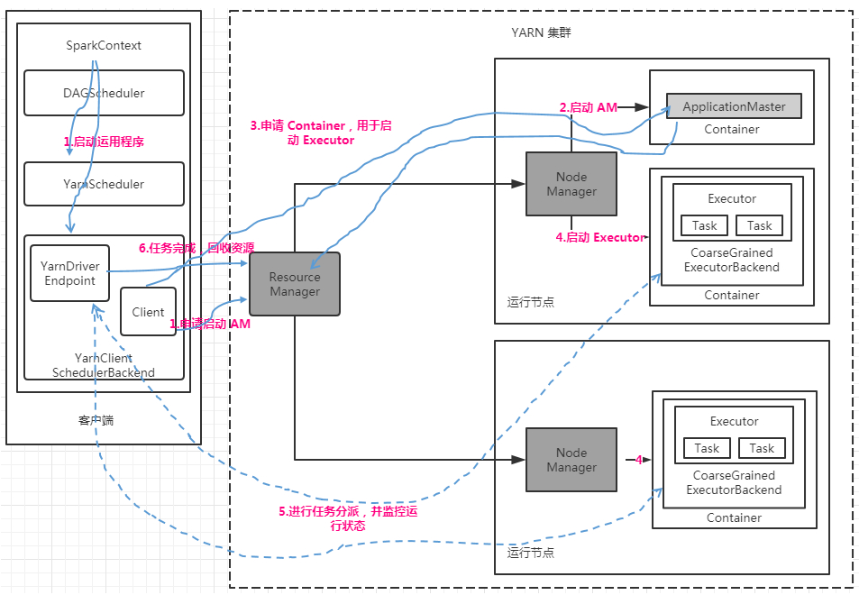
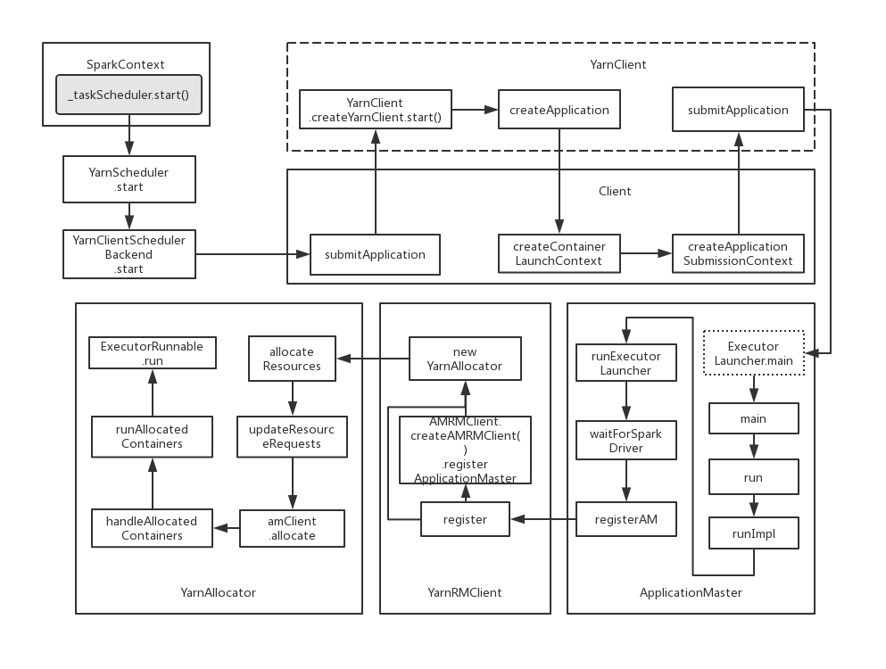

# 【Spark】Spark 运行架构--YARN-Client

本篇结构：

* YARN-Client 工作流程图
* YARN-Client 工作流程
* YARN-Client 模式启动类图
* YARN-Client 实现原理
* YARN-Client 作业运行调用图

## 一、YARN-Client 工作流程图



## 二、YARN-Client 工作流程

1. 启动运用程序，main 函数方法中会启动 SparkContext，在 SparkContext 启动过程，会构建 DAGScheduler，利用反射构建 YarnScheduler（TaskScheduler）和 YarnClientSchedulerBackend（SchedulerBackend）。YarnClientSchedulerBackend 内部又会启动 YarnDriverEndpoint 和 Client，接着 Client 向 Yarn 集群的 ResourceManager 申请启动 ApplicationMaster。
2. RM 收到请求，在集群中选择一个 NodeManager，为该应用程序分配第一个 Container，在该 Container 中启动应用程序的 ApplicationMaster（AM），和 YARN-Cluster 不同，YARN-Client 在 AM 中不运行 SparkContext，只与 SparkContext 进行联系进行资源的分派。
3. 客户端的 SparkContext 启动完毕后，与 AM 建立通信，向 ResourceManager 注册，根据任务信息向 RM 申请资源（Container）。
4. 一旦 AM 申请到资源（即 Container）后，便与对应的 NodeManager 通信，要求它在获得的 Container 中启动  CoarseGrainedExecutorBackend ，CoarseGrainedExecutorBackend 启动后会向客户端的 SparkContext 注册并等待接收任务集。
5. 客户端的 SparkContext 分配任务集给 CoarseGrainedExecutorBackend  执行，CoarseGrainedExecutorBackend  运行任务并向终端点 YarnDriverEndpoint 汇报运行的状态和进度，让客户端随时掌握各个任务的运行状态，从而可以在任务失败时重新启动任务。
6. 程序运行结束后，客户端 SparkContext 向 RM 申请注销并关闭自身。

## 三、YARN-Client 模式启动类图

先大致画个 YARN-Clinet 运行模式应用程序启动类图：



## 四、YARN-Client 实现原理

1. SparkContext 启动时，通过 createTaskScheduler 构建 TaskScheduler 和 SchedulerBackend 两个对象，具体在 YARN-Client 模式，创建 TaskScheduler 实现 YarnScheduler 和 SchedulerBackend 实现 YarnClientSchedulerBackend。其中 YarnScheduler 完全继承 TaskSchedulerImpl，只重写了 getRackForHost() 方法。来看 SparkContext # createTaskScheduler：

   ```scala
   ...
   case masterUrl =>
     // 对于 Yarn 模式，获取的是 YarnClusterManager
     val cm = getClusterManager(masterUrl) match {
       case Some(clusterMgr) => clusterMgr
       case None => throw new SparkException("Could not parse Master URL: '" + master + "'")
     }
     try {
       val scheduler = cm.createTaskScheduler(sc, masterUrl)
       val backend = cm.createSchedulerBackend(sc, masterUrl, scheduler)
       cm.initialize(scheduler, backend)
       (backend, scheduler)
     } catch {
       case se: SparkException => throw se
       case NonFatal(e) =>
         throw new SparkException("External scheduler cannot be instantiated", e)
     }
   ...
   ```

   分别具体看 createTaskScheduler，createSchedulerBackend：

   YarnClusterManager # createTaskScheduler：

   ```scala
   override def createTaskScheduler(sc: SparkContext, masterURL: String): TaskScheduler = {
     sc.deployMode match {
       case "cluster" => new YarnClusterScheduler(sc)
       // 对于 YARN-Clinet，创建 YarnScheduler 对象
       case "client" => new YarnScheduler(sc)
       case _ => throw new SparkException(s"Unknown deploy mode '${sc.deployMode}' for Yarn")
     }
   }
   ```

   YarnClusterManager # createSchedulerBackend：

   ```scala
   override def createSchedulerBackend(sc: SparkContext,
       masterURL: String,
       scheduler: TaskScheduler): SchedulerBackend = {
     sc.deployMode match {
       case "cluster" =>
         new YarnClusterSchedulerBackend(scheduler.asInstanceOf[TaskSchedulerImpl], sc)
       case "client" =>
         new YarnClientSchedulerBackend(scheduler.asInstanceOf[TaskSchedulerImpl], sc)
       case  _ =>
         throw new SparkException(s"Unknown deploy mode '${sc.deployMode}' for Yarn")
     }
   }
   ```

   由上述源码可确认，**YARN-Client 模式，SparkContext 初始化时创建的两个重要类分别是 YarnScheduler（TaskScheduler）、YarnClientSchedulerBackend（SchedulerBackend）**。

   SparkContext 创建上述两个对象后，调用 _taskScheduler.start() 方法，在该方法中，会调用 backend.start() 方法，而在 YarnClientSchedulerBackend 的 start() 方法中，启动 Client，并在 client.submitApplication() 方法中申请启动 AM，同时会调用 super.start 启动 DriverEndpoint。

   YarnClientSchedulerBackend # start：

   ```scala
   override def start() {
     val driverHost = conf.get("spark.driver.host")
     val driverPort = conf.get("spark.driver.port")
     val hostport = driverHost + ":" + driverPort
     sc.ui.foreach { ui => conf.set("spark.driver.appUIAddress", ui.webUrl) }

     val argsArrayBuf = new ArrayBuffer[String]()
     argsArrayBuf += ("--arg", hostport)

     logDebug("ClientArguments called with: " + argsArrayBuf.mkString(" "))
     val args = new ClientArguments(argsArrayBuf.toArray)
     totalExpectedExecutors = SchedulerBackendUtils.getInitialTargetExecutorNumber(conf)
     client = new Client(args, conf)
     bindToYarn(client.submitApplication(), None)

     // SPARK-8687: Ensure all necessary properties have already been set before
     // we initialize our driver scheduler backend, which serves these properties
     // to the executors
     super.start()
     waitForApplication()

     // SPARK-8851: In yarn-client mode, the AM still does the credentials refresh. The driver
     // reads the credentials from HDFS, just like the executors and updates its own credentials
     // cache.
     if (conf.contains("spark.yarn.credentials.file")) {
       YarnSparkHadoopUtil.startCredentialUpdater(conf)
     }
     monitorThread = asyncMonitorApplication()
     monitorThread.start()
   }
   ```

   在 client.submitApplication() 方法中，会判断 ResourceManager 是否有足够的资源，如果资源足够，则构造用于启动 ApplicationMaster 环境并提交应用程序到 YARN 集群中。

    Client # submitApplication：

   ```scala
   def submitApplication(): ApplicationId = {
     var appId: ApplicationId = null
     try {
       launcherBackend.connect()
       // Setup the credentials before doing anything else,
       // so we have don't have issues at any point.
       setupCredentials()
       // 初始化 yarnClient，用于和 YARN 集群交互
       yarnClient.init(hadoopConf)
       yarnClient.start()

       logInfo("Requesting a new application from cluster with %d NodeManagers"
         .format(yarnClient.getYarnClusterMetrics.getNumNodeManagers))

       // Get a new application from our RM
       // 向 RM 申请应用程序编号
       val newApp = yarnClient.createApplication()
       val newAppResponse = newApp.getNewApplicationResponse()
       appId = newAppResponse.getApplicationId()

       new CallerContext("CLIENT", sparkConf.get(APP_CALLER_CONTEXT),
         Option(appId.toString)).setCurrentContext()

       // Verify whether the cluster has enough resources for our AM
       // 查证是否有足够的资源启动 AM
       verifyClusterResources(newAppResponse)

       // Set up the appropriate contexts to launch our AM
       // 构造适当的环境用于启动 AM
       val containerContext = createContainerLaunchContext(newAppResponse)
       val appContext = createApplicationSubmissionContext(newApp, containerContext)

       // Finally, submit and monitor the application
       logInfo(s"Submitting application $appId to ResourceManager")
       // 向 RM 提交并监控应用程序
       yarnClient.submitApplication(appContext)
       launcherBackend.setAppId(appId.toString)
       reportLauncherState(SparkAppHandle.State.SUBMITTED)

       appId
     } catch {
       case e: Throwable =>
         if (appId != null) {
           cleanupStagingDir(appId)
         }
         throw e
     }
   }
   ```

2. 当 ResourceManager 收到请求后，在集群中选择一个 NodeManager 并启动 ExecutorLauncher，在 ExecutorLauncher 初始化中启动 ApplicationMaster。启动 ExecutorLauncher 是在 Client.createContainerLaunchContext 方法指定。

   ```scala
   private def createContainerLaunchContext(newAppResponse: GetNewApplicationResponse)
     : ContainerLaunchContext = {
     ...
     val amClass =
       if (isClusterMode) {
         Utils.classForName("org.apache.spark.deploy.yarn.ApplicationMaster").getName
       } else {
         Utils.classForName("org.apache.spark.deploy.yarn.ExecutorLauncher").getName
       }
   ...
   }
   ```

3. ExecutorLauncher  启动后，在其 main 方法中调用 ApplicationMaster.main 方法，ApplicationMaster main 方法调用其 run 方法，在 run 方法调用 runExecutorLauncher，接着在 runExecutorLauncher 中调用 registerAM，registerAM 方法由 ResourceManager 向终端点 DriverEndpoint 发送消息通知 ApplicationMaster 已经启动完毕。然后 ApplicationMaster 通过 YarnAllocator 的 allocateResources 方法向 ResourceManager 申请资源（Container）。

   ApplicationMaster # registerAM：

   ```scala
   private def registerAM(
       _sparkConf: SparkConf,
       _rpcEnv: RpcEnv,
       driverRef: RpcEndpointRef,
       uiAddress: Option[String]) = {
     // 获取应用程序和 Attempt 编号
     val appId = client.getAttemptId().getApplicationId().toString()
     val attemptId = client.getAttemptId().getAttemptId().toString()
     val historyAddress = ApplicationMaster
       .getHistoryServerAddress(_sparkConf, yarnConf, appId, attemptId)

     // 获取 DriverEndpoint 终端点引用
     val driverUrl = RpcEndpointAddress(
       _sparkConf.get("spark.driver.host"),
       _sparkConf.get("spark.driver.port").toInt,
       CoarseGrainedSchedulerBackend.ENDPOINT_NAME).toString

     // Before we initialize the allocator, let's log the information about how executors will
     // be run up front, to avoid printing this out for every single executor being launched.
     // Use placeholders for information that changes such as executor IDs.
     logInfo {
       val executorMemory = sparkConf.get(EXECUTOR_MEMORY).toInt
       val executorCores = sparkConf.get(EXECUTOR_CORES)
       val dummyRunner = new ExecutorRunnable(None, yarnConf, sparkConf, driverUrl, "<executorId>",
         "<hostname>", executorMemory, executorCores, appId, securityMgr, localResources)
       dummyRunner.launchContextDebugInfo()
     }

     // 在 ResouceManager 发送消息通知 DriverEndpoint，通知其 AM 已经启动
     allocator = client.register(driverUrl,
       driverRef,
       yarnConf,
       _sparkConf,
       uiAddress,
       historyAddress,
       securityMgr,
       localResources)

     // Initialize the AM endpoint *after* the allocator has been initialized. This ensures
     // that when the driver sends an initial executor request (e.g. after an AM restart),
     // the allocator is ready to service requests.
     rpcEnv.setupEndpoint("YarnAM", new AMEndpoint(rpcEnv, driverRef))

     // 申请 Executor 的资源
     allocator.allocateResources()
     reporterThread = launchReporterThread()
   }
   ```

4. 在 YarnAllocator.allocateResources 中获取可用的 Container，如果获取到了 Container，YarnAllocator 调用 handleAllocatedContainers 方法，做一些处理后接着调用  runAllocatedContainers 方法，在该方法中，以线程池执行线程 ExecutorRunnable，ExecutorRunnable run 中，调用 startContainer 启动 Container，Container 中运行的是 CoarseGrainedExecutorBackend（可由 startContainer 调用的 prepareCommand 方法看出）。

   ```scala
   private def runAllocatedContainers(containersToUse: ArrayBuffer[Container]): Unit = {
     for (container <- containersToUse) {
       // 更新计数器
       executorIdCounter += 1
       val executorHostname = container.getNodeId.getHost
       val containerId = container.getId
       val executorId = executorIdCounter.toString
       assert(container.getResource.getMemory >= resource.getMemory)
       logInfo(s"Launching container $containerId on host $executorHostname " +
         s"for executor with ID $executorId")

       def updateInternalState(): Unit = synchronized {
         runningExecutors.add(executorId)
         numExecutorsStarting.decrementAndGet()
         executorIdToContainer(executorId) = container
         containerIdToExecutorId(container.getId) = executorId
         val containerSet = allocatedHostToContainersMap.getOrElseUpdate(executorHostname,
           new HashSet[ContainerId])
         // 在机器与 Container 列表中加入当前 Container 信息
         containerSet += containerId
         allocatedContainerToHostMap.put(containerId, executorHostname)
       }

       if (runningExecutors.size() < targetNumExecutors) {
         numExecutorsStarting.incrementAndGet()
         if (launchContainers) {
           launcherPool.execute(new Runnable {
             override def run(): Unit = {
               try {
                 // ExecutorRunnable 加入线程池中调用，ExecutorRunnable run 方法会启动 Container 并将 CoarseGrainedExecutorBackend
                 // 传给 Container 启动
                 new ExecutorRunnable(
                   Some(container),
                   conf,
                   sparkConf,
                   driverUrl,
                   executorId,
                   executorHostname,
                   executorMemory,
                   executorCores,
                   appAttemptId.getApplicationId.toString,
                   securityMgr,
                   localResources
                 ).run()
                 updateInternalState()
               } catch {
                 case e: Throwable =>
                   numExecutorsStarting.decrementAndGet()
                   if (NonFatal(e)) {
                     logError(s"Failed to launch executor $executorId on container $containerId", e)
                     // Assigned container should be released immediately
                     // to avoid unnecessary resource occupation.
                     amClient.releaseAssignedContainer(containerId)
                   } else {
                     throw e
                   }
               }
             }
           })
         } else {
           // For test only
           updateInternalState()
         }
       } else {
         logInfo(("Skip launching executorRunnable as running executors count: %d " +
           "reached target executors count: %d.").format(
           runningExecutors.size, targetNumExecutors))
       }
     }
   }
   ```

5. SparkContext 收到 CoarseGrainedExecutorBackend 发出的 RegisterExecutor 注册消息后，回复 RegisteredExecutor 消息， CoarseGrainedExecutorBackend  收到消息创建 Executor 等待接收任务集运行，SparkContext 分配任务集给 Executor 并跟踪运行状态，和 Standalone 运行模式是一致的。

6. 运用程序运行完成后，SparkContext 向 ResourceManager 申请注销并关闭。

## 五、YARN-Client 作业运行调用图

