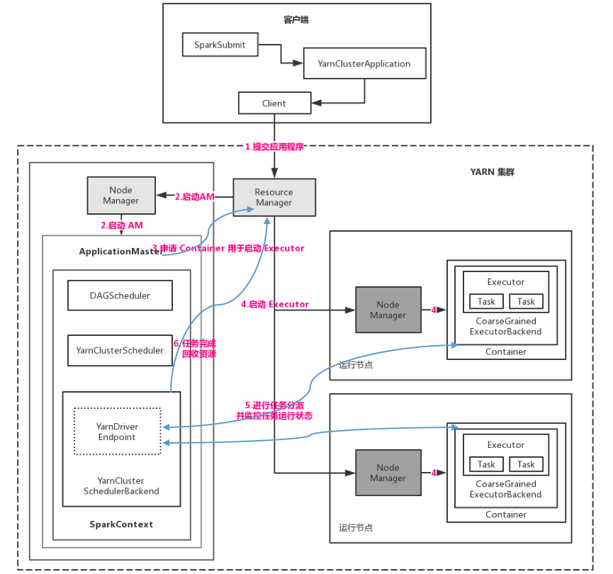
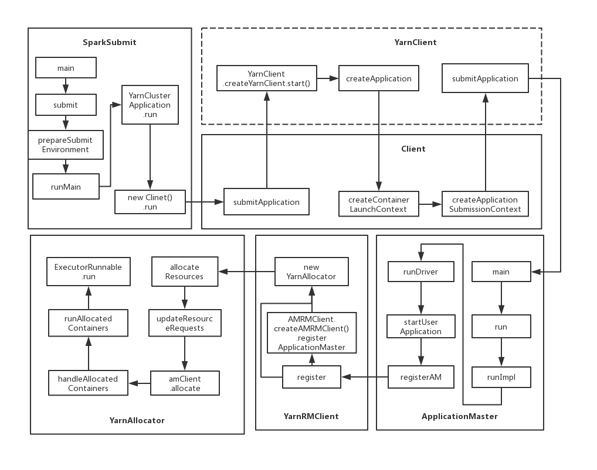
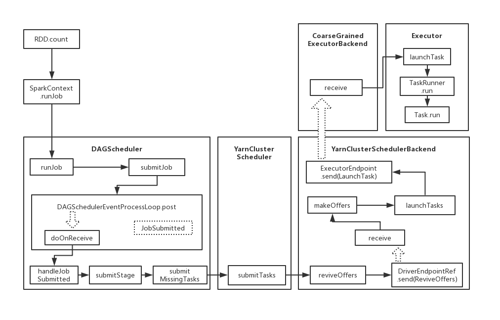

# 【Spark】Spark 运行架构--YARN-Cluster

本篇结构：

* YARN-Cluster 工作流程图
* YARN-Cluster 工作流程
* YARN-Cluster 模式启动类图
* YARN-Cluster 实现原理
* YARN-Cluster 作业运行调用图

## 一、YARN-Cluster 工作流程图



## 二、YARN-Cluster 工作流程

1. 客户端通过 spark-submit 提交应用程序，反射生成 YarnClusterApplication，在其 start 方法中构造 Client，并调用 Client.run 向 YARN 中提交程序，包括 ApplicationMaster 的命令、提交给 ApplicationMaster 的程序和需要在 Executor 中运行的程序等。
2. ResourceManager 收到请求后，在集群中选择一个 NodeManager，分配第一个 Container，并在 Container 中启动应用程序的 ApplicationMaster，其中 ApplicationMaster 进行 SparkContext 的初始化。
3. ApplicationMaster 向 ResourceManager 注册，这样用户可以直接通过 ResourceManager 查看应用程序的运行状态，然后它将采用轮询的方式为各个任务申请资源，并监控它们的运行状态直至结束。
4. 如果 ApplicationMaster 申请到资源（Container）后，便与对应的 NodeManager 进行通信，要求其在 Container 中启动 CoarseGrainedExecutorBackend，CoarseGrainedExecutorBackend 启动后和 Standalone 模式一样向 SparkContext 注册，只不过这里的 SparkContext 运行在 ApplicationMaster 中，注册后，CoarseGrainedExecutorBackend 等待分配任务执行。
5. AM 中的 SparkContext 分配任务集给 CoarseGrainedExecutorBackend ，提交任务是在 YarnClusterScheduler 中，具体资源的协商是在 CoarseGrainedSchedulerBackend（YarnClusterSchedulerBackend） 中。CoarseGrainedExecutorBackend 运行任务并向 SparkContext 的 DriverEndpoint 汇报运行状态和进度，如果失败，以便进行重试。
6. 程序结束后，AM 向 RM 申请注销并关闭。

## 三、YARN-Cluster 模式启动类图



## 四、YARN-Cluster 实现原理

1. 和 Client 模式不同，Cluster 模式在 SparkSubmit 的 runMain 方法中创建的 SparkApplication 不同，Client 创建的是包装 mainClass（也即通过 --class 参数传递的主类）的 JavaMainApplication，而 Cluster 模式创建的是 SparkApplication（YARN-Cluster 中是 YarnClusterApplication）。

   ```scala
   val app: SparkApplication = if (classOf[SparkApplication].isAssignableFrom(mainClass)) {
     mainClass.newInstance().asInstanceOf[SparkApplication]
   } else {
     // SPARK-4170
     if (classOf[scala.App].isAssignableFrom(mainClass)) {
       printWarning("Subclasses of scala.App may not work correctly. Use a main() method instead.")
     }
     new JavaMainApplication(mainClass)
   }
   ```

   **然后运行 app.start 方法，对 Client 而言，是通过反射运行 mainClass，在 mainClass 中初始化 SparkContext，SparkContext 是运行在客户端，而 YARN-Cluster 则是通过 Client 向 YARN 集群的 ResourceManager 申请 Container 运行 ApplicationMaster，然后在 ApplicationMaster 中启动线程运行 SparkContext，SparkContext 运行在集群中的某个 NodeManager 的 ApplicationMaster 中。**

   ```scala
   private[spark] class YarnClusterApplication extends SparkApplication {
   
     override def start(args: Array[String], conf: SparkConf): Unit = {
       // SparkSubmit would use yarn cache to distribute files & jars in yarn mode,
       // so remove them from sparkConf here for yarn mode.
       conf.remove("spark.jars")
       conf.remove("spark.files")
   
       new Client(new ClientArguments(args), conf).run()
     }
   
   }
   ```

2. YARN-Cluster 中 Client 向 ResourceManager 申请 Container 运行 ApplicationMaster 的过程和 YARN-Client 中是一样的，可以参考 YARN-Client 篇的第四节的1、2 段。ApplicationMaster 启动后在 main 方法调用其 run 方法，在 run 方法调用 runImpl，runImpl 中调用的是 runDriver，这里和 YARN-Client 不同，YARN-Client 调用的是 runExecutorLauncher。SparkContext 就是在 runDriver 中初始化的，看 ApplicationMaster 的 runDriver 方法。

   ```scala
   private def runDriver(): Unit = {
     addAmIpFilter(None)
     // 启动应用程序线程
     userClassThread = startUserApplication()
   
     // This a bit hacky, but we need to wait until the spark.driver.port property has
     // been set by the Thread executing the user class.
     logInfo("Waiting for spark context initialization...")
     val totalWaitTime = sparkConf.get(AM_MAX_WAIT_TIME)
     try {
       // 等待 SparkContext 初始化，默认 100s
       val sc = ThreadUtils.awaitResult(sparkContextPromise.future,
         Duration(totalWaitTime, TimeUnit.MILLISECONDS))
       // 判断是否成功启动 SparkContext
       if (sc != null) {
         rpcEnv = sc.env.rpcEnv
         val driverRef = createSchedulerRef(
           sc.getConf.get("spark.driver.host"),
           sc.getConf.get("spark.driver.port"))
         // registerAM 中，由 ResourceManager 向 DriverEndpoint 发送消息 AM 已经启动
         registerAM(sc.getConf, rpcEnv, driverRef, sc.ui.map(_.webUrl))
         registered = true
       } else {
         // Sanity check; should never happen in normal operation, since sc should only be null
         // if the user app did not create a SparkContext.
         throw new IllegalStateException("User did not initialize spark context!")
       }
       resumeDriver()
       userClassThread.join()
     } catch {
       case e: SparkException if e.getCause().isInstanceOf[TimeoutException] =>
         logError(
           s"SparkContext did not initialize after waiting for $totalWaitTime ms. " +
            "Please check earlier log output for errors. Failing the application.")
         finish(FinalApplicationStatus.FAILED,
           ApplicationMaster.EXIT_SC_NOT_INITED,
           "Timed out waiting for SparkContext.")
     } finally {
       resumeDriver()
     }
   }
   ```

   runDriver 中调用 startUserApplication 以反射的方式启动 mainClass，即编写的应用程序，进而初始化 SparkContext，这里是和 YARN-Client 模式的最大区别。

   ```scala
   private def startUserApplication(): Thread = {
     logInfo("Starting the user application in a separate Thread")
   
     var userArgs = args.userArgs
     if (args.primaryPyFile != null && args.primaryPyFile.endsWith(".py")) {
       // When running pyspark, the app is run using PythonRunner. The second argument is the list
       // of files to add to PYTHONPATH, which Client.scala already handles, so it's empty.
       userArgs = Seq(args.primaryPyFile, "") ++ userArgs
     }
     if (args.primaryRFile != null && args.primaryRFile.endsWith(".R")) {
       // TODO(davies): add R dependencies here
     }
   
     val mainMethod = userClassLoader.loadClass(args.userClass)
       .getMethod("main", classOf[Array[String]])
   
     val userThread = new Thread {
       override def run() {
         try {
           mainMethod.invoke(null, userArgs.toArray)
           finish(FinalApplicationStatus.SUCCEEDED, ApplicationMaster.EXIT_SUCCESS)
           logDebug("Done running users class")
         } catch {
           case e: InvocationTargetException =>
             e.getCause match {
               case _: InterruptedException =>
                 // Reporter thread can interrupt to stop user class
               case SparkUserAppException(exitCode) =>
                 val msg = s"User application exited with status $exitCode"
                 logError(msg)
                 finish(FinalApplicationStatus.FAILED, exitCode, msg)
               case cause: Throwable =>
                 logError("User class threw exception: " + cause, cause)
                 finish(FinalApplicationStatus.FAILED,
                   ApplicationMaster.EXIT_EXCEPTION_USER_CLASS,
                   "User class threw exception: " + StringUtils.stringifyException(cause))
             }
             sparkContextPromise.tryFailure(e.getCause())
         } finally {
           // Notify the thread waiting for the SparkContext, in case the application did not
           // instantiate one. This will do nothing when the user code instantiates a SparkContext
           // (with the correct master), or when the user code throws an exception (due to the
           // tryFailure above).
           sparkContextPromise.trySuccess(null)
         }
       }
     }
     userThread.setContextClassLoader(userClassLoader)
     userThread.setName("Driver")
     userThread.start()
     userThread
   }
   ```

3. SparkContext 启动过程中，通过 createTaskScheduler 构建 TaskScheduler 和 SchedulerBackend 两个对象，具体在 YARN-Cluster 模式，创建 TaskScheduler 的实现 YarnClusterScheduler 和 SchedulerBackend 的实现 YarnClusterSchedulerBackend。其中 YarnClusterScheduler 只重写 TaskSchedulerImpl 的 postStartHook() 方法。来看 SparkContext # createTaskScheduler：

```scala
...
case masterUrl =>
  // 对于 Yarn 模式，获取的是 YarnClusterManager
  val cm = getClusterManager(masterUrl) match {
    case Some(clusterMgr) => clusterMgr
    case None => throw new SparkException("Could not parse Master URL: '" + master + "'")
  }
  try {
    val scheduler = cm.createTaskScheduler(sc, masterUrl)
    val backend = cm.createSchedulerBackend(sc, masterUrl, scheduler)
    cm.initialize(scheduler, backend)
    (backend, scheduler)
  } catch {
    case se: SparkException => throw se
    case NonFatal(e) =>
      throw new SparkException("External scheduler cannot be instantiated", e)
  }
...
```

分别具体看 createTaskScheduler，createSchedulerBackend：

YarnClusterManager # createTaskScheduler：

```scala
override def createTaskScheduler(sc: SparkContext, masterURL: String): TaskScheduler = {
  sc.deployMode match {
    // 对于 YARN-Cluster，创建 YarnClusterScheduler 对象
    case "cluster" => new YarnClusterScheduler(sc)
    // 对于 YARN-Client，创建 YarnScheduler 对象
    case "client" => new YarnScheduler(sc)
    case _ => throw new SparkException(s"Unknown deploy mode '${sc.deployMode}' for Yarn")
  }
}
```

YarnClusterManager # createSchedulerBackend：

```scala
override def createSchedulerBackend(sc: SparkContext,
    masterURL: String,
    scheduler: TaskScheduler): SchedulerBackend = {
  sc.deployMode match {
    case "cluster" =>
      new YarnClusterSchedulerBackend(scheduler.asInstanceOf[TaskSchedulerImpl], sc)
    case "client" =>
      new YarnClientSchedulerBackend(scheduler.asInstanceOf[TaskSchedulerImpl], sc)
    case  _ =>
      throw new SparkException(s"Unknown deploy mode '${sc.deployMode}' for Yarn")
  }
}
```

由上述源码可确认，**YARN-Cluster 模式，SparkContext 初始化时创建的两个重要类分别是 YarnClusterScheduler（TaskScheduler）、YarnClusterSchedulerBackend（SchedulerBackend）**。

SparkContext 创建上述两个对象后，调用 _taskScheduler.start() 方法，在该方法中，会调用 backend.start() 方法，而在 YarnClusterSchedulerBackend 的 start() 方法，YarnClusterSchedulerBackend 不会再创建 Client，只调用其父类创建 DriverEndpoint。

```scala
override def start() {
  require(appId.isDefined, "application ID unset")
  val binding = SchedulerExtensionServiceBinding(sc, appId.get, attemptId)
  services.start(binding)
  super.start()
}
```

4. ApplicationMaster 启动后，runDriver 方法调用 registerAM，registerAM 方法中，由 ResourceManager 向终端点 DriverEndpoint 发消息通知 AM 已经启动，然后还是 registerAM  方法 YarnAllocator 的 allocateResources 方法向 ResourceManager 申请资源（Container），处理流程与 YARN-Client 一样。
5. YarnAllocator 获取 Container 后， 调用 runAllocatedContainers 方法，在该方法中调用 ExecutorRunnable 的 run 方法在 Container 中启动 CoarseGrainedExecutorBackend。CoarseGrainedExecutorBackend 启动后向 AM 中的 SparkContext 发送 RegisterExecutor 消息注册，等待分配任务运行，该步和 YARN-Client 也相同。
6. AM 中的 SparkContext 分配任务集给 CoarseGrainedExecutorBackend 执行，CoarseGrainedExecutorBackend 运行任务并向 SparkContext 的 DriverEndpoint 汇报运行状态和进度，以便失败进行重试。
7. 运用程序运行完成后，SparkContext 向 ResourceManager 申请注销并关闭。

## 五、YARN-Cluster 作业运行调用图

作业运行都差不多，主要是实现类不同。

