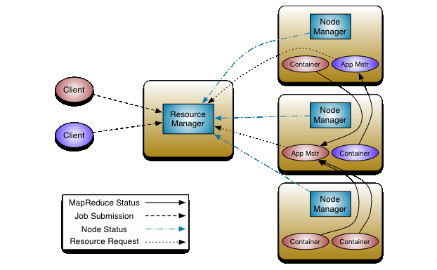
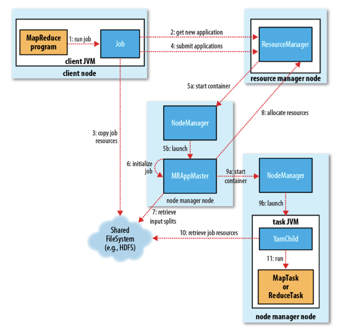

# 【Spark】Spark 运行架构--YARN 运行模式

本篇结构：

* 运行架构组成
* 运行模式介绍
* 两个重要类 TaskScheduler 和 SchedulerBackend
* yarn 运行模式
* YARN-Client 和 YARN-Cluster 的区别

## 一、运行架构组成

Spark 运行架构主要由三部分组成：

* SparkContext：Spark 运行上下文，通常可以认为是 Driver 端，负责与 ClusterManager 通信，进行资源申请、认为分配和监控，负责作业执行的全部生命周期。
* ClusterManager：集群资源管理器，提供资源的分配和管理。Standalone 模式下，由 Master 担任，yarn 模式，由 Resource Manager 担任，Mesos   模式下，由 Mesos Manager 担任。
* Executor：任务执行进程，真正运行任务的程序。

## 二、运行模式介绍

虽然 Spark 有不同的运行模式，但这三部分是 Spark 运行架构的基础，区别不大。

Spark 主要有五种运行模式，分别是：

* local 本地模式：该模式主要用作测试用，一般编写的 spark 程序，将 master 设置为 local 或者 local[n]，以本地模式运行，所有的代码都在一个 Jvm 里面。
* 伪分布式模式：该模式所有的 Driver 和 Executor 都运行在同一台机器，在单机上模拟集群环境，和 Standalone 模式运行过程大致相同。
* Standalone 模式：该模式由 Spark 自带的集群管理模式，不依赖外部的资源管理器，由 Master 负责资源的分配管理，Worker 负责运行 Executor  ，具体的运行过程可参考之前介绍 Spark 运行模式的篇章。
* yarn 模式：该模式由 yarn 负责管理整个集群资源，不再有 Master 和 Worker，根据 yarn-client 和 yarn-cluster 的不同，Driver 分为运行在 Client 和 NodeManager 之中，Executor 统一运行在 NodeManager 中。
* Mesos 模式：和 yarn 一样，Mesos 中，Spark 的资源管理从 Standalone 的 Master 转移到 Mesos Manager 中。

local 模式较简单可自行看源码，伪分布式和 Standalone 模式基本类似，已经介绍，下面重点介绍 YARN 模式。

## 三、两个重要类 TaskScheduler 和 SchedulerBackend

* TaskScheduler：是 Spark 的任务调度器，负责具体任务的调度执行，接收任务运行状态。TaskSchedulerImpl 是其最重要的实现类，实现了其所有方法，孙子类 YarnScheduler 和 YarnClusterScheduler 只实现了其中一两个方法。

* SchedulerBackend：是 Spark 的调度不同架构资源的接口，它负责应用程序运行期间与底层资源调度系统交互。根据运行模式的不同其实现类有，本地运行模式的 LocalSchedulerBackend、粗粒度运行模式的 CoarseGrainedSchedulerBackend、细粒度 Mesos 运行模式的 MesosFineGrainedSchedulerBackend。粗粒度运行模式包括 Standalone 模式的 StandaloneSchedulerBackend、yarn 运行模式的 YarnSchedulerBackend（根据 yarn-client 的 YarnClientSchedulerBackend 和 yarn-cluster 的 YarnClusterSchedulerBackend）、粗粒度 Mesos 运行模式的 MesosCoarseGrainedSchedulerBackend。

## 四、YARN 运行模式

YARN 架构图：

- ResourceManager: 控制整个集群并管理应用程序向基础计算资源的分配。ResourceManager 将各个资源部分（计算、内存、带宽等）精心安排给基础 NodeManager。
- NodeManager: 管理一个 YARN 集群中的每个节点。NodeManage r提供针对集群中每个节点的服务，从监督对一个容器的终生管理到监视资源和跟踪节点健康。
- ApplicationMaster: 管理在 YARN 内运行的应用程序的每个实例。负责协调来自 ResourceManager 的资源，并通过 NodeManager 监视容器的执行和资源使用（CPU、内存等的资源分配）。
- Container: 对任务运行环境进行抽象，封装 CPU、内存等多维度的资源以及环境变量、启动命令等任务运行相关的信息。比如内存、CPU、磁盘、网络等，当 AM 向 RM 申请资源时，RM 为 AM 返回的资源便是用Container 表示的。YARN 会为每个任务分配一个 Container，且该任务只能使用该 Container 中描述的资源。

ResourceManager 负责整个集群资源的分配和调度，NodeManager 负责单个节点资源的管理。

要使用一个 YARN 集群，首先需要来自包含一个应用程序的客户的请求。ResourceManager 协商一个容器的必要资源，启动一个 ApplicationMaster 来表示已提交的应用程序。ApplicationMaster 与 ResourceManager 协商获取合适的 Contailner 供应用程序任务使用，并跟踪这些 Container 的状态和监控其进度。当应用程序完成时，ApplicationMaster 从 ResourceManager 注销其容器，执行周期就完成了。

## 五、YARN-Client 和 YARN-Cluster 的区别

在 YARN 中，每个 Application 实例都有一个 Application Master 进程，它是 Application 启动的第一个容器。它负责和 Resource Manager 打交道并请求资源，获取资源后告诉 NodeManager 为其启动 Container。

YARN-Client 和 YARN-Cluster 的区别可以认为就是 Application Master 进程的区别。

* YARN-Client 模式， 客户端由 SparkSubmit 通过 JavaMainApplication 反射创建 mainClass 对象，也即应用程序，初始化 SparkContext，接着在客户端启动 Client，由 Client 向 YARN ResourceManager 申请资源启动 ApplicationMaster。ApplicationMaster 负责和  Resource Manager 打交道并请求资源，SparkContext 运行在客户端，分配任务给 Container 中的 CoarseGrainedExecutorBackend 运行，并监控任务运行状态和进度。因此 Client 不能离开。
* YARN-Cluster 模式，客户端由 SparkSubmit 通过 YarnClusterApplication 启动 Client，由 Client  向 YARN ResourceManager 申请资源启动 ApplicationMaster，接着在 ApplicationMaster 中通过反射的方式调用 mainClass 的 main 方法启动应用程序，初始化 SparkContext。SparkContext 运行在 ApplicationMaster 中，因此已经提交作业后，就可以关闭 Client。

YARN-Client 和 YARN-Cluster 具体剖析详见后两篇。

