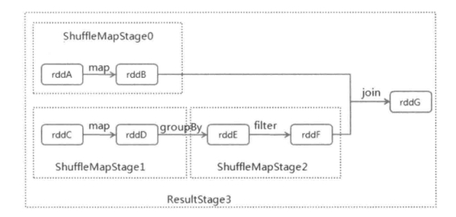

# 【Spark】Spark作业执行原理--划分调度阶段

本篇结构：

- 划分调度阶段
- 实例解析

## 一、划分调度阶段

Spark 调度阶段的划分是由 DAGScheduler 实现的，它会从最后一个 RDD 出发遍历整个依赖树，从而划分调度阶段，调度阶段的划分是以操作是否为**宽依赖**进行的。即当某个 RDD 的操作时 shuffle 时，以该 shuffle 操作为界限将划分成前后两个调度阶段。

划分调度阶段的逻辑是在 DAGScheduler 的 handleJobSubmitted 方法中：

```scala
  private[scheduler] def handleJobSubmitted(jobId: Int,
      finalRDD: RDD[_],
      func: (TaskContext, Iterator[_]) => _,
      partitions: Array[Int],
      callSite: CallSite,
      listener: JobListener,
      properties: Properties) {
    var finalStage: ResultStage = null
    try {
      // New stage creation may throw an exception if, for example, jobs are run on a
      // HadoopRDD whose underlying HDFS files have been deleted.
      finalStage = createResultStage(finalRDD, func, partitions, jobId, callSite)
    } catch {
      case e: Exception =>
        logWarning("Creating new stage failed due to exception - job: " + jobId, e)
        listener.jobFailed(e)
        return
    }

    val job = new ActiveJob(jobId, finalStage, callSite, listener, properties)
    clearCacheLocs()
    logInfo("Got job %s (%s) with %d output partitions".format(
      job.jobId, callSite.shortForm, partitions.length))
    logInfo("Final stage: " + finalStage + " (" + finalStage.name + ")")
    logInfo("Parents of final stage: " + finalStage.parents)
    logInfo("Missing parents: " + getMissingParentStages(finalStage))

    val jobSubmissionTime = clock.getTimeMillis()
    jobIdToActiveJob(jobId) = job
    activeJobs += job
    finalStage.setActiveJob(job)
    val stageIds = jobIdToStageIds(jobId).toArray
    val stageInfos = stageIds.flatMap(id => stageIdToStage.get(id).map(_.latestInfo))
    listenerBus.post(
      SparkListenerJobStart(job.jobId, jobSubmissionTime, stageInfos, properties))
    submitStage(finalStage)
  }
```

handleJobSubmitted  处理作业提交，主要分两部分，一部分是划分调度阶段，另一分是提交调度阶段，这里我们重点关注划分调度阶段，下一篇再关注提交调度阶段。

调度阶段的划分集中在 createResultStage：

```scala
finalStage = createResultStage(finalRDD, func, partitions, jobId, callSite)

  /**
   * Create a ResultStage associated with the provided jobId.
   */
  private def createResultStage(
      rdd: RDD[_],
      func: (TaskContext, Iterator[_]) => _,
      partitions: Array[Int],
      jobId: Int,
      callSite: CallSite): ResultStage = {
    val parents = getOrCreateParentStages(rdd, jobId)
    val id = nextStageId.getAndIncrement()
    val stage = new ResultStage(id, rdd, func, partitions, parents, jobId, callSite)
    stageIdToStage(id) = stage
    updateJobIdStageIdMaps(jobId, stage)
    stage
  }
```

Stage 有两类，一类是 ResultStage，它在 RDD 的分区上应用一个函数来计算操作的结果，ResultStage 也是最后一个调度阶段；一类是 ShuffleMapStage，它是执行 DAG 的中间阶段。

在 createResultStage 方法中，先通过 getOrCreateParentStages(rdd, jobId)  方法创建 RDD 的父调度阶段，再创建 ResultStage 返回。

来看 getOrCreateParentStages：

```scala
  /**
   * Get or create the list of parent stages for a given RDD.  The new Stages will be created with
   * the provided firstJobId.
   */
  private def getOrCreateParentStages(rdd: RDD[_], firstJobId: Int): List[Stage] = {
    getShuffleDependencies(rdd).map { shuffleDep =>
      getOrCreateShuffleMapStage(shuffleDep, firstJobId)
    }.toList
  }
```

先通过 getShuffleDependencies 找到 rdd 依赖，这些依赖是 ShuffleDependency，而且是直接 ShuffleDependency（举个例子，如果 C 依赖 B，B 依赖 A，那么调用C 的 getShuffleDependencies  返回的是 B）。

```scala
/**
 * Returns shuffle dependencies that are immediate parents of the given RDD.
 *
 * This function will not return more distant ancestors.  For example, if C has a shuffle
 * dependency on B which has a shuffle dependency on A:
 *
 * A <-- B <-- C
 *
 * calling this function with rdd C will only return the B <-- C dependency.
 *
 * This function is scheduler-visible for the purpose of unit testing.
 */
private[scheduler] def getShuffleDependencies(
    rdd: RDD[_]): HashSet[ShuffleDependency[_, _, _]] = {
  val parents = new HashSet[ShuffleDependency[_, _, _]]
  val visited = new HashSet[RDD[_]]
  val waitingForVisit = new Stack[RDD[_]]
  waitingForVisit.push(rdd)
  while (waitingForVisit.nonEmpty) {
    val toVisit = waitingForVisit.pop()
    if (!visited(toVisit)) {
      visited += toVisit
      toVisit.dependencies.foreach {
        case shuffleDep: ShuffleDependency[_, _, _] =>
          parents += shuffleDep
        case dependency =>
          waitingForVisit.push(dependency.rdd)
      }
    }
  }
  parents
}
```

我们知道，调度阶段的划分是依据宽依赖，也即是 ShuffleDependency，获取到 rdd 的直接 ShuffleDependency 后，就可以进行 Stage 的划分。

getOrCreateShuffleMapStage(shuffleDep, firstJobId) 就是来创建 Stage 的：

```scala
/**
 * Gets a shuffle map stage if one exists in shuffleIdToMapStage. Otherwise, if the
 * shuffle map stage doesn't already exist, this method will create the shuffle map stage in
 * addition to any missing ancestor shuffle map stages.
 */
private def getOrCreateShuffleMapStage(
    shuffleDep: ShuffleDependency[_, _, _],
    firstJobId: Int): ShuffleMapStage = {
  shuffleIdToMapStage.get(shuffleDep.shuffleId) match {
    case Some(stage) =>
      stage

    case None =>
      // Create stages for all missing ancestor shuffle dependencies.
      getMissingAncestorShuffleDependencies(shuffleDep.rdd).foreach { dep =>
        // Even though getMissingAncestorShuffleDependencies only returns shuffle dependencies
        // that were not already in shuffleIdToMapStage, it's possible that by the time we
        // get to a particular dependency in the foreach loop, it's been added to
        // shuffleIdToMapStage by the stage creation process for an earlier dependency. See
        // SPARK-13902 for more information.
        if (!shuffleIdToMapStage.contains(dep.shuffleId)) {
          createShuffleMapStage(dep, firstJobId)
        }
      }
      // Finally, create a stage for the given shuffle dependency.
      createShuffleMapStage(shuffleDep, firstJobId)
  }
}
```

getOrCreateShuffleMapStage 中，先判断 shuffleIdToMapStage 中是否已经有该 ShuffleDependency 对应的 ShuffleMapStage，有就直接返回，没有再去构建。

构建的过程先通过 getMissingAncestorShuffleDependencies 获取一个完整的 ShuffleDependency 依赖链：

```scala
  /** Find ancestor shuffle dependencies that are not registered in shuffleToMapStage yet */
  private def getMissingAncestorShuffleDependencies(
      rdd: RDD[_]): Stack[ShuffleDependency[_, _, _]] = {
    val ancestors = new Stack[ShuffleDependency[_, _, _]]
    val visited = new HashSet[RDD[_]]
    // We are manually maintaining a stack here to prevent StackOverflowError
    // caused by recursively visiting
    val waitingForVisit = new Stack[RDD[_]]
    waitingForVisit.push(rdd)
    while (waitingForVisit.nonEmpty) {
      val toVisit = waitingForVisit.pop()
      if (!visited(toVisit)) {
        visited += toVisit
        getShuffleDependencies(toVisit).foreach { shuffleDep =>
          if (!shuffleIdToMapStage.contains(shuffleDep.shuffleId)) {
            ancestors.push(shuffleDep)
            waitingForVisit.push(shuffleDep.rdd)
          } // Otherwise, the dependency and its ancestors have already been registered.
        }
      }
    }
    ancestors
  }
```

因为调度阶段是根据 ShuffleDependency 划分的，遍历 RDD 的依赖树，有多少个 ShuffleDependency  就会创建多少个 shuffleIdToMapStage，createShuffleMapStage 用于创建 shuffleIdToMapStage：

```scala
/**
 * Creates a ShuffleMapStage that generates the given shuffle dependency's partitions. If a
 * previously run stage generated the same shuffle data, this function will copy the output
 * locations that are still available from the previous shuffle to avoid unnecessarily
 * regenerating data.
 */
def createShuffleMapStage(shuffleDep: ShuffleDependency[_, _, _], jobId: Int): ShuffleMapStage = {
  val rdd = shuffleDep.rdd
  val numTasks = rdd.partitions.length
  val parents = getOrCreateParentStages(rdd, jobId)
  val id = nextStageId.getAndIncrement()
  val stage = new ShuffleMapStage(id, rdd, numTasks, parents, jobId, rdd.creationSite, shuffleDep)

  stageIdToStage(id) = stage
  shuffleIdToMapStage(shuffleDep.shuffleId) = stage
  updateJobIdStageIdMaps(jobId, stage)

  if (mapOutputTracker.containsShuffle(shuffleDep.shuffleId)) {
    // A previously run stage generated partitions for this shuffle, so for each output
    // that's still available, copy information about that output location to the new stage
    // (so we don't unnecessarily re-compute that data).
    val serLocs = mapOutputTracker.getSerializedMapOutputStatuses(shuffleDep.shuffleId)
    val locs = MapOutputTracker.deserializeMapStatuses(serLocs)
    (0 until locs.length).foreach { i =>
      if (locs(i) ne null) {
        // locs(i) will be null if missing
        stage.addOutputLoc(i, locs(i))
      }
    }
  } else {
    // Kind of ugly: need to register RDDs with the cache and map output tracker here
    // since we can't do it in the RDD constructor because # of partitions is unknown
    logInfo("Registering RDD " + rdd.id + " (" + rdd.getCreationSite + ")")
    mapOutputTracker.registerShuffle(shuffleDep.shuffleId, rdd.partitions.length)
  }
  stage
}
```

这样调度阶段就划分好了。

## 二、实例解析

以网上一个例子来说明，如下，有 7个 RDD， 分别为 rddA~rddG，它们之间有5个操作，划分调度阶段详细步骤如下：



（1）在 SparkContext 中提交运行时，经过一系列调用后 DAGScheduler 的 submitJob 提交作业，作业消息由 handleJobSubmitted 进行处理；

（2）在 handleJobSubmitted  中，会找到最后一个 RDD（即 rddG），并调用 getOrCreateParentStages 方法，该方法中通过 getShuffleDependencies 会查看 rddG 的依赖树中是否有 ShuffleDependency，这里是存在的，因为 join 操作是 shuffle 操作；

（3）找到 ShuffleDependency 后，getOrCreateShuffleMapStage 方法中用于创建 ShuffleMapStage，先从 rddB 出发，调用 getMissingAncestorShuffleDependencies 向前遍历，发现该依赖上没有宽依赖，生成调度阶段 ShuffleMapStage0；

（4）接着 从 rddF 出发，调用 getMissingAncestorShuffleDependencies 向前遍历，发现存在 shuffle 操作 groupBy，以此为界划分 stage， rddC 和 rddD 为 ShuffleMapStage1，rddE 和 rddF 为 ShuffleMapStage2；

（5）最后生成 rddG 的 ResultStage3。一共形成四个调度阶段。

