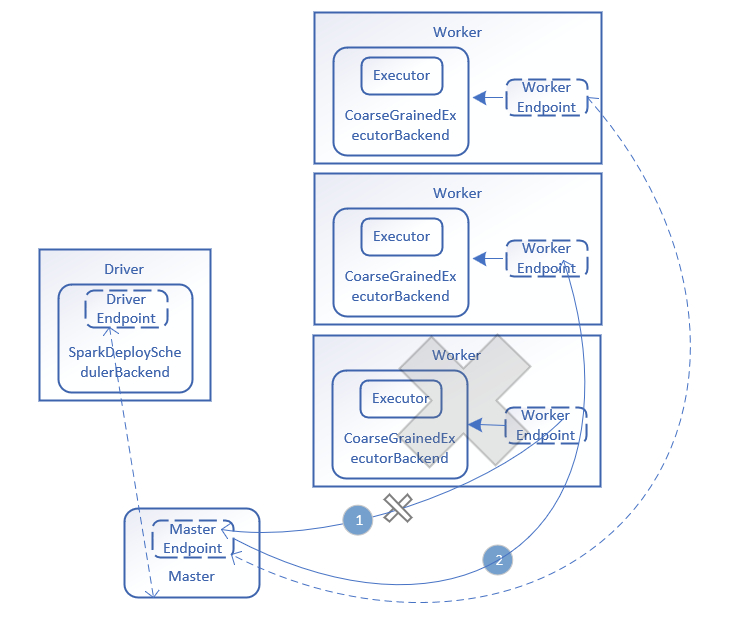

# 【Spark】Spark 容错及 HA--Worker 异常

## 一、心跳连接

Spark Standalone 是经典的 Master/Slave 结构，Slave 就是集群中的 Worker，Worker 启动后，会向 Master 注册，注册成功后会定时向 Master 发送 心跳，上报自己的状态。同时 Master 也会不断检查注册的 Worker 是否超时。

首先，Worker 发送心跳信息：

Worker # handleRegisterResponse：

```scala
case RegisteredWorker(masterRef, masterWebUiUrl, masterAddress) =>
  ...
  forwordMessageScheduler.scheduleAtFixedRate(new Runnable {
    override def run(): Unit = Utils.tryLogNonFatalError {
      self.send(SendHeartbeat)
    }
  }, 0, HEARTBEAT_MILLIS, TimeUnit.MILLISECONDS)
  ...
```

Worker # receive：

```scala
case SendHeartbeat =>
  if (connected) { sendToMaster(Heartbeat(workerId, self)) }
```

Master 接收心跳，修改上次心跳的时间。

Master # receive：

```scala
case Heartbeat(workerId, worker) =>
  idToWorker.get(workerId) match {
    case Some(workerInfo) =>
      workerInfo.lastHeartbeat = System.currentTimeMillis()
    case None =>
      if (workers.map(_.id).contains(workerId)) {
        logWarning(s"Got heartbeat from unregistered worker $workerId." +
          " Asking it to re-register.")
        worker.send(ReconnectWorker(masterUrl))
      } else {
        logWarning(s"Got heartbeat from unregistered worker $workerId." +
          " This worker was never registered, so ignoring the heartbeat.")
      }
  }
```

## 二、Master 感知心跳超时

同时 Master 也要检查心跳是否超时，在 Master 启动后，也就是 onStart() 中，会启动一个线程用于检查 Worker 是否超时。

Master # onStart：

```scala
override def onStart(): Unit = {
  ...
  checkForWorkerTimeOutTask = forwardMessageThread.scheduleAtFixedRate(new Runnable {
    override def run(): Unit = Utils.tryLogNonFatalError {
      self.send(CheckForWorkerTimeOut)
    }
  }
                                                               ...
```

Master # receive：

```scala
case CheckForWorkerTimeOut =>
  timeOutDeadWorkers()
```

Master # timeOutDeadWorkers：

```scala
/** Check for, and remove, any timed-out workers */
private def timeOutDeadWorkers() {
  // Copy the workers into an array so we don't modify the hashset while iterating through it
  val currentTime = System.currentTimeMillis()
  val toRemove = workers.filter(_.lastHeartbeat < currentTime - WORKER_TIMEOUT_MS).toArray
  for (worker <- toRemove) {
    if (worker.state != WorkerState.DEAD) {
      logWarning("Removing %s because we got no heartbeat in %d seconds".format(
        worker.id, WORKER_TIMEOUT_MS / 1000))
      removeWorker(worker, s"Not receiving heartbeat for ${WORKER_TIMEOUT_MS / 1000} seconds")
    } else {
      if (worker.lastHeartbeat < currentTime - ((REAPER_ITERATIONS + 1) * WORKER_TIMEOUT_MS)) {
        workers -= worker // we've seen this DEAD worker in the UI, etc. for long enough; cull it
      }
    }
  }
}
```

一旦超时 WORKER_TIMEOUT_MS，就要 removeWorker。

## 三、Worker 超时

Master # removeWorker：

```scala
private def removeWorker(worker: WorkerInfo, msg: String) {
  logInfo("Removing worker " + worker.id + " on " + worker.host + ":" + worker.port)
  worker.setState(WorkerState.DEAD)
  idToWorker -= worker.id
  addressToWorker -= worker.endpoint.address

  for (exec <- worker.executors.values) {
    logInfo("Telling app of lost executor: " + exec.id)
    exec.application.driver.send(ExecutorUpdated(
      exec.id, ExecutorState.LOST, Some("worker lost"), None, workerLost = true))
    exec.state = ExecutorState.LOST
    exec.application.removeExecutor(exec)
  }
  for (driver <- worker.drivers.values) {
    if (driver.desc.supervise) {
      logInfo(s"Re-launching ${driver.id}")
      relaunchDriver(driver)
    } else {
      logInfo(s"Not re-launching ${driver.id} because it was not supervised")
      removeDriver(driver.id, DriverState.ERROR, None)
    }
  }
  logInfo(s"Telling app of lost worker: " + worker.id)
  apps.filterNot(completedApps.contains(_)).foreach { app =>
    app.driver.send(WorkerRemoved(worker.id, worker.host, msg))
  }
  persistenceEngine.removeWorker(worker)
}
```

由源码可知，根据 Worker 运行的是 Executor 还是 Driver 要分别处理。

* 如果是 Executor，Master 给对应的 Driver 发送 ExecutorUpdated 消息，告知 Executor 已经丢失，同时把这些 Executor 从其应用程序运行列表中删除。并且相关 Executor 的异常也需要按照 Executor 进行处理。

ApplicationInfo # removeExecutor：

```scala
private[master] def removeExecutor(exec: ExecutorDesc) {
  if (executors.contains(exec.id)) {
    removedExecutors += executors(exec.id)
    executors -= exec.id
    coresGranted -= exec.cores
  }
}
```

* 如果是 Driver，则判断是否需要设置重新启动。如果需要，则在 relaunchDriver 方法中调用 schedule 进行调度，分配合适节点重启 Driver；如果不需要重启，则删除该应用程序。
* Master # relaunchDriver：

```scala
private def relaunchDriver(driver: DriverInfo) {
  // We must setup a new driver with a new driver id here, because the original driver may
  // be still running. Consider this scenario: a worker is network partitioned with master,
  // the master then relaunches driver driverID1 with a driver id driverID2, then the worker
  // reconnects to master. From this point on, if driverID2 is equal to driverID1, then master
  // can not distinguish the statusUpdate of the original driver and the newly relaunched one,
  // for example, when DriverStateChanged(driverID1, KILLED) arrives at master, master will
  // remove driverID1, so the newly relaunched driver disappears too. See SPARK-19900 for details.
  removeDriver(driver.id, DriverState.RELAUNCHING, None)
  val newDriver = createDriver(driver.desc)
  persistenceEngine.addDriver(newDriver)
  drivers.add(newDriver)
  waitingDrivers += newDriver

  schedule()
}
```

## 四、线路图

