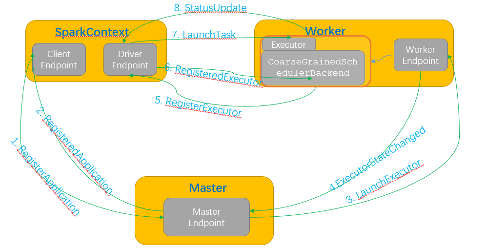

# 【Spark】Spark 运行消息通信

本篇结构：

- 前言
- 详细过程

## 一、前言

前面介绍了 Spark Rpc 框架，及 Spark 启动时通信，这篇主要介绍 Spark 运行时通信。

下面还是以 Standalone 模式介绍：

用户提交应用程序时，应用程序的 SparkContext 会向 Master 发送应用注册消息，并由 Master 给应用分配 Executor，Executor 会向 SparkContext 发送注册成功消息；当 SparkContext 的 RDD 触发行动操作后，将创建 RDD 的 DAG，通过 DAGScheduler 进行划分 Stage，并将 Stage 转化为 TaskSet；接着由 TaskScheduler 向注册的 Executor 发送执行消息，Executor 接收到任务消息后启动并运行；最后当所有任务运行完毕，由 Driver 处理结果并回收资源。



## 二、详细过程

### 2.1、ClientEndpoint 发送 RegisterApplication 给 Master

应用程序由 main 方法作为入口开始执行，创建 SparkContext，SparkContext 的创建较复杂，其中有一步是实例化 SchedulerBackend （是 TaskScheduler 的调度后端接口），如下代码所示：

```scala
    // Create and start the scheduler
    val (sched, ts) = SparkContext.createTaskScheduler(this, master, deployMode)
    _schedulerBackend = sched

  private def createTaskScheduler(
      sc: SparkContext,
      master: String,
      deployMode: String): (SchedulerBackend, TaskScheduler) = {
    import SparkMasterRegex._

    // When running locally, don't try to re-execute tasks on failure.
    val MAX_LOCAL_TASK_FAILURES = 1

    master match {
      case "local" =>
        val scheduler = new TaskSchedulerImpl(sc, MAX_LOCAL_TASK_FAILURES, isLocal = true)
        val backend = new LocalSchedulerBackend(sc.getConf, scheduler, 1)
        scheduler.initialize(backend)
        (backend, scheduler)

      case LOCAL_N_REGEX(threads) =>
        def localCpuCount: Int = Runtime.getRuntime.availableProcessors()
        // local[*] estimates the number of cores on the machine; local[N] uses exactly N threads.
        val threadCount = if (threads == "*") localCpuCount else threads.toInt
        if (threadCount <= 0) {
          throw new SparkException(s"Asked to run locally with $threadCount threads")
        }
        val scheduler = new TaskSchedulerImpl(sc, MAX_LOCAL_TASK_FAILURES, isLocal = true)
        val backend = new LocalSchedulerBackend(sc.getConf, scheduler, threadCount)
        scheduler.initialize(backend)
        (backend, scheduler)

      case LOCAL_N_FAILURES_REGEX(threads, maxFailures) =>
        def localCpuCount: Int = Runtime.getRuntime.availableProcessors()
        // local[*, M] means the number of cores on the computer with M failures
        // local[N, M] means exactly N threads with M failures
        val threadCount = if (threads == "*") localCpuCount else threads.toInt
        val scheduler = new TaskSchedulerImpl(sc, maxFailures.toInt, isLocal = true)
        val backend = new LocalSchedulerBackend(sc.getConf, scheduler, threadCount)
        scheduler.initialize(backend)
        (backend, scheduler)

      case SPARK_REGEX(sparkUrl) =>
        val scheduler = new TaskSchedulerImpl(sc)
        val masterUrls = sparkUrl.split(",").map("spark://" + _)
        val backend = new StandaloneSchedulerBackend(scheduler, sc, masterUrls)
        scheduler.initialize(backend)
        (backend, scheduler)

      case LOCAL_CLUSTER_REGEX(numSlaves, coresPerSlave, memoryPerSlave) =>
        // Check to make sure memory requested <= memoryPerSlave. Otherwise Spark will just hang.
        val memoryPerSlaveInt = memoryPerSlave.toInt
        if (sc.executorMemory > memoryPerSlaveInt) {
          throw new SparkException(
            "Asked to launch cluster with %d MB RAM / worker but requested %d MB/worker".format(
              memoryPerSlaveInt, sc.executorMemory))
        }

        val scheduler = new TaskSchedulerImpl(sc)
        val localCluster = new LocalSparkCluster(
          numSlaves.toInt, coresPerSlave.toInt, memoryPerSlaveInt, sc.conf)
        val masterUrls = localCluster.start()
        val backend = new StandaloneSchedulerBackend(scheduler, sc, masterUrls)
        scheduler.initialize(backend)
        backend.shutdownCallback = (backend: StandaloneSchedulerBackend) => {
          localCluster.stop()
        }
        (backend, scheduler)

      case masterUrl =>
        val cm = getClusterManager(masterUrl) match {
          case Some(clusterMgr) => clusterMgr
          case None => throw new SparkException("Could not parse Master URL: '" + master + "'")
        }
        try {
          val scheduler = cm.createTaskScheduler(sc, masterUrl)
          val backend = cm.createSchedulerBackend(sc, masterUrl, scheduler)
          cm.initialize(scheduler, backend)
          (backend, scheduler)
        } catch {
          case se: SparkException => throw se
          case NonFatal(e) =>
            throw new SparkException("External scheduler cannot be instantiated", e)
        }
    }
  }
```

在 Standalone 模式下 SchedulerBackend 的实现是 case SPARK_REGEX(sparkUrl) 下创建的 StandaloneSchedulerBackend：

```scala
StandaloneSchedulerBackend(
    scheduler: TaskSchedulerImpl,
    sc: SparkContext,
    masters: Array[String])
  extends CoarseGrainedSchedulerBackend
```

#### 2.1.1、实例化 ClientEndpoint 和 DriverEndpoint

1.在 StandaloneSchedulerBackend 的 start 方法中会实例化 StandaloneAppClient 的   ClientEndpoint。

 StandaloneSchedulerBackend#start() -> StandaloneAppClient#start()：

```scala
StandaloneSchedulerBackend # 
override def start(){
    super.start()
    ...
    client = new StandaloneAppClient(sc.env.rpcEnv, masters, appDesc, this, conf)
    client.start()
    ...
}

StandaloneAppClient #
def start() {
  // Just launch an rpcEndpoint; it will call back into the listener.
  endpoint.set(rpcEnv.setupEndpoint("AppClient", new ClientEndpoint(rpcEnv)))
}
```

2.在 StandaloneSchedulerBackend 的父类 CoarseGrainedSchedulerBackend 的 start 方法中会实例化 DriverEndpoint：

```scala
override def start() {
  val properties = new ArrayBuffer[(String, String)]
  for ((key, value) <- scheduler.sc.conf.getAll) {
    if (key.startsWith("spark.")) {
      properties += ((key, value))
    }
  }

  // TODO (prashant) send conf instead of properties
  driverEndpoint = createDriverEndpointRef(properties)
}

protected def createDriverEndpoint(properties: Seq[(String, String)]): DriverEndpoint = {
  new DriverEndpoint(rpcEnv, properties)
}
```

也就是说在 SparkContext 启动过程会创建 SchedulerBackend ，而 SchedulerBackend  又会创建 ClientEndpoint 和 DriverEndpoint 两个端点。

#### 2.1.2、应用程序的注册

应用程序的注册主要和 ClientEndpoint  相关，在 ClientEndpoint 的 onStart() 方法中有相关代码逻辑：

```scala
override def onStart(): Unit = {
  try {
    registerWithMaster(1)
  } catch {
    case e: Exception =>
      logWarning("Failed to connect to master", e)
      markDisconnected()
      stop()
  }
}
```

onStart 调用：registerWithMaster：

```scala
private def registerWithMaster(nthRetry: Int) {
  registerMasterFutures.set(tryRegisterAllMasters())
  registrationRetryTimer.set(registrationRetryThread.schedule(new Runnable {
    override def run(): Unit = {
      if (registered.get) {
        registerMasterFutures.get.foreach(_.cancel(true))
        registerMasterThreadPool.shutdownNow()
      } else if (nthRetry >= REGISTRATION_RETRIES) {
        markDead("All masters are unresponsive! Giving up.")
      } else {
        registerMasterFutures.get.foreach(_.cancel(true))
        registerWithMaster(nthRetry + 1)
      }
    }
  }, REGISTRATION_TIMEOUT_SECONDS, TimeUnit.SECONDS))
}
```

和之前分析启动消息通信一样跟踪来到 tryRegisterAllMasters：

```scala
/**
 *  Register with all masters asynchronously and returns an array `Future`s for cancellation.
 */
private def tryRegisterAllMasters(): Array[JFuture[_]] = {
  for (masterAddress <- masterRpcAddresses) yield {
    registerMasterThreadPool.submit(new Runnable {
      override def run(): Unit = try {
        if (registered.get) {
          return
        }
        logInfo("Connecting to master " + masterAddress.toSparkURL + "...")
        val masterRef = rpcEnv.setupEndpointRef(masterAddress, Master.ENDPOINT_NAME)
        masterRef.send(RegisterApplication(appDescription, self))
      } catch {
        case ie: InterruptedException => // Cancelled
        case NonFatal(e) => logWarning(s"Failed to connect to master $masterAddress", e)
      }
    })
  }
}
```

tryRegisterAllMasters 中以线程池异步的方式向所有的 Master 发送 RegisterApplication 消息。

### 2.2、Master 发送 RegisteredApplication 到 ClientEndpoint

RpcEndpointRef.send 方法发送的消息最后是由 RpcEndpoint.receive 接收，所以定位 Master 的 receive。

#### 2.2.1、Master 发送 RegisteredApplication

在 receive 方法中，Master 接收到 RegisterApplication 消息后，在 registerApplication 中记录应用消息并把该应用加入到等待运行应用列表中，注册成功后向 ClientEndpoint  发送注册成功的 RegisteredApplication 消息。

```scala
override def receive: PartialFunction[Any, Unit] = {
  ...
  case RegisterApplication(description, driver) =>
    // TODO Prevent repeated registrations from some driver
    if (state == RecoveryState.STANDBY) {
      // ignore, don't send response
    } else {
      logInfo("Registering app " + description.name)
      val app = createApplication(description, driver)
      registerApplication(app)
      logInfo("Registered app " + description.name + " with ID " + app.id)
      persistenceEngine.addApplication(app)
      driver.send(RegisteredApplication(app.id, self))
      schedule()
    }
    ...
}
```

registerApplication 方法代码：

```scala
private def registerApplication(app: ApplicationInfo): Unit = {
  val appAddress = app.driver.address
  if (addressToApp.contains(appAddress)) {
    logInfo("Attempted to re-register application at same address: " + appAddress)
    return
  }

  applicationMetricsSystem.registerSource(app.appSource)
  apps += app
  idToApp(app.id) = app
  endpointToApp(app.driver) = app
  addressToApp(appAddress) = app
  waitingApps += app
  if (reverseProxy) {
    webUi.addProxyTargets(app.id, app.desc.appUiUrl)
  }
}

```

#### 2.2.2、ClientEndpoint  接收 RegisteredApplication 消息

SparkContext#StandaloneSchedulerBackend#StandaloneAppClient#ClientEndpoint  接收 RegisteredApplication 将注册标识 registered 标记为 true

```scala
override def receive: PartialFunction[Any, Unit] = {
  case RegisteredApplication(appId_, masterRef) =>
    // FIXME How to handle the following cases?
    // 1. A master receives multiple registrations and sends back multiple
    // RegisteredApplications due to an unstable network.
    // 2. Receive multiple RegisteredApplication from different masters because the master is
    // changing.
    appId.set(appId_)
    registered.set(true)
    master = Some(masterRef)
    listener.connected(appId.get)
  ...
}

```

### 2.3、Master 发送 LaunchExecutor 消息给 Worker

Master 发送 RegisteredApplication 注册成功的消息后，同时还会调用 schedule 方法，schedule 方法中重点关注 startExecutorsOnWorkers。

#### 2.3.1、从集群中获取可以运行程序的 Worker 及可用的 cores

Master#startExecutorsOnWorkers：

```scala
/**
 * Schedule the currently available resources among waiting apps. This method will be called
 * every time a new app joins or resource availability changes.
 */
private def schedule(): Unit = {
  if (state != RecoveryState.ALIVE) {
    return
  }
  // Drivers take strict precedence over executors
  val shuffledAliveWorkers = Random.shuffle(workers.toSeq.filter(_.state == WorkerState.ALIVE))
  val numWorkersAlive = shuffledAliveWorkers.size
  var curPos = 0
  for (driver <- waitingDrivers.toList) { // iterate over a copy of waitingDrivers
    // We assign workers to each waiting driver in a round-robin fashion. For each driver, we
    // start from the last worker that was assigned a driver, and continue onwards until we have
    // explored all alive workers.
    var launched = false
    var numWorkersVisited = 0
    while (numWorkersVisited < numWorkersAlive && !launched) {
      val worker = shuffledAliveWorkers(curPos)
      numWorkersVisited += 1
      if (worker.memoryFree >= driver.desc.mem && worker.coresFree >= driver.desc.cores) {
        launchDriver(worker, driver)
        waitingDrivers -= driver
        launched = true
      }
      curPos = (curPos + 1) % numWorkersAlive
    }
  }
  startExecutorsOnWorkers()
}

```

在 startExecutorsOnWorkers 方法中，使用 FIFO 调度算法，先注册的 app 先运行。

对于每一个 app：

- 先找出符合条件（剩余内存大于等于每个 Executor 所需内存且剩余可用核数大于等于每个 Executor 所需核数）的  Worker；
- 然后确定运行在哪些 Worker 上，并且确定每个 Worker 分配用于运行的核数 ，有两种分配策略，一种是分配给尽量多的 Worker，另一种是分配给尽量少的 Worker，优先将一个 Worker 的资源分配完（spark.deploy.spreadOut 控制，true，表示尽量多的 Worker）；
- 循环遍历所有满足条件的 Worker，为该 Worker 上的所有 Executor 分配资源。

```scala
/**
 * Schedule and launch executors on workers
 */
private def startExecutorsOnWorkers(): Unit = {
  // Right now this is a very simple FIFO scheduler. We keep trying to fit in the first app
  // in the queue, then the second app, etc.
  for (app <- waitingApps if app.coresLeft > 0) {
    val coresPerExecutor: Option[Int] = app.desc.coresPerExecutor
    // Filter out workers that don't have enough resources to launch an executor
    val usableWorkers = workers.toArray.filter(_.state == WorkerState.ALIVE)
      .filter(worker => worker.memoryFree >= app.desc.memoryPerExecutorMB &&
        worker.coresFree >= coresPerExecutor.getOrElse(1))
      .sortBy(_.coresFree).reverse
    val assignedCores = scheduleExecutorsOnWorkers(app, usableWorkers, spreadOutApps)

    // Now that we've decided how many cores to allocate on each worker, let's allocate them
    for (pos <- 0 until usableWorkers.length if assignedCores(pos) > 0) {
      allocateWorkerResourceToExecutors(
        app, assignedCores(pos), coresPerExecutor, usableWorkers(pos))
    }
  }
}

```

#### 2.3.2、Worker 分配资源给其 Executors

 master#allocateWorkerResourceToExecutors() 方法：

- 首先计算该 Worker 要启动的 Executor 数量。如果指定了每个 Executor 的 cores，那么每个 Worker 就会启动 assignedCores / coresPerExecutor 个 Executor，否则就启动一个 Executor 包含 assignedCores 个核数。
- 再循环发消息通知 Worker 启动 其所有的 Executors 。

```scala
/**
 * Allocate a worker's resources to one or more executors.
 * @param app the info of the application which the executors belong to
 * @param assignedCores number of cores on this worker for this application
 * @param coresPerExecutor number of cores per executor
 * @param worker the worker info
 */
private def allocateWorkerResourceToExecutors(
    app: ApplicationInfo,
    assignedCores: Int,
    coresPerExecutor: Option[Int],
    worker: WorkerInfo): Unit = {
  // If the number of cores per executor is specified, we divide the cores assigned
  // to this worker evenly among the executors with no remainder.
  // Otherwise, we launch a single executor that grabs all the assignedCores on this worker.
  val numExecutors = coresPerExecutor.map { assignedCores / _ }.getOrElse(1)
  val coresToAssign = coresPerExecutor.getOrElse(assignedCores)
  for (i <- 1 to numExecutors) {
    val exec = app.addExecutor(worker, coresToAssign)
    launchExecutor(worker, exec)
    app.state = ApplicationState.RUNNING
  }
}

```

#### 2.3.3、通知 Worker 启动 Executor 

在 Master#launchExecutor 方法中发消息通知启动 Executor：

```scala
private def launchExecutor(worker: WorkerInfo, exec: ExecutorDesc): Unit = {
  logInfo("Launching executor " + exec.fullId + " on worker " + worker.id)
  worker.addExecutor(exec)
  worker.endpoint.send(LaunchExecutor(masterUrl,
    exec.application.id, exec.id, exec.application.desc, exec.cores, exec.memory))
  exec.application.driver.send(
    ExecutorAdded(exec.id, worker.id, worker.hostPort, exec.cores, exec.memory))
}

```

查看该方法可见：

- Master 持有 worker 节点的引用，向 Worker 发送 LaunchExecutor 消息；
- 向 ClientEndpoint 发送 ExecutorAdded 的消息。

### 2.4、Worker 发送 ExecutorStateChanged 消息

Master 持有 worker 节点的引用，向 Worker 发送 LaunchExecutor 消息，在 Worker 中 receive 方法中接收：

#### 2.4.1、Worker 接收 LaunchExecutor 消息

```scala
case LaunchExecutor(masterUrl, appId, execId, appDesc, cores_, memory_) =>
  if (masterUrl != activeMasterUrl) {
    logWarning("Invalid Master (" + masterUrl + ") attempted to launch executor.")
  } else {
    try {
      logInfo("Asked to launch executor %s/%d for %s".format(appId, execId, appDesc.name))

      // Create the executor's working directory
      val executorDir = new File(workDir, appId + "/" + execId)
      if (!executorDir.mkdirs()) {
        throw new IOException("Failed to create directory " + executorDir)
      }

      // Create local dirs for the executor. These are passed to the executor via the
      // SPARK_EXECUTOR_DIRS environment variable, and deleted by the Worker when the
      // application finishes.
      val appLocalDirs = appDirectories.getOrElse(appId,
        Utils.getOrCreateLocalRootDirs(conf).map { dir =>
          val appDir = Utils.createDirectory(dir, namePrefix = "executor")
          Utils.chmod700(appDir)
          appDir.getAbsolutePath()
        }.toSeq)
      appDirectories(appId) = appLocalDirs
      val manager = new ExecutorRunner(
        appId,
        execId,
        appDesc.copy(command = Worker.maybeUpdateSSLSettings(appDesc.command, conf)),
        cores_,
        memory_,
        self,
        workerId,
        host,
        webUi.boundPort,
        publicAddress,
        sparkHome,
        executorDir,
        workerUri,
        conf,
        appLocalDirs, ExecutorState.RUNNING)
      executors(appId + "/" + execId) = manager
      manager.start()
      coresUsed += cores_
      memoryUsed += memory_
      sendToMaster(ExecutorStateChanged(appId, execId, manager.state, None, None))
    } catch {
      case e: Exception =>
        logError(s"Failed to launch executor $appId/$execId for ${appDesc.name}.", e)
        if (executors.contains(appId + "/" + execId)) {
          executors(appId + "/" + execId).kill()
          executors -= appId + "/" + execId
        }
        sendToMaster(ExecutorStateChanged(appId, execId, ExecutorState.FAILED,
          Some(e.toString), None))
    }
  }

```

Worker 接收到 LaunchExecutor 消息后，先创建 Executor 执行目录，然后创建 Executor 本地目录，程序结束后再删除本地目录。

重点关注 ExecutorRunner，实例化 ExecutorRunner 后调用其 start 方法，在 start 过程中创建 Executor process 进程并运行。

#### 2.4.2、创建 Executor Process 并启动

ExecutorRunner#start：

```scala
private[worker] def start() {
  workerThread = new Thread("ExecutorRunner for " + fullId) {
    override def run() { fetchAndRunExecutor() }
  }
  workerThread.start()
  // Shutdown hook that kills actors on shutdown.
  shutdownHook = ShutdownHookManager.addShutdownHook { () =>
    // It's possible that we arrive here before calling `fetchAndRunExecutor`, then `state` will
    // be `ExecutorState.RUNNING`. In this case, we should set `state` to `FAILED`.
    if (state == ExecutorState.RUNNING) {
      state = ExecutorState.FAILED
    }
    killProcess(Some("Worker shutting down")) }
}

```

Executor#fetchAndRunExecutor：

```scala
/**
 * Download and run the executor described in our ApplicationDescription
 */
private def fetchAndRunExecutor() {
  try {
    // Launch the process
    val builder = CommandUtils.buildProcessBuilder(appDesc.command, new SecurityManager(conf),
      memory, sparkHome.getAbsolutePath, substituteVariables)
    val command = builder.command()
    val formattedCommand = command.asScala.mkString("\"", "\" \"", "\"")
    logInfo(s"Launch command: $formattedCommand")

    builder.directory(executorDir)
    builder.environment.put("SPARK_EXECUTOR_DIRS", appLocalDirs.mkString(File.pathSeparator))
    // In case we are running this from within the Spark Shell, avoid creating a "scala"
    // parent process for the executor command
    builder.environment.put("SPARK_LAUNCH_WITH_SCALA", "0")

    // Add webUI log urls
    val baseUrl =
      if (conf.getBoolean("spark.ui.reverseProxy", false)) {
        s"/proxy/$workerId/logPage/?appId=$appId&executorId=$execId&logType="
      } else {
        s"http://$publicAddress:$webUiPort/logPage/?appId=$appId&executorId=$execId&logType="
      }
    builder.environment.put("SPARK_LOG_URL_STDERR", s"${baseUrl}stderr")
    builder.environment.put("SPARK_LOG_URL_STDOUT", s"${baseUrl}stdout")

    process = builder.start()
    val header = "Spark Executor Command: %s\n%s\n\n".format(
      formattedCommand, "=" * 40)

    // Redirect its stdout and stderr to files
    val stdout = new File(executorDir, "stdout")
    stdoutAppender = FileAppender(process.getInputStream, stdout, conf)

    val stderr = new File(executorDir, "stderr")
    Files.write(header, stderr, StandardCharsets.UTF_8)
    stderrAppender = FileAppender(process.getErrorStream, stderr, conf)

    // Wait for it to exit; executor may exit with code 0 (when driver instructs it to shutdown)
    // or with nonzero exit code
    val exitCode = process.waitFor()
    state = ExecutorState.EXITED
    val message = "Command exited with code " + exitCode
    worker.send(ExecutorStateChanged(appId, execId, state, Some(message), Some(exitCode)))
  } catch {
    case interrupted: InterruptedException =>
      logInfo("Runner thread for executor " + fullId + " interrupted")
      state = ExecutorState.KILLED
      killProcess(None)
    case e: Exception =>
      logError("Error running executor", e)
      state = ExecutorState.FAILED
      killProcess(Some(e.toString))
  }
}

```

fetchAndRunExecutor 方法，先根据传进来的 command 对象创建 ProcessBuilder 对象，该对象用于构建 Process。

command 对象中有个 mainClass 属性，这里的 mainClass 是 org.apache.spark.executor.CoarseGrainedExecutorBackend，该类是最初在 StandaloneSchedulerBackend 的 start 方法中创建 ApplicationDescription 时传递进来的。

接着看 fetchAndRunExecutor  方法，构建 builder 后，给 builder 添加执行目录信息、添加监控页面输入日志地址信息，然后启动 builder，启动后会调用 CoarseGrainedExecutorBackend 其 main 方法运行，然后输出 CoarseGrainedExecutorBackend  实例运行信息。

最后等待 CoarseGrainedExecutorBackend  运行结束，结束后向 Worker 发送退出状态信息。

#### 2.4.3、Worker 发送 ExecutorStateChanged 消息

在 Worker 收到 LaunchExecutor 消息，并启动 CoarseGrainedExecutorBackend 容器后，向 Master 发送 ExecutorStateChanged 消息。

Worker#receive -> Worker#sendToMaster

```scala
  sendToMaster(ExecutorStateChanged(appId, execId, manager.state, None, None))

  /**
   * Send a message to the current master. If we have not yet registered successfully with any
   * master, the message will be dropped.
   */
  private def sendToMaster(message: Any): Unit = {
    master match {
      case Some(masterRef) => masterRef.send(message)
      case None =>
        logWarning(
          s"Dropping $message because the connection to master has not yet been established")
    }
  }

```

Master 接收 ExecutorStateChanged 消息：

```scala
case ExecutorStateChanged(appId, execId, state, message, exitStatus) =>
  val execOption = idToApp.get(appId).flatMap(app => app.executors.get(execId))
  execOption match {
    case Some(exec) =>
      val appInfo = idToApp(appId)
      val oldState = exec.state
      exec.state = state

      if (state == ExecutorState.RUNNING) {
        assert(oldState == ExecutorState.LAUNCHING,
          s"executor $execId state transfer from $oldState to RUNNING is illegal")
        appInfo.resetRetryCount()
      }

      exec.application.driver.send(ExecutorUpdated(execId, state, message, exitStatus, false))

      if (ExecutorState.isFinished(state)) {
        // Remove this executor from the worker and app
        logInfo(s"Removing executor ${exec.fullId} because it is $state")
        // If an application has already finished, preserve its
        // state to display its information properly on the UI
        if (!appInfo.isFinished) {
          appInfo.removeExecutor(exec)
        }
        exec.worker.removeExecutor(exec)

        val normalExit = exitStatus == Some(0)
        // Only retry certain number of times so we don't go into an infinite loop.
        // Important note: this code path is not exercised by tests, so be very careful when
        // changing this `if` condition.
        if (!normalExit
            && appInfo.incrementRetryCount() >= MAX_EXECUTOR_RETRIES
            && MAX_EXECUTOR_RETRIES >= 0) { // < 0 disables this application-killing path
          val execs = appInfo.executors.values
          if (!execs.exists(_.state == ExecutorState.RUNNING)) {
            logError(s"Application ${appInfo.desc.name} with ID ${appInfo.id} failed " +
              s"${appInfo.retryCount} times; removing it")
            removeApplication(appInfo, ApplicationState.FAILED)
          }
        }
      }
      schedule()
    case None =>
      logWarning(s"Got status update for unknown executor $appId/$execId")
  }

```

### 2.5、CoarseGrainedExecutorBackend 向 DriverEndpoint ask RegisterExecutor 消息

在 2.4.2 的 创建后，CoarseGrainedExecutorBackend，运行 main 方法，会调用来到  onStart 启动方法中。

#### 2.5.1、CoarseGrainedExecutorBackend 发送 RegisterExecutor 消息

```scala
override def onStart() {
  logInfo("Connecting to driver: " + driverUrl)
  rpcEnv.asyncSetupEndpointRefByURI(driverUrl).flatMap { ref =>
    // This is a very fast action so we can use "ThreadUtils.sameThread"
    driver = Some(ref)
    ref.ask[Boolean](RegisterExecutor(executorId, self, hostname, cores, extractLogUrls))
  }(ThreadUtils.sameThread).onComplete {
    // This is a very fast action so we can use "ThreadUtils.sameThread"
    case Success(msg) =>
      // Always receive `true`. Just ignore it
    case Failure(e) =>
      exitExecutor(1, s"Cannot register with driver: $driverUrl", e, notifyDriver = false)
  }(ThreadUtils.sameThread)
}

```

#### 2.5.2、DriverEndpoint 接收 RegisterExecutor 消息

来到 DriverEndpoint  的 receiveAndReply 方法，根据消息类型匹配到 case RegisterExecutor，先判断该 Executor 是否已经注册，如果已经注册则发送 RegisterExecutorFailed 消息，否则 DriverEndpoint 记录该 Executor 信息，发送 RegisteredExecutor 注册成功消息。

DriverEndpoint # receiveAndReply ：

```scala
case RegisterExecutor(executorId, executorRef, hostname, cores, logUrls) =>
  if (executorDataMap.contains(executorId)) {
    executorRef.send(RegisterExecutorFailed("Duplicate executor ID: " + executorId))
    context.reply(true)
  } else {
    // If the executor's rpc env is not listening for incoming connections, `hostPort`
    // will be null, and the client connection should be used to contact the executor.
    val executorAddress = if (executorRef.address != null) {
        executorRef.address
      } else {
        context.senderAddress
      }
    logInfo(s"Registered executor $executorRef ($executorAddress) with ID $executorId")
    addressToExecutorId(executorAddress) = executorId
    totalCoreCount.addAndGet(cores)
    totalRegisteredExecutors.addAndGet(1)
    val data = new ExecutorData(executorRef, executorRef.address, hostname,
      cores, cores, logUrls)
    // This must be synchronized because variables mutated
    // in this block are read when requesting executors
    CoarseGrainedSchedulerBackend.this.synchronized {
      executorDataMap.put(executorId, data)
      if (currentExecutorIdCounter < executorId.toInt) {
        currentExecutorIdCounter = executorId.toInt
      }
      if (numPendingExecutors > 0) {
        numPendingExecutors -= 1
        logDebug(s"Decremented number of pending executors ($numPendingExecutors left)")
      }
    }
    executorRef.send(RegisteredExecutor)
    // Note: some tests expect the reply to come after we put the executor in the map
    context.reply(true)
    listenerBus.post(
      SparkListenerExecutorAdded(System.currentTimeMillis(), executorId, data))
    makeOffers()
  }

```

### 2.6、DriverEndpoint 发送 RegisteredExecutor

DriverEndpoint 接收 RegisterExecutor 消息后，处理成功向 CoarseGrainedExecutorBackend 发送 RegisteredExecutor 注册成功的消息。

#### 2.6.1、实例化 Executor

CoarseGrainedExecutorBackend  接收到 RegisteredExecutor  消息后来到 receive 方法，匹配消息类型 RegisteredExecutor，实例化 Executor：

```scala
override def receive: PartialFunction[Any, Unit] = {
  case RegisteredExecutor =>
    logInfo("Successfully registered with driver")
    try {
      executor = new Executor(executorId, hostname, env, userClassPath, isLocal = false)
    } catch {
      case NonFatal(e) =>
        exitExecutor(1, "Unable to create executor due to " + e.getMessage, e)
    }
  ...
}

```

#### 2.6.2、Executor 定时向 DriverEndpoint 发送心跳

```scala
/**
 * Schedules a task to report heartbeat and partial metrics for active tasks to driver.
 */
private def startDriverHeartbeater(): Unit = {
  val intervalMs = conf.getTimeAsMs("spark.executor.heartbeatInterval", "10s")

  // Wait a random interval so the heartbeats don't end up in sync
  val initialDelay = intervalMs + (math.random * intervalMs).asInstanceOf[Int]

  val heartbeatTask = new Runnable() {
    override def run(): Unit = Utils.logUncaughtExceptions(reportHeartBeat())
  }
  heartbeater.scheduleAtFixedRate(heartbeatTask, initialDelay, intervalMs, TimeUnit.MILLISECONDS)
}

```

心跳时间由 spark.executor.heartbeatInterval 控制，默认为 10s。

### 2.7、CoarseGrainedExecutorBackend #Executor 接收 LaunchTask 消息

CoarseGrainedExecutorBackend 的 Executor 启动后，等待接收 DriverEndpoint 发送的 LaunchTask 消息，执行任务。

CoarseGrainedExecutorBackend#receive：

```scala
case LaunchTask(data) =>
  if (executor == null) {
    exitExecutor(1, "Received LaunchTask command but executor was null")
  } else {
    val taskDesc = ser.deserialize[TaskDescription](data.value)
    logInfo("Got assigned task " + taskDesc.taskId)
    executor.launchTask(this, taskId = taskDesc.taskId, attemptNumber = taskDesc.attemptNumber,
      taskDesc.name, taskDesc.serializedTask)
  }

```

Executor#launchTask：

```scala
def launchTask(
    context: ExecutorBackend,
    taskId: Long,
    attemptNumber: Int,
    taskName: String,
    serializedTask: ByteBuffer): Unit = {
  val tr = new TaskRunner(context, taskId = taskId, attemptNumber = attemptNumber, taskName,
    serializedTask)
  runningTasks.put(taskId, tr)
  threadPool.execute(tr)
}

```

launchTask 方法创建 TaskRunner 线程，并放入 runningTasks map 中，然后由线程池统一调度。

任务的具体执行过程需要较大篇幅，后续再详细介绍。

### 2.8、CoarseGrainedExecutorBackend #Executor 发送 StatusUpdate 消息

当 TaskRunner 执行任务完成时，会向 DriverEndpoint 发送状态变更的消息。

```scala
override def statusUpdate(taskId: Long, state: TaskState, data: ByteBuffer) {
  val msg = StatusUpdate(executorId, taskId, state, data)
  driver match {
    case Some(driverRef) => driverRef.send(msg)
    case None => logWarning(s"Drop $msg because has not yet connected to driver")
  }
}

```

DriverEndpoint 接收到 StatusUpdate 消息后，调用 TaskSchedulerImpl 的 statusUpdate 方法，根据任务执行不同结果进行处理，处理完毕后再给该 Executor 分配执行任务。

```scala
override def receive: PartialFunction[Any, Unit] = {
  case StatusUpdate(executorId, taskId, state, data) =>
    scheduler.statusUpdate(taskId, state, data.value)
    if (TaskState.isFinished(state)) {
      executorDataMap.get(executorId) match {
        case Some(executorInfo) =>
          executorInfo.freeCores += scheduler.CPUS_PER_TASK
          makeOffers(executorId)
        case None =>
          // Ignoring the update since we don't know about the executor.
          logWarning(s"Ignored task status update ($taskId state $state) " +
            s"from unknown executor with ID $executorId")
      }
    }
    ...
 }

```